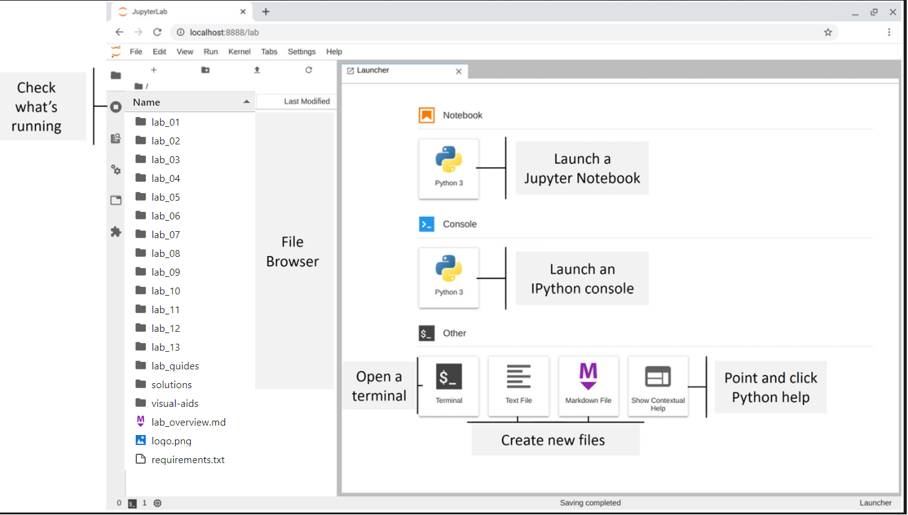

Lab 1: Introduction to Data Analysis
=======================================

In this lab, we will go through Jupyter Notebooks and  run some checks to make sure that everything is
set up properly in lab environment. We will also review python basics.

#### Pre-reqs:
- Google Chrome (Recommended)

#### Lab Environment
Notebooks are ready to run. All packages have been installed. There is no requirement for any setup.

All examples are present in `~/work/machine-learning-essentials-module1/lab_01` folder. 

#### JupyterLab

JupyterLab is an IDE that allows us to create Jupyter Notebooks and
Python scripts, interact with the terminal, create
text documents, reference documentation, and much more from a clean web
interface on our machine.

Using the **File Browser** pane, double-click on the **lab_01** folder,
which contains the Jupyter Notebook that we will use to validate our
setup.

### Validating the Environment

Open the `checking_your_setup.ipynb` notebook in the
**lab_01** folder, as shown in the following
screenshot:

Lab materials
=================

In this lab, there is an `exercises.ipynb` notebook, with code to generate some
initial data. Knowledge of basic Python will be necessary to complete
these exercises. For those who would like to review the basics, make
sure to run through the `python_101.ipynb` notebook, included
in the materials for this lab, for a crash course.

Exercises
=========

Run through the `introduction_to_data_analysis.ipynb` notebook
for a review of this lab\'s content, review the
`python_101.ipynb` notebook (if needed), and then complete the
following exercises to practice working with JupyterLab and calculating
summary statistics in Python:

1.  Explore the JupyterLab interface and look at some of the shortcuts
    that are available. Don\'t worry about memorizing them for now
    (eventually, they will become second nature and save you a lot of
    time)---just get comfortable using Jupyter Notebooks.

2.  Is all data normally distributed? Explain why or why not.

3.  When would it make more sense to use the median instead of the mean
    for the measure of center?

4.  Run the code in the first cell of the `exercises.ipynb`
    notebook. It will give you a list of 100 values to work with for the
    rest of the exercises in this lab. Be sure to treat these values
    as a sample of the population.

5.  Using the data from *exercise 4*, calculate the following statistics
    without importing anything from the `statistics` module in
    the standard library
    (<https://docs.python.org/3/library/statistics.html>), and then
    confirm your results match up to those that are obtained when using
    the `statistics` module (where possible):

    a\) Mean

    b\) Median

    c\) Mode (hint: check out the `Counter` class in the
    `collections` module of the standard library at
    <https://docs.python.org/3/library/collections.html#collections.Counter>)

    d\) Sample variance

    e\) Sample standard deviation

6.  Using the data from *exercise 4*, calculate the following statistics
    using the functions in the `statistics` module where
    appropriate:

    a\) Range

    b\) Coefficient of variation

    c\) Interquartile range

    d\) Quartile coefficient of dispersion

7.  Scale the data created in *exercise 4* using the following
    strategies:

    a\) Min-max scaling (normalizing)

    b\) Standardizing

8.  Using the scaled data from *exercise 7*, calculate the following:

    a\) The covariance between the standardized and normalized data

    b\) The Pearson correlation coefficient between the standardized and
    normalized data (this is actually 1, but due to rounding along the
    way, the result will be slightly less)