*Lab 10*: Making Better Predictions -- Optimizing Models
========================================================


In this lab, the following topics will be covered:

-   Hyperparameter tuning with grid search
-   Feature engineering
-   Building ensemble models combining many estimators
-   Inspecting classification prediction confidence
-   Addressing class imbalance
-   Penalizing high regression coefficients with regularization


#### Pre-reqs:
- Google Chrome (Recommended)

#### Lab Environment
Notebooks are ready to run. All packages have been installed. There is no requirement for any setup.

All examples are present in `~/work/data-analysis-pandas/lab_10` folder. Exercise solution(s) are present in `solutions` folder. 

Lab materials
==============

In this lab, we will be working with three datasets. The first two
come from data on wine quality donated to the UCI Machine Learning Data
Repository (<http://archive.ics.uci.edu/ml/index.php>) by P. Cortez, A.
Cerdeira, F. Almeida, T. Matos, and J. Reis, and contain information on
the chemical properties of various wine samples along with a rating of
the quality from a blind tasting session by a panel of wine experts.
These files can be found in the `data/` folder inside this
lab\'s folder in the GitHub repository
(<https://github.com/fenago/data-analysis-pandas/tree/master/lab_10>)
as `winequality-red.csv` and `winequality-white.csv`
for red and white wine, respectively.

Our third dataset was collected using the Open Exoplanet Catalogue
database, at
<https://github.com/OpenExoplanetCatalogue/open_exoplanet_catalogue/>,
which provides data in XML format. The parsed planet data can be found
in the `data/planets.csv` file. For the exercises, we will
also be working with the star temperature data from *Lab 9*,
*Getting Started with Machine Learning in Python*, which can be found in
the `data/stars.csv` file.

For reference, the following data sources were used:

-   *Open Exoplanet Catalogue database*, available at
    <https://github.com/OpenExoplanetCatalogue/open_exoplanet_catalogue/#data-structure>.
-   *P. Cortez, A. Cerdeira, F. Almeida, T. Matos and J. Reis. Modeling
    wine preferences by data mining from physicochemical properties. In
    Decision Support Systems, Elsevier, 47(4):547-553, 2009.* Available
    online at <http://archive.ics.uci.edu/ml/datasets/Wine+Quality>.
-   *Dua, D. and Karra Taniskidou, E. (2017). UCI Machine Learning
    Repository (*<http://archive.ics.uci.edu/ml/index.php>*). Irvine,
    CA: University of California, School of Information and Computer
    Science.*

We will be using the `red_wine.ipynb` notebook to predict red
wine quality, `wine.ipynb` to distinguish between red and
white wine based on their chemical properties, and the
`planets_ml.ipynb` notebook to build a regression model to
predict the year length of planets in Earth days.

Before we get started, let\'s handle our imports and read in our data:

```
>>> %matplotlib inline
>>> import matplotlib.pyplot as plt
>>> import numpy as np
>>> import pandas as pd
>>> import seaborn as sns
>>> planets = pd.read_csv('data/planets.csv') 
>>> red_wine = pd.read_csv('data/winequality-red.csv')
>>> white_wine = \
...     pd.read_csv('data/winequality-white.csv', sep=';') 
>>> wine = pd.concat([
...     white_wine.assign(kind='white'),
...     red_wine.assign(kind='red')
... ])
>>> red_wine['high_quality'] = pd.cut(
...     red_wine.quality, bins=[0, 6, 10], labels=[0, 1]
... )
```

Let\'s also create our training and testing sets for the red wine
quality, wine type by chemical properties, and planets models:

```
>>> from sklearn.model_selection import train_test_split
>>> red_y = red_wine.pop('high_quality')
>>> red_X = red_wine.drop(columns='quality')
>>> r_X_train, r_X_test, \
... r_y_train, r_y_test = train_test_split(
...     red_X, red_y, test_size=0.1, random_state=0,
...     stratify=red_y
... )
>>> wine_y = np.where(wine.kind == 'red', 1, 0)
>>> wine_X = wine.drop(columns=['quality', 'kind'])
>>> w_X_train, w_X_test, \
... w_y_train, w_y_test = train_test_split(
...     wine_X, wine_y, test_size=0.25, 
...     random_state=0, stratify=wine_y
... )
>>> data = planets[
...     ['semimajoraxis', 'period', 'mass', 'eccentricity']
... ].dropna()
>>> planets_X = data[
...     ['semimajoraxis', 'mass', 'eccentricity']
... ]
>>> planets_y = data.period
>>> pl_X_train, pl_X_test, \
... pl_y_train, pl_y_test = train_test_split(
...     planets_X, planets_y, test_size=0.25, random_state=0
... )
```

Important note

Remember that we will be working in dedicated notebooks for each of the
datasets, so while the setup code is all in the same code block to make
it easier to follow in the course, make sure to work in the notebook
corresponding to the data in question.


Hyperparameter tuning with grid search
======================================


No doubt you have noticed that we can provide various parameters to the
model classes when we instantiate them. These
model parameters are not derived from the data itself and are referred
to as **hyperparameters**. Some examples of these are regularization
terms, which we will discuss later in this
lab, and weights. Through the process of **model tuning**, we seek
to optimize our model\'s performance by tuning these hyperparameters.

How can we know we are picking the best values to
optimize our model\'s performance? One way is to
use a technique called **grid search** to tune
these hyperparameters. Grid search allows us to define a search space
and test all combinations of hyperparameters in that space, keeping the
ones that result in the best model. The scoring criterion we define will
determine the best model.

Remember the elbow point method we discussed in *Lab 9*, *Getting
Started with Machine Learning in Python*, for finding a good value for
*k* in k-means clustering? We can employ a similar visual method to find
the best value for our hyperparameters. This will involve
splitting our training data into **training** and
**validation sets**. We need to save the test set
for the final evaluation of the model, so we use the validation set to
test each of our models when searching for the best values of the
hyperparameters. To reiterate, the validation set and the test set are
not the same---they must be disjoint datasets. This split can be done
with `train_test_split()`. Here, we will use the red wine
quality dataset:

```
>>> from sklearn.model_selection import train_test_split
>>> r_X_train_new, r_X_validate,\
... r_y_train_new, r_y_validate = train_test_split(
...     r_X_train, r_y_train, test_size=0.3, 
...     random_state=0, stratify=r_y_train
... )
```

Then, we can build the model multiple times for all the values of the
hyperparameters we want to test, and score them based on the metric that
matters most to us. Let\'s try to find a good
value for `C`, the inverse of the regularization strength,
which determines the weight of the penalty term for logistic regression
and is discussed more in-depth in the *Regularization* section toward
the end of this lab; we tune this hyperparameter to reduce
overfitting:

```
>>> from sklearn.linear_model import LogisticRegression
>>> from sklearn.metrics import f1_score
>>> from sklearn.pipeline import Pipeline
>>> from sklearn.preprocessing import MinMaxScaler
# we will try 10 values from 10^-1 to 10^1 for C
>>> inv_regularization_strengths = \
...     np.logspace(-1, 1, num=10)
>>> scores = []
>>> for inv_reg_strength in inv_regularization_strengths:
...     pipeline = Pipeline([
...         ('scale', MinMaxScaler()),
...         ('lr', LogisticRegression(
...             class_weight='balanced', random_state=0,
...             C=inv_reg_strength
...         ))
...     ]).fit(r_X_train_new, r_y_train_new)
...     scores.append(f1_score(
...         pipeline.predict(r_X_validate), r_y_validate
...     ))
```

Tip

Here, we are using `np.logspace()` to get our range of values
to try for `C`. To use this function, we supply starting and
stopping exponents to use with a base number (10, by default). So
`np.logspace(-1, 1, num=10)` gives us 10 evenly spaced numbers
between 10[-1]{.superscript} and 10[1]{.superscript}.

This is then plotted as follows:

```
>>> plt.plot(inv_regularization_strengths, scores, 'o-')
>>> plt.xscale('log')
>>> plt.xlabel('inverse of regularization strength (C)')
>>> plt.ylabel(r'$F_1$ score')
>>> plt.title(
...     r'$F_1$ score vs. '
...     'Inverse of Regularization Strength'
... )
```

Using the resulting plot, we can pick the value that maximizes our
performance:


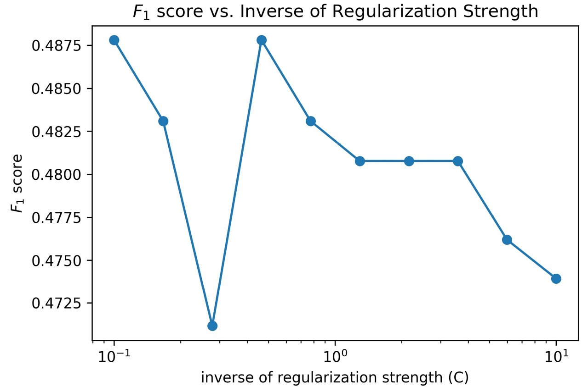


Scikit-learn provides the `GridSearchCV` class in the
`model_selection` module for carrying out
this exhaustive search much more easily. Classes
that end with *CV* utilize **cross-validation**, meaning they divide up
the training data into subsets, some of which
will be the validation set for scoring the model (without needing the
testing data until after the model is fit).

One common method of cross-validation is **k-fold
cross-validation**, which splits the training data into *k* subsets and
will train the model *k* times, each time leaving one subset out to use
as the validation set. The score for the model will be the average
across the *k* validation sets. Our initial attempt was 1-fold
cross-validation. When *k*=3, this process looks like the following
diagram:


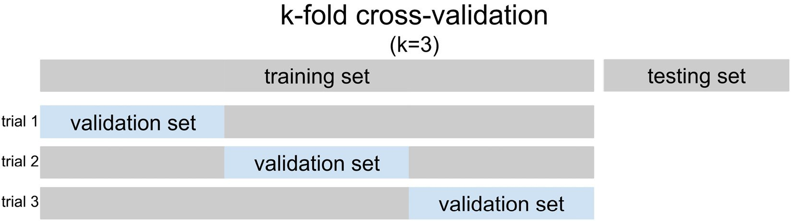


Tip

When working with classification problems, `scikit-learn` will
implement stratified k-fold cross-validation. This ensures that the
percentage of samples belonging to each class will be preserved across
folds. Without stratification, it\'s possible some validation sets will
see a disproportionately low (or high) amount of a given class, which
can distort the results.

`GridSearchCV` uses cross-validation to find the best
hyperparameters in the search space, without the need to use the testing
data. Remember, test data should not influence the training process in
any way---neither when training the model nor when tuning
hyperparameters---otherwise, the model will have issues generalizing.
This happens because we would be picking the
hyperparameters that give the best performance on the test set, thus
leaving no way to test on unseen data, and overestimating our
performance.

In order to use `GridSearchCV`, we need to provide a model (or
pipeline) and a search space, which will be a dictionary mapping the
hyperparameter to tune (by name) to a list of values to try. Optionally,
we can provide a scoring metric to use, as well as the number of folds
to use with cross-validation. We can tune any step in the pipeline by
prefixing the hyperparameter name with the name of that step, followed
by two underscores. For instance, if we have a logistic regression step
called `lr` and want to tune `C`, we use
`lr__C` as the key in the search space dictionary. Note that
if our model has any preprocessing steps, it\'s imperative that we use a
pipeline.

Let\'s use `GridSearchCV` for the red wine quality logistic
regression, searching for whether or not to fit our model with an
intercept and the best value for the inverse of the regularization
strength (`C`). We will use the F[1]{.subscript} score macro
average as the scoring metric. Note that, due to the consistency of the
API, `GridSearchCV` can be used to score, fit, and predict
with the same methods as the underlying models. By default, the grid
search will run in series, but `GridSearchCV` is capable of
performing multiple searches in parallel, greatly speeding up this
process:

```
>>> from sklearn.linear_model import LogisticRegression
>>> from sklearn.model_selection import GridSearchCV
>>> from sklearn.pipeline import Pipeline
>>> from sklearn.preprocessing import MinMaxScaler
>>> pipeline = Pipeline([
...     ('scale', MinMaxScaler()),
...     ('lr', LogisticRegression(class_weight='balanced',
...                               random_state=0))
... ])
>>> search_space = {
...     'lr__C': np.logspace(-1, 1, num=10),
...     'lr__fit_intercept': [True, False]
... }
>>> lr_grid = GridSearchCV(
...     pipeline, search_space, scoring='f1_macro', cv=5
... ).fit(r_X_train, r_y_train)
```

Once the grid search completes, we can isolate
the best hyperparameters from the search space with the
`best_params_` attribute. Notice that this result is different
from our 1-fold cross-validation attempt because each of the folds has
been averaged together to find the best hyperparameters overall, not
just for a single fold:

```
# best values of `C` and `fit_intercept` in search space
>>> lr_grid.best_params_
{'lr__C': 3.593813663804626, 'lr__fit_intercept': True}
```

Tip

We can also retrieve the best version of the pipeline from the grid
search with the `best_estimator_` attribute. If we want to see
the score the best estimator (model) had, we can grab it from the
`best_score_` attribute; note that this will be the score we
specified with the `scoring` argument.

Our F[1]{.subscript} score macro average is now
higher than what we achieved in *Lab 9*, *Getting Started with
Machine Learning in Python*:

```
>>> from sklearn.metrics import classification_report
>>> print(classification_report(
...     r_y_test, lr_grid.predict(r_X_test)
... ))
              precision    recall  f1-score   support
           0       0.94      0.80      0.87       138
           1       0.36      0.68      0.47        22
    accuracy                           0.79       160
   macro avg       0.65      0.74      0.67       160
weighted avg       0.86      0.79      0.81       160
```

Note that the `cv` argument doesn\'t have to be an
integer---we can provide one of the splitter
classes mentioned at
<https://scikit-learn.org/stable/modules/classes.html#splitter-classes>
if we want to use a method other than the default of k-fold for
regression or stratified k-fold for classification. For example, when
working with time series, we can use `TimeSeriesSplit` as the
cross-validation object to work with successive samples and avoid
shuffling.


Let\'s test out
`RepeatedStratifiedKFold` on the red wine quality model
instead of the default `StratifiedKFold`, which will repeat
the stratified k-fold cross-validation 10 times by default. All we have
to do is change what we passed in as `cv` in the first
`GridSearchCV` example to be a
`RepeatedStratifiedKFold` object. Note that---despite
using the same pipeline, search space, and
scoring metric---we have different values for `best_params_`
because our cross-validation process has changed:

```
>>> from sklearn.model_selection import RepeatedStratifiedKFold
>>> lr_grid = GridSearchCV(
...     pipeline, search_space, scoring='f1_macro', 
...     cv=RepeatedStratifiedKFold(random_state=0)
... ).fit(r_X_train, r_y_train)
>>> print('Best parameters (CV score=%.2f):\n    %s' % (
...     lr_grid.best_score_, lr_grid.best_params_
... )) # f1 macro score
Best parameters (CV score=0.69): 
    {'lr__C': 5.994842503189409, 'lr__fit_intercept': True}
```

In addition to cross-validation, `GridSearchCV` allows us to
specify the metric we want to optimize with the `scoring`
parameter. This can be a string for the name of the score (as in the
previous code blocks), provided that it is in the list at
<https://scikit-learn.org/stable/modules/model_evaluation.html#common-cases-predefined-values>;
otherwise, we can either pass the function itself or make our own using
the `make_scorer()` function from `sklearn.metrics`.
We can even provide a dictionary of scorers (in the form of
`{name: function}`) for grid search, provided that we specify
which one we want to use for optimization by passing its name to the
`refit` parameter. Therefore, we can use grid search to find
the hyperparameters that help us maximize our performance on the metrics
we discussed in the previous lab.

Important note

The time it takes to train our model should also be something we
evaluate and look to optimize. If it takes us double the training time
to get one more correct classification, it\'s probably not worth it. If
we have a `GridSearchCV` object called `grid`, we
can see the average fit time by running
`grid.cv_results_['mean_fit_time']`.

We can use `GridSearchCV` to search for the best parameters
for any step in our pipeline. For example, let\'s use grid search with a
pipeline of preprocessing and linear regression
on the planets data (similar to when we
modeled planet year length in *Lab 9*, while minimizing
**mean absolute error** (**MAE**) instead of the default
R[2]{.superscript}:

```
>>> from sklearn.linear_model import LinearRegression
>>> from sklearn.metrics import \
...     make_scorer, mean_squared_error
>>> from sklearn.model_selection import GridSearchCV
>>> from sklearn.pipeline import Pipeline
>>> from sklearn.preprocessing import StandardScaler
>>> model_pipeline = Pipeline([
...     ('scale', StandardScaler()),
...     ('lr', LinearRegression())
... ])
>>> search_space = {
...     'scale__with_mean': [True, False],
...     'scale__with_std': [True, False],
...     'lr__fit_intercept': [True, False], 
...     'lr__normalize': [True, False]
... }
>>> grid = GridSearchCV(
...     model_pipeline, search_space, cv=5,
...     scoring={
...         'r_squared': 'r2',
...         'mse': 'neg_mean_squared_error',
...         'mae': 'neg_mean_absolute_error',
...         'rmse': make_scorer(
...             lambda x, y: \
...                 -np.sqrt(mean_squared_error(x, y))
...         )
...     }, refit='mae'
... ).fit(pl_X_train, pl_y_train)
```

Note that we are using the negative of all the
metrics except R[2]{.superscript}. This is because
`GridSearchCV` will attempt to maximize the score, and we want
to minimize our errors. Let\'s check the best parameters for the scaling
and linear regression in this grid:

```
>>> print('Best parameters (CV score=%.2f):\n%s' % (
...     grid.best_score_, grid.best_params_
... )) # MAE score * -1
Best parameters (CV score=-1215.99):
{'lr__fit_intercept': False, 'lr__normalize': True, 
 'scale__with_mean': False, 'scale__with_std': True}
```

The tuned model\'s MAE is more than 120 Earth days smaller than the MAE
we got in *Lab 9*, *Getting Started with Machine Learning in
Python*:

```
>>> from sklearn.metrics import mean_absolute_error
>>> mean_absolute_error(pl_y_test, grid.predict(pl_X_test))
1248.3690943844194
```

It\'s important to note that while a model may be fast to train, we
shouldn\'t create a large, granular search space; in practice, it\'s
better to start with a few different spread-out values, and then examine
the results to see which areas warrant a more in-depth search. For
instance, say we are looking to tune the `C` hyperparameter.
On our first pass, we may look at the result of
`np.logspace(-1, 1)`. If we see that the best value for
`C` is at either end of the spectrum,
we can then look at values above/below the value. If the best value is
in the range, we may look at a few values around it. This process can be
performed iteratively until we don\'t see additional improvement.
Alternatively, we could use `RandomizedSearchCV`, which will
try 10 random combinations in the search space (by default) and find the
best estimator (model). We can change this number with the
`n_iter` argument.


Interaction terms and polynomial features
-----------------------------------------

Scikit-learn provides the `PolynomialFeatures` class in the
`preprocessing` module for easily creating interaction terms
and polynomial features. This comes in handy when building models with
categorical and continuous features. By specifying just the degree, we
can get every combination of the features less than or equal to the
degree. High degrees will increase model complexity greatly and may lead
to overfitting.

If we use `degree=2`, we can turn *citric acid* and *fixed
acidity* into the following, where *1* is the bias term that can be used
in a model as an intercept term:


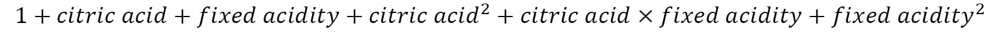


By calling the `fit_transform()` method on the
`PolynomialFeatures` object, we can
generate these features:

```
>>> from sklearn.preprocessing import PolynomialFeatures
>>> PolynomialFeatures(degree=2).fit_transform(
...     r_X_train[['citric acid', 'fixed acidity']]
... )
array([[1.000e+00, 5.500e-01, 9.900e+00, 3.025e-01, 
        5.445e+00, 9.801e+01],
       [1.000e+00, 4.600e-01, 7.400e+00, 2.116e-01, 
        3.404e+00, 5.476e+01],
       [1.000e+00, 4.100e-01, 8.900e+00, 1.681e-01, 
        3.649e+00, 7.921e+01],
       ...,
       [1.000e+00, 1.200e-01, 7.000e+00, 1.440e-02, 
        8.400e-01, 4.900e+01],
       [1.000e+00, 3.100e-01, 7.600e+00, 9.610e-02, 
        2.356e+00, 5.776e+01],
       [1.000e+00, 2.600e-01, 7.700e+00, 6.760e-02, 
        2.002e+00, 5.929e+01]])
```

Let\'s dissect the first row of our array in the
previous code block (highlighted in bold) to understand how we got each
of these values:


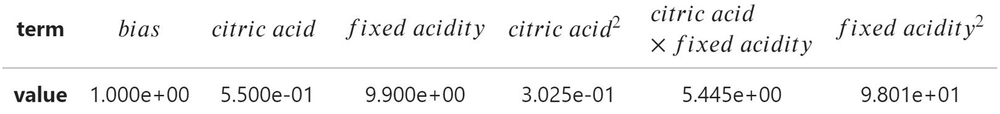


If we are only interested in the interaction variables (*citric acid ×
fixed acidity*, here), we can specify `interaction_only=True`.
In this case, we also don\'t want the bias term, so we specify
`include_bias=False` as well. This will give us the original
variables along with their interaction term(s):

```
>>> PolynomialFeatures(
...     degree=2, include_bias=False, interaction_only=True
... ).fit_transform(
...     r_X_train[['citric acid', 'fixed acidity']]
... )
array([[0.55 , 9.9  , 5.445],
       [0.46 , 7.4  , 3.404],
       [0.41 , 8.9  , 3.649],
       ...,
       [0.12 , 7.   , 0.84 ],
       [0.31 , 7.6  , 2.356],
       [0.26 , 7.7  , 2.002]])
```

We can add these polynomial features to our
pipeline:

```
>>> from sklearn.linear_model import LogisticRegression
>>> from sklearn.model_selection import GridSearchCV
>>> from sklearn.pipeline import Pipeline
>>> from sklearn.preprocessing import (
...     MinMaxScaler, PolynomialFeatures
... )
>>> pipeline = Pipeline([
...     ('poly', PolynomialFeatures(degree=2)),
...     ('scale', MinMaxScaler()),
...     ('lr', LogisticRegression(
...         class_weight='balanced', random_state=0
...     ))
... ]).fit(r_X_train, r_y_train)
```

Note that this model is slightly better than before we added these
additional terms, which was the model used in *Lab 9*, *Getting
Started with Machine Learning in Python*:

```
>>> from sklearn.metrics import classification_report
>>> preds = pipeline.predict(r_X_test)
>>> print(classification_report(r_y_test, preds))
              precision    recall  f1-score   support
           0       0.95      0.79      0.86       138
           1       0.36      0.73      0.48        22
    accuracy                           0.78       160
   macro avg       0.65      0.76      0.67       160
weighted avg       0.87      0.78      0.81       160
```

Adding polynomial features and interaction terms increases the
dimensionality of our data, which may not be
desirable. Sometimes, rather than looking to create more features, we
look for ways to consolidate them and reduce the dimensionality of our
data.


Dimensionality reduction
------------------------

One common strategy for feature selection is to discard features with
low variance. These features aren\'t very informative since they are
mostly the same value throughout the data. Scikit-learn provides the
`VarianceThreshold` class for carrying out feature selection
according to a minimum variance threshold. By default, it will discard
any features that have zero variance; however, we can provide our own
threshold. Let\'s perform feature selection on our model that predicts
whether a wine is red or white based on its chemical composition. Since
we have no features with zero variance, we will choose to keep features
whose variance is greater than 0.01:

```
>>> from sklearn.feature_selection import VarianceThreshold
>>> from sklearn.linear_model import LogisticRegression
>>> from sklearn.pipeline import Pipeline
>>> from sklearn.preprocessing import StandardScaler
>>> white_or_red_min_var = Pipeline([
...     ('feature_selection',
...      VarianceThreshold(threshold=0.01)), 
...     ('scale', StandardScaler()), 
...     ('lr', LogisticRegression(random_state=0))
... ]).fit(w_X_train, w_y_train)
```

This removed two features with low variance. We
can get their names with the Boolean mask returned by the
`VarianceThreshold` object\'s `get_support()`
method, which indicates the features that were kept:

```
>>> w_X_train.columns[
...     ~white_or_red_min_var.named_steps[
...         'feature_selection'
...     ].get_support()
... ]
Index(['chlorides', 'density'], dtype='object')
```

Using only 9 of the 11 features, our performance hasn\'t been affected
much:

```
>>> from sklearn.metrics import classification_report
>>> print(classification_report(
...     w_y_test, white_or_red_min_var.predict(w_X_test)
... ))
              precision    recall  f1-score   support
           0       0.98      0.99      0.99      1225
           1       0.98      0.95      0.96       400
    accuracy                           0.98      1625
   macro avg       0.98      0.97      0.97      1625
weighted avg       0.98      0.98      0.98      1625
```

Let\'s take a look at the `pca_scatter()` function in the
`ml_utils.pca` module, which will help us visualize our data
when reduced to two dimensions:

```
import matplotlib.pyplot as plt
from sklearn.decomposition import PCA
from sklearn.pipeline import Pipeline
from sklearn.preprocessing import MinMaxScaler
def pca_scatter(X, labels, cbar_label, cmap='brg'):
    """
    Create a 2D scatter plot from 2 PCA components of X
    Parameters:
        - X: The X data for PCA
        - labels: The y values
        - cbar_label: The label for the colorbar
        - cmap: Name of the colormap to use.
    Returns:
        Matplotlib `Axes` object
    """
    pca = Pipeline([
        ('scale', MinMaxScaler()),
        ('pca', PCA(2, random_state=0))
    ]).fit(X)
    data, classes = pca.transform(X), np.unique(labels)
    ax = plt.scatter(
        data[:, 0], data[:, 1],
        c=labels, edgecolor='none', alpha=0.5,
        cmap=plt.cm.get_cmap(cmap, classes.shape[0])
    )
    plt.xlabel('component 1')
    plt.ylabel('component 2')
    cbar = plt.colorbar()
    cbar.set_label(cbar_label)
    cbar.set_ticks(classes)
    plt.legend([
        'explained variance\n'
        'comp. 1: {:.3}\ncomp. 2: {:.3}'.format(
           *pca.named_steps['pca'].explained_variance_ratio_
        ) 
    ])
    return ax
```

Let\'s visualize the wine data with two PCA
components to see if there is a way to separate red from white:

```
>>> from ml_utils.pca import pca_scatter
>>> pca_scatter(wine_X, wine_y, 'wine is red?')
>>> plt.title('Wine Kind PCA (2 components)')
```

Most of the red wines are in the bright green mass of points at the top,
and the white wines are in the blue point mass at the bottom. Visually,
we can see how to separate them, but there is still some overlap:


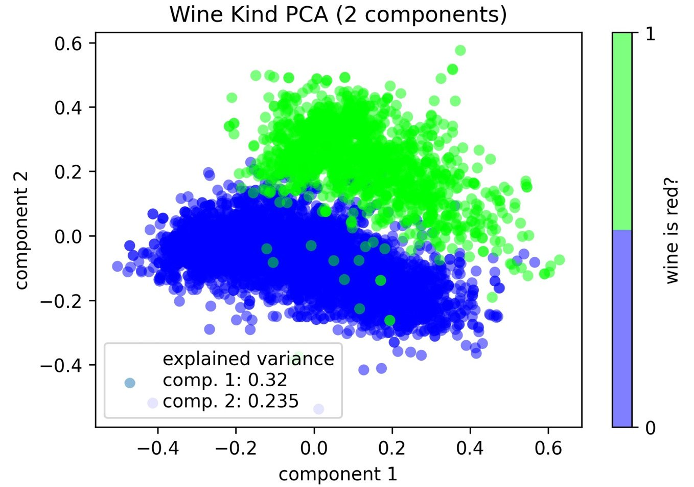


Tip

PCA components will be linearly uncorrelated, since they were obtained
through an orthogonal transformation (perpendicularity extended to
higher dimensions). Linear regression assumes the regressors (input
data) are not correlated, so this can help address multicollinearity.

Note the explained variances of each component
from the previous plot\'s legend---the components explain over 50% of
the variance in the wine data. Let\'s see if using three dimensions
improves the separation. The `pca_scatter_3d()` function in
the `ml_utils.pca` module uses `mpl_toolkits`, which
comes with `matplotlib` for 3D visualizations:

```
import matplotlib.pyplot as plt
from mpl_toolkits.mplot3d import Axes3D
from sklearn.decomposition import PCA
from sklearn.pipeline import Pipeline
from sklearn.preprocessing import MinMaxScaler
def pca_scatter_3d(X, labels, cbar_label, cmap='brg', 
                   elev=10, azim=15):
    """
    Create a 3D scatter plot from 3 PCA components of X
    Parameters:
        - X: The X data for PCA
        - labels: The y values
        - cbar_label: The label for the colorbar
        - cmap: Name of the colormap to use.
        - elev: The degrees of elevation to view the plot from. 
        - azim: The azimuth angle on the xy plane (rotation 
                around the z-axis).
    Returns:
        Matplotlib `Axes` object
    """
    pca = Pipeline([
        ('scale', MinMaxScaler()),
        ('pca', PCA(3, random_state=0))
    ]).fit(X)
    data, classes = pca.transform(X), np.unique(labels)
    fig = plt.figure()
    ax = fig.add_subplot(111, projection='3d')
    p = ax.scatter3D(
        data[:, 0], data[:, 1], data[:, 2],
        alpha=0.5, c=labels,
        cmap=plt.cm.get_cmap(cmap, classes.shape[0])
    )
    ax.view_init(elev=elev, azim=azim)
    ax.set_xlabel('component 1')
    ax.set_ylabel('component 2')
    ax.set_zlabel('component 3')
    cbar = fig.colorbar(p, pad=0.1)
    cbar.set_ticks(classes)
    cbar.set_label(cbar_label)
    plt.legend([
        'explained variance\ncomp. 1: {:.3}\n'
        'comp. 2: {:.3}\ncomp. 3: {:.3}'.format(
            *pca.named_steps['pca'].explained_variance_ratio_
        ) 
    ])
    return ax
```

Let\'s use our 3D visualization function on the
wine data again to see if white and red are easier to separate with
three PCA components:

```
>>> from ml_utils.pca import pca_scatter_3d
>>> pca_scatter_3d(
...     wine_X, wine_y, 'wine is red?', elev=20, azim=-10
... )
>>> plt.suptitle('Wine Type PCA (3 components)')
```

It seems like we could slice off the green (right) point mass from this
angle, although we still have a few points in the wrong section:


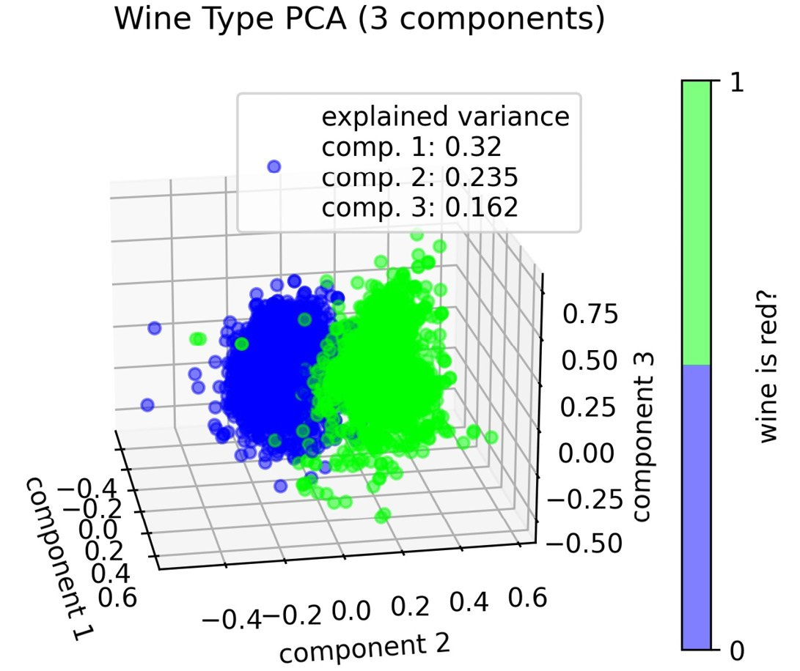

We can use the
`pca_explained_variance_plot()` function from the
`ml_utils.pca` module to visualize the cumulative explained
variance as a function of the number of PCA components:

```
import matplotlib.pyplot as plt
import numpy as np
def pca_explained_variance_plot(pca_model, ax=None):
    """
    Plot the cumulative explained variance of PCA components.
    Parameters:
        - pca_model: The PCA model that has been fit already
        - ax: Matplotlib `Axes` object to plot on.
    Returns:
        A matplotlib `Axes` object
    """
    if not ax:
        fig, ax = plt.subplots()
    ax.plot(
        np.append(
            0, pca_model.explained_variance_ratio_.cumsum()
        ), 'o-'
    )
    ax.set_title(
        'Total Explained Variance Ratio for PCA Components'
    )
    ax.set_xlabel('PCA components used')
    ax.set_ylabel('cumulative explained variance ratio')
    return ax
```

We can pass the PCA part of our pipeline to this
function in order to see the cumulative explained variance:

```
>>> from sklearn.decomposition import PCA
>>> from sklearn.pipeline import Pipeline
>>> from sklearn.preprocessing import MinMaxScaler
>>> from ml_utils.pca import pca_explained_variance_plot
>>> pipeline = Pipeline([
...     ('normalize', MinMaxScaler()),
...     ('pca', PCA(8, random_state=0))
... ]).fit(w_X_train, w_y_train) 
>>> pca_explained_variance_plot(pipeline.named_steps['pca'])
```

The first four PCA components explain about 80% of the variance:


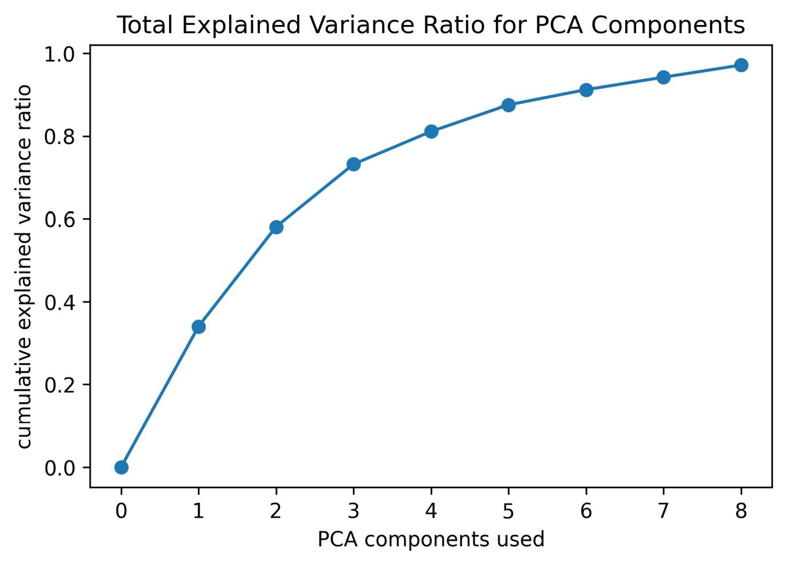


We can also use the elbow point method to find a good value for the
number of PCA components to use, just as we did
with k-means in *Lab 9*, *Getting Started with Machine Learning in
Python*. For this, we need to make a **scree plot**, which shows the
explained variance for each component. The `ml_utils.pca`
module has the `pca_scree_plot()` function for creating this
visualization:

```
import matplotlib.pyplot as plt
import numpy as np
def pca_scree_plot(pca_model, ax=None):
    """
    Plot explained variance of each consecutive PCA component.
    Parameters:
        - pca_model: The PCA model that has been fit already
        - ax: Matplotlib `Axes` object to plot on.
    Returns: A matplotlib `Axes` object
    """
    if not ax:
        fig, ax = plt.subplots()
    values = pca_model.explained_variance_
    ax.plot(np.arange(1, values.size + 1), values, 'o-')
    ax.set_title('Scree Plot for PCA Components')
    ax.set_xlabel('component')
    ax.set_ylabel('explained variance')
    return ax
```

We can pass the PCA part of our pipeline to this
function in order to see the variance explained by each PCA component:

```
>>> from sklearn.decomposition import PCA
>>> from sklearn.pipeline import Pipeline
>>> from sklearn.preprocessing import MinMaxScaler
>>> from ml_utils.pca import pca_scree_plot
>>> pipeline = Pipeline([
...     ('normalize', MinMaxScaler()),
...     ('pca', PCA(8, random_state=0))
... ]).fit(w_X_train, w_y_train)
>>> pca_scree_plot(pipeline.named_steps['pca'])
```

The scree plot tells us we should try four PCA
components because there are diminishing returns after that component:


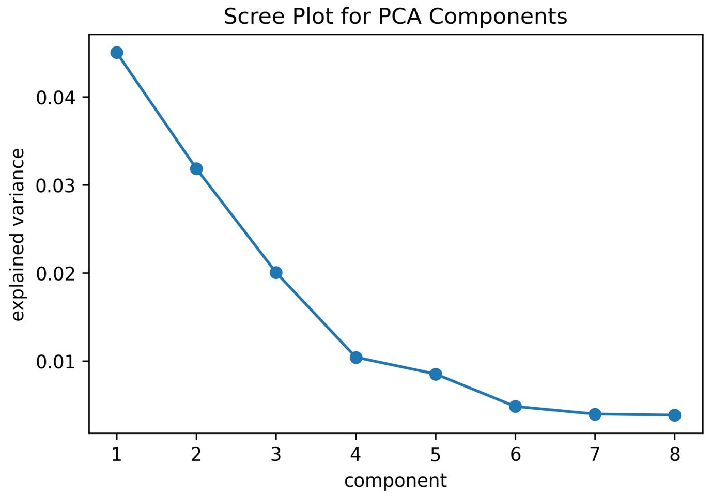


after the fourth

We can build a model on top of these four PCA
features in a process called **meta-learning**, where the last model in
the pipeline is trained on the output from a different model, not the
original data itself:

```
>>> from sklearn.decomposition import PCA
>>> from sklearn.pipeline import Pipeline
>>> from sklearn.preprocessing import MinMaxScaler
>>> from sklearn.linear_model import LogisticRegression
>>> pipeline = Pipeline([
...     ('normalize', MinMaxScaler()),
...     ('pca', PCA(4, random_state=0)),
...     ('lr', LogisticRegression(
...         class_weight='balanced', random_state=0
...     ))
... ]).fit(w_X_train, w_y_train)
```

Our new model performs nearly as well as the
original logistic regression that used 11 features, with just 4 features
made with PCA:

```
>>> from sklearn.metrics import classification_report
>>> preds = pipeline.predict(w_X_test)
>>> print(classification_report(w_y_test, preds))
              precision    recall  f1-score   support
           0       0.99      0.99      0.99      1225
           1       0.96      0.96      0.96       400
    accuracy                           0.98      1625
   macro avg       0.98      0.98      0.98      1625
weighted avg       0.98      0.98      0.98      1625
```

After performing dimensionality reduction, we no longer have all of the
features we started with---reducing the number of features was the point
after all. However, it is possible that we will
want to perform different feature engineering techniques on subsets of
our features; in order to do so, we need to understand feature unions.


Feature unions
--------------

We may want to build a model on features from a variety of sources, such
as PCA, in addition to selecting a subset of the
features. For these purposes, `scikit-learn` provides the
`FeatureUnion` class in the `pipeline` module. This
also allows us to perform multiple feature engineering techniques at
once, such as feature extraction followed by feature transformation,
when we combine this with a pipeline.

Creating a `FeatureUnion` object is just like creating a
pipeline, but rather than passing the steps in order, we pass the
transformations we want to make. These will be stacked side by side in
the result. Let\'s use a feature union of interaction terms and select
the features with a variance above 0.01 to predict red wine quality:

```
>>> from sklearn.feature_selection import VarianceThreshold
>>> from sklearn.pipeline import FeatureUnion, Pipeline
>>> from sklearn.preprocessing import (
...     MinMaxScaler, PolynomialFeatures
... )
>>> from sklearn.linear_model import LogisticRegression
>>> combined_features = FeatureUnion([
...     ('variance', VarianceThreshold(threshold=0.01)),
...     ('poly', PolynomialFeatures(
...         degree=2, include_bias=False, interaction_only=True
...     ))
... ])
>>> pipeline = Pipeline([
...     ('normalize', MinMaxScaler()),
...     ('feature_union', combined_features),
...     ('lr', LogisticRegression(
...         class_weight='balanced', random_state=0
...     ))
... ]).fit(r_X_train, r_y_train)
```

To illustrate the transformation that took place, let\'s examine the
first row from the training set for the red wine quality data after the
`FeatureUnion` object transforms it. Since we
saw that our variance threshold results in nine
features, we know they are the first nine entries in the resulting NumPy
array, and the rest are the interaction terms:

```
>>> pipeline.named_steps['feature_union']\
...     .transform(r_X_train)[0]
array([9.900000e+00, 3.500000e-01, 5.500000e-01, 5.000000e+00,
       1.400000e+01, 9.971000e-01, 3.260000e+00, 1.060000e+01,
       9.900000e+00, 3.500000e-01, 5.500000e-01, 2.100000e+00,
       6.200000e-02, 5.000000e+00, 1.400000e+01, 9.971000e-01,
       ..., 3.455600e+01, 8.374000e+00])
```

We can also look at the classification report to see that we got a
marginal improvement in F[1]{.subscript} score:

```
>>> from sklearn.metrics import classification_report
>>> preds = pipeline.predict(r_X_test)
>>> print(classification_report(r_y_test, preds))
              precision    recall  f1-score   support
           0       0.94      0.80      0.87       138
           1       0.36      0.68      0.47        22
    accuracy                           0.79       160
   macro avg       0.65      0.74      0.67       160
weighted avg       0.86      0.79      0.81       160
```

In this example, we selected our features such that they had variance
greater than 0.01, making the assumption that if
the feature doesn\'t take on many different values then it may not be
that helpful. Rather than making this assumption, we can use a machine
learning model to help determine which features are important.


Feature importances
-------------------

**Decision trees** recursively split the data,
making decisions on which features to use for
each split. They are **greedy learners**, meaning
they look for the largest split they can make
each time; this isn\'t necessarily the optimal split when looking at the
output of the tree. We can use a decision tree to
gauge **feature importances**, which determine how the tree splits the
data at the decision nodes. These feature importances can help inform
feature selection. Note that feature importances will sum to one, and
higher values are better. Let\'s use a decision tree to see how red and
white wine can be separated on a chemical level:

```
>>> from sklearn.tree import DecisionTreeClassifier
>>> dt = DecisionTreeClassifier(random_state=0).fit(
...     w_X_train, w_y_train
... )
>>> pd.DataFrame([(col, coef) for col, coef in zip(
...     w_X_train.columns, dt.feature_importances_
... )], columns=['feature', 'importance']
... ).set_index('feature').sort_values(
...     'importance', ascending=False
... ).T
```

This shows us that the most important chemical
properties in distinguishing between red and
white wine are total sulfur dioxide and chlorides:


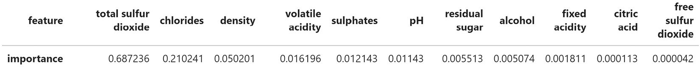


type

Tip

Using the top features, as indicated by the feature importances, we can
try to build a simpler model (by using fewer features). If possible, we
want to simplify our models without sacrificing much performance. See
the `wine.ipynb` notebook for an example.

If we train another decision tree with a max depth of two, we can
visualize the top of the tree (it is too large to visualize if we don\'t
limit the depth):

```
>>> from sklearn.tree import export_graphviz
>>> import graphviz
>>> graphviz.Source(export_graphviz(
...     DecisionTreeClassifier(
...         max_depth=2, random_state=0
...     ).fit(w_X_train, w_y_train),
...     feature_names=w_X_train.columns
... ))
```

Important note

Graphviz software will need to be installed (if it isn\'t already) in
order to visualize the tree. It can be downloaded
at <https://graphviz.gitlab.io/download/>, with the installation guide
at <https://graphviz.readthedocs.io/en/stable/manual.html#installation>.
Note that the kernel will need to be restarted
after installing. Otherwise, pass `out_file='tree.dot'` to the
`export_graphviz()` `function` and then generate a
PNG file by running `dot -T png tree.dot -o tree.png` from the
command line. As an alternative, `scikit-learn` provides the
`plot_tree()` function, which uses `matplotlib`;
consult the notebook for an example.

This results in the following tree, which first splits on total sulfur
dioxide (which has the highest feature importance), followed by
chlorides on the second level. The information at each node tells us the
criterion for the split (the top line), the value of the cost function
(**gini**), the number of samples at that node (**samples**), and the
number of samples in each class at that node (**values**):


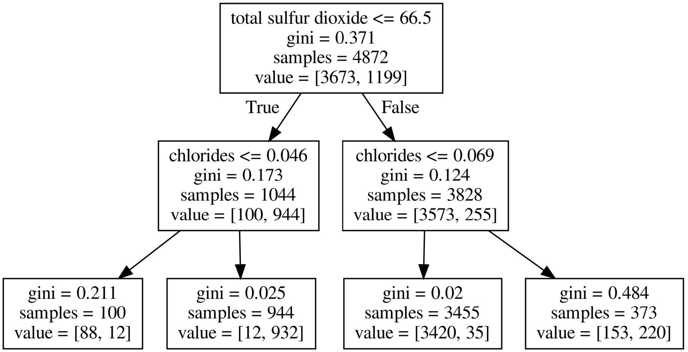


properties

We can also apply decision trees to regression
problems. Let\'s find the feature importances for the planets data using
the `DecisionTreeRegressor` class:

```
>>> from sklearn.tree import DecisionTreeRegressor
>>> dt = DecisionTreeRegressor(random_state=0).fit(
...     pl_X_train, pl_y_train
... )
>>> [(col, coef) for col, coef in zip(
...     pl_X_train.columns, dt.feature_importances_
... )]
[('semimajoraxis', 0.9969449557611615),
 ('mass', 0.0015380986260574154),
 ('eccentricity', 0.0015169456127809738)]
```

Basically, the semi-major axis is the main determinant in the period
length, which we already knew, but if we visualize a tree, we can see
why. The first four splits are all based on the semi-major axis:


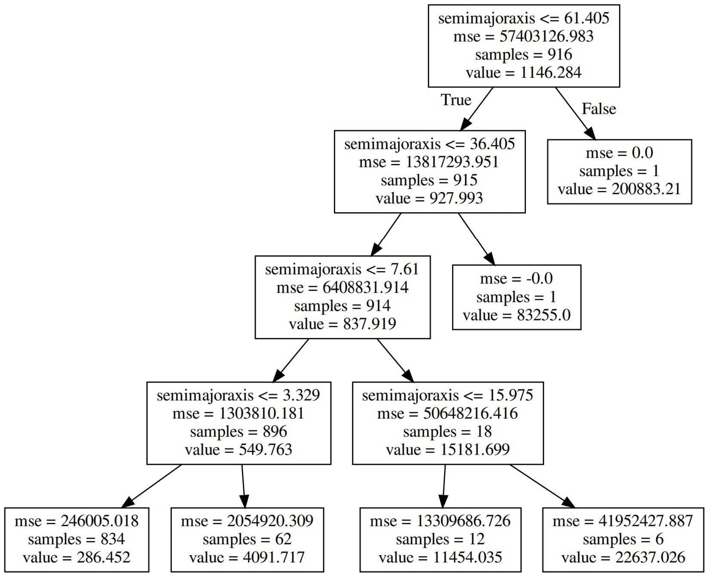


Decision trees can be **pruned** after being grown to maximum depth, or
provided with a max depth before training, to
limit growth and thus avoid overfitting.

Random forest
-------------

Let\'s use the `RandomForestClassifier` class from the
`ensemble` module to build a random forest (with
`n_estimators` trees in it) for the classification of
high-quality red wines:

```
>>> from sklearn.ensemble import RandomForestClassifier
>>> from sklearn.model_selection import GridSearchCV
>>> rf = RandomForestClassifier(
...     n_estimators=100, random_state=0
... )
>>> search_space = {
...     'max_depth': [4, 8], # keep trees small
...     'min_samples_leaf': [4, 6]
... }
>>> rf_grid = GridSearchCV(
...     rf, search_space, cv=5, scoring='precision'
... ).fit(r_X_train, r_y_train)
>>> rf_grid.score(r_X_test, r_y_test)
0.6
```

Note that our precision with the random forest is
already much better than the 0.35 we got in
*Lab 9*, *Getting Started with Machine Learning in Python*. The
random forest is robust to outliers and able to model non-linear
decision boundaries to separate the classes, which may explain part of
this dramatic improvement.


Gradient boosting
-----------------

Let\'s use grid search and gradient boosting to
train another model for classifying the red wine quality data. In
addition to searching for the best values for the
`max_depth` and `min_samples_leaf` parameters, we
will search for a good value for the `learning_rate`
parameter, which determines the contribution each tree will make in the
final estimator:

```
>>> from sklearn.ensemble import GradientBoostingClassifier
>>> from sklearn.model_selection import GridSearchCV
>>> gb = GradientBoostingClassifier(
...     n_estimators=100, random_state=0
... )
>>> search_space = {
...     'max_depth': [4, 8], # keep trees small
...     'min_samples_leaf': [4, 6],
...     'learning_rate': [0.1, 0.5, 1]
... }
>>> gb_grid = GridSearchCV(
...     gb, search_space, cv=5, scoring='f1_macro'
... ).fit(r_X_train, r_y_train)
```

The F[1]{.subscript} macro score we achieve with gradient boosting is
better than the 0.66 we got with logistic regression in *Lab 9*,
*Getting Started with Machine Learning in Python*:

```
>>> gb_grid.score(r_X_test, r_y_test)
0.7226024272287617
```

Both bagging and boosting have given us better performance than the
logistic regression model; however, we may find
that the models don\'t always agree and that we could
improve performance even more by having the
models vote before making the final prediction.


Voting
------

When trying out different models for classification, it may be
interesting to measure their agreement using
Cohen\'s kappa score. We can use the
`cohen_kappa_score()` function in the
`sklearn.metrics` module to do so. The score ranges from
complete disagreement (-1) to complete agreement (1). Our boosting and
bagging predictions have a high level of agreement:

```
>>> from sklearn.metrics import cohen_kappa_score
>>> cohen_kappa_score(
...     rf_grid.predict(r_X_test), gb_grid.predict(r_X_test)
... )
0.7185929648241206
```

Sometimes, we can\'t find a single model that works well for all of our
data, so we may want to find a way to combine the opinions of various
models to make the final decision. Scikit-learn provides the
`VotingClassifier` class for aggregating model opinions on
classification tasks. We have the option of specifying the voting type,
where `hard` results in majority rules and `soft`
will predict the class with the highest sum of probabilities across the
models.

As an example, let\'s create a classifier for each voting type using the
three estimators (models) from this lab---logistic regression,
random forest, and gradient boosting. Since we will run
`fit()`, we pass in the best estimator from each of our grid
searches (`best_estimator_`). This avoids running each grid
search again unnecessarily, which will also train our model faster:

```
>>> from sklearn.ensemble import VotingClassifier
>>> majority_rules = VotingClassifier(
...     [('lr', lr_grid.best_estimator_), 
...      ('rf', rf_grid.best_estimator_), 
...      ('gb', gb_grid.best_estimator_)],
...     voting='hard'
... ).fit(r_X_train, r_y_train)
>>> max_probabilities = VotingClassifier(
...     [('lr', lr_grid.best_estimator_), 
...      ('rf', rf_grid.best_estimator_), 
...      ('gb', gb_grid.best_estimator_)],
...     voting='soft'
... ).fit(r_X_train, r_y_train)
```

Our `majority_rules` classifier requires two of the three
models to agree (at a minimum), while the `max_probabilities`
classifier has each model vote with its predicted probabilities. We can
measure how well they perform on the test data
with 
function, which tells us that `majority_rules` is a little
better than `max_probabilities` in terms of precision. Both
are better than the other models we have tried:

```
>>> from sklearn.metrics import classification_report
>>> print(classification_report(
...     r_y_test, majority_rules.predict(r_X_test)
... ))
              precision    recall  f1-score   support
           0       0.92      0.95      0.93       138
           1       0.59      0.45      0.51        22
    accuracy                           0.88       160
   macro avg       0.75      0.70      0.72       160
weighted avg       0.87      0.88      0.87       160
>>> print(classification_report(
...     r_y_test, max_probabilities.predict(r_X_test)
... ))
              precision    recall  f1-score   support
           0       0.92      0.93      0.92       138
           1       0.52      0.50      0.51        22
    accuracy                           0.87       160
   macro avg       0.72      0.71      0.72       160
weighted avg       0.87      0.87      0.87       160
```

Another important option with the `VotingClassifier` class is
the `weights` parameter, which lets us
place more or less emphasis on certain estimators
when voting. For example, if we pass
`weights=[1, 2, 2]` to `majority_rules`, we are
giving extra weight to the predictions made by the random forest and
gradient boosting estimators. In order to determine which models (if
any) should be given extra weight, we can look at individual performance
and prediction confidence.


Inspecting classification prediction confidence
===============================================


As we saw with ensemble methods, when we know the strengths and
weaknesses of our model, we can employ strategies to attempt to improve
performance. We may have two models to classify
something, but they most likely won\'t agree on everything. However, say
that we know that one does better on edge cases, while the other is
better on the more common ones. In that case, we would likely want to
investigate a voting classifier to improve our performance. How can we
know how the models perform in different situations, though?

By looking at the probabilities the model predicts of an observation
belonging to a given class, we can gain insight into how confident our
model is when it is correct and when it errs. We can use our
`pandas` data wrangling skills to make quick work of this.
Let\'s see how confident our original `white_or_red` model
from *Lab 9*, *Getting Started with Machine Learning in Python*, was
in its predictions:

```
>>> prediction_probabilities = pd.DataFrame(
...     white_or_red.predict_proba(w_X_test), 
...     columns=['prob_white', 'prob_red']
... ).assign(
...     is_red=w_y_test == 1,
...     pred_white=lambda x: x.prob_white >= 0.5,
...     pred_red=lambda x: np.invert(x.pred_white),
...     correct=lambda x: (np.invert(x.is_red) & x.pred_white)
...                        | (x.is_red & x.pred_red)
... )
```

Tip

We can tweak the probability threshold for our model\'s predictions by
using the `predict_proba()` method, instead of
`predict()`. This will give us the probabilities that the
observation belongs to each class. We can then compare that to our
custom threshold. For example, we could use 75%:
`white_or_red.predict_proba(w_X_test)[:,1] >= .75`.

One way to identify this threshold is to determine the false positive
rate we are comfortable with, and then use the data from the
`roc_curve()` function in the `sklearn.metrics`
module to find the threshold that results in that false positive rate.
Another way is to find a satisfactory spot along the precision-recall
curve, and then get the threshold from the
`precision_recall_curve()` function. We will work through an
example in *Lab 11*,
*Machine Learning Anomaly Detection*.

Let\'s use `seaborn` to make a plot showing the distribution
of the prediction probabilities when the model
was correct versus when it was incorrect. The `displot()`
function makes it easy to plot the **kernel
density estimate** (**KDE**) superimposed on a
histogram. Here, we will also add a **rug plot**, which shows where each
of our predictions ended up:

```
>>> g = sns.displot(
...     data=prediction_probabilities, x='prob_red', 
...     rug=True, kde=True, bins=20, col='correct',
...     facet_kws={'sharey': True} 
... )
>>> g.set_axis_labels('probability wine is red', None) 
>>> plt.suptitle('Prediction Confidence', y=1.05)
```

The KDE for correct predictions is bimodal, with modes near 0 and near
1, meaning the model is very confident when it is correct, which, since
it is correct most of the time, means it is very confident in general.
The peak of the correct predictions KDE at 0 is much higher than the one
at 1 because we have many more white wines than red wines in the data.
Note that the KDE shows probabilities of less than zero and greater than
one as possible. For this reason, we add the histogram to confirm that
the shape we are seeing is meaningful. The histogram for correct
predictions doesn\'t have much in the middle of the distribution, so we
include the rug plot to better see which probabilities were predicted.
The incorrect predictions don\'t have many data points, but it appears
to be all over the place, because when the model got it wrong, it got
fooled pretty badly:


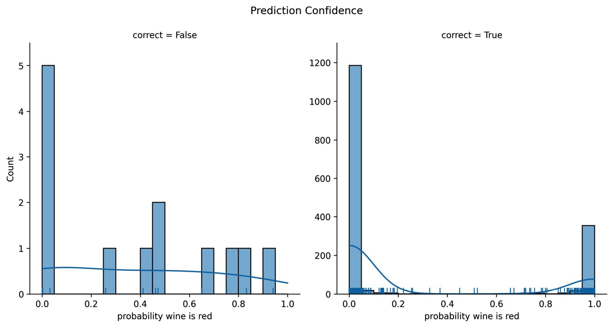


incorrect

This outcome tells us we may want to look into the chemical properties
of the wines that were incorrectly classified.
It\'s possible they were outliers and that is why they fooled the model.
We can modify the box plots by wine type from the *Exploratory data
analysis* section in *Lab 9*, *Getting Started with Machine Learning
in Python*, to see if anything stands out (*Figure 9.6*).

First, we isolate the chemical properties for the incorrectly classified
wines:

```
>>> incorrect = w_X_test.assign(is_red=w_y_test).iloc[
...     prediction_probabilities.query('not correct').index
... ]
```

Then, we add some calls to `scatter()` on the `Axes`
object to mark these wines on the box plots from before:

```
>>> import math
>>> chemical_properties = [col for col in wine.columns
...                        if col not in ['quality', 'kind']]
>>> melted = \
...     wine.drop(columns='quality').melt(id_vars=['kind'])
>>> fig, axes = plt.subplots(
...     math.ceil(len(chemical_properties) / 4), 4,
...     figsize=(15, 10)
... )
>>> axes = axes.flatten()
>>> for prop, ax in zip(chemical_properties, axes):
...     sns.boxplot(
...         data=melted[melted.variable.isin([prop])], 
...         x='variable', y='value', hue='kind', ax=ax,
...         palette={'white': 'lightyellow', 'red': 'orchid'},
...         saturation=0.5, fliersize=2
...     ).set_xlabel('')
...     for _, wrong in incorrect.iterrows(): 
...         # _ is convention for collecting info we won't use
...         x_coord = -0.2 if not wrong['is_red'] else 0.2
...         ax.scatter(
...             x_coord, wrong[prop], marker='x',
...             color='red', s=50
...         )
>>> for ax in axes[len(chemical_properties):]:
...     ax.remove()
>>> plt.suptitle(
...     'Comparing Chemical Properties of Red and White Wines'
...     '\n(classification errors are red x\'s)'
... )
>>> plt.tight_layout() # clean up layout
```

This results in each of the incorrectly
classified wines being marked with a red **X**. In each subplot, the
points on the left box plot are white wines and those on the right box
plot are red wines. It appears that some of them may have been outliers
for a few characteristics---such as red wines with high residual sugar
or sulfur dioxide, and white wines with high volatile acidity:


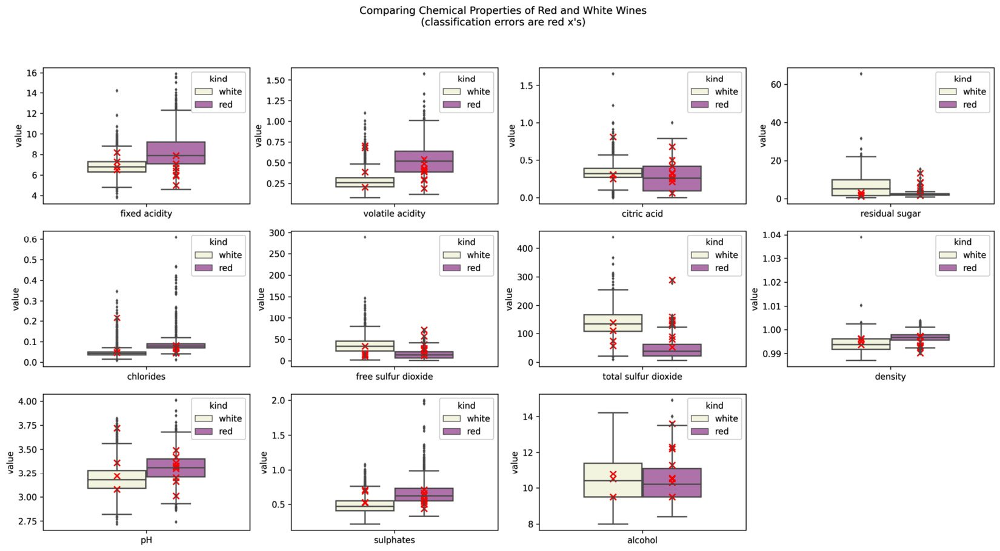


Despite having many more white wines than red
wines in the data, our model is able to distinguish between them pretty
well. This isn\'t always the case. Sometimes, in order to improve our
performance, we need to address the class imbalance.


Addressing class imbalance
==========================

Before we explore any imbalanced sampling techniques, let\'s create a
baseline model using **k-nearest neighbors** (**k-NN**) classification,
which will classify observations according to the
class of the k-nearest observations in the n-dimensional space of the
data (our red wine quality data is 11-dimensional). For comparison
purposes, we will use the same number of neighbors for all the models in
this section; however, it is certainly possible that the sampling
techniques will result in a different value performing better. We will
use five neighbors:

```
>>> from sklearn.neighbors import KNeighborsClassifier
>>> knn = KNeighborsClassifier(n_neighbors=5).fit(
...     r_X_train, r_y_train
... )
>>> knn_preds = knn.predict(r_X_test)
```

Our k-NN model is fast to train because it is a **lazy
learner**---calculations are made at classification time. It is
important to keep in mind the time our models take to train and make
predictions, as this can dictate which models we can use in practice. A
model that performs marginally better but takes twice as long to train
or predict may not be worth it. As the dimensionality of our data
increases, the k-NN model will become less and less feasible. We can use
the `%%timeit` magic to get an estimate of how long it takes
on average to train. Note that this will train the model multiple times,
so it might not be the best strategy to time a
computationally intense model:

```
>>> %%timeit
>>> from sklearn.neighbors import KNeighborsClassifier
>>> knn = KNeighborsClassifier(n_neighbors=5).fit(
...     r_X_train, r_y_train
... )
3.24 ms ± 599 µs per loop 
(mean ± std. dev. of 7 runs, 100 loops each)
```

Let\'s compare this result with training a
**support vector machine** (**SVM**), which projects the data into a
higher dimension to find the **hyperplane** that separates the classes.
A hyperplane is the n-dimensional equivalent of a plane, just like
a plane is the two-dimensional equivalent of a
line. SVMs are typically robust to outliers and can model non-linear
decision boundaries; however, SVMs get slow very quickly, so it will be
a good comparison:

```
>>> %%timeit
>>> from sklearn.svm import SVC
>>> svc = SVC(gamma='auto').fit(r_X_train, r_y_train)
153 ms ± 6.7 ms per loop 
(mean ± std. dev. of 7 runs, 1 loop each)
```

Now that we have our baseline model and an idea of how it works, let\'s
see how the baseline k-NN model performs:

```
>>> from sklearn.metrics import classification_report
>>> print(classification_report(r_y_test, knn_preds))
              precision    recall  f1-score   support
           0       0.91      0.93      0.92       138
           1       0.50      0.41      0.45        22
    accuracy                           0.86       160
   macro avg       0.70      0.67      0.69       160
weighted avg       0.85      0.86      0.86       160
```

With this performance benchmark, we are ready to
try out imbalanced sampling. We will be using the `imblearn`
package, which is provided by the `scikit-learn` community. It
provides implementations for over- and under-sampling using various
strategies, and it is just as easy to use as `scikit-learn`,
since they both follow the same API conventions.

Under-sampling
--------------

As we hinted at earlier, under-sampling will reduce the amount of data
available to train our model on. This means we should only attempt this
if we have enough data that we can accept
eliminating some of it. Let\'s
see what happens with the red wine quality data,
since we don\'t have much data to begin with.

We will use the `RandomUnderSampler` class from
`imblearn` to randomly under-sample the low-quality red wines
in the training set:

```
>>> from imblearn.under_sampling import RandomUnderSampler
>>> X_train_undersampled, y_train_undersampled = \
...     RandomUnderSampler(random_state=0)\
...         .fit_resample(r_X_train, r_y_train)
```

We went from almost 14% of the
training data being high-quality red wine to 50%
of it; however, notice that this came at the price of 1,049 training
samples (more than half of our training data):

```
# before
>>> r_y_train.value_counts() 
0    1244
1     195
Name: high_quality, dtype: int64
# after
>>> pd.Series(y_train_undersampled).value_counts().sort_index()
0    195
1    195
dtype: int64
```

Fitting our model with the under-sampled data is no different from
before:

```
>>> from sklearn.neighbors import KNeighborsClassifier
>>> knn_undersampled = KNeighborsClassifier(n_neighbors=5)\
...     .fit(X_train_undersampled, y_train_undersampled)
>>> knn_undersampled_preds = knn_undersampled.predict(r_X_test)
```

Using the classification report, we see that under-sampling is
definitely not an improvement---we hardly had any data for this model:

```
>>> from sklearn.metrics import classification_report
>>> print(
...     classification_report(r_y_test, knn_undersampled_preds)
... )
              precision    recall  f1-score   support
           0       0.93      0.65      0.77       138
           1       0.24      0.68      0.35        22
    accuracy                           0.66       160
   macro avg       0.58      0.67      0.56       160
weighted avg       0.83      0.66      0.71       160
```

In situations where we have limited
data to start with, under-sampling is simply not
feasible. Here, we lost over half of the already small amount of data we
had. Models need a good amount of data to learn from, so let\'s try
over-sampling the minority class now.


Over-sampling
-------------

It\'s clear that with smaller datasets, it won\'t be beneficial to
under-sample. Instead, we can try over-sampling
the minority class (the high-quality red wines,
in this case). Rather than doing random
over-sampling with the `RandomOverSampler` class, we are going
to use the **Synthetic Minority Over-sampling Technique** (**SMOTE**) to
create *new* (synthetic) red wines similar to the high-quality ones
using the k-NN algorithm. By doing this, we are making a big assumption
that the data we have collected about the chemical properties of the red
wine does influence the quality rating of the wine.


Let\'s use SMOTE with the five nearest
neighbors to over-sample the high-quality red
wines in our training data:

```
>>> from imblearn.over_sampling import SMOTE
>>> X_train_oversampled, y_train_oversampled = SMOTE(
...     k_neighbors=5, random_state=0
... ).fit_resample(r_X_train, r_y_train)
```

Since we over-sampled, we will have more data than we did before,
gaining an extra 1,049 high-quality red wine samples:

```
# before
>>> r_y_train.value_counts()
0    1244
1     195
Name: high_quality, dtype: int64
# after
>>> pd.Series(y_train_oversampled).value_counts().sort_index()
0    1244
1    1244
dtype: int64
```

Once again, we will fit a k-NN model, using the over-sampled data this
time:

```
>>> from sklearn.neighbors import KNeighborsClassifier
>>> knn_oversampled = KNeighborsClassifier(n_neighbors=5)\ 
...     .fit(X_train_oversampled, y_train_oversampled)
>>> knn_oversampled_preds = knn_oversampled.predict(r_X_test)
```

Over-sampling performed much better
than under-sampling, but unless we were looking
to maximize recall, we are better off sticking with our original
strategy for k-NN:

```
>>> from sklearn.metrics import classification_report
>>> print(
...     classification_report(r_y_test, knn_oversampled_preds)
... )
              precision    recall  f1-score   support
           0       0.96      0.78      0.86       138
           1       0.37      0.82      0.51        22
    accuracy                           0.78       160
   macro avg       0.67      0.80      0.68       160
weighted avg       0.88      0.78      0.81       160
```

Note that since SMOTE is creating synthetic data, we must carefully
consider the side effects this may have on our
model. If we can\'t make the assumption that all
the values of a given class are representative of the full spectrum of
the population and that this won\'t change over time, we cannot expect
SMOTE to work well.


Regularization
==============

Scikit-learn implements ridge, LASSO, and elastic net regressions with
the `Ridge`, `Lasso`, and `ElasticNet`
classes, respectively, which can be used in the same way as the
`LinearRegression` class. There is also a `CV`
version of each of these (`RidgeCV`, `LassoCV`, and
`ElasticNetCV`), which features built-in cross-validation.
Using all the defaults for these models, we find
that LASSO performs the best at predicting the length of the year in
Earth days with the planet data:

```
>>> from sklearn.linear_model import Ridge, Lasso, ElasticNet
>>> ridge, lasso, elastic = Ridge(), Lasso(), ElasticNet()
>>> for model in [ridge, lasso, elastic]:
...     model.fit(pl_X_train, pl_y_train)
...     print(
...         f'{model.__class__.__name__}: ' # get model name
...         f'{model.score(pl_X_test, pl_y_test):.4}'
...     )
Ridge: 0.9206
Lasso: 0.9208
ElasticNet: 0.9047
```

Note that these `scikit-learn` classes have an
`alpha` parameter, which lines up with λ in the previous
equations (not α). For `ElasticNet`, α in the equations lines
up with the `l1_ratio` parameter, which defaults to 50% LASSO.
In practice, both of these hyperparameters are determined with
cross-validation.


Summary
=======


In this lab, we reviewed various techniques we can employ to improve
model performance. We learned how to use grid search to find the best
hyperparameters in a search space, and how to tune our model using the
scoring metric of our choosing with `GridSearchCV`. This means
we don\'t have to accept the default in the `score()` method
of our model and can customize it to our needs.

We also took a look at the random forest, gradient boosting, and
voting classifiers to discuss ensemble methods and how they seek to
address the bias-variance trade-off through bagging, boosting, and
voting strategies. We also saw how to measure agreement between
classifiers with Cohen\'s kappa score. This led us to examine our
`white_or_red` wine classifier\'s confidence in its correct
and incorrect predictions. Once we know the ins and outs of our model\'s
performance, we can try to improve upon it through the appropriate
ensemble method to capitalize on its strengths and mitigate its
weaknesses.

After that, we learned how to use the `imblearn` package to
implement over- and under-sampling strategies when faced with a class
imbalance.

In the next lab, we will revisit the simulated login attempt data
and use machine learning to detect anomalies. We will also see how we
can apply both unsupervised and supervised learning in practice.


Exercises
=========


Complete the following exercises to practice the skills covered in this
lab.

1.  Predict star temperature with elastic net linear regression as
    follows:

    a\) Using the `data/stars.csv` file, build a pipeline to
    normalize the data with a `MinMaxScaler` object and then
    run elastic net linear regression using all the numeric columns to
    predict the temperature of the star.

    b\) Run grid search on the pipeline to find the best values for
    `alpha`, `l1_ratio`, and
    `fit_intercept` for the elastic net in the search space of
    your choice.

    c\) Train the model on 75% of the initial data.

    d\) Calculate the R[2]{.superscript} of your model.

    e\) Find the coefficients for each regressor and the intercept.

    f\) Visualize the residuals using the `plot_residuals()`
    function from the `ml_utils.regression` module.

2.  Perform multiclass classification of white wine quality using a
    support vector machine and feature union as follows:

    a\) Using the `data/winequality-white.csv` file, build a
    pipeline to standardize data, then create a feature union between
    interaction terms and a feature selection method of your choice from
    the `sklearn.feature_selection` module, followed by an SVM
    (use the `SVC` class).

    b\) Run grid search on your pipeline with 85% of the data to find
    the best values for the `include_bias` parameter
    (`PolynomialFeatures`) and the `C` parameter
    (`SVC`) in the search space of your choosing with
    `scoring='f1_macro'`.

    c\) Look at the classification report for your model.

    d\) Create a confusion matrix using the
    `confusion_matrix_visual()` function from the
    `ml_utils.classification` module.

    e\) Plot a precision-recall curve for multiclass data using the
    `plot_multiclass_pr_curve()` function from the
    `ml_utils.classification` module.

3.  Perform multiclass classification of white wine quality using k-NN
    and over-sampling as follows:

    a\) Using the `data/winequality-white.csv` file, create a
    test and training set with 85% of the data in the training set.
    Stratify on `quality`.

    b\) With `imblearn`, use the `RandomOverSampler`
    class to over-sample the minority quality scores.

    c\) Build a pipeline to standardize data and run k-NN.

    d\) Run grid search on your pipeline with the over-sampled data on
    the search space of your choosing to find the best value for k-NN\'s
    `n_neighbors` parameter with
    `scoring='f1_macro'`.

    e\) Look at the classification report for your model.

    f\) Create a confusion matrix using the
    `confusion_matrix_visual()` function from the
    `ml_utils.classification` module.

    g\) Plot a precision-recall curve for multiclass data using the
    `plot_multiclass_pr_curve()` function from the
    `ml_utils.classification` module.

4.  Can wine type (red or white) help determine the quality score?

    a\) Using the `data/winequality-white.csv` and
    `data/winequality-red.csv` files, create a dataframe with
    the concatenated data and a column indicating which wine type the
    data belongs to (red or white).

    b\) Create a test and training set with 75% of the data in the
    training set. Stratify on `quality`.

    c\) Build a pipeline using a `ColumnTransformer` object to
    standardize the numeric data while one-hot encoding the wine type
    column (something like `is_red` and `is_white`,
    each with binary values), and then train a random forest.

    d\) Run grid search on your pipeline with the search space of your
    choosing to find the best value for the random forest\'s
    `max_depth` parameter with `scoring='f1_macro'`.

    e\) Take a look at the feature importances from the random forest.

    f\) Look at the classification report for your model.

    g\) Plot a ROC curve for multiclass data using the
    `plot_multiclass_roc()` function from the
    `ml_utils.classification` module.

    h\) Create a confusion matrix using the
    `confusion_matrix_visual()` function from the
    `ml_utils.classification` module.

5.  Make a multiclass classifier to predict wine quality with majority
    rules voting by performing the following steps:

    a\) Using the `data/winequality-white.csv` and
    `data/winequality-red.csv` files, create a dataframe with
    concatenated data and a column indicating which wine type the data
    belongs to (red or white).

    b\) Create a test and training set with 75% of the data in the
    training set. Stratify on `quality`.

    c\) Build a pipeline for each of the following models: random
    forest, gradient boosting, k-NN, logistic regression, and Naive
    Bayes (`GaussianNB`). The pipeline should use a
    `ColumnTransformer` object to standardize the numeric data
    while one-hot encoding the wine type column (something like
    `is_red` and `is_white`, each with binary
    values), and then build the model. Note that we will discuss Naive
    Bayes in *Lab     11*,
    *Machine Learning Anomaly Detection*.

    d\) Run grid search on each pipeline except Naive Bayes (just run
    `fit()` on it) with `scoring='f1_macro'` on the
    search space of your choosing to find the best values for the
    following:

    i\) **Random forest**: `max_depth`

    ii\) **Gradient boosting**: `max_depth`

    iii\) **k-NN**: `n_neighbors`

    iv\) **Logistic regression**: `C`

    e\) Find the level of agreement between each pair of two models
    using the `cohen_kappa_score()` function from the
    `metrics` module in `scikit-learn`. Note that
    you can get all the combinations of the two easily using the
    `combinations()` function from the `itertools`
    module in the Python standard library.

    f\) Build a voting classifier with the five models built using
    majority rules (`voting='hard'`) and weighting the Naive
    Bayes model half as much as the others.

    g\) Look at the classification report for your model.

    h\) Create a confusion matrix using the
    `confusion_matrix_visual()` function from the
    `ml_utils.classification` module.
