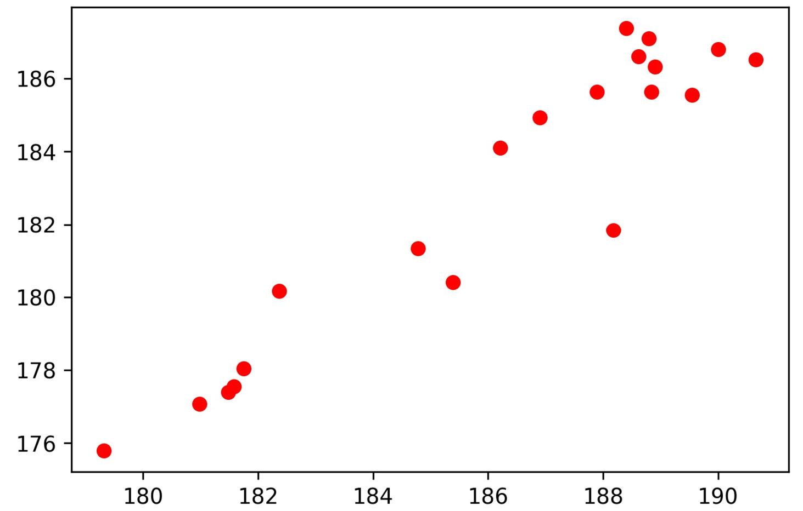
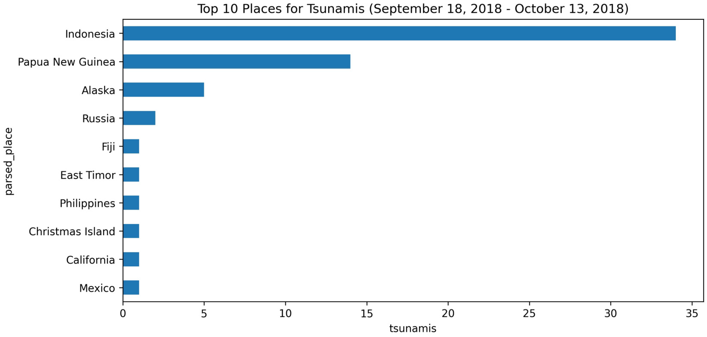
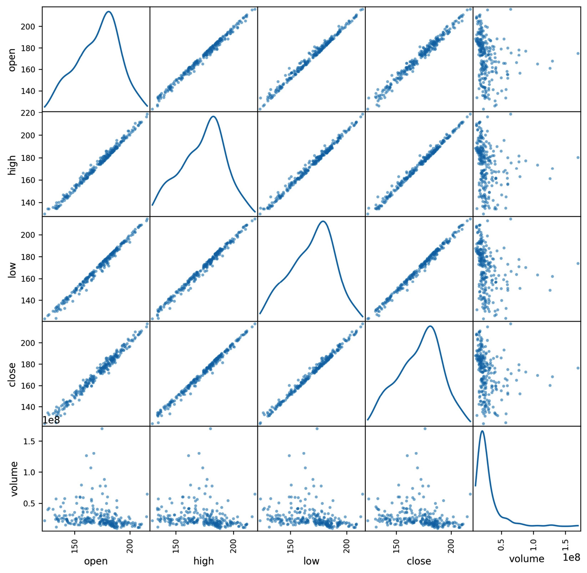
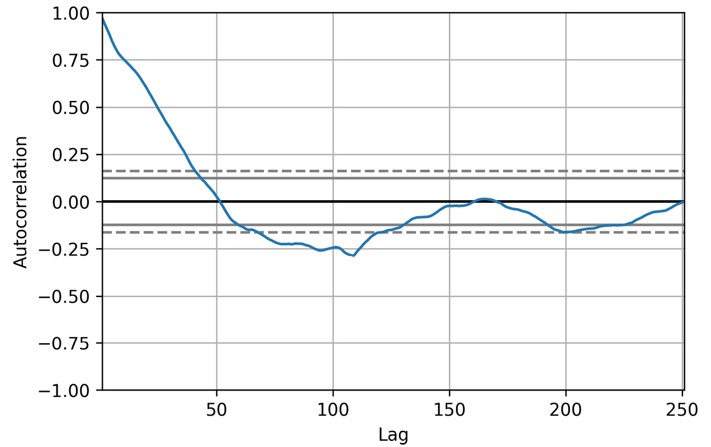

 


Lab 10: Visualizing Data with Pandas and Matplotlib
=====================================================


So far, we have been working with data strictly in a tabular format.
However, the human brain excels at picking out visual patterns; hence,
our natural next step is learning how to visualize our data. In this lab, we will cover the following topics:

-   An introduction to matplotlib
-   Plotting with pandas
-   The pandas.plotting module


#### Pre-reqs:
- Google Chrome (Recommended)

#### Lab Environment
Notebooks are ready to run. All packages have been installed. There is no requirement for any setup.

All examples are present in `~/work/machine-learning-essentials-module1/lab_10` folder. 


Lab materials
==============

We will be working with three datasets, all of which can be found in the
`data/` directory. In the `fb_stock_prices_2018.csv`
file, we have the daily opening, high, low, and closing prices of
Facebook stock from January through December 2018, along with the volume
traded. This was obtained using the `stock_analysis` package,
which we will build in *Lab 12*,
*Financial Analysis -- Bitcoin and the Stock Market*. The stock market
is closed on the weekends, so we only have data for the trading days.

The `earthquakes.csv` file contains earthquake data collected
from the **United States Geological Survey** (**USGS**) API
(<https://earthquake.usgs.gov/fdsnws/event/1/>) for September 18, 2018
through October 13, 2018. For each earthquake, we have the value of the
magnitude (the `mag` column), the scale it was measured on
(the `magType` column), when (the `time` column) and
where (the `place` column) it occurred, and the
`parsed_place` column for the state or country where the
earthquake occurred. Other unnecessary columns have been
removed.

In the `covid19_cases.csv` file, we have an export from the
*daily number of new reported cases of COVID-19 by country worldwide*
dataset provided by the **European Centre for Disease Prevention and Control** (**ECDC**), which can be found at
<https://www.ecdc.europa.eu/en/publications-data/download-todays-data-geographic-distribution-covid-19-cases-worldwide>.
For scripted or automated collection of this data, the ECDC makes the
current day\'s CSV file available via
<https://opendata.ecdc.europa.eu/covid19/casedistribution/csv>. The
snapshot we will be using was collected on September 19, 2020 and
contains the number of new COVID-19 cases per country from December 31,
2019 through September 18, 2020, with partial data for September 19,
2020. For this lab, we will look at the 8-month span from January
18, 2020 through September 18, 2020.

Throughout this lab, we will be working through three notebooks.
These are numbered in the order they will be used---one for each of the
main sections of this lab. We will begin our discussion of plotting
in Python with an introduction to `matplotlib` in the
`1-introducing_matplotlib.ipynb` notebook. Then, we will learn
how to create visualizations using `pandas` in the
`2-plotting_with_pandas.ipynb` notebook. Finally, we will
explore some additional plotting options that `pandas`
provides in the `3-pandas_plotting_module.ipynb` notebook. You
will be prompted when it is time to switch between the notebooks.


The basics
----------

Rather than importing the whole `matplotlib` package, we will
only import the `pyplot` module using the dot (`.`)
notation; this reduces the amount of typing we need to do in order to
access what we need, and we don\'t take up more space in memory with
code we won\'t use. Note that `pyplot` is traditionally
aliased as `plt`:

```
import matplotlib.pyplot as plt
```


In Jupyter Notebooks, we can simply
use the `%matplotlib inline` **magic command** (a special
IPython command preceded by a `%` sign) once, and our
visualizations will be automatically displayed when the cell with our
visualization code is executed. Magic commands (or *magics* for short)
are run as regular code within a Jupyter Notebook cell.


Let\'s create our first plot in the
`1-introducing_matplotlib.ipynb` notebook, using the Facebook
stock prices data from the `fb_stock_prices_2018.csv` file in
the repository for this lab. First, we need to import
`pyplot` and `pandas` (in this example, we will use
`plt.show()`, so we don\'t need to run the magic here):

```
>>> import matplotlib.pyplot as plt
>>> import pandas as pd
```


Next, we read in the CSV file and specify the index as the
`date` column, since we know what the data looks like from
previous labs:

```
>>> fb = pd.read_csv(
...     'data/fb_stock_prices_2018.csv', 
...     index_col='date',
...     parse_dates=True
... )
```


To understand how Facebook\'s stock has evolved over time, we can create
a line plot of the daily opening price. For this task, we will use the
`plt.plot()` function, providing the data to be
used on the *x*-axis and *y*-axis, respectively.
We will then follow up with a call to `plt.show()` to display
it:

```
>>> plt.plot(fb.index, fb.open)
>>> plt.show()
```


The result is the following plot:


If we want to present this visualization, we would have to go back and
add our axis labels, plot title, legend (if applicable), and possibly
fix the *y*-axis range; this will be covered in the next lab when we
discuss formatting and customizing the appearance of our plots. Pandas
and `seaborn` will take care of some of this for us, at least.

For the remainder of this course, we will be using the
`%matplotlib inline` magic command (remember, this needs to be
used in a Jupyter Notebook to work), so we won\'t be calling
`plt.show()` after our plotting code. The following code gives
the same output as the preceding block:

```
>>> %matplotlib inline
>>> import matplotlib.pyplot as plt
>>> import pandas as pd
>>> fb = pd.read_csv(
...     'data/fb_stock_prices_2018.csv', 
...     index_col='date',
...     parse_dates=True
... )
>>> plt.plot(fb.index, fb.open)
```


**Important note:**

Be sure to run the `%matplotlib inline` magic command now if
you are using a Jupyter Notebook. This ensures that the plotting code in
the rest of this lab displays the output automatically.

We can also use the `plt.plot()`
function to generate scatter plots, provided that we specify a format
string for the plot as the third argument. A format string is of the
form `'[marker][linestyle][color]'`; for example,
`'--k'` for a black dashed line. Since we don\'t want a line
for the scatter plot, we omit the `linestyle` component. We
can make a scatter plot of red circles with the `'or'` format
string; here, `o` is for circles and `r` is for the
color red. The following code generates a scatter plot of high price
versus low price. Notice that we can pass our dataframe in the
`data` argument and then use the string names for the columns,
instead of passing the series as `x` and `y`:

```
>>> plt.plot('high', 'low', 'or', data=fb.head(20))
```


Barring days of large fluctuations, we would expect the points to be in
the form of a line, since the high and low prices won\'t be far from
each other. This is true for the most part, but be careful of the scale
that was generated automatically---the *x*-axis and the *y*-axis don\'t
line up perfectly:





To create histograms with `matplotlib`, we use the
`hist()` function instead. Let\'s make a histogram of the
earthquake magnitudes in the `earthquakes.csv` file, using
those measured with the `ml` magnitude type:

```
>>> quakes = pd.read_csv('data/earthquakes.csv')
>>> plt.hist(quakes.query('magType == "ml"').mag)
```


The resulting histogram gives us an idea of the range of earthquake
magnitudes we can expect using the `ml` measurement technique:


As we could have guessed, the magnitudes tend to be small, and the
distribution appears to be somewhat normal. However, a word of caution
regarding histograms---bin size matters. There are cases where we can
change the number of bins the data is divided into and
change what the histogram indicates the
distribution to be. For example, if we make two histograms for this data
using different numbers of bins, the distributions look different:

```
>>> x = quakes.query('magType == "ml"').mag
>>> fig, axes = plt.subplots(1, 2, figsize=(10, 3))
>>> for ax, bins in zip(axes, [7, 35]):
...     ax.hist(x, bins=bins)
...     ax.set_title(f'bins param: {bins}')
```


Notice how the distribution appears unimodal in the left subplot, but
seems bimodal in the right subplot:


There are a couple of additional things to note from this example, which
we will address in the next section on plot components:

-   We can make subplots.
-   Plotting functions in `pyplot` can also be used as methods
    of `matplotlib` objects, such as `Figure` and
    `Axes` objects.

One last thing regarding basic usage that we will
find handy is saving plots as images---we shouldn\'t be limited to
showing the figures in Python only. We can save the last figure with the
`plt.savefig()` function by passing in the path to save the
image at; for example, `plt.savefig('my_plot.png')`. Note
that, if `plt.show()` was called prior to saving, the file
will be empty, since the reference to the last plot will be gone after
the call to `plt.show()` (`matplotlib` closes the
`Figure` object to free up resources in memory). With the
`%matplotlib inline` magic command, we can both see and save
our image in the same cell.


Plot components
---------------

We use the `plt.figure()` function to create
`Figure` objects; these will have zero `Axes`
objects until a plot is added:

```
>>> fig = plt.figure()
<Figure size 432x288 with 0 Axes>
```


The `plt.subplots()` function creates a `Figure`
object with `Axes` objects for subplots in the arrangement
specified. If we ask `plt.subplots()` for one row and one
column, a `Figure` object with one `Axes` object
will be returned. This can be useful when writing functions that
generate subplot layouts based on the input, since we don\'t need to
worry about needing a special case to handle a single subplot. Here, we
will specify an arrangement of one row and two columns; this returns a
`(Figure, Axes)` tuple, which we can unpack:

```
>>> fig, axes = plt.subplots(1, 2)
```


When using the `%matplotlib inline` magic command, we will see
the figure that was created:


The alternative to using
`plt.subplots()` would be to use the `add_axes()`
method on the `Figure` object that we get after running
`plt.figure()`. The `add_axes()` method takes a list
in the form of `[left, bottom, width, height]` as proportions
of the figure dimensions, representing the area in the figure this
subplot should occupy:

```
>>> fig = plt.figure(figsize=(3, 3))
>>> outside = fig.add_axes([0.1, 0.1, 0.9, 0.9])
>>> inside = fig.add_axes([0.7, 0.7, 0.25, 0.25])
```


This enables the creation of plots inside of plots:


If our goal is to keep all the plots separate but
not all equally sized, we can use the `add_gridspec()` method
on a `Figure` object to create a grid for the subplots. Then,
we can run `add_subplot()`, passing in the area(s) from the
grid that the given subplot should occupy:

```
>>> fig = plt.figure(figsize=(8, 8))
>>> gs = fig.add_gridspec(3, 3)
>>> top_left = fig.add_subplot(gs[0, 0])
>>> mid_left = fig.add_subplot(gs[1, 0])
>>> top_right = fig.add_subplot(gs[:2, 1:])
>>> bottom = fig.add_subplot(gs[2,:])
```


This results in the following layout:


In the previous section, we discussed how to save visualizations using
`plt.savefig()` but we also can use the `savefig()`
method on `Figure` objects:

```
>>> fig.savefig('empty.png')
```


This is very useful to remember since with
`plt.<func>()`, we only have access to the last
`Figure` object; however, if we save the references to our
`Figure` objects, we can work with any of them, regardless of
when they were created. Additionally, this foreshadows an important
concept that you will notice throughout this lab: `Figure`
and `Axes` objects have methods with similar or identical
names to their `pyplot` function counterparts.

While it\'s convenient to have references to all of the
`Figure` objects we create, it is good practice to close them
when we are done with them so that we don\'t waste any resources. This
can be accomplished with the `plt.close()` function. If we
don\'t pass in anything, it will close the last `Figure`
object; however, we can pass in a specific `Figure` object to
close only that one or `'all'` to close all of the
`Figure` objects we have open:

```
>>> plt.close('all')
```


It\'s important to get comfortable working with `Figure` and
`Axes` objects directly as it enables more
fine-grained control of the resulting
visualizations. This will become evident in the next lab.


Additional options
------------------

A few of our visualizations looked a little squished. To remedy this, we
can pass in a value for `figsize` in our
call to `plt.figure()` or `plt.subplots()`. We
specify the dimensions with a `(width, height)` tuple in
inches. The `plot()` method we will see with
`pandas` also accepts the `figsize` parameter, so
bear this in mind:

```
>>> fig = plt.figure(figsize=(10, 4))
<Figure size 720x288 with 0 Axes>
>>> fig, axes = plt.subplots(1, 2, figsize=(10, 4))
```


Notice that these subplots are more square-shaped than the subplots in
*Figure 5.6* when we didn\'t specify `figsize`:


It\'s not too bad specifying the `figsize` parameter for our
plots one by one. However, if we find that we are resizing everything to
the same size, there\'s a better alternative. Matplotlib houses its
defaults in `rcParams`, which acts like a dictionary, meaning
we can easily overwrite what we wish for our session and get the
defaults back when we restart our Python session. Since there are many
options in this dictionary (over 300 at the time of writing), let\'s
randomly select a few of them to get an idea of
what is available:

```
>>> import random
>>> import matplotlib as mpl
>>> rcparams_list = list(mpl.rcParams.keys())
>>> random.seed(20) # make this repeatable
>>> random.shuffle(rcparams_list)
>>> sorted(rcparams_list[:20])
['axes.axisbelow',
 'axes.formatter.limits',
 'boxplot.vertical',
 'contour.corner_mask',
 'date.autoformatter.month',
 'legend.labelspacing',
 'lines.dashed_pattern',
 'lines.dotted_pattern',
 'lines.scale_dashes',
 'lines.solid_capstyle',
 'lines.solid_joinstyle',
 'mathtext.tt',
 'patch.linewidth',
 'pdf.fonttype',
 'savefig.jpeg_quality',
 'svg.fonttype',
 'text.latex.preview',
 'toolbar',
 'ytick.labelright',
 'ytick.minor.size'] 
```


As you can see, there are many options we can
tinker with here. Let\'s check what the current default value for
`figsize` is:

```
>>> mpl.rcParams['figure.figsize']
[6.0, 4.0]
```


To change this for our current session, simply set it equal to a new
value:

```
>>> mpl.rcParams['figure.figsize'] = (300, 10)
>>> mpl.rcParams['figure.figsize']
[300.0, 10.0]
```


Before we move on, let\'s restore the default settings by using the
`mpl.rcdefaults()` function. The default value for
`figsize` is actually different than what we had previously;
this is because `%matplotlib inline` sets different values for
a few of the plot-related parameters when it is first run
(<https://github.com/ipython/ipykernel/blob/master/ipykernel/pylab/config.py#L42-L56>):

```
>>> mpl.rcdefaults()
>>> mpl.rcParams['figure.figsize']
[6.8, 4.8]
```


Note that we can also use the `plt.rc()` function to update a
particular setting if we know its group (`figure`, in this
case) and parameter name (`figsize`). As we did previously, we
can use `plt.rcdefaults()` to reset the defaults:

```
# change `figsize` default to (20, 20)
>>> plt.rc('figure', figsize=(20, 20)) 
>>> plt.rcdefaults() # reset the default
```


**Tip:** 

If we find ourselves making the same changes every time we start Python,
we should look into reading our configuration in rather than updating
the default values each time. Consult the `mpl.rc_file()`
function for more information.


Plotting with pandas
====================


Both `Series` and `DataFrame` objects have a
`plot()` method that allows us to create several different
plots and control some aspects of their
formatting, such as subplot layout, figure size, titles, and whether to
share an axis across subplots. This makes plotting our data much more
convenient, as the bulk of the work to create presentable plots is
achieved with a single method call. Under the hood, `pandas`
is making several calls to `matplotlib` to produce our plot.
Some of the most frequently used arguments to the `plot()`
method include the following:


Rather than having separate functions for each plot type, as we saw
during our discussion of `matplotlib`, the `plot()`
method from `pandas` allows us to specify the type of plot we
want using the `kind` argument. The choice of plot will
determine which other arguments are required. We can use the
`Axes` object that\'s returned by the `plot()`
method to further modify our plot.

Let\'s explore this functionality in the
`2-plotting_with_pandas.ipynb` notebook. Before we begin, we
need to handle our imports for this section and read in the data we will
be using (Facebook stock prices, earthquakes, and COVID-19 cases):

```
>>> %matplotlib inline
>>> import matplotlib.pyplot as plt
>>> import numpy as np
>>> import pandas as pd
>>> fb = pd.read_csv(
...     'data/fb_stock_prices_2018.csv', 
...     index_col='date',
...     parse_dates=True
... )
>>> quakes = pd.read_csv('data/earthquakes.csv')
>>> covid = pd.read_csv('data/covid19_cases.csv').assign(
...     date=lambda x: \
...         pd.to_datetime(x.dateRep, format='%d/%m/%Y')
... ).set_index('date').replace(
...     'United_States_of_America', 'USA'
... ).sort_index()['2020-01-18':'2020-09-18']
```


In the next few sections, we will discuss how to generate an appropriate
visualization for a specific analysis goal, such as showing the
evolution over time or the relationship between the
variables in the data. Note that, wherever
possible, the plots have been styled so that they can be interpreted in
black and white for this course.


Evolution over time
-------------------

When working with time series data (such as the Facebook stock data
stored in the `fb` variable), we often
want to show how the data has changed over time.
To do this, we use line plots and, in some cases, bar plots (covered in
the *Counts and frequencies* section). In the case of a line plot, we
simply provide `kind='line'` to `plot()`, indicating
which columns will be `x` and `y`. Note that we
actually don\'t need to provide a column for `x` because
`pandas`, by default, will use the index (this also makes it
possible to generate the line plot of a `Series` object).
Additionally, notice that we can provide a format string to the
`style` argument, just like we did with the
`matplotlib` plots:

```
>>> fb.plot(
...     kind='line', y='open', figsize=(10, 5), style='-b',
...     legend=False, title='Evolution of Facebook Open Price'
... )
```


This gives us a plot similar to what we achieved with
`matplotlib`; however, in this single method call, we
specified the figure size for this plot only, turned off the legend, and
gave it a title:


As with `matplotlib`, we don\'t have to use the style format
strings---instead, we can pass each component
separately with its associated keyword. For
example, the following code gives us the same result as the previous
one:

```
fb.plot(
    kind='line', y='open', figsize=(10, 5),
    color='blue', linestyle='solid',
    legend=False, title='Evolution of Facebook Open Price'
)
```


We aren\'t limited to plotting one line at a time with the
`plot()` method; we can also pass in a list of columns to plot
and style them individually. Note that we actually don\'t need to
specify `kind='line'` because that is the default:

```
>>> fb.first('1W').plot(
...     y=['open', 'high', 'low', 'close'], 
...     style=['o-b', '--r', ':k', '.-g'],
...     title='Facebook OHLC Prices during '
...           '1st Week of Trading 2018'
... ).autoscale() # add space between data and axes
```


This results in the following plot, where each
line is styled differently:


Additionally, we can easily have `pandas` plot all our columns
in that same call. The `x` and `y` arguments can
take a single column name or a list of them; if we provide nothing,
`pandas` will use all of them. Note that the columns must be
passed as the `y` argument when `kind='line'`;
however, other plot types support passing lists of columns to
`x` as well. In this case, it may be helpful to ask for
subplots instead of having all the lines on the same plot. Let\'s
visualize all the columns in the Facebook data as line plots:

```
>>> fb.plot(
...     kind='line', subplots=True, layout=(3, 2),
...     figsize=(15, 10), title='Facebook Stock 2018'
... )
```


Using the `layout` argument, we told
`pandas` how to arrange our subplots (three rows and two
columns):


Notice that the subplots automatically share the *x*-axis, since they
share an index. The *y*-axis is not shared because the
`volume` time series is on a different scale. We can alter
this behavior in some plot types by passing the `sharex` or
`sharey` argument with a Boolean to `plot()`. The
legend will be rendered by default, so, for each subplot, we have a
single item in the legend indicating which data it contains. We didn\'t
provide a list of subplot titles with the `title` argument in
this case, since the legend served that purpose; however, we passed a
single string for the title of the plot as a whole. To summarize, when
working with subplots, we have two options when it comes to the title:

-   Passing a single string for the title of the figure as a whole.
-   Passing a list of strings to use as the title for each subplot.

Sometimes, we want to make subplots where each has
a few variables in them for comparison. This can be achieved by first
creating the subplots with `plt.subplots()` and then providing
the `Axes` objects to the `ax` parameter. To
illustrate this, let\'s take a look at daily new cases of COVID-19 in
China, Spain, Italy, the USA, Brazil, and India. This is long format
data, so we must first pivot it so that the dates (which we set as the
index when we read in the CSV file) are in the index of the pivot table
and the countries (`countriesAndTerritories`) are in the
columns. Since there is a lot of fluctuation in these values, we will
plot the 7-day moving average of new cases using the
`rolling()` method introduced in *Lab 9*:

```
>>> new_cases_rolling_average = covid.pivot_table(
...     index=covid.index,
...     columns='countriesAndTerritories',
...     values='cases'
... ).rolling(7).mean()
```


Rather than create a separate plot for each country (which makes it
harder to compare) or plot them all together (which will make it
difficult to see the smaller values), we will plot countries that have
had a similar number of cases in the same subplot. We will also use
different line styles in order to distinguish between them in black and
white:

```
>>> fig, axes = plt.subplots(1, 3, figsize=(15, 5))
>>> new_cases_rolling_average[['China']]\
...     .plot(ax=axes[0], style='-.c')
>>> new_cases_rolling_average[['Italy', 'Spain']].plot(
...     ax=axes[1], style=['-', '--'],
...     title='7-day rolling average of new '
...           'COVID-19 cases\n(source: ECDC)'
... )
>>> new_cases_rolling_average[['Brazil', 'India', 'USA']]\ 
...     .plot(ax=axes[2], style=['--', ':', '-'])
```


By directly using `matplotlib` to
generate the `Axes` objects for each subplot, we gained a lot
more flexibility in the resulting layout:


In the previous plot, we were able to compare countries with similar
levels of daily new COVID-19 cases, but we couldn\'t compare all of them
in the same subplot due to scale. One way to get around this is to use
an **area plot**, which makes it possible for us to visualize the
overall 7-day rolling average of new COVID-19 cases and, at the same
time, how much each country is contributing to the total. In the
interest of readability, we will group Italy and Spain together and
create another category for countries other than the USA, Brazil, and
India:

```
>>> cols = [
...     col for col in new_cases_rolling_average.columns 
...     if col not in [
...         'USA', 'Brazil', 'India', 'Italy & Spain'
...     ]
... ]
>>> new_cases_rolling_average.assign(
...     **{'Italy & Spain': lambda x: x.Italy + x.Spain}
... ).sort_index(axis=1).assign(
...     Other=lambda x: x[cols].sum(axis=1)
... ).drop(columns=cols).plot(
...     kind='area', figsize=(15, 5), 
...     title='7-day rolling average of new '
...           'COVID-19 cases\n(source: ECDC)'
... )
```


For those viewing the resulting plot in black and
white, Brazil is the bottom layer, with India on top of it and so on.
The combined height of the plot areas is the overall value, and the
height of a given shaded region is the value for that country. This
shows us that more than half of the daily new cases are in Brazil,
India, Italy, Spain, and the USA combined:


Another way to visualize evolution over time is to look at the
cumulative sum over time. Let\'s plot the cumulative number of COVID-19
cases in China, Spain, Italy, the USA, Brazil, and India, using the
`ax` parameter to once again to create subplots. To calculate
the cumulative sum over time, we group by the
location (`countriesAndTerritories`) and the date, which is
our index, so we use `pd.Grouper()`; this time, we will use
`groupby()` and `unstack()` to pivot our data into
wide format for the plot:

```
>>> fig, axes = plt.subplots(1, 3, figsize=(15, 3))
>>> cumulative_covid_cases = covid.groupby(
...     ['countriesAndTerritories', pd.Grouper(freq='1D')]
... ).cases.sum().unstack(0).apply('cumsum')
>>> cumulative_covid_cases[['China']]\
...     .plot(ax=axes[0], style='-.c')
>>> cumulative_covid_cases[['Italy', 'Spain']].plot(
...     ax=axes[1], style=['-', '--'], 
...     title='Cumulative COVID-19 Cases\n(source: ECDC)'
... )
>>> cumulative_covid_cases[['Brazil', 'India', 'USA']]\ 
...     .plot(ax=axes[2], style=['--', ':', '-'])
```


Viewing the cumulative COVID-19 cases shows that
while China and Italy appear to have COVID-19 cases under control,
Spain, the USA, Brazil, and India are struggling:


**Important note:**

We used dotted and dashed lines multiple times in this section to ensure
that the resulting plots could be interpreted in black and white; note,
however, that accepting the default colors and line styles will suffice
when presenting these plots in color. Often, different line styles
signify a difference in the data types---for example, we could use a
solid line for the evolution over time and a dashed line to represent
the rolling average.


Relationships between variables
-------------------------------

When we want to visualize the relationship between
variables, we often begin with scatter plots, which show us the value of
the `y` variable at different values of the `x`
variable. This makes it very easy for us to spot correlations and
possible non-linear relationships. In the previous lab, when we
looked at the Facebook stock data, we saw that the days of high volume
traded appeared to be correlated with large drops in stock price. We can
use a scatter plot to visualize this relationship:

```
>>> fb.assign(
...     max_abs_change=fb.high - fb.low
... ).plot(
...     kind='scatter', x='volume', y='max_abs_change',
...     title='Facebook Daily High - Low vs. Volume Traded'
... )
```


There appears to be a relationship, but it does
not seem linear:


Let\'s try taking the logarithm (log) of the volume. To do so, we have a
couple of options:

-   Create a new column that is the log of the volume using
    `np.log()`.
-   Use a logarithmic scale for the *x*-axis by passing in
    `logx=True` to the `plot()` method or calling
    `plt.xscale('log')`.

In this case, it makes the most sense to simply change how we display
our data, since we aren\'t going to use the new column:

```
>>> fb.assign(
...     max_abs_change=fb.high - fb.low
... ).plot(
...     kind='scatter', x='volume', y='max_abs_change',
...     title='Facebook Daily High - '
...           'Low vs. log(Volume Traded)',
...     logx=True
... )
```


After modifying the *x*-axis scale, we get the
following scatter plot:


**Tip:** 

The `plot()` method from `pandas` has three
arguments for logarithmic scales: `logx`/`logy` for
single axis adjustments and `loglog` for setting both to the
logarithmic scale.

One problem with scatter plots is that it can be very difficult to
discern the concentration of points in a given area, since they are
simply plotted one of top of the other. We can use the `alpha`
argument to control the transparency of the points; this argument takes
values from `0` to `1`, where `0` is
entirely transparent and `1` is completely opaque. By default,
they are opaque (value of `1`); however, if we make them more
transparent, we should be able to see some of the overlap:

```
>>> fb.assign(
...     max_abs_change=fb.high - fb.low
... ).plot(
...     kind='scatter', x='volume', y='max_abs_change',
...     title='Facebook Daily High - '
...           'Low vs. log(Volume Traded)', 
...     logx=True, alpha=0.25
... )
```


We can now begin to make out the density of points
in the lower-left region of the plot, but it\'s still relatively
difficult:


Thankfully, we have another plot type at our disposal:
`hexbin`. **Hexbins** form a two-dimensional histogram by
dividing the plot into a grid of hexagons and shading them based on the
concentration of points in each bin. Let\'s view this data as hexbins:

```
>>> fb.assign(
...     log_volume=np.log(fb.volume),
...     max_abs_change=fb.high - fb.low
... ).plot(
...     kind='hexbin', 
...     x='log_volume', 
...     y='max_abs_change', 
...     title='Facebook Daily High - '
...           'Low vs. log(Volume Traded)', 
...     colormap='gray_r', 
...     gridsize=20,
...     sharex=False # bug fix to keep the x-axis label
... )
```


The colorbar on the side indicates the
relationship between color and the number of points in that bin. The
colormap we chose (`gray_r`) shades the bins darker (toward
black) for high density, and lighter (toward white) for low density. By
passing in `gridsize=20`, we are specifying that 20 hexagons
should be used across the *x*-axis, and then having `pandas`
determine how many to use along the *y*-axis so that they are
approximately regular in shape; we can, however, pass a tuple to choose
the number in both directions. A larger value for `gridsize`
will make the bins harder to see, while a smaller one will result in
fuller bins that take up more space on the plot---we must strike a
balance:


Finally, if we simply want to visualize the correlation between
variables, we can plot a correlation matrix. A **correlation matrix**
depicts the magnitude and direction (positive or negative) of the
correlation. Let\'s take a look at the correlation matrix for the
Facebook data we have been working with. To do so,
we can use a combination of `pandas` and either the
`plt.matshow()` or `plt.imshow()` function from
`matplotlib`. Since there is a lot of code that needs to be
run in the same cell, we will discuss the purpose of each section
immediately after this code block:

```
>>> fig, ax = plt.subplots(figsize=(20, 10))
# calculate the correlation matrix
>>> fb_corr = fb.assign(
...     log_volume=np.log(fb.volume),
...     max_abs_change=fb.high - fb.low
... ).corr()
# create the heatmap and colorbar
>>> im = ax.matshow(fb_corr, cmap='seismic')
>>> im.set_clim(-1, 1)
>>> fig.colorbar(im)
# label the ticks with the column names
>>> labels = [col.lower() for col in fb_corr.columns]
>>> ax.set_xticks(ax.get_xticks()[1:-1])
>>> ax.set_xtickabels(labels, rotation=45)
>>> ax.set_yticks(ax.get_yticks()[1:-1])
>>> ax.set_yticklabels(labels)
# include the value of the correlation coefficient in the boxes
>>> for (i, j), coef in np.ndenumerate(fb_corr):
...     ax.text(
...         i, j, fr'$\rho$ = {coef:.2f}', 
...         ha='center', va='center', 
...         color='white', fontsize=14
...     )
```


A **heatmap** lets us easily visualize the correlation coefficients,
provided we choose a diverging colormap. Essentially, for
this plot, we want red for correlation coefficients greater than zero
and blue for those below; correlation coefficients
near zero will be devoid of color, and stronger correlations will be
darker shades of their respective colors. This can be achieved by
selecting the `seismic` colormap and then setting the limits
of the color scale to \[-1, 1\], since the correlation coefficient has
those bounds:

```
im = ax.matshow(fb_corr, cmap='seismic')
im.set_clim(-1, 1) # set the bounds of the color scale
fig.colorbar(im) # add the colorbar to the figure
```


To be able to read the resulting heatmap, we need to label the rows and
columns with the names of the variables in our data:

```
labels = [col.lower() for col in fb_corr.columns]
ax.set_xticks(ax.get_xticks()[1:-1]) # to handle matplotlib bug
ax.set_xticklabels(labels, rotation=45)
ax.set_yticks(ax.get_yticks()[1:-1]) # to handle matplotlib bug
ax.set_yticklabels(labels)
```


While the color scale will make it easy for us to differentiate between
weak and strong correlations, it is often helpful to annotate the
heatmap with the actual correlation coefficients. This can
be accomplished by using the `text()`
method on the `Axes` object containing the plot. For this
plot, we placed white, center-aligned text indicating the value of the
Pearson correlation coefficient for each variable combination:

```
# iterate over the matrix 
for (i, j), coef in np.ndenumerate(fb_corr): 
    ax.text(
        i, j, 
        fr'$\rho$ = {coef:.2f}', # raw (r), format (f) string
        ha='center', va='center', 
        color='white', fontsize=14
    )
```


This results in an annotated heatmap showing the correlations between
the variables in the Facebook dataset:


In *Figure 5.21*, we can easily see strong positive correlations among
the OHLC time series, as well as among the volume traded and maximum
absolute value of change. However, there are weak
negative correlations between these groups. Furthermore, we can see that
taking the logarithm of the volume does indeed increase the coefficient
of correlation with `max_abs_change` from 0.64 to 0.73. When
we discuss `seaborn` in the next lab, we will learn an
easier way to generate a heatmap, and also cover annotations in more
detail.


Distributions
-------------

Often, we want to visualize the distribution of our data to see what
values it takes on. Depending on the type of data
we have, we may choose to use histograms, **kernel
density estimates** (**KDEs**), box plots, or **empirical cumulative
distribution functions** (**ECDFs**). When working with discrete data,
histograms are a good place to start. Let\'s take
a look at the histogram of daily volume traded in Facebook stock:

```
>>> fb.volume.plot(
...     kind='hist', 
...     title='Histogram of Daily Volume Traded '
...           'in Facebook Stock'
... )
>>> plt.xlabel('Volume traded') # label x-axis (see ch 6)
```


This is a great example of real-world data that is, most definitely, not
normally distributed. The volume traded is right skewed, with a long
tail to the right. Recall that in *Lab 9*,
*Aggregating Pandas DataFrames*, when we discussed binning and looked at
low, medium, and high volume traded, almost all of the data fell in the
low bucket, which aligns with what we see in this histogram:


**Tip:** 

As with the `plt.hist()` function from `matplotlib`,
we can provide a custom value for the number of bins with the
`bins` argument. However, we must be careful that we don\'t
misrepresent the distribution.

We can also create multiple histograms on the same
plot to compare distributions by using the `ax` parameter to
specify the same `Axes` object for each plot. In this case, we
must use the `alpha` parameter to see any overlaps. Given that
we have many different measurement techniques for earthquakes (the
`magType` column), we may be interested in comparing the
different ranges of magnitudes they yield:

```
>>> fig, axes = plt.subplots(figsize=(8, 5))
>>> for magtype in quakes.magType.unique():
...     data = quakes.query(f'magType == "{magtype}"').mag
...     if not data.empty:
...         data.plot(
...             kind='hist', 
...             ax=axes, 
...             alpha=0.4, 
...             label=magtype, 
...             legend=True, 
...             title='Comparing histograms '
...                   'of earthquake magnitude by magType'
...         )
>>> plt.xlabel('magnitude') # label x-axis (discussed in ch 6)
```


This shows us that `ml` is the most common
`magType`, followed by `md`, and that they yield
similar ranges of magnitudes; however,
`mb`, which is the third-most common, yields higher
magnitudes:


When working with continuous data (such as stock prices), we can use
KDEs. Let\'s take a look at the KDE of the daily high price for Facebook
stock. Note that we can pass either `kind='kde'` or
`kind='density'`:

```
>>> fb.high.plot(
...     kind='kde', 
...     title='KDE of Daily High Price for Facebook Stock'
... )
>>> plt.xlabel('Price ($)') # label x-axis (discussed in ch 6)
```


The resulting density curve has some left skew:


We may also want to visualize the KDE superimposed on top of the
histogram. Pandas allows us to pass the `Axes` object we want
to plot on, and also returns one after creating the visualization, which
makes this a cinch:

```
>>> ax = fb.high.plot(kind='hist', density=True, alpha=0.5)
>>> fb.high.plot(
...     ax=ax, kind='kde', color='blue', 
...     title='Distribution of Facebook Stock\'s '
...           'Daily High Price in 2018'
... )
>>> plt.xlabel('Price ($)') # label x-axis (discussed in ch 6)
```


Notice that we had to pass `density=True` when we generated
the histogram to make sure that the *y*-axis for the histogram and KDE
were on the same scale. Otherwise, the KDE would have been too small to
see. The histogram then gets plotted with density on the *y*-axis so
that we can better understand how the KDE got its shape. We also
increased the transparency of the histogram so that we could see the KDE
line on top. Note that if we remove the
`color='blue'` part of the KDE call, we don\'t need to change
the value of `alpha` in the histogram call because the KDE and
histogram will be different colors; we are plotting them both in blue
since they represent the same data:


The KDE shows us an estimated **probability density function**
(**PDF**), which tells us how probability is
distributed over the values of the data. However, in some cases, we are
more interested in the probability of getting less
than or equal to (or greater than or equal to) some value, which we can
see with the **cumulative distribution function** (**CDF**).

**Important note:**

With a CDF, the values for the *x* variable go along the *x*-axis, while
the cumulative probability of getting, at most, a given *x* goes along
the *y*-axis. This cumulative probability is between 0 and 1 and is
written as *P(X ≤ x)*, where the lowercase (*x*) is the value for
comparison and the uppercase (*X*) is the random variable, *X*. More
information can be found at
<https://www.itl.nist.gov/div898/handbook/eda/section3/eda362.htm>.

Using the `statsmodels` package, we can estimate the CDF
giving us the **empirical cumulative distribution function** (**ECDF**).
Let\'s use this to understand the distribution of magnitudes for
earthquakes measured with the `ml` magnitude type:

```
>>> from statsmodels.distributions.empirical_distribution \
...     import ECDF
>>> ecdf = ECDF(quakes.query('magType == "ml"').mag)
>>> plt.plot(ecdf.x, ecdf.y)
# axis labels (we will cover this in lab 6)
>>> plt.xlabel('mag') # add x-axis label 
>>> plt.ylabel('cumulative probability') # add y-axis label
# add title (we will cover this in lab 6)
>>> plt.title('ECDF of earthquake magnitude with magType ml')
```


This yields the following ECDF:


This can be very useful in gaining a better understanding of our data
when we conduct our EDA. However, we must be careful how we interpret
this and how we explain it to others, if we choose to do so. Here, we
can see that if this distribution is indeed representative of the
population, the probability of the `ml` magnitude of the
earthquake being less than or equal to **3** is **98%** for earthquakes
measured with that measurement technique:


Finally, we can use box plots to visualize
potential outliers and the distribution using quartiles. As an example,
let\'s visualize the OHLC prices for Facebook stock across the whole
dataset:

```
>>> fb.iloc[:,:4].plot(
...     kind='box', 
...     title='Facebook OHLC Prices Box Plot'
... )
>>> plt.ylabel('price ($)') # label x-axis (discussed in ch 6)
```


Notice that we do lose some information we had in the other plots. We no
longer have an idea of the density of points throughout the
distribution; with the box plot, we focus on the 5-number summary
instead:


**Tip:** 

We can create a notched box plot by passing in `notch=True`.
The notch marks a 95% confidence interval around the median, which can
be helpful when comparing differences between groups. There is an
example in the notebook.

We can also call the `boxplot()` method
after calling `groupby()`. Let\'s examine how the box plots
change when we calculate them based on the volume traded:

```
>>> fb.assign(
...     volume_bin=\
...         pd.cut(fb.volume, 3, labels=['low', 'med', 'high']) 
... ).groupby('volume_bin').boxplot(
...     column=['open', 'high', 'low', 'close'], 
...     layout=(1, 3), figsize=(12, 3)
... )
>>> plt.suptitle(
...     'Facebook OHLC Box Plots by Volume Traded', y=1.1
... )
```


Remember from *lab 9*,
*Aggregating Pandas DataFrames,* that most of the days fell in the low
volume traded bucket, so we would expect to see more variation there
because of what the stock data looked like over time:


We can also use this technique to see the
distribution of earthquake magnitudes based on which `magType`
was used and compare it with the expected ranges on the USGS website
(<https://www.usgs.gov/natural-hazards/earthquake-hazards/science/magnitude-types>):

```
>>> quakes[['mag', 'magType']]\
...     .groupby('magType')\
...     .boxplot(figsize=(15, 8), subplots=False)
# formatting (covered in lab 6)
>>> plt.title('Earthquake Magnitude Box Plots by magType')
>>> plt.ylabel('magnitude')
```


The USGS website mentions situations in which certain measurement
techniques can\'t be used and the range of magnitudes each measurement
technique is authoritative for (when outside that range, other
techniques are used). Here, we can see that, together, the techniques
cover a wide spectrum of magnitudes, while none of them cover
everything:


**Important note:**

While histograms, KDEs, ECDFs, and box plots are all ways of looking at
the distribution of the data, we saw that each
visualization showed us a different aspect of it. It\'s important to
visualize the data from many angles before drawing any conclusions.


Counts and frequencies
----------------------

We can use a horizontal bar plot to see which places in the
`quakes` dataframe have had the most earthquakes. First, we
call the `value_counts()` method on the
`parsed_place` series and take the top 15 places for
earthquakes. Next, we reverse the order so that the smallest
ones in this list are on top, which will sort the
highest to the top of the bar plot that we will make. Note that we could
reverse the sort order as an argument to `value_counts()`, but
since we would still have to grab the top 15, we are doing both in a
single `iloc` call:

```
>>> quakes.parsed_place.value_counts().iloc[14::-1,].plot(
...     kind='barh', figsize=(10, 5), 
...     title='Top 15 Places for Earthquakes '
...           '(September 18, 2018 - October 13, 2018)'
... )
>>> plt.xlabel('earthquakes') # label x-axis (see ch 6)
```


Remember, slicing notation is `[start:stop:step]`, and in this
case, since the step is negative, the order is reversed; we start at
index `14` (the 15[th]{.superscript} entry) and get closer to
index `0` each time. By passing `kind='barh'`, we
get a horizontal bar plot that shows that most of the earthquakes in
this dataset occur in Alaska. Perhaps it is surprising to see the number
of earthquakes over such a short time period, but many of these
earthquakes are so small in magnitude that people don\'t even feel them:


Our data also contains information about whether
the earthquake was accompanied by a tsunami. Let\'s use
`groupby()` to make a bar plot of the top 10 places that were
hit by tsunamis during the time period we have in our data:

```
>>> quakes.groupby(
...     'parsed_place'
... ).tsunami.sum().sort_values().iloc[-10:,].plot(
...     kind='barh', figsize=(10, 5), 
...     title='Top 10 Places for Tsunamis '
...           '(September 18, 2018 - October 13, 2018)'
... )
>>> plt.xlabel('tsunamis') # label x-axis (discussed in ch 6)
```


Notice that this time, we used `iloc[-10:,]`, which starts at
the 10[th]{.superscript} largest value (since `sort_values()`
sorts in ascending order by default) and goes to the largest value,
giving us the top 10. Here, we can see that Indonesia had many more
tsunamis than the other places during this time period:





After seeing something like this, we may be prompted to look further
into the number of tsunamis in Indonesia each day.
We can visualize this evolution over time as a line plot or with a
vertical bar plot by using `kind='bar'`. Here, we will use
bars to avoid interpolating the points:

```
>>> indonesia_quakes = quakes.query(
...     'parsed_place == "Indonesia"'
... ).assign(
...     time=lambda x: pd.to_datetime(x.time, unit='ms'),
...     earthquake=1
... ).set_index('time').resample('1D').sum()
# format the datetimes in the index for the x-axis
>>> indonesia_quakes.index = \
...     indonesia_quakes.index.strftime('%b\n%d')
>>> indonesia_quakes.plot(
...     y=['earthquake', 'tsunami'], kind='bar', rot=0, 
...     figsize=(15, 3), label=['earthquakes', 'tsunamis'], 
...     title='Earthquakes and Tsunamis in Indonesia '
...           '(September 18, 2018 - October 13, 2018)'
... )
# label the axes (discussed in lab 6)
>>> plt.xlabel('date')
>>> plt.ylabel('count')
```


On September 28, 2018, we can see a spike in both earthquakes and
tsunamis in Indonesia; on this date a 7.5 magnitude earthquake occurred,
causing a devastating tsunami:


We can also create grouped bars from a single
column\'s values by using `groupby()` and
`unstack()`. This makes it possible for us to generate bars
for each distinct value in the column. Let\'s use this strategy to take
a look at the frequency of a tsunami accompanying an earthquake, as a
percentage. We can handle this using the `apply()` method along `axis=1` (to apply row
by row). For illustration purposes, we will look at the seven places
with the highest percentage of earthquakes accompanied by a tsunami:

```
>>> quakes.groupby(['parsed_place', 'tsunami']).mag.count()\
...     .unstack().apply(lambda x: x / x.sum(), axis=1)\
...     .rename(columns={0: 'no', 1: 'yes'})\
...     .sort_values('yes', ascending=False)[7::-1]\
...     .plot.barh(
...         title='Frequency of a tsunami accompanying '
...               'an earthquake'
...     )
# move legend to the right of the plot; label axes
>>> plt.legend(title='tsunami?', bbox_to_anchor=(1, 0.65))
>>> plt.xlabel('percentage of earthquakes')
>>> plt.ylabel('')
```


Christmas Island had one earthquake during this
time period, but it was accompanied by a tsunami. Papua New Guinea, on
the other hand, had tsunamis alongside roughly 40% of its earthquakes:


**Tip:** 

When saving the preceding plots, long category names may get cut off; if
that\'s the case, try running `plt.tight_layout()` before
saving.

Now, let\'s use vertical bars to see which methods
of measuring earthquake magnitude are most prevalent by using
`kind='bar'`:

```
>>> quakes.magType.value_counts().plot(
...     kind='bar', rot=0,
...     title='Earthquakes Recorded per magType'
... )
# label the axes (discussed in ch 6)
>>> plt.xlabel('magType')
>>> plt.ylabel('earthquakes')
```


It appears that `ml` is, by far, the most common method for
measuring earthquake magnitudes. This makes sense since it is the
*original magnitude relationship defined by Richter and Gutenberg in
1935 for local earthquakes*, according to the USGS page explaining the
`magType` field in the dataset we are using
(<https://www.usgs.gov/natural-hazards/earthquake-hazards/science/magnitude-types>):


Say we want to see how many earthquakes of a given
magnitude there were and to distinguish them by `magType`.
This shows us a few things in a single plot:

-   Which magnitudes occur most often across `magType`.
-   The relative ranges of magnitude that each `magType`
    yields.
-   The most common values for `magType`.

To do so, we can make a stacked bar plot. First, we will round all
magnitudes down to the nearest integer. This means that all earthquakes
will be marked as the part of the magnitude before the decimal point
(for example, 5.5 gets marked as 5, just like 5.7, 5.2, and 5.0). Next,
we will need to create a pivot table with the magnitude in the index and
the magnitude type along the columns; we will count the number of
earthquakes for the values:

```
>>> pivot = quakes.assign(
...     mag_bin=lambda x: np.floor(x.mag)
... ).pivot_table(
...     index='mag_bin', 
...     columns='magType', 
...     values='mag', 
...     aggfunc='count'
... )
```


Once we have the pivot table, we can create a stacked bar plot by
passing in `stacked=True` when plotting:

```
>>> pivot.plot.bar(
...     stacked=True,
...     rot=0, 
...     title='Earthquakes by integer magnitude and magType'
... )
>>> plt.ylabel('earthquakes') # label axes (discussed in ch 6)
```


This results in the following plot, which shows
that most of the earthquakes are measured with the `ml`
magnitude type and have magnitudes below four:


The other bars are dwarfed in comparison to `ml`, which makes
it difficult for us to see which magnitude types assign higher
magnitudes to earthquakes. To address this, we can make a normalized
stacked bar plot. Rather than showing the count of earthquakes for each
combination of magnitude and `magType`, we will show what
percentage of earthquakes of a given magnitude used each
`magType`:

```
>>> normalized_pivot = \
...     pivot.fillna(0).apply(lambda x: x / x.sum(), axis=1)
... 
>>> ax = normalized_pivot.plot.bar(
...     stacked=True, rot=0, figsize=(10, 5),
...     title='Percentage of earthquakes by integer magnitude '
...           'for each magType'
... )
>>> ax.legend(bbox_to_anchor=(1, 0.8)) # move legend
>>> plt.ylabel('percentage') # label axes (discussed in ch 6)
```


Now, we can easily see that `mww` yields
higher magnitudes and that `ml` appears to be spread across
the lower end of the spectrum:


Note that we can also use this strategy with a call to the
`groupby()` and then `unstack()` methods. Let\'s
revisit the frequency of a tsunami accompanying an earthquake plot, but
rather than use grouped bars, we will stack them:

```
>>> quakes.groupby(['parsed_place', 'tsunami']).mag.count()\
...     .unstack().apply(lambda x: x / x.sum(), axis=1)\
...     .rename(columns={0: 'no', 1: 'yes'})\
...     .sort_values('yes', ascending=False)[7::-1]\
...     .plot.barh(
...         title='Frequency of a tsunami accompanying '
...               'an earthquake',
...         stacked=True
...     )
# move legend to the right of the plot
>>> plt.legend(title='tsunami?', bbox_to_anchor=(1, 0.65))
# label the axes (discussed in lab 6)
>>> plt.xlabel('percentage of earthquakes')
>>> plt.ylabel('')
```


This stacked bar plot makes it very easy for us to compare the
frequencies of tsunamis across different places:


Categorical data limits us in terms of the types
of plots we can use, but there are some alternatives to the bar plot. We
will take a look at them in the *Utilizing seaborn for advanced
plotting* section in the next lab; for now, let\'s take a look at
the `pandas.plotting` module.

The pandas.plotting module
==========================


In the *Plotting with pandas* section, we covered standard plots that
`pandas` has provided easier
implementations for. However, `pandas` also has a module
(which is appropriately named `plotting`) with special plots
that we can use on our data. Note that the customization options of
these may be more limited because of how they are composed and returned
to us.

We will be working in the `3-pandas_plotting_module.ipynb`
notebook for this section. As usual, we will begin with our imports and
reading in the data; we will only be using the Facebook data here:

```
>>> %matplotlib inline
>>> import matplotlib.pyplot as plt
>>> import numpy as np
>>> import pandas as pd
>>> fb = pd.read_csv(
...     'data/fb_stock_prices_2018.csv', 
...     index_col='date', 
...     parse_dates=True
... )
```


Now, let\'s take a tour of some of the plots
available in the `pandas.plotting` module and learn how we can
utilize the resulting visualizations in our EDA.


Scatter matrices
----------------

Earlier in this lab, we discussed using scatter plots to show
relationships among variables. Often, we want to see these for each
combination of variables in the data, which can be
tedious to execute. The `pandas.plotting` module contains the
`scatter_matrix()` function, which makes this much easier.
Let\'s use it to view the scatter plots for each
combination of columns in our Facebook stock prices data:

```
>>> from pandas.plotting import scatter_matrix
>>> scatter_matrix(fb, figsize=(10, 10))
```


This results in the following plot matrix, which is often used in
machine learning to see which variables could be useful in building a
model. We can easily see that we have strong positive correlations
between the opening, high, low, and closing prices:


By default, on the diagonal, where the column is
paired with itself, we get its histogram.
Alternatively, we can ask for the KDE by passing in
`diagonal='kde'`:

```
>>> scatter_matrix(fb, figsize=(10, 10), diagonal='kde')
```


This results in a scatter matrix with KDEs along
the diagonal instead of histograms:





While a scatter matrix makes it easy to examine the relationships
between our variables, sometimes, we are interested in
**autocorrelation**, which means that the time
series is correlated with a lagged version
of itself. One way to visualize this is with a lag
plot.


Lag plots
---------

If our data is random, this plot will have no pattern. Let\'s test this
with some random data generated with NumPy:

```
>>> from pandas.plotting import lag_plot
>>> np.random.seed(0) # make this repeatable
>>> lag_plot(pd.Series(np.random.random(size=200)))
```


The random data points don\'t indicate any pattern, just random noise:


With our stock data, we know that the prices on a given day are
determined by what happened the day before; therefore, we would expect
to see a pattern in the lag plot. Let\'s use the closing price of
Facebook\'s stock to test whether our intuition is correct:

```
>>> lag_plot(fb.close)
```


As expected, this results in a linear pattern:


We can also specify the number of periods to use for the lag. The
default lag is one, but we can change this with
the `lag` parameter. For example, we can compare each
value to the value of the week prior with
`lag=5` (remember that the stock data only contains data for
weekdays since the market is closed on the weekends):

```
>>> lag_plot(fb.close, lag=5)
```


This still yields a strong correlation, but, compared to above image, it definitely looks weaker:


Autocorrelation plots
---------------------

As we did when discussing lag plots, let\'s first examine what this
looks like for random data generated with NumPy:

```
>>> from pandas.plotting import autocorrelation_plot
>>> np.random.seed(0) # make this repeatable
>>> autocorrelation_plot(pd.Series(np.random.random(size=200)))
```


Indeed, the autocorrelation is near zero, and the line is within the
confidence bands (99% is dashed; 95% is solid):


Let\'s explore what the autocorrelation plot looks
like for the closing price of Facebook\'s stock,
since the lag plots indicated several periods of autocorrelation:

```
>>> autocorrelation_plot(fb.close)
```


Here, we can see that there is autocorrelation for many lag periods before it becomes noise:




Bootstrap plots
---------------

Let\'s see what the uncertainty for the summary statistics of the volume
traded data looks like:

```
>>> from pandas.plotting import bootstrap_plot
>>> fig = bootstrap_plot(
...     fb.volume, fig=plt.figure(figsize=(10, 6))
... )
```


This results in the following subplots, which we can use to assess the
uncertainty in the mean, median, and midrange (the midpoint of the
range):


This was a sample of a few of the functions
in the `pandas.plotting` module. For the
full list, check out
<https://pandas.pydata.org/pandas-docs/stable/reference/plotting.html>.


Summary
=======


Now that we\'ve completed this lab, we are well-equipped to quickly
create a variety of visualizations in Python using `pandas`
and `matplotlib`. We now understand the basics of how
`matplotlib` works and the main components of a plot.
Additionally, we discussed various plot types and the situations in
which to use them --- a crucial component of data visualization is
choosing the appropriate plot. Be sure to check out the *Choosing the
appropriate visualization* section in the *Appendix* for future
reference.

Exercises
=========


Create the following visualizations using what you have learned up to
this point in this course. Use the data from this lab\'s
`data/` directory:

1.  Plot the rolling 20-day minimum of the Facebook closing price using
    `pandas`.

2.  Create a histogram and KDE of the change from open to close in the
    price of Facebook stock.

3.  Using the earthquake data, create box plots for the magnitudes of
    each `magType` used in Indonesia.

4.  Make a line plot of the difference between the weekly maximum high
    price and the weekly minimum low price for Facebook. This should be
    a single line.

5.  Plot the 14-day moving average of the daily change in new COVID-19
    cases in Brazil, China, India, Italy, Spain, and the USA:

    a\) First, use the `diff()` method that was introduced in
    *Aggregating Pandas DataFrames*, to calculate the day-over-day
    change in new cases. Then, use `rolling()` to calculate
    the 14-day moving average.

    b\) Make three subplots: one for China; one for Spain and Italy; and
    one for Brazil, India, and the USA.

6.  Using `matplotlib` and `pandas`, create two
    subplots side-by-side showing the effect that after-hours trading
    has had on Facebook\'s stock prices:

    a\) The first subplot will contain a line plot of the daily
    difference between that day\'s opening price and the prior day\'s
    closing price.

    b\) The second subplot will be a bar plot showing the net effect
    this had monthly, using `resample()`.

    c\) Bonus \#1: Color the bars according to whether there are gains
    in the stock price (green) or drops in the stock price (red).

    d\) Bonus \#2: Modify the *x*-axis of the bar plot to show the
    three-letter abbreviation for the month.