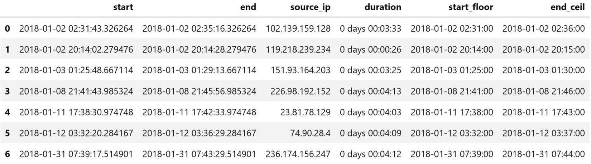

*Lab 11*: Machine Learning Anomaly Detection
=====================================================================


For our final application lab, we will be revisiting **anomaly
detection** on login attempts. Let\'s imagine we work for a company that
launched its web application at the beginning of 2018. This web
application has been collecting log events for all login attempts since
it launched. We know the IP address that the attempt was made from, the
result of the attempt, when it was made, and which username was entered.
What we don\'t know is whether the attempt was made by one of our valid
users or a nefarious party.

Our company has been expanding and, since data breaches seem to be in
the news every day, has created an information security department to
monitor the traffic. The CEO saw our rule-based approach to identifying
hackers from [*Lab
8*],
*Rule-Based Anomaly Detection*, and was intrigued by our initiative, but
wants us to move beyond using rules and thresholds for such a vital
task. We have been tasked with developing a machine learning model for
anomaly detection of the login attempts on the web application.

Since this will require a good amount of data, we have been given access
to all the logs from January 1, 2018 through December 31, 2018. In
addition, the newly formed **security operations center** (**SOC**) will
be auditing all this traffic now and will indicate which time frames
contain nefarious users based on their investigations. Since the SOC
members are subject matter experts, this data will be exceptionally
valuable to us. We will be able to use the labeled data they provide to
build a supervised learning model for future use; however, it will take
them some time to sift through all the traffic, so we should get started
with some unsupervised learning until they have that ready for us.

In this lab, we will cover the following topics:

-   Exploring the simulated login attempts data
-   Utilizing unsupervised methods of anomaly detection
-   Implementing supervised anomaly detection
-   Incorporating a feedback loop with online learning


Lab materials
=================


The materials for this lab can be found at
<https://github.com/fenago/data-analysis-pandas/tree/master/lab_11>.
In this lab, we will be revisiting attempted login data; however,
the `simulate.py` script has been updated to allow additional
command-line arguments. We won\'t be running the simulation this time,
but be sure to take a look at the script and check out the process that
was followed to generate the data files and create the database for this
lab in the `0-simulating_the_data.ipynb` notebook. The
`user_data/` directory contains the files used for this
simulation, but we won\'t be using them directly in this lab.

The simulated log data we will be using for this lab can be found in
the `logs/` directory. The `logs_2018.csv` and
`hackers_2018.csv` files are logs of login attempts and a
record of hacker activity from all 2018 simulations, respectively. Files
with the `hackers` prefix are treated as the labeled data we
will receive from the SOC, so we will pretend we don\'t have them
initially. The files with `2019` instead of `2018`
in the name are the data from simulating the first quarter of 2019,
rather than the full year. In addition, the CSV files have been written
to the `logs.db` SQLite database. The `logs` table
contains the data from `logs_2018.csv` and
`logs_2019.csv`; the `attacks` table contains the
data from `hackers_2018.csv` and `hackers_2019.csv`.

The parameters of the simulation vary per month, and in most months, the
hackers are varying their IP addresses for each username they attempt to
log in with. This will make our method from [*Lab
8*],
*Rule-Based Anomaly Detection*, useless because we were looking for IP
addresses with many attempts and high failure rates. If the hackers now
vary their IP addresses, we won\'t have many attempts associated with
them. Therefore, we won\'t be able to flag them with that strategy, so
we will have to find another way around this:


Figure 11.1 -- Simulation parameters

Important note

The `merge_logs.py` file contains the Python code to merge the
logs from each of the individual simulations, and
`run_simulations.sh` contains a Bash script for running the
entire process. These are provided for completeness, but we don\'t need
to use them (or worry about Bash).

Our workflow for this lab has been split across several notebooks,
which are all preceded by a number indicating their order. Before we
have the labeled data, we will conduct some EDA in the
`1-EDA_unlabeled_data.ipynb` notebook, and then move on to the
`2-unsupervised_anomaly_detection.ipynb` notebook to try out
some unsupervised anomaly detection methods. Once we have the labeled
data, we will perform some additional EDA in the
`3-EDA_labeled_data.ipynb` notebook, and then move on to the
`4-supervised_anomaly_detection.ipynb` notebook for supervised
methods. Finally, we will use the `5-online_learning.ipynb`
notebook for our discussion of online learning. As usual, the text will
indicate when it is time to switch between notebooks.


Exploring the simulated login attempts data
===========================================


We don\'t have labeled data yet, but we can still
examine the data to see whether there is something that stands out. This
data is different from the data in [*Lab
8*],
*Rule-Based Anomaly Detection*. The hackers are smarter in this
simulation---they don\'t always try as many users or stick with the same
IP address every time. Let\'s see whether we can come up with some
features that will help with anomaly detection by performing some EDA in
the `1-EDA_unlabeled_data.ipynb` notebook.

As usual, we begin with our imports. These will be the same for all
notebooks, so it will be reproduced in this section only:

```
>>> %matplotlib inline
>>> import matplotlib.pyplot as plt
>>> import numpy as np
>>> import pandas as pd
>>> import seaborn as sns
```

Next, we read in the 2018 logs from the
`logs` table in the SQLite database:

```
>>> import sqlite3
>>> with sqlite3.connect('logs/logs.db') as conn:
...     logs_2018 = pd.read_sql(
...         """
...         SELECT * 
...         FROM logs 
...         WHERE
...             datetime BETWEEN "2018-01-01" AND "2019-01-01";
...         """, 
...         conn, parse_dates=['datetime'],
...         index_col='datetime'
...     )
```

Tip

If the SQLAlchemy package (<https://www.sqlalchemy.org/>) is installed
in the environment we are working with (as is the
case for us), we have the option of providing the database **uniform
resource identifier** (**URI**) for the connection when calling
`pd.read_sql()`, eliminating the need for the `with`
statement. In our case, this would be
`sqlite:///logs/logs.db`, where `sqlite` is the
dialect and `logs/logs.db` is the path to the file. Note that
there are three `/` characters in a row.

Our data looks like this:


Figure 11.2 -- Login attempt logs for 2018

Our data types will be the same as in [*Lab
8*],
*Rule-Based Anomaly Detection*, with the exception of the
`success` column. SQLite doesn\'t support Boolean values, so
this column was converted to the binary
representation of its original form (stored as an integer) upon writing
the data to the database:

```
>>> logs_2018.dtypes
source_ip         object
username          object
success            int64
failure_reason    object
dtype: object
```


Using the `info()` method, we see that
`failure_reason` is the only column with nulls. It is null
when the attempt is successful. When looking to build a model, we should
also pay attention to the memory usage of our
data. Some models will require increasing the dimensionality of our
data, which can quickly get too large to hold in memory:

```
>>> logs_2018.info()
<class 'pandas.core.frame.DataFrame'>
DatetimeIndex: 38700 entries, 
2018-01-01 00:05:32.988414 to 2018-12-31 23:29:42.482166
Data columns (total 4 columns):
 #   Column          Non-Null Count  Dtype 
---  ------          --------------  ----- 
 0   source_ip       38700 non-null  object
 1   username        38700 non-null  object
 2   success         38700 non-null  int64 
 3   failure_reason  11368 non-null  object
dtypes: int64(1), object(3)
memory usage: 1.5+ MB
```

Running the `describe()` method tells us that the most common
reason for failure is providing the wrong password. We can also see that
the number of unique usernames tried (1,797) is well over the number of
users in our user base (133), indicating some suspicious activity. The
most frequent IP address made 314 attempts, but since that isn\'t even
one per day (remember we are looking at the full year of 2018), we
can\'t make any assumptions:

```
>>> logs_2018.describe(include='all')
           source_ip username      success       failure_reason
count          38700    38700 38700.000000                11368
unique          4956     1797          NaN                    3
top   168.123.156.81   wlopez          NaN error_wrong_password
freq             314      387          NaN                 6646
mean             NaN      NaN     0.706253                  NaN
std              NaN      NaN     0.455483                  NaN
min              NaN      NaN     0.000000                  NaN
25%              NaN      NaN     0.000000                  NaN
50%              NaN      NaN     1.000000                  NaN
75%              NaN      NaN     1.000000                  NaN
max              NaN      NaN     1.000000                  NaN
```

We can look at the unique usernames with
attempted logins per IP address, as in [*Lab
8*],
*Rule-Based Anomaly Detection*, which shows us that most of the IP
addresses have a few usernames, but there is at least one with many:

```
>>> logs_2018.groupby('source_ip')\
...     .agg(dict(username='nunique'))\
...     .username.describe()
count    4956.000000
mean        1.146287
std         1.916782
min         1.000000
25%         1.000000
50%         1.000000
75%         1.000000
max       129.000000
Name: username, dtype: float64
```

Let\'s calculate the metrics per IP address:

```
>>> pivot = logs_2018.pivot_table(
...     values='success', index='source_ip', 
...     columns=logs_2018.failure_reason.fillna('success'), 
...     aggfunc='count', fill_value=0
... )
>>> pivot.insert(0, 'attempts', pivot.sum(axis=1))
>>> pivot = pivot\
...     .sort_values('attempts', ascending=False)\
...     .assign(
...         success_rate=lambda x: x.success / x.attempts,
...         error_rate=lambda x: 1 - x.success_rate
...     )
>>> pivot.head()
```

The top five IP addresses with the most attempts appear to be valid
users since they have relatively high success rates:


Figure 11.3 -- Metrics per IP address

Let\'s use this dataframe to plot successes
versus attempts per IP address to see whether there is a pattern we can
exploit to separate valid activity from malicious activity:

```
>>> pivot.plot(
...     kind='scatter', x='attempts', y='success', 
...     title='successes vs. attempts by IP address',
...     alpha=0.25
... )
```

There appear to be a few points at the bottom that don\'t belong, but
notice the scales on the axes don\'t perfectly line up. The majority of
the points are along a line that is slightly less than a 1:1
relationship of attempts to successes. Recall that this lab\'s
simulation is more realistic than the one we used in [*Lab
8*],
*Rule-Based Anomaly Detection*; as such, if we compare *Figure 8.11* to
this plot, we can observe that it is much more difficult to separate
valid from malicious activity here:


Remember, this is a binary classification problem where we want to find
a way to distinguish between valid user and attacker login activity. We
want to build a model that will learn some
decision boundary that separates valid users from attackers. Since valid
users have a higher probability of entering their password correctly,
the relationship between attempts and successes will be closer to 1:1
compared to the attackers. Therefore, we may imagine the separation
boundary looking something like this:


Figure 11.5 -- A possible decision boundary

Now, the question is, which of those two groups is the attackers? Well,
if more of the IP addresses are the attackers (since they use different
IP addresses for each username they attempt), then the valid users would
be considered outliers, and the attackers would be considered
\"inliers\" with a box plot. Let\'s create one to see if that is what is
happening:

```
>>> pivot[['attempts', 'success']].plot(
...     kind='box', subplots=True, figsize=(10, 3), 
...     title='stats per IP address'
... )
```

Indeed, this appears to be what is happening. Our
valid users have more successes than the attackers because they only use
1-3 different IP addresses:


Figure 11.6 -- Looking for outliers using metrics per IP address

Clearly, looking at the data like this isn\'t helping too much, so
let\'s see whether a smaller granularity can help us. Let\'s visualize
the distributions of attempts, the number of usernames, and the number
of failures per IP address on a minute-by-minute resolution for January
2018:

```
>>> from matplotlib.ticker import MultipleLocator
>>> ax = logs_2018.loc['2018-01'].assign(
...     failures=lambda x: 1 - x.success
... ).groupby('source_ip').resample('1min').agg({
...     'username': 'nunique', 
...     'success': 'sum', 
...     'failures': 'sum'
... }).assign(
...     attempts=lambda x: x.success + x.failures
... ).dropna().query('attempts > 0').reset_index().plot(
...     y=['attempts', 'username', 'failures'], kind='hist',
...     subplots=True, layout=(1, 3), figsize=(20, 3),
...     title='January 2018 distributions of minutely stats'
...           'by IP address'
... )
>>> for axes in ax.flatten():
...     axes.xaxis.set_major_locator(MultipleLocator(1))
```

It looks like most of the IP addresses have just
a single username associated with them; however, some IP addresses also
have multiple failures for their attempts:


Figure 11.7 -- Distribution of metrics per minute per IP address

Perhaps a combination of unique usernames and failures will give us
something that doesn\'t rely on the IP address being constant. Let\'s
visualize the number of usernames with failures per minute over 2018:

```
>>> logs_2018.loc['2018'].assign(
...     failures=lambda x: 1 - x.success
... ).query('failures > 0').resample('1min').agg(
...     {'username': 'nunique', 'failures': 'sum'}
... ).dropna().rename(
...     columns={'username': 'usernames_with_failures'}
... ).usernames_with_failures.plot(
...     title='usernames with failures per minute in 2018', 
...     figsize=(15, 3)
... ).set_ylabel('usernames with failures')
```

This looks promising; we should definitely be
looking into spikes in usernames with failures. It could be an issue
with our website, or something malicious:


Figure 11.8 -- Usernames with failures over time

After a thorough exploration of the data we will be working with, we
have an idea of what features we could use when
building machine learning models. Since we don\'t yet have the labeled
data, let\'s try out some unsupervised models next.


Utilizing unsupervised methods of anomaly detection
===================================================


If the hackers are conspicuous and distinct from our valid users,
unsupervised methods may prove pretty effective.
This is a good place to start before we have labeled data, or if the
labeled data is difficult to gather or not guaranteed to be
representative of the full spectrum we are looking to flag. Note that,
in most cases, we won\'t have labeled data, so it is crucial that we are
familiar with some unsupervised methods.

In our initial EDA, we identified the number of usernames with a failed
login attempt in a given minute as a feature for anomaly detection. We
will now test out some unsupervised anomaly detection algorithms, using
this feature as the jumping-off point. Scikit-learn provides a few such
algorithms. In this section, we will look at
isolation forest and local outlier factor; a
third method, using a one-class **support vector machine** (**SVM**), is
in the *Exercises* section.

Before we can try out these methods, we need to prepare our training
data. Since the SOC will be sending over the labeled data for January
2018 first, we will use just the January 2018 minute-by-minute data for
our unsupervised models. Our features will be the day of the week
(one-hot encoded), the hour of the day (one-hot encoded), and the number
of usernames with failures. See the *Encoding data* section in *Lab
9*, *Getting Started with Machine Learning in Python*, for a refresher
on one-hot encoding, if needed.

Let\'s turn to the `2-unsupervised_anomaly_detection.ipynb`
notebook and write a utility function to grab this data easily:

```
>>> def get_X(log, day):
...     """
...     Get data we can use for the X
...
...     Parameters:
...         - log: The logs dataframe
...         - day: A day or single value we can use as a
...                datetime index slice
...
...     Returns: 
...         A `pandas.DataFrame` object
...     """
...     return pd.get_dummies(
...         log.loc[day].assign(
...             failures=lambda x: 1 - x.success
...         ).query('failures > 0').resample('1min').agg(
...             {'username': 'nunique', 'failures': 'sum'}
...         ).dropna().rename(
...             columns={'username': 'usernames_with_failures'}
...         ).assign(
...             day_of_week=lambda x: x.index.dayofweek, 
...             hour=lambda x: x.index.hour
...         ).drop(columns=['failures']),
...         columns=['day_of_week', 'hour']
...     )
```

Now, we can grab January and store it in
`X`:

```
>>> X = get_X(logs_2018, '2018-01')
>>> X.columns
Index(['usernames_with_failures', 'day_of_week_0',
       'day_of_week_1', 'day_of_week_2', 'day_of_week_3',
       'day_of_week_4', 'day_of_week_5', 'day_of_week_6',
       'hour_0', 'hour_1', ..., 'hour_22', 'hour_23'],
      dtype='object')
```


Isolation forest
----------------

The **isolation forest** algorithm uses splitting techniques to isolate
outliers from the rest of the data; therefore, it can be used for
anomaly detection. Under the hood, it is a random forest
where the splits are made on randomly chosen
features. A random value of that feature between its maximum and its
minimum is selected to split on. Note that this
range is from the range of the feature at that node in the tree, not the
starting data.

A single tree in the forest will look something like the following:


Figure 11.9 -- Example of a single tree in an isolation forest

The average length of the path that must be traveled from the top of
each tree in the forest to the leaf containing a given point is used to
score a point as an outlier or inlier. The outliers
have much shorter paths, since they will be one
of the few on a given side of a split and have
less in common with other points. Conversely, points with many
dimensions in common will take more splits to separate.

Important note

More information on this algorithm can be found
at
<https://scikit-learn.org/stable/modules/outlier_detection.html#isolation-forest>.

Let\'s implement an isolation forest with a pipeline that first
standardizes our data:

```
>>> from sklearn.ensemble import IsolationForest
>>> from sklearn.pipeline import Pipeline
>>> from sklearn.preprocessing import StandardScaler
>>> iso_forest_pipeline = Pipeline([
...     ('scale', StandardScaler()),
...     ('iforest', IsolationForest(
...         random_state=0, contamination=0.05
...     ))
... ]).fit(X)
```

We had to specify how much of the data was expected to be outliers
(`contamination`), which we estimated to be 5%; this will be
difficult to choose since we don\'t have labeled data. There is an
`auto` option that will determine a value for us but, in this
case, it gives us no outliers, so it\'s clear that that value isn\'t the
one we want. In practice, we could perform a statistical analysis on the
data to determine an initial value or consult domain experts.

The `predict()` method can be used to check whether each data
point is an outlier. Anomaly detection algorithms implemented in
`scikit-learn` typically return `1` or
`-1` if the point is an inlier or outlier, respectively:

```
>>> isolation_forest_preds = iso_forest_pipeline.predict(X)
>>> pd.Series(np.where(
...     isolation_forest_preds == -1, 'outlier', 'inlier'
... )).value_counts()
inlier     42556
outlier     2001
dtype: int64
```

Since we don\'t have the labeled
data yet, we will come back to evaluate this
later; for now, let\'s take a look at the second unsupervised algorithm
that we will discuss in this lab.


Local outlier factor
--------------------

While inliers are typically located in denser regions of the dataset
(32-dimensional here), outliers tend to be
located in sparser, more isolated regions with few neighboring points.
The **local outlier factor** (**LOF**) algorithm
looks for these sparsely populated regions to
identify outliers. It scores all points based on the ratio of the
density around each point to that of its nearest neighbors. Points that
are considered normal will have similar densities to their neighbors;
those with few others nearby will be considered abnormal.

Important note

More information on this algorithm can be found
at
<https://scikit-learn.org/stable/modules/outlier_detection.html#local-outlier-factor>.

Let\'s build another pipeline, but swap out the isolation forest for
LOF. Note that we have to guess the best value for the
`n_neighbors` parameter, because `GridSearchCV` has
nothing to score models on if we don\'t have labeled data. We are using
the default value for this parameter, which is `20`:

```
>>> from sklearn.neighbors import LocalOutlierFactor
>>> from sklearn.pipeline import Pipeline
>>> from sklearn.preprocessing import StandardScaler
>>> lof_pipeline = Pipeline([
...     ('scale', StandardScaler()),
...     ('lof', LocalOutlierFactor())
... ]).fit(X)
```

Now, let\'s see how many outliers we have
this time. LOF doesn\'t have a
`predict()` method, so we have to check the
`negative_outlier_factor_` attribute of the LOF object to see
the scores of each of the data points we fit it with:

```
>>> lof_preds = lof_pipeline.named_steps['lof']\
...     .negative_outlier_factor_ 
>>> lof_preds
array([-1.33898756e+10, -1.00000000e+00, -1.00000000e+00, ...,
       -1.00000000e+00, -1.00000000e+00, -1.11582297e+10])
```

There is another difference between LOF and isolation forests: the
values for the `negative_outlier_factor_` attribute aren\'t
strictly `-1` or `1`. In fact, they can be any
number---take a look at the first and last values in the previous
result, and you\'ll see that they are way less than `-1`. This
means we can\'t use the method we used with the isolation forest to
count the inliers and outliers. Instead, we need to compare the
`negative_outlier_factor_` attribute to the
`offset_` attribute of the LOF model, which
tells us the cutoff value as determined by the
LOF model during training (using the `contamination`
parameter):

```
>>> pd.Series(np.where(
...     lof_preds < lof_pipeline.named_steps['lof'].offset_, 
...     'outlier', 'inlier'
... )).value_counts()
inlier     44248
outlier      309
dtype: int64
```

Now that we have two unsupervised models, we need
to compare them to see which one would be more beneficial to our
stakeholders.


Comparing models
----------------

LOF indicates fewer outliers than the isolation
forest, but perhaps they don\'t even agree with each other. As we
learned in [*Lab
10*],
*Making Better Predictions -- Optimizing Models*, we can use the
`cohen_kappa_score()` function from
`sklearn.metrics` to check their level of agreement:

```
>>> from sklearn.metrics import cohen_kappa_score
>>> is_lof_outlier = np.where(
...     lof_preds < lof_pipeline.named_steps['lof'].offset_, 
...     'outlier', 'inlier'
... )
>>> is_iso_outlier = np.where(
...     isolation_forest_preds == -1, 'outlier', 'inlier'
... )
>>> cohen_kappa_score(is_lof_outlier, is_iso_outlier)
0.25862517997335677
```

They have a low level of agreement, indicating that it\'s not so obvious
which data points are anomalies. Without labeled data, however, it
really is impossible for us to tell which one is better. We would have
to work with the consumers of the results to determine which
model gives them the most useful data.
Thankfully, the SOC has just sent over the January 2018 labeled data, so
we can determine which of our models is better and let them start using
it until we get a supervised model ready.

First, we will read in the labeled data they wrote to the database in
the `attacks` table and add some columns indicating the minute
the attack started, the duration, and when it ended:

```
>>> with sqlite3.connect('logs/logs.db') as conn:
...     hackers_jan_2018 = pd.read_sql(
...         """
...         SELECT * 
...         FROM attacks 
...         WHERE start BETWEEN "2018-01-01" AND "2018-02-01";
...         """, conn, parse_dates=['start', 'end']
...     ).assign(
...         duration=lambda x: x.end - x.start,
...         start_floor=lambda x: x.start.dt.floor('min'),
...         end_ceil=lambda x: x.end.dt.ceil('min')
...     )
>>> hackers_jan_2018.shape
(7, 6)
```

Note that the SOC only has a single IP address for the ones involved in
each attack, so it\'s a good thing we aren\'t relying on that anymore.
Instead, the SOC wants us to tell them at which
minute there was suspicious activity so that they can investigate
further. Also note that while the attacks are quick in duration, our
minute-by-minute data means we will trigger many alerts per attack:





Figure 11.10 -- Labeled data for evaluating our models

Using the `start_floor` and `end_ceil` columns, we
can create a range of datetimes and can check whether the data we marked
as outliers falls within that range. For this, we will use the following
function:

```
>>> def get_y(datetimes, hackers, resolution='1min'):
...     """
...     Get data we can use for the y (whether or not a
...     hacker attempted a log in during that time).
...
...     Parameters:
...         - datetimes: The datetimes to check for hackers
...         - hackers: The dataframe indicating when the 
...                    attacks started and stopped
...         - resolution: The granularity of the datetime. 
...                       Default is 1 minute.
...
...     Returns: `pandas.Series` of Booleans.
...     """
...     date_ranges = hackers.apply(
...         lambda x: pd.date_range(
...             x.start_floor, x.end_ceil, freq=resolution
...         ), 
...         axis=1
...     )
...     dates = pd.Series(dtype='object')
...     for date_range in date_ranges:
...         dates = pd.concat([dates, date_range.to_series()])
...     return datetimes.isin(dates)
```

Now, let\'s find the datetimes in our
`X` data that had hacker activity:

```
>>> is_hacker = \
...     get_y(X.reset_index().datetime, hackers_jan_2018)
```

We now have everything we need to make a classification report and a
confusion matrix. Since we will be passing in the `is_hacker`
series a lot, we will make some partials to reduce our typing a bit:

```
>>> from functools import partial
>>> from sklearn.metrics import classification_report
>>> from ml_utils.classification import confusion_matrix_visual
>>> report = partial(classification_report, is_hacker)
>>> conf_matrix = partial(
...     confusion_matrix_visual, is_hacker, 
...     class_labels=[False, True]
... )
```

Let\'s start with the classification reports,
which indicate that the isolation forest is much better in terms of
recall:

```
>>> iso_forest_predicts_hacker = isolation_forest_preds == - 1
>>> print(report(iso_forest_predicts_hacker)) # iso. forest
              precision    recall  f1-score   support
       False       1.00      0.96      0.98     44519
        True       0.02      0.82      0.03        38
    accuracy                           0.96     44557
   macro avg       0.51      0.89      0.50     44557
weighted avg       1.00      0.96      0.98     44557
>>> lof_predicts_hacker = \
...     lof_preds < lof_pipeline.named_steps['lof'].offset_ 
>>> print(report(lof_predicts_hacker)) # LOF
              precision    recall  f1-score   support
       False       1.00      0.99      1.00     44519
        True       0.03      0.26      0.06        38
    accuracy                           0.99     44557
   macro avg       0.52      0.63      0.53     44557
weighted avg       1.00      0.99      1.00     44557
```

To better understand the results in the
classification report, let\'s create confusion matrices for our
unsupervised methods and place them side-by-side for comparison:

```
>>> fig, axes = plt.subplots(1, 2, figsize=(15, 5))
>>> conf_matrix(
...     iso_forest_predicts_hacker, 
...     ax=axes[0], title='Isolation Forest'
... )
>>> conf_matrix(
...     lof_predicts_hacker, 
...     ax=axes[1], title='Local Outlier Factor'
... )
```

The isolation forest has more true positives and a greater number of
false positives compared to LOF, but it has fewer false negatives:


Figure 11.11 -- Confusion matrices for our unsupervised models

The SOC has informed us that false negatives are much more costly than
false positives. However, they would like us to keep false positives in
check to avoid bogging down the team with an
excessive number of false alarms. This tells us
that recall (the **true positive rate** (**TPR**)) is more valuable than
precision as a performance metric. The SOC wants us to target a *recall
of at least 70%*.

Since we have a very large class imbalance, the
**false positive rate** (**FPR**) won\'t be too informative for us.
Remember, the FPR is the ratio of false positives to the sum of false
positives and true negatives (everything belonging to the negative
class). Due to the nature of the attacks being rare, we will have a very
large number of true negatives and, therefore, our FPR will remain very
low. Consequently, the secondary metric determined by the SOC is to
attain a *precision of 85% or greater*.

The isolation forest model exceeds our target recall, but the precision
is too low. Since we were able to obtain some labeled data, we can now
use supervised learning to find the minutes with suspicious activity
(note that this won\'t always be the case). Let\'s see whether we can
use this extra information to find the minutes of interest more
precisely.


Implementing supervised anomaly detection
=========================================


The SOC has finished up labeling the 2018 data, so we should revisit our
EDA to make sure our plan of looking at the
number of usernames with failures on a minute resolution does separate
the data. This EDA is in the `3-EDA_labeled_data.ipynb`
notebook. After some data wrangling, we are able to create the following
scatter plot, which shows that this strategy does indeed appear to
separate the suspicious activity:


In the `4-supervised_anomaly_detection.ipynb` notebook, we
will create some supervised models. This time we need to read in all the
labeled data for 2018. Note that the code for reading in the logs is
omitted since it is the same as in the previous section:

```
>>> with sqlite3.connect('logs/logs.db') as conn:
...     hackers_2018 = pd.read_sql(
...         """
...         SELECT * 
...         FROM attacks 
...         WHERE start BETWEEN "2018-01-01" AND "2019-01-01";
...         """, conn, parse_dates=['start', 'end']
...     ).assign(
...         duration=lambda x: x.end - x.start,
...         start_floor=lambda x: x.start.dt.floor('min'),
...         end_ceil=lambda x: x.end.dt.ceil('min')
...     )
```

Before we build our models, however, let\'s create a new function that
will create both `X` and `y` at
 function
will use the `get_X()` and `get_y()` functions we
made earlier, returning both `X` and `y`:

```
>>> def get_X_y(log, day, hackers):
...     """
...     Get the X, y data to build a model with.
...
...     Parameters:
...         - log: The logs dataframe
...         - day: A day or single value we can use as a 
...                datetime index slice
...         - hackers: The dataframe indicating when the 
...                    attacks started and stopped
...
...     Returns:
...         X, y tuple where X is a `pandas.DataFrame` object
...         and y is a `pandas.Series` object
...     """
...     X = get_X(log, day)
...     y = get_y(X.reset_index().datetime, hackers)
...     return X, y
```

Now, let\'s make a training set with January 2018
data and a testing set with February 2018 data, using our new function:

```
>>> X_train, y_train = \
...     get_X_y(logs_2018, '2018-01', hackers_2018)
>>> X_test, y_test = \
...     get_X_y(logs_2018, '2018-02', hackers_2018)
```

Important note

While we have a very large class imbalance, we don\'t jump right to
balancing the training sets. It\'s crucial to try out the model without
premature optimization. If we build our model and see that it is being
affected by the class imbalance, then we can try those techniques.
Remember to be very cautious with over-/under-sampling techniques, as
some make assumptions of the data that aren\'t always applicable or
realistic. Think about SMOTE---would we really expect all future
attackers to be similar to the ones we have in the data?

Let\'s use this data to build some supervised anomaly detection models.
Remember that the SOC has given us the performance requirements in terms
of recall (at least 70%) and precision (85% or greater), so we will use
those metrics to evaluate our models.


Baselining
----------

Our first step will be to build
some baseline models, so we know that our machine
learning algorithms are performing better than some simpler models and
have predictive value. We will build two such models:

-   A dummy classifier that will predict labels based on the
    stratification in the data.
-   A Naive Bayes model that will predict the labels leveraging Bayes\'
    theorem.

### Dummy classifier

A dummy classifier will give us a model that is
equivalent to the baseline we have been drawing on our ROC curves. The
results will be poor on purpose. We will never use this classifier to
actually make predictions; rather, we can use it
to see whether the models we are building are better than random
guessing strategies. In the `dummy` module,
`scikit-learn` provides the `DummyClassifier` class
precisely for this purpose.

Using the `strategy` parameter, we can specify how the dummy
classifier will make its predictions. Some
interesting options are as follows:

-   `uniform`: The classifier will guess each time whether or
    not the observation belongs to a hacking attempt.
-   `most_frequent`: The classifier will always predict the
    most frequent label, which, in our case, will result in never
    marking anything as nefarious. This will achieve high accuracy, but
    be useless since the minority class is the class of interest.
-   `stratified`: The classifier will use the class
    distribution from the training data and maintain that ratio with its
    guesses.

Let\'s build a dummy classifier with the `stratified`
strategy:

```
>>> from sklearn.dummy import DummyClassifier
>>> dummy_model = DummyClassifier(
...     strategy='stratified', random_state=0
... ).fit(X_train, y_train)
>>> dummy_preds = dummy_model.predict(X_test)
```

Now that we have our first baseline model, let\'s measure its
performance for comparisons. We will be using both the ROC curve and the
precision-recall curve to show how the class imbalance can make the ROC
curve optimistic of performance. To reduce typing, we will once again
make some partials:

```
>>> from functools import partial
>>> from sklearn.metrics import classification_report
>>> from ml_utils.classification import (
...     confusion_matrix_visual, plot_pr_curve, plot_roc
... )
>>> report = partial(classification_report, y_test)
>>> roc = partial(plot_roc, y_test)
>>> pr_curve = partial(plot_pr_curve, y_test)
>>> conf_matrix = partial(
...     confusion_matrix_visual, y_test, 
...     class_labels=[False, True]
... )
```

Recall from our initial discussion of ROC curves
in *Lab 9*, *Getting Started with Machine Learning in Python*, that
the diagonal line was random guessing of a dummy model. If our
performance isn\'t better than this line, our model has no predictive
value. The dummy model we just created is equivalent to this line.
Let\'s visualize the baseline ROC curve, precision-recall curve, and
confusion matrix using subplots:

```
>>> fig, axes = plt.subplots(1, 3, figsize=(20, 5))
>>> roc(dummy_model.predict_proba(X_test)[:,1], ax=axes[0])
>>> conf_matrix(dummy_preds, ax=axes[1])
>>> pr_curve(
...     dummy_model.predict_proba(X_test)[:,1], ax=axes[2]
... )
>>> plt.suptitle('Dummy Classifier with Stratified Strategy')
```

The dummy classifier wasn\'t able to flag any of the attackers. The ROC
curve (TPR versus FPR) indicates that the dummy
model has no predictive value, with an **area under the curve**
(**AUC**) of 0.5. Note that the area under the precision-recall curve is
nearly zero:


Figure 11.13 -- Baselining with a dummy classifier

Since we have a very large class imbalance, the
stratified random guessing strategy should perform horrendously on the
minority class and very well on the majority class. We can observe this
by examining the classification report:

```
>>> print(report(dummy_preds))
              precision    recall  f1-score   support
       False       1.00      1.00      1.00     39958
        True       0.00      0.00      0.00         5
    accuracy                           1.00     39963
   macro avg       0.50      0.50      0.50     39963
weighted avg       1.00      1.00      1.00     39963
```

### Naive Bayes

Our last baseline model will be a Naive Bayes
classifier. Before we discuss this model, we need to
review a few concepts of probability. The first
is conditional probability. When dealing with two events, *A* and *B*,
the probability of event *A* happening *given* that event *B* happened
is the **conditional probability** and is written
as *P(A\|B)*. When events *A* and *B* are independent, meaning *B*
happening doesn\'t tell us anything about *A* happening and vice versa,
*P(A\|B)* is *P(A)*.

The conditional probability is defined as the
**joint probability** of both *A* and *B* occurring (which is the
intersection of these events), written as *P(A* *∩* *B)*, divided by the
probability of *B* occurring (provided this is not zero):


This equation can be rearranged as follows:


The joint probability of *A* *∩* *B* is equivalent to *B* *∩* *A*;
therefore, we get the following equation:


It then follows that we can change the first equation to use conditional
probabilities instead of the joint probability. This gives us **Bayes\'
theorem**:


When working with the previous equation, *P(A)*
is referred to as the **prior probability**, or initial degree of belief
that event *A* will happen. After accounting for event *B* occurring,
this initial belief gets updated; this is represented as *P(A\|B)* and
is called the **posterior probability**. The
**likelihood** of event *B* given event *A* is *P(B\|A)*. The support
that event *B* occurring gives to our belief of observing event *A* is
the following:


Let\'s take a look at an example---say we are building a spam filter,
and we find that 10% of emails are spam. This 10% is our prior, or
*P(spam)*. We want to know the probability an email we
just received is spam given that it contains the
word *free*---we want to find *P(spam\|free)*. In order to find this, we
need the probability that the word *free* is in
an email given that it is spam, or
*P(free\|spam)*, and the probability of the word *free* being in an
email, or *P(free)*.

Suppose we learned that 12% of emails contained the word *free* and 20%
of the emails that were determined to be spam contained the word *free*.
Plugging all this into the equation from before, we see that once we
know an email contains the word *free*, our belief that it is spam
increases from 10% to 16.7%, which is our posterior probability:


Bayes\' theorem can be leveraged in a type of classifier called **Naive
Bayes**. Depending on the assumptions we make of the data, we get a
different member of the Naive Bayes family of classifiers. These models
are very fast to train because they make a simplifying assumption of
conditional independence of each pair of the `X` features,
given the `y` variable (meaning
*P(x*[i]{.subscript}*\|y,x*[1]{.subscript}*\...x*[n]{.subscript}*)* is
equivalent to *P(x*[i]{.subscript}*\|y)*). They are called *naive*
because this assumption is often incorrect; however, these classifiers
have traditionally worked well in building spam filters.

Let\'s say we also find multiple dollar signs in the email and the word
*prescription*, and we want to know the probability of it being spam.
While some of these features may depend on each other, the Naive Bayes
model will treat them as conditionally independent. This means our
equation for the posterior probability is now the following:


Suppose we find out that 5% of spam emails
contain multiple dollar signs, 55% of spam emails contain the word
*prescription*, 25% of emails contain multiple
dollar signs, and the word *prescription* is
found in 2% of emails overall. This means that our belief of the email
being spam, given that it has the words *free* and *prescription* and
multiple dollar signs, increases from 10% to 91.7%:


Now that we understand the basics of the algorithm, let\'s build a Naive
Bayes classifier. Note that `scikit-learn` provides various
Naive Bayes classifiers that differ by the assumed distributions of the
likelihoods of the features, which we defined as
*P(x*[i]{.subscript}*\|y,x*[1]{.subscript}*\...x*[n]{.subscript}*)*. We
will use the version that assumes they are normally distributed,
`GaussianNB`:

```
>>> from sklearn.naive_bayes import GaussianNB
>>> from sklearn.pipeline import Pipeline
>>> from sklearn.preprocessing import StandardScaler
>>> nb_pipeline = Pipeline([
...     ('scale', StandardScaler()),
...     ('nb', GaussianNB())
... ]).fit(X_train, y_train)
>>> nb_preds = nb_pipeline.predict(X_test)
```

We can retrieve the class priors from the model, which, in this case,
tells us that the prior for a minute containing normal activity is
99.91% versus 0.09% for abnormal activity:

```
>>> nb_pipeline.named_steps['nb'].class_prior_
array([9.99147160e-01, 8.52840182e-04])
```

Naive Bayes makes a nice baseline model because
we don\'t have to tune any hyperparameters, and
it is quick to train. Let\'s see how it performs on the test data
(February 2018):

```
>>> fig, axes = plt.subplots(1, 3, figsize=(20, 5))
>>> roc(nb_pipeline.predict_proba(X_test)[:,1], ax=axes[0])
>>> conf_matrix(nb_preds, ax=axes[1])
>>> pr_curve(
...     nb_pipeline.predict_proba(X_test)[:,1], ax=axes[2]
... )
>>> plt.suptitle('Naive Bayes Classifier')
```

The Naive Bayes classifier finds all five attackers and is above the
baseline (the dashed line) in both the ROC curve and precision-recall
curve, meaning this model has some predictive value:


Figure 11.14 -- Performance of the Naive Bayes classifier

Unfortunately, we are triggering an enormous quantity of false positives
(8,218). For the month of February, roughly 1 out of every 1,644 attack
classifications was indeed an attack. This has the effect of
desensitizing the users of these classifications. They may choose to
always ignore our classifications because they are too noisy and,
consequently, miss a real issue. This trade-off can be captured in the
metrics of the classification report:

```
>>> print(report(nb_preds))
              precision    recall  f1-score   support
       False       1.00      0.79      0.89     39958
        True       0.00      1.00      0.00         5
    accuracy                           0.79     39963
   macro avg       0.50      0.90      0.44     39963
weighted avg       1.00      0.79      0.89     39963
```

While the Naive Bayes classifier outperforms the
dummy classifier, it does not meet the requirements of our stakeholders.
Precision rounds to zero for the target class
because we have lots of false positives. Recall is higher than precision
because the model is better with false negatives than false positives
(since it isn\'t very discerning). This leaves the F[1]{.subscript}
score at zero. Now, let\'s try to beat these baseline models.


Logistic regression
-------------------

Since logistic regression is another
simple model, let\'s try it out next. We used
logistic regression in *Lab 9*, *Getting Started with Machine
Learning in Python*, for classification problems, so we already know how
it works. As we learned in [*Lab
10*],
*Making Better Predictions -- Optimizing Models*, we will use a grid
search to find a good value for the regularization hyperparameter in our
desired search space, using `recall_macro` for scoring.
Remember there is a large cost associated with false negatives, so we
are focusing on recall. The `_macro` suffix indicates that we
want to average the recall between the positive and negative classes,
instead of looking at it overall (due to the class imbalance).

Tip

If we know exactly how much more valuable recall is to us over
precision, we can replace this with a custom scorer made using the
`make_scorer()` function in `sklearn.metrics`. The
notebook we are working in has an example.

When using grid search, warnings from
`scikit-learn` may be printed at each iteration. Therefore, to
avoid having to scroll through all that, we will
use the `%%capture` magic command to capture everything that
would have been printed, keeping our notebook clean:

```
>>> %%capture
>>> from sklearn.linear_model import LogisticRegression
>>> from sklearn.model_selection import GridSearchCV
>>> from sklearn.pipeline import Pipeline
>>> from sklearn.preprocessing import StandardScaler
>>> lr_pipeline = Pipeline([
...     ('scale', StandardScaler()),
...     ('lr', LogisticRegression(random_state=0))
... ])
>>> search_space = {'lr__C': [0.1, 0.5, 1, 2]}
>>> lr_grid = GridSearchCV(
...     lr_pipeline, search_space, scoring='recall_macro', cv=5
... ).fit(X_train, y_train)
>>> lr_preds = lr_grid.predict(X_test) 
```

Tip

With `%%capture`, all errors and output will be captured by
default. We have the option of writing `--no-stderr` to hide
errors only and `--no-stdout` to hide output only. These go
after `%%capture`; for example,
`%%capture --no-stderr`.

If we want to hide specific errors, we can use the `warnings`
module, instead. For example, after importing `filterwarnings`
from the `warnings` module, we can run the following to ignore
warnings of future deprecations:
`filterwarnings('ignore',               category=DeprecationWarning)`

Now that we have our logistic regression
model trained, let\'s check on the performance:

```
>>> fig, axes = plt.subplots(1, 3, figsize=(20, 5))
>>> roc(lr_grid.predict_proba(X_test)[:,1], ax=axes[0])
>>> conf_matrix(lr_preds, ax=axes[1])
>>> pr_curve(lr_grid.predict_proba(X_test)[:,1], ax=axes[2])
>>> plt.suptitle('Logistic Regression Classifier')
```

This model has no false positives and is much better than the baselines.
The ROC curve is significantly closer to the top-left corner, as is the
precision-recall curve to the top-right corner. Notice that the ROC
curve is a bit more optimistic about the performance:


Figure 11.15 -- Performance using logistic regression

This model meets the requirements
of the SOC. Our recall is at least 70% and our
precision is at least 85%:

```
>>> print(report(lr_preds))
              precision    recall  f1-score   support
       False       1.00      1.00      1.00     39958
        True       1.00      0.80      0.89         5
    accuracy                           1.00     39963
   macro avg       1.00      0.90      0.94     39963
weighted avg       1.00      1.00      1.00     39963
```

The SOC has given us data for January and February 2019, and they want
us to update our model. Unfortunately, our model has already been
trained, so we have the choice of rebuilding from scratch or ignoring
this new data. Ideally, we would build a model with a feedback loop to
incorporate this (and future) new data. In the next section, we will
discuss how to do this.


Incorporating a feedback loop with online learning
==================================================


There are some big issues with the models we have built so far. Unlike
the data we worked with in *Lab 9*, *Getting Started with Machine
Learning in Python*, and [*Lab
10*],
*Making Better Predictions -- Optimizing Models*, we wouldn\'t expect
the attacker behavior to be static over time. There is also a limit to
how much data we can hold in memory, which limits
how much data we can train our model on.
Therefore, we will now build an online learning model to flag anomalies
in usernames with failures per minute. An
**online learning** model is constantly getting updated (in near real
time via streaming, or in batches). This allows us to learn from new
data as it comes and then get rid of it (to keep space in memory).

In addition, the model can evolve over time and adapt to changes in the
underlying distribution of the data. We will also be providing our model
with feedback as it learns so that we are able to
make sure it stays robust to changes in the hacker behavior over time.
This is called **active learning**. Not all models in
`scikit-learn` support this kind of behavior; so, we are
limited to the models that offer a `partial_fit()` method
(models without this need to be trained from scratch with new data).

Tip

Scikit-learn refers to models implementing the
`partial_fit()` method as **incremental learners**. More
information, including which models support this, can be found at
<https://scikit-learn.org/stable/computing/scaling_strategies.html#incremental-learning>.

Our data is currently being rolled up to the minute and then passed to
the model, so this will be batch learning, not streaming; however, note
that if we were to put this into production, we could update our model
each minute, if desired.


Creating the PartialFitPipeline subclass
----------------------------------------

We saw in *Lab 9*, *Getting Started with Machine Learning in
Python*, that the `Pipeline` class made
streamlining our machine learning processes a cinch, but unfortunately,
we can\'t use it with the `partial_fit()` method. To get
around this, we can create our own `PartialFitPipeline` class,
which is a subclass of the `Pipeline` class but supports
calling `partial_fit()`. The `PartialFitPipeline`
class is located in the `ml_utils.partial_fit_pipeline`
module.

We simply inherit from
`sklearn.pipeline.Pipeline` and define a single new
method---`partial_fit()`---which will call
`fit_transform()` on all the steps except the last one, and
`partial_fit()` on the last step:

```
from sklearn.pipeline import Pipeline
class PartialFitPipeline(Pipeline):
    """
    Subclass of sklearn.pipeline.Pipeline that supports the 
    `partial_fit()` method.
    """
    def partial_fit(self, X, y):
        """
        Run `partial_fit()` for online learning estimators 
        when used in a pipeline.
        """
        # for all but last step
        for _, step in self.steps[:-1]: # (name, object) tuples
            X = step.fit_transform(X)
        # grab object from tuple position 1 for partial_fit()
        self.steps[-1][1].partial_fit(X, y)
        return self
```

Now that we have the
`PartialFitPipeline` class, the last piece that remains is to
select a model capable of online learning.


Stochastic gradient descent classifier
--------------------------------------

Our logistic regression model performed well---it met the requirements
for recall and precision. However, the `LogisticRegression`
class does not support online learning because
the method it uses to calculate the coefficients is a closed-form
solution. We have the option of using an optimization algorithm, such as
gradient descent, to determine the coefficients instead; this will be
capable of online learning.

Rather than use a different incremental learner, we can train a new
logistic regression model with the `SGDClassifier` class. It
uses **stochastic gradient descent** (**SGD**) to optimize the loss
function of our choice. For this example, we will be using log loss,
which gives us a logistic regression where the coefficients are found
using SGD.

Whereas standard gradient descent optimization looks at all the samples
or batches to estimate the gradient, SGD reduces the computational cost
by selecting samples at random (stochastically). How much the model
learns from each sample is determined by the **learning rate**, with
earlier updates having more of an effect than later ones. A single
iteration of SGD is carried out as follows:

1.  Shuffle the training data.
2.  For each sample in the training data, estimate the gradient and
    update the model with decreasing strength as determined by the
    learning rate.
3.  Repeat *step 2* until all samples have been used.

In machine learning, we use **epochs** to refer to the number of times
the full training set is used. The process of SGD
we just outlined is for a single epoch. When we train for multiple
epochs, we repeat the preceding steps for the desired number of epochs,
continuing each time from where we left off.

Now that we understand how SGD works, we are
ready to build our model. Here\'s an overview of the process we will
follow before presenting it to the SOC:


Figure 11.16 -- Process for preparing our online learning model

Let\'s now turn to the `5-online_learning.ipynb` notebook to
build our online learning model.

### Building our initial model

First, we will use the `get_X_y()` function to get our
`X` and `y` training data using the full year of
2018:

```
>>> X_2018, y_2018 = get_X_y(logs_2018, '2018', hackers_2018)
```

Since we will be updating this model in batches,
our test set will always be the data we are using for our current
predictions. After we do so, it will become the training set and be used
to update the model. Let\'s build our initial model trained on the 2018
labeled data. Note that the `PartialFitPipeline` object is
created in the same way we create a `Pipeline` object:

```
>>> from sklearn.linear_model import SGDClassifier
>>> from sklearn.preprocessing import StandardScaler
>>> from ml_utils.partial_fit_pipeline import \
...     PartialFitPipeline
>>> model = PartialFitPipeline([
...     ('scale', StandardScaler()), 
...     ('sgd', SGDClassifier(
...         random_state=10, max_iter=1000, 
...         tol=1e-3, loss='log', average=1000,
...         learning_rate='adaptive', eta0=0.01
...     ))
... ]).fit(X_2018, y_2018)
```

Our pipeline will first standardize the data, and then pass it to the
model. We start building our model using the `fit()` method so
that we have a good starting point for our updates with
`partial_fit()` later. The `max_iter` parameter
defines the number of epochs for the training.
The `tol` parameter (tolerance) specifies when to stop
iterating, which occurs when the loss from the current iteration is
greater than the previous loss minus the tolerance (or we have reached
`max_iter` iterations). We specified `loss='log'` to
use logistic regression; however, there are many other options for the
loss functions, including the default value of `'hinge'` for a
linear SVM.

Here, we also passed in a value for the `average` parameter,
telling the `SGDClassifier` object to store the coefficients
as averages of the results once 1,000 samples have been seen; note that
this parameter is optional and, by default, this won\'t be calculated.
Examining these coefficients can be achieved as follows:

```
>>> [(col, coef) for col, coef in 
...  zip(X_2018.columns, model.named_steps['sgd'].coef_[0])]
[('usernames_with_failures', 0.9415581997027198),
 ('day_of_week_0', 0.05040751530926895),
 ...,
 ('hour_23', -0.02176726532333003)]
```

Lastly, we passed in `eta0=0.01` for our starting learning
rate and specified to only adjust the learning rate when we have failed
to improve our loss by the tolerance defined for
a given number of consecutive epochs
(`learning_rate='adaptive'`). This number of epochs is defined
by the `n_iter_no_change` parameter, which will be
`5` (the default), since we aren\'t setting it explicitly.

### Evaluating the model

Since we now have labeled data for January and February 2019, we can
evaluate how the model performs each month. First, we read in the 2019
data from the database:

```
>>> with sqlite3.connect('logs/logs.db') as conn:
...     logs_2019 = pd.read_sql(
...         """
...         SELECT * 
...         FROM logs 
...         WHERE
...             datetime BETWEEN "2019-01-01" AND "2020-01-01";
...         """, 
...         conn, parse_dates=['datetime'],
...         index_col='datetime'
...     )
...     hackers_2019 = pd.read_sql(
...         """
...         SELECT * 
...         FROM attacks 
...         WHERE start BETWEEN "2019-01-01" AND "2020-01-01";
...         """, 
...         conn, parse_dates=['start', 'end']
...     ).assign(
...         start_floor=lambda x: x.start.dt.floor('min'),
...         end_ceil=lambda x: x.end.dt.ceil('min')
...     )
```

Next, we isolate the January 2019 data:

```
>>> X_jan, y_jan = get_X_y(logs_2019, '2019-01', hackers_2019)
```

The classification report indicates that this
model performs pretty well, but our recall for the positive class is
lower than our target:

```
>>> from sklearn.metrics import classification_report
>>> print(classification_report(y_jan, model.predict(X_jan)))
              precision    recall  f1-score   support
       False       1.00      1.00      1.00     44559
        True       1.00      0.64      0.78        44
    accuracy                           1.00     44603
   macro avg       1.00      0.82      0.89     44603
weighted avg       1.00      1.00      1.00     44603
```

Remember, our stakeholders have specified we must achieve a recall (TPR)
of at least 70% and a precision of at least 85%. Let\'s write a function
that will show us the ROC curve, confusion matrix, and precision-recall
curve and indicate the region we need to be in as well as where we
currently are:

```
>>> from ml_utils.classification import (
...     confusion_matrix_visual, plot_pr_curve, plot_roc
... )
>>> def plot_performance(model, X, y, threshold=None, 
...                      title=None, show_target=True):
...     """
...     Plot ROC, confusion matrix, and precision-recall curve.
...     
...     Parameters:
...         - model: The model object to use for prediction.
...         - X: The features to pass in for prediction.
...         - y: The actuals to evaluate the prediction.
...         - threshold: Value to use as when predicting 
...                      probabilities.
...         - title: A title for the subplots.
...         - show_target: Whether to show the target regions.
...         
...     Returns: 
...         Matplotlib `Axes` object.
...     """
...     fig, axes = plt.subplots(1, 3, figsize=(20, 5))
...     # plot each visualization
...     plot_roc(y, model.predict_proba(X)[:,1], ax=axes[0])
...     confusion_matrix_visual(
...         y, 
...         model.predict_proba(X)[:,1] >= (threshold or 0.5), 
...         class_labels=[False, True], ax=axes[1]
...     )
...     plot_pr_curve(
...         y, model.predict_proba(X)[:,1], ax=axes[2]
...     )
...
...     # show the target regions if desired
...     if show_target:
...         axes[0]\
...             .axvspan(0, 0.1, color='lightgreen', alpha=0.5)
...         axes[0]\
...             .axhspan(0.7, 1, color='lightgreen', alpha=0.5)
...         axes[0].annotate(
...             'region with acceptable\nFPR and TPR', 
...             xy=(0.1, 0.7), xytext=(0.17, 0.65), 
...             arrowprops=dict(arrowstyle='->')
...         )
...
...         axes[2]\
...             .axvspan(0.7, 1, color='lightgreen', alpha=0.5)
...         axes[2].axhspan(
...             0.85, 1, color='lightgreen', alpha=0.5
...         )
...         axes[2].annotate(
...             'region with acceptable\nprecision and recall', 
...             xy=(0.7, 0.85), xytext=(0.3, 0.6), 
...             arrowprops=dict(arrowstyle='->')
...         )
...
...         # mark the current performance
...         tn, fn, fp, tp = \
...             [int(x.get_text()) for x in axes[1].texts]
...         precision, recall = tp / (tp + fp), tp / (tp + fn)
...         fpr = fp / (fp + tn)
...
...         prefix = 'current performance' if not threshold \
...                  else f'chosen threshold: {threshold:.2%}'
...         axes[0].annotate(
...             f'{prefix}\n- FPR={fpr:.2%}'
...             f'\n- TPR={recall:.2%}',
...             xy=(fpr, recall), xytext=(0.05, 0.45), 
...             arrowprops=dict(arrowstyle='->')
...         )
...         axes[2].annotate(
...             f'{prefix}\n- precision={precision:.2%}'
...             f'\n- recall={recall:.2%}', 
...             xy=(recall, precision), xytext=(0.2, 0.85), 
...             arrowprops=dict(arrowstyle='->')
...         )
...
...     if title: # show the title if specified
...         plt.suptitle(title)
... 
...     return axes
```

Now, let\'s call the function to see how we are
doing:

```
>>> axes = plot_performance(
...     model, X_jan, y_jan, 
...     title='Stochastic Gradient Descent Classifier '
...           '(Tested on January 2019 Data)'
... )
```

Notice we are not currently meeting the specifications of our
stakeholders; our performance is not in the target region:


Figure 11.17 -- Model performance with a default threshold

Our resulting recall (TPR) is 63.64%, which doesn\'t meet the goal of
70% or better. By default, when we use the `predict()` method,
our probability threshold is 50%. If we are targeting a specific
precision/recall or TPR/FPR region, we may have to change the threshold
and use `predict_proba()` to get the desired performance.

The `ml_utils.classification` module contains the
`find_threshold_roc()` and `find_threshold_pr()`
functions, which will help us pick a threshold along the ROC curve or
precision-recall curve, respectively. Since we are targeting a specific
precision/recall region, we will use the latter. This function uses the
`precision_recall_curve()` function from
`scikit-learn` also, but instead of
plotting the resulting precision and recall data,
we use it to select the thresholds that meet our criteria:

```
from sklearn.metrics import precision_recall_curve
def find_threshold_pr(y_test, y_preds, *, min_precision,  
                      min_recall):
    """
    Find the threshold to use with `predict_proba()` for 
    classification based on the minimum acceptable precision 
    and the minimum acceptable recall.
    Parameters:
        - y_test: The actual labels.
        - y_preds: The predicted labels.
        - min_precision: The minimum acceptable precision.
        - min_recall: The minimum acceptable recall.
    Returns: The thresholds that meet the criteria.
    """
    precision, recall, thresholds = \
        precision_recall_curve(y_test, y_preds)
    # precision and recall have one extra value at the end 
    # for plotting -- needs to be removed to make a mask 
    return thresholds[
        (precision[:-1] >= min_precision) & 
        (recall[:-1] >= min_recall)
    ]
```

Important note

The notebook also shows an example of finding a threshold for a TPR/FPR
goal. Our current target precision/recall happens to give the same
threshold as targeting a TPR (recall) of at least 70% and an FPR of at
most 10%.

Let\'s use this function to find a threshold that
meets our stakeholders\' specifications. We take the max of the
probabilities that fall in the desired region to pick the least
sensitive of the candidate thresholds:

```
>>> from ml_utils.classification import find_threshold_pr
>>> threshold = find_threshold_pr(
...     y_jan, model.predict_proba(X_jan)[:,1], 
...     min_precision=0.85, min_recall=0.7
... ).max()
>>> threshold
0.0051533333839830974
```

This result tells us that we can reach the desired precision and recall
if we flag results that have a 0.52% chance of being in the positive
class. No doubt this seems like a very low probability, or that the
model isn\'t sure of itself, but we can think about it this way: if the
model thinks there is even a slight chance that the login activity is
suspicious, we want to know. Let\'s see how our
performance looks using this threshold:

```
>>> axes = plot_performance(
...     model, X_jan, y_jan, threshold=threshold, 
...     title='Stochastic Gradient Descent Classifier '
...           '(Tested on January 2019 Data)'
... )
```

This threshold gives us a recall of 70.45%, satisfying our stakeholders.
Our precision is in the acceptable range as well:


Figure 11.18 -- Model performance using a custom threshold

Using the custom threshold, we have correctly identified another three
cases, reducing our false negatives, which are very costly for the SOC.
Here, this improvement didn\'t come at the cost of additional false
positives, but remember, there is often a trade-off between
reducing false negatives (**type II error**) and
reducing false positives (**type I error**). In some cases, we have a
very low tolerance for type I errors (the FPR must be very small),
whereas in others, we are more concerned with finding all the positive
cases (the TPR must be high). In information security, we have a low
tolerance for false negatives because they are very costly; therefore,
we will move forward with the custom threshold.

Important note

Sometimes, the requirements of a model\'s performance aren\'t feasible.
It\'s important to maintain an open line of communication with
stakeholders to explain the issues and discuss relaxing criteria when
necessary.

### Updating the model

Continuous updating will help the model adapt to changes in hacker
behavior over time. Now that we have evaluated
our January predictions, we can use them to update the model. To do so,
we use the `partial_fit()` method and the labeled data for
January, which will run a single epoch on the January data:

```
>>> model.partial_fit(X_jan, y_jan)
```

Our model has now been updated, so we can test its performance on the
February data now. Let\'s grab the February data first:

```
>>> X_feb, y_feb = get_X_y(logs_2019, '2019-02', hackers_2019)
```

February had fewer attacks, but we caught a higher percentage of them
(80%):

```
>>> print(classification_report(
...     y_feb, model.predict_proba(X_feb)[:,1] >= threshold
... ))
              precision    recall  f1-score   support
       False       1.00      1.00      1.00     40248
        True       1.00      0.80      0.89        10
    accuracy                           1.00     40258
   macro avg       1.00      0.90      0.94     40258
weighted avg       1.00      1.00      1.00     40258
```

Let\'s look at the performance plots for February
to see how they changed:

```
>>> axes = plot_performance(
...     model, X_feb, y_feb, threshold=threshold,
...     title='Stochastic Gradient Descent Classifier '
...           '(Tested on February 2019 Data)'
... )
```

Notice the area under the precision-recall curve has increased and more
of the curve is in the target region:


Figure 11.19 -- Model performance after one update

### Presenting our results

The SOC has finished up the March data. They want us to implement into
our model the feedback they gave on our February
predictions, and then make predictions for the March data for them to
review. They will be evaluating our performance on each minute in March,
using the classification report, ROC curve, confusion matrix, and
precision-recall curve. It\'s time to put our model to the test.

First, we need to update our model for the February data:

```
>>> model.partial_fit(X_feb, y_feb)
```

Next, we grab the March data and make our predictions, using a threshold
of 0.52%:

```
>>> X_march, y_march = \
...     get_X_y(logs_2019, '2019-03', hackers_2019)
>>> march_2019_preds = \
...     model.predict_proba(X_march)[:,1] >= threshold
```

Our classification report looks good. We have a recall of 76%, a
precision of 88%, and a solid F[1]{.subscript} score:

```
>>> from sklearn.metrics import classification_report
>>> print(classification_report(y_march, march_2019_preds))
              precision    recall  f1-score   support
       False       1.00      1.00      1.00     44154
        True       0.88      0.76      0.81        29
    accuracy                           1.00     44183
   macro avg       0.94      0.88      0.91     44183
weighted avg       1.00      1.00      1.00     44183
```

Now, let\'s see how the plots look:

```
>>> axes = plot_performance(
...     model, X_march, y_march, threshold=threshold,
...     title='Stochastic Gradient Descent Classifier '
...           '(Tested on March 2019 Data)'
... )
```

Our AUC for the ROC curve is slightly higher now,
while it dropped for the precision-recall curve:


Figure 11.20 -- Model performance after two updates

### Further improvements

The SOC is pleased with our results and now wants us to provide
predictions each minute. They have also promised
to provide feedback within an hour. We won\'t implement this request
here, but we will briefly discuss how we could go about this.

We have been using batch processing to update the model each month;
however, in order to provide our stakeholders with what they want, we
will need to shorten our feedback loop by performing the following
actions:

-   Running `predict_proba()` on our model every single minute
    and having the predictions sent to our stakeholders. This will
    require setting up a process to pass the logs one minute at a time
    to a preprocessing function, and then to the model itself.
-   Delivering the results to our stakeholders via an agreed-upon
    medium. 
-   Updating the model with `partial_fit()` every hour using
    the feedback we receive from the stakeholders (once we have
    determined how to have them share this information with us).

After the aforementioned actions are implemented,
all that remains is for us to put the model into production and
determine the update and prediction frequencies everyone will be
accountable for meeting.


Summary
=======


In practice, detecting attackers isn\'t easy. Real-life hackers are much
savvier than the ones in this simulation. Attacks are also much less
frequent, creating a huge class imbalance. Building machine learning
models that will catch everything just isn\'t possible. That is why it
is so vital that we work with those who have domain knowledge; they can
help us squeeze some extra performance out of our models by really
understanding the data and its peculiarities. No matter how experienced
we become with machine learning, we should never turn down help from
someone who often works with the data in question.

Our initial attempts at anomaly detection were unsupervised while we
waited for the labeled data from our subject matter experts. We tried
LOF and isolation forest using `scikit-learn`. Once we
received the labeled data and performance requirements from our
stakeholders, we determined that the isolation forest model was better
for our data.

However, we didn\'t stop there. Since we had just been given the labeled
data, we tried our hand at supervised methods. We learned how to build
baseline models using dummy classifiers and Naive Bayes. Then, we
revisited logistic regression to see whether it could help us. Our
logistic regression model performed well; however, since it used a
closed-form solution to find the coefficients, we were unable to
incorporate a feedback loop without retraining the model from scratch.

This limitation led us to build an online learning model, which is
constantly updated. First, we had to make a subclass to allow pipelines
to use the `partial_fit()` method. Then, we tried SGD
classification with log loss. We were able to train on an entire year of
data at once, and then update our model when we received new labeled
data. This allows the model to adjust to changes in the distributions of
the features over time.

In the next lab, we will recap what we have learned throughout the
course and introduce additional resources for finding data, as well as
working with it in Python.


Exercises
=========


Complete the following exercises for some practice with the machine
learning workflow and exposure to some additional anomaly detection
strategies:

1.  A one-class SVM is another model that can be used for unsupervised
    outlier detection. Build a one-class SVM with the default
    parameters, using a pipeline with a `StandardScaler`
    object followed by a `OneClassSVM` object. Train the model
    on the January 2018 data, just as we did for the isolation forest.
    Make predictions on that same data. Count the number of inliers and
    outliers this model identifies.

2.  Using the 2018 minutely data, build a k-means model with two
    clusters after standardizing the data with a
    `StandardScaler` object. With the labeled data in the
    `attacks` table in the SQLite database
    (`logs/logs.db`), see whether this model gets a good
    Fowlkes-Mallows score (use the `fowlkes_mallows_score()`
    function in `sklearn.metrics`).

3.  Evaluate the performance of a random forest classifier for
    supervised anomaly detection. Set `n_estimators` to
    `100` and use the remaining defaults, including the
    prediction threshold. Train on January 2018 and test on
    February 2018.

4.  The `partial_fit()` method isn\'t available with the
    `GridSearchCV` class. Instead, we can use its
    `fit()` method with a model that has a
    `partial_fit()` method (or a
    `PartialFitPipeline` object) to find the best
    hyperparameters in our search space. Then, we can grab the best
    model from the grid search (`best_estimator_`) and use
    `partial_fit()` on it. Try this with the
    `PassiveAggressiveClassifier` class from the
    `sklearn.linear_model` module and a
    `PartialFitPipeline` object. This online learning
    classifier is passive when it makes a correct prediction, but
    aggressive in correcting itself when it makes an incorrect
    prediction. Don\'t worry about selecting a custom threshold. Be sure
    to follow these steps:

    a\) Run a grid search using the January 2018 data for the initial
    training.

    b\) Grab the tuned model with the `best_estimator_`
    attribute.

    c\) Evaluate the best estimator with the February 2018 data.

    d\) Make updates with the February 2018 data.

    e\) Evaluate the final model on March through June 2018 data.
