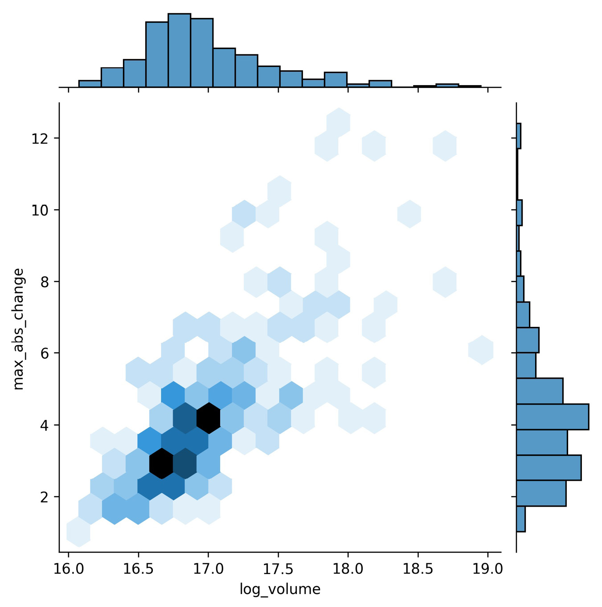
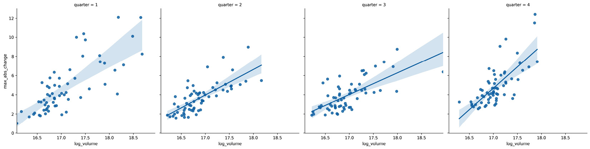
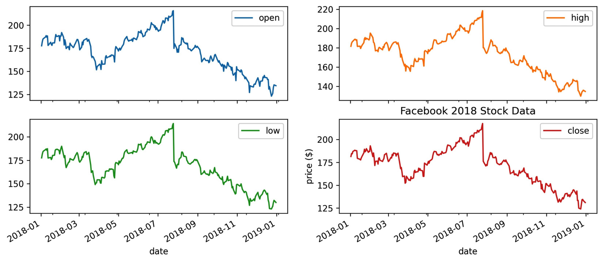
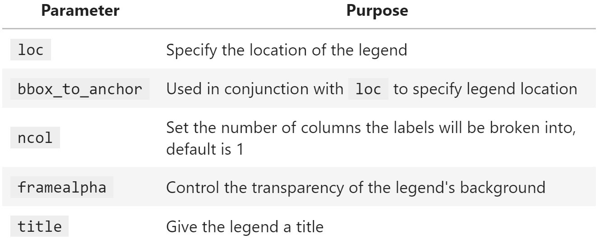

Lab 11: Plotting with Seaborn and Customization Techniques
================================================================


In this lab, we will cover the following topics:

-   Utilizing seaborn for more advanced plot types
-   Formatting plots with matplotlib
-   Customizing visualizations


#### Pre-reqs:
- Google Chrome (Recommended)

#### Lab Environment
Notebooks are ready to run. All packages have been installed. There is no requirement for any setup.

All examples are present in `~/work/machine-learning-essentials-module1/lab_11` folder. 


Lab materials
=================

We will be working with three datasets once again, all of which can be
found in the `data/` directory. In the
`fb_stock_prices_2018.csv` file, we have Facebook\'s stock
price for all trading days in 2018. This data is the OHLC data (opening,
high, low, and closing price), along with the volume traded. It was
gathered using the `stock_analysis` package, which we will
build in *Lab 12*. The stock market
is closed on the weekends, so we only have data for the trading days.

The `earthquakes.csv` file contains earthquake data pulled
from the **United States Geological Survey** (**USGS**) API
(<https://earthquake.usgs.gov/fdsnws/event/1/>) for September 18, 2018,
through October 13, 2018. For each earthquake, we have the magnitude
(the `mag` column), the scale it was measured on (the
`magType` column), when (the `time` column), and
where (the `place` column) it occurred; we also have the
`parsed_place` column, which indicates the state or country in
which the earthquake occurred. Other unnecessary columns have been
removed.

In the `covid19_cases.csv` file, we have an export from the
*daily number of new reported cases of COVID-19 by country worldwide*
dataset provided by the **European Centre for Disease Prevention and
Control** (**ECDC**), which can be found at
<https://www.ecdc.europa.eu/en/publications-data/download-todays-data-geographic-distribution-covid-19-cases-worldwide>.
For scripted or automated collection of this data, the ECDC makes the
current day\'s CSV file available via this link:
<https://opendata.ecdc.europa.eu/covid19/casedistribution/csv>. The
snapshot we will be using was collected on September 19, 2020 and
contains the number of new COVID-19 cases per country from December 31,
2019 through September 18, 2020 with partial data for September 19,
2020. For this lab, we will look at the 8-month span from January
18, 2020 through September 18, 2020.

Throughout this lab, we will be working through three Jupyter
Notebooks. These are all numbered according to their order of use. We
will begin exploring the capabilities of `seaborn` in the
`1-introduction_to_seaborn.ipynb` notebook. Next, we will move
on to the `2-formatting_plots.ipynb` notebook as we discuss
formatting and labeling our plots. Finally, in the
`3-customizing_visualizations.ipynb` notebook, we will learn
how to add reference lines, shade regions, include annotations, and
customize our visualizations. The text will prompt us when to switch
notebooks.


In addition, we have two Python (`.py`) files that contain
functions we will use throughout the lab:
`viz.py` and `color_utils.py`. Let\'s
get started by exploring `seaborn`.

Utilizing seaborn for advanced plotting
=======================================


As we saw in the previous lab,
`pandas` provides implementations for most visualizations we
would want to create; however, there is another library,
`seaborn`, that provides additional
functionality for more involved visualizations and makes creating
visualizations with long-format data much easier than
`pandas`. These also tend to look much nicer than standard
visualizations generated by `matplotlib`.

For this section, we will be working with the
`1-introduction_to_seaborn.ipynb` notebook. First, we must
import `seaborn`, which is traditionally aliased as
`sns`:

```
>>> import seaborn as sns
```


Let\'s also import `numpy`, `matplotlib.pyplot`, and
`pandas`, and then read in the CSV files for the Facebook
stock prices and earthquake data:

```
>>> %matplotlib inline
>>> import matplotlib.pyplot as plt
>>> import numpy as np
>>> import pandas as pd 
>>> fb = pd.read_csv(
...     'data/fb_stock_prices_2018.csv',
...     index_col='date', 
...     parse_dates=True
... )
>>> quakes = pd.read_csv('data/earthquakes.csv')
```


While `seaborn` offers alternatives to
many of the plot types we covered in the previous lab, for the most
part, we will only cover new types that `seaborn` makes
possible and leave learning about the rest as an
exercise. Additional available functions using the `seaborn`
API can be found at <https://seaborn.pydata.org/api.html>.


Categorical data
----------------

There was a devastating tsunami in Indonesia on
September 28, 2018; it came after a 7.5 magnitude earthquake occurred
near Palu, Indonesia
(<https://www.livescience.com/63721-tsunami-earthquake-indonesia.html>).
Let\'s create a visualization to understand which magnitude types are
used in Indonesia, the range of magnitudes recorded, and how many of the
earthquakes were accompanied by a tsunami. To do this, we need a way to
plot relationships in which one of the variables is categorical
(`magType`) and the other is numeric (`mag`).

**Important note:**

Information on the different magnitude types can be found at
<https://www.usgs.gov/natural-hazards/earthquake-hazards/science/magnitude-types>.


Let\'s create this visualization with
`stripplot()`. We pass the subset of earthquakes occurring in
Indonesia to the `data` parameter, and specify that we want to
put `magType` on the *x*-axis (`x`), magnitudes on
the *y*-axis (`y`), and color the points by whether the
earthquake was accompanied by a tsunami (`hue`):

```
>>> sns.stripplot(
...     x='magType', 
...     y='mag', 
...     hue='tsunami',
...     data=quakes.query('parsed_place == "Indonesia"')
... )
```


Using the resulting plot, we can see that the earthquake in question is
the highest orange point in the `mww` column (don\'t forget to
call `plt.show()` if not using the Jupyter Notebook provided):


For the most part, the tsunamis occurred with higher magnitude
earthquakes, as we would expect; however, due to the high concentration
of points at lower magnitudes, we can\'t really see all the points. We
could try to adjust the `jitter` argument, which controls how
much random noise to add to the point in an attempt to reduce overlaps,
or the `alpha` argument for
transparency, as we did in the previous lab; fortunately, there is
another function, `swarmplot()`, that will reduce the overlap
as much as possible, so we will use that instead:

```
>>> sns.swarmplot(
...     x='magType', 
...     y='mag', 
...     hue='tsunami',
...     data=quakes.query('parsed_place == "Indonesia"'),
...     size=3.5 # point size
... )
```


The **swarm plot** (or bee swarm plot) also has
the bonus of giving us a glimpse of what the distribution might be. We
can now see many more earthquakes in the lower section of the
`mb` column:


In the *Plotting with pandas* section in the previous lab, when we
discussed how to visualize distributions, we discussed the box plot.
Seaborn provides an enhanced box plot for large datasets,
which shows additional quantiles for more
information on the shape of the distribution, particularly in the tails.
Let\'s use the enhanced box plot to compare earthquake magnitudes across
different magnitude types:

```
>>> sns.boxenplot(
...     x='magType', y='mag', data=quakes[['magType', 'mag']]
... )
>>> plt.title('Comparing earthquake magnitude by magType')
```


This results in the following plot:


**Tip:** 

The enhanced box plot was introduced in the paper *Letter-value plots:
Boxplots for large data,* by Heike Hofmann, Karen Kafadar, and Hadley
Wickham, which can be found at
<https://vita.had.co.nz/papers/letter-value-plot.html>.

Box plots are great for visualizing the quantiles of our data, but we
lose information about the distribution. As we saw, an enhanced box plot
is one way to address this---another strategy is to use a
violin plot, which combines a kernel density
estimate (estimation of the underlying distribution) and a box plot:

```
>>> fig, axes = plt.subplots(figsize=(10, 5))
>>> sns.violinplot(
...     x='magType', y='mag', data=quakes[['magType', 'mag']], 
...     ax=axes, scale='width' # all violins have same width
... )
>>> plt.title('Comparing earthquake magnitude by magType')
```


The box plot portion runs through the center of
each violin plot; the **kernel density estimate** (**KDE**) is then
drawn on both sides using the box plot as its *x*-axis. We can read the
KDE from either side of the box plot since it is symmetrical:


The `seaborn` documentation also lists out the plotting
functions by the type of data being plotted; the full offering of
categorical plots is available at
<https://seaborn.pydata.org/api.html#categorical-plots>. Be sure to
check out the `countplot()` and `barplot()`
functions for variations on the bar plots we
created with `pandas` in the previous lab.


Correlations and heatmaps
-------------------------

We will make a heatmap of the correlations between the OHLC stock prices, the log of
volume traded, and the daily difference between
the highest and lowest prices (`max_abs_change`); however,
this time, we will use `seaborn`, which gives us the
`heatmap()` function for an easier way to produce this
visualization:

```
>>> sns.heatmap(
...     fb.sort_index().assign(
...         log_volume=np.log(fb.volume), 
...         max_abs_change=fb.high - fb.low
...     ).corr(), 
...     annot=True, 
...     center=0, 
...     vmin=-1, 
...     vmax=1
... )
```


**Tip:** 

When using `seaborn`, we can still use functions from
`matplotlib`, such as `plt.savefig()` and
`plt.tight_layout()`. Note that if there are issues with
`plt.tight_layout()`, pass `bbox_inches='tight'` to
`plt.savefig()` instead.

We pass in `center=0` so that `seaborn` puts values
of `0` (no correlation) at the center of the colormap it uses.
In order to set the bounds of the color scale to that of the correlation
coefficient, we need to provide `vmin=-1` and
`vmax=1` as well. Notice that we also passed in
`annot=True` to write the correlation coefficients in each
box---we get the benefit of the numerical data and the visual data all
in one plot with a single function call:


Seaborn also provides us with an alternative to
the `scatter_matrix()` function provided in the
`pandas.plotting` module, called `pairplot()`. We
can use this to see the correlations between the
columns in the Facebook data as scatter plots
instead of the heatmap:

```
>>> sns.pairplot(fb)
```


This result makes it easy to understand the near-perfect positive
correlation between the OHLC columns shown in the heatmap, while also
showing us histograms for each column along the diagonal:


Facebook\'s performance in the latter half of 2018
was markedly worse than in the first half, so we
may be interested to see how the distribution of the data changed each
quarter of the year. As with the
`pandas.plotting.scatter_matrix()` function, we can specify
what to do along the diagonal with the `diag_kind` argument;
however, unlike `pandas`, we can easily color everything based
on other data with the `hue` argument. To do so, we just add
the `quarter` column and then provide it to the
`hue` argument:

```
>>> sns.pairplot(
...     fb.assign(quarter=lambda x: x.index.quarter), 
...     diag_kind='kde', hue='quarter'
... )
```


We can now see how the distributions of the OHLC
columns had lower standard deviations (and,
subsequently, lower variances) in the first quarter and how the stock
price lost a lot of ground in the fourth quarter (the distribution
shifts to the left):


**Tip:** 

We can also pass `kind='reg'` to
`pairplot()` to show regression lines.

If we only want to compare two variables, we can use
`jointplot()`, which will give us a scatter plot along with
the distribution of each variable along the side. Let\'s look once again
at how the log of volume traded correlates with the difference between
the daily high and low prices in Facebook stock:

```
>>> sns.jointplot(
...     x='log_volume', 
...     y='max_abs_change', 
...     data=fb.assign(
...         log_volume=np.log(fb.volume), 
...         max_abs_change=fb.high - fb.low
...     )
... )
```


Using the default value for the `kind` argument, we get
histograms for the distributions and a plain scatter plot in the center:


Seaborn gives us plenty of alternatives for the
`kind` argument. For example, we can use hexbins because there
is a significant overlap when we use the scatter
plot:

```
>>> sns.jointplot(
...     x='log_volume', 
...     y='max_abs_change', 
...     kind='hex',
...     data=fb.assign(
...         log_volume=np.log(fb.volume), 
...         max_abs_change=fb.high - fb.low
...     )
... )
```


We can now see the large concentration of points in the lower-left
corner:





Another way of viewing the concentration
of values is to use `kind='kde'`, which
gives us a **contour plot** to represent the joint
density estimate along with KDEs for each of the variables:

```
>>> sns.jointplot(
...     x='log_volume', 
...     y='max_abs_change', 
...     kind='kde',
...     data=fb.assign(
...         log_volume=np.log(fb.volume), 
...         max_abs_change=fb.high - fb.low
...     )
... )
```


Each curve in the contour plot contains points of
a given density:


Furthermore, we can plot a regression in the
center and get KDEs in addition to histograms along the sides:

```
>>> sns.jointplot(
...     x='log_volume', 
...     y='max_abs_change', 
...     kind='reg',
...     data=fb.assign(
...         log_volume=np.log(fb.volume), 
...         max_abs_change=fb.high - fb.low
...     )
... )
```


This results in a linear regression line being
drawn through the scatter plot, along with a
confidence band surrounding the line in a lighter color:


The relationship appears to be linear, but we
should look at the **residuals** to check. Residuals are the observed
values minus the values predicted using the regression line. We can look
directly at the residuals that would result from the previous regression
with `kind='resid'`:

```
>>> sns.jointplot(
...     x='log_volume', 
...     y='max_abs_change', 
...     kind='resid',
...     data=fb.assign(
...         log_volume=np.log(fb.volume), 
...         max_abs_change=fb.high - fb.low
...     )
... )
# update y-axis label (discussed next section)
>>> plt.ylabel('residuals')
```


Notice that the residuals appear to be getting
further away from zero at higher quantities of volume traded, which
could mean this isn\'t the right way to model this
relationship:


We just saw that we can use `jointplot()` to get a regression
plot or a residuals plot; naturally, `seaborn` exposes
functions to make these directly without the overhead of creating the
entire joint plot. Let\'s discuss those next.


Regression plots
----------------

The `regplot()` function will calculate a regression line and
plot it, while the `residplot()` function will calculate the
regression and plot only the residuals. We can write a function to
combine these for us, but first, some setup.

Our function will plot all permutations of any two columns (as opposed
to combinations; order matters with permutations, for example,
`(open, close)` is not equivalent to
`(close, open)`). This allows us to see each column as the
regressor and as the dependent variable; since we don\'t know the
direction of the relationship, we let the viewer decide after calling
the function. This generates many subplots, so we will create a new
dataframe with just a few columns from our Facebook data.

We\'ll be looking at the logarithm of the volume traded
(`log_volume`) and the daily difference between the highest
and lowest price of Facebook stock (`max_abs_change`). Let\'s
use `assign()` to create these new columns and save them in a
new dataframe called `fb_reg_data`:

```
>>> fb_reg_data = fb.assign(
...     log_volume=np.log(fb.volume), 
...     max_abs_change=fb.high - fb.low
... ).iloc[:,-2:]
```


Next, we need to import `itertools`, which is part of the
Python standard library
(<https://docs.python.org/3/library/itertools.html>). When writing
plotting functions, `itertools` can be extremely helpful; it
makes it very easy to create efficient iterators for things such as
permutations, combinations, and infinite cycles or repeats:

```
>>> import itertools
```


**Iterables** are objects that can be iterated
over. When we start a loop, an **iterator** is created from the
iterable. At each iteration, the iterator provides
its next value, until it is exhausted; this means that once we complete
a single iteration through all its items, there is nothing left, and it
can\'t be reused. Iterators are iterables, but not all iterables are
iterators. Iterables that aren\'t iterators can be used repeatedly.

The iterators we get back when using `itertools` can only be
used once through:

```
>>> iterator = itertools.repeat("I'm an iterator", 1)
>>> for i in iterator:
...     print(f'-->{i}')
-->I'm an iterator
>>> print(
...     'This printed once because the iterator '
...     'has been exhausted'
... )
This printed once because the iterator has been exhausted
>>> for i in iterator:
...     print(f'-->{i}')
```


A list, on the other hand, is an iterable; we can
write something that loops over all the elements in the list, and we
will still have a list for later reuse:

```
>>> iterable = list(itertools.repeat("I'm an iterable", 1))
>>> for i in iterable:
...     print(f'-->{i}')
-->I'm an iterable
>>> print('This prints again because it\'s an iterable:')
This prints again because it's an iterable:
>>> for i in iterable:
...     print(f'-->{i}')
-->I'm an iterable
```


Now that we have some background on `itertools` and iterators,
let\'s write the function for our regression and
residuals permutation plots:

```
def reg_resid_plots(data):
    """
    Using `seaborn`, plot the regression and residuals plots 
    side-by-side for every permutation of 2 columns in data.
    Parameters:
        - data: A `pandas.DataFrame` object
    Returns:
        A matplotlib `Axes` object.
    """
    num_cols = data.shape[1]
    permutation_count = num_cols * (num_cols - 1)
    fig, ax = \
        plt.subplots(permutation_count, 2, figsize=(15, 8))
    for (x, y), axes, color in zip(
        itertools.permutations(data.columns, 2), 
        ax,
        itertools.cycle(['royalblue', 'darkorange'])
    ):
        for subplot, func in zip(
            axes, (sns.regplot, sns.residplot)
        ):
            func(x=x, y=y, data=data, ax=subplot, color=color)
            if func == sns.residplot:
                subplot.set_ylabel('residuals')
    return fig.axes
```


In this function, we can see that all the material
covered so far in this lab and from the previous lab is coming
together; we calculate how many subplots we need, and since we will have
two plots for each permutation, we just need the number of permutations
to determine the row count. We take advantage of the `zip()`
function, which gives us values from multiple iterables at once in
tuples, and tuple unpacking to easily iterate over the permutation
tuples and the 2D NumPy array of `Axes` objects. Take some
time to make sure you understand what is going on here; there are also
resources on `zip()` and tuple unpacking in the *Further
reading* section at the end of this lab.

**Important note:**

If we provide different length iterables to `zip()`, we will
only get a number of tuples equal to the shortest length. For this
reason, we can use infinite iterators, such as those we get when using
`itertools.repeat()`, which repeats the same value infinitely
(when we don\'t specify the number of times to repeat the value), and
`itertools.cycle()`, which cycles between all the values
provided infinitely.

Calling our function is effortless, with only a single parameter:

```
>>> from viz import reg_resid_plots
>>> reg_resid_plots(fb_reg_data)
```


The first row of subsets is what we saw earlier with the joint plots,
and the second row is the regression when flipping the `x` and
`y` variables:


**Tip:** 

The `regplot()` function supports polynomial and logistic
regression through the `order` and `logistic`
parameters, respectively.

Seaborn also makes it easy to plot regressions
across different subsets of our data with `lmplot()`. We can
split our regression plots with `hue`, `col`, and
`row`, which will color by values in a given column, make a
new column for each value, and make a new row for each value,
respectively.

We saw that Facebook\'s performance was different across each quarter of
the year, so let\'s calculate a regression per quarter with the Facebook
stock data, using the volume traded and the daily difference between the
highest and lowest price, to see whether this relationship also changes:

```
>>> sns.lmplot(
...     x='log_volume', 
...     y='max_abs_change', 
...     col='quarter',
...     data=fb.assign(
...         log_volume=np.log(fb.volume), 
...         max_abs_change=fb.high - fb.low,
...         quarter=lambda x: x.index.quarter
...     )
... )
```


Notice that the regression line in the fourth
quarter has a much steeper slope than previous quarters:





Note that the result of running `lmplot()` is a
`FacetGrid` object, which is a powerful feature of
`seaborn`. Let\'s now discuss how we can make these directly
with any plot inside.


Faceting
--------

Faceting allows us to plot subsets (facets) of our
data across subplots. We already saw a few as a
result of some `seaborn` functions; however, we can easily
make them for ourselves for use with any plotting function. Let\'s
create a visualization that will allow us to compare the distributions
of earthquake magnitudes in Indonesia and Papua New Guinea depending on
whether there was a tsunami.

First, we create a `FacetGrid` object with the data we will be
using and define how it will be subset with the `row` and
`col` arguments:

```
>>> g = sns.FacetGrid(
...     quakes.query(
...         'parsed_place.isin('
...         '["Indonesia", "Papua New Guinea"]) '
...         'and magType == "mb"'
...     ),   
...     row='tsunami',
...     col='parsed_place',
...     height=4
... )
```


Then, we use the `FacetGrid.map()` method to run a plotting
function on each of the subsets, passing along any necessary arguments.
We will make histograms with KDEs for the location and tsunami data
subsets using the `sns.histplot()` function:

```
>>> g = g.map(sns.histplot, 'mag', kde=True)
```


For both locations, we can see that tsunamis occurred when the
earthquake magnitude was 5.0 or greater:


This concludes our discussion of the plotting
capabilities of `seaborn`; however, I encourage you to check
out the API (<https://seaborn.pydata.org/api.html>) to see additional
functionality. Also, be sure to consult the *Choosing the appropriate
visualization* section in the *Appendix* as a reference when looking to
plot some data.


Formatting plots with matplotlib
================================


A big part of making our visualizations
presentable is choosing the right plot type and having them well labeled
so they are easy to interpret. By carefully tuning
the final appearance of our visualizations, we make them easier to read
and understand.

Let\'s now move to the `2-formatting_plots.ipynb` notebook,
run the setup code to import the packages we need,
and read in the Facebook stock data and COVID-19 daily new cases data:

```
>>> %matplotlib inline
>>> import matplotlib.pyplot as plt
>>> import numpy as np
>>> import pandas as pd 
>>> fb = pd.read_csv(
...     'data/fb_stock_prices_2018.csv', 
...     index_col='date', 
...     parse_dates=True
... ) 
>>> covid = pd.read_csv('data/covid19_cases.csv').assign(
...     date=lambda x: \
...         pd.to_datetime(x.dateRep, format='%d/%m/%Y')
... ).set_index('date').replace(
...     'United_States_of_America', 'USA'
... ).sort_index()['2020-01-18':'2020-09-18']
```


In the next few sections, we will discuss how to add titles, axis
labels, and legends to our plots, as well as how to customize the axes.
Note that everything in this section needs to be called before running
`plt.show()` or within the same Jupyter Notebook cell if using
the `%matplotlib inline` magic command.


Titles and labels
-----------------

Some of the visualizations we have created thus
far didn\'t have titles or axis labels. We know what is going on in the
figure, but if we were to present them to others,
there could be some confusion. It\'s good practice to be explicit with
our labels and titles.

We saw that, when plotting with `pandas`, we could add a title
by passing the `title` argument to the `plot()`
method, but we can also do this with `matplotlib` using
`plt.title()`. Note that we can pass
`x`/`y` values to `plt.title()` to control
the placement of our text. We can also change the font and its size.
Labeling our axes is just as easy; we can use `plt.xlabel()`
and `plt.ylabel()`. Let\'s plot the Facebook closing price and
label everything using `matplotlib`:

```
>>> fb.close.plot()
>>> plt.title('FB Closing Price')
>>> plt.xlabel('date')
>>> plt.ylabel('price ($)')
```


This results in the following plot:


When working with subplots, we have to take a different approach. To see
this firsthand, let\'s make subplots of Facebook
stock\'s OHLC data and use `plt.title()` to give the entire
plot a title, along with `plt.ylabel()`
to give each subplot\'s *y*-axis a label:

```
>>> fb.iloc[:,:4]\
...     .plot(subplots=True, layout=(2, 2), figsize=(12, 5))
>>> plt.title('Facebook 2018 Stock Data')
>>> plt.ylabel('price ($)')
```


Using `plt.title()` puts the title on the last subplot,
instead of being the title for the plots as a whole, as we intended. The
same thing happens to the *y*-axis label:





In the case of subplots, we want to give the entire figure a title;
therefore, we use `plt.suptitle()` instead. Conversely, we
want to give each subplot a *y*-axis label, so we use the
`set_ylabel()` method on each of the `Axes` objects
returned by the call to `plot()`. Note that the
`Axes` objects are returned in a NumPy array of the same
dimensions as the subplot layout, so for easier iteration, we call
`flatten()`:

```
>>> axes = fb.iloc[:,:4]\
...     .plot(subplots=True, layout=(2, 2), figsize=(12, 5))
>>> plt.suptitle('Facebook 2018 Stock Data')
>>> for ax in axes.flatten():
...     ax.set_ylabel('price ($)')
```


This results in a title for the plot as a whole
and *y*-axis labels for each of the subplots:


Note that the `Figure` class also has a `suptitle()`
method and that the `Axes` class\'s `set()` method
lets us label the axes, title the plot, and much more in a single call,
for example, `set(xlabel='…', ylabel='…', title='…', …)`.
Depending on what we are trying to do, we may need to call methods on
`Figure` or `Axes` objects directly, so it\'s
important to be aware of them.


Legends
-------

Matplotlib makes it possible to control many
aspects of the legend through the `plt.legend()` function and
the `Axes.legend()` method. For example, we can specify the
legend\'s location and format how the legend looks, including
customizing the fonts, colors, and much more. Both the
`plt.legend()` function and the `Axes.legend()`
method can also be used to show a legend when the plot doesn\'t have one
initially. Here is a sampling of some commonly
used parameters:





The legend will use the label of each object that was plotted. If we
don\'t want something to show up, we can make its label an empty string.
However, if we simply want to alter how something shows up, we can pass
its display name through the `label` argument. Let\'s plot
Facebook stock\'s closing price and the 20-day moving average, using the
`label` argument to provide a descriptive name for the legend:

```
>>> fb.assign(
...     ma=lambda x: x.close.rolling(20).mean()
... ).plot(
...     y=['close', 'ma'], 
...     title='FB closing price in 2018',
...     label=['closing price', '20D moving average'],
...     style=['-', '--']
... )
>>> plt.legend(loc='lower left')
>>> plt.ylabel('price ($)')
```


By default, `matplotlib` tries to find the best location for
the plot, but sometimes it covers up parts of the plot as in this case.
Therefore, we chose to place the legend in the lower-left corner of
the plot. Note that the text in the legend is what
we provided in the `label` argument to `plot()`:


Notice that we passed a string to the `loc` argument to
specify the legend location; we also have the option of passing the code
as an integer or a tuple for the `(x, y)` coordinates to draw
the lower-left corner of the legend box. The following table contains
the possible location strings:


Let\'s now take a look at styling the legend with
the `framealpha`, `ncol`, and `title`
arguments. We will plot the percentage of the world\'s daily new
COVID-19 cases that occurred in Brazil, China, Italy, Spain, and the USA
over the 8-month period from January 18, 2020 through September 18,
2020. In addition, we will remove the top and right spines of the plot
to make it look cleaner:

```
>>> new_cases = covid.reset_index().pivot(
...     index='date',
...     columns='countriesAndTerritories',
...     values='cases'
... ).fillna(0)
>>> pct_new_cases = new_cases.apply(
...     lambda x: x / new_cases.apply('sum', axis=1), axis=0
... )[
...     ['Italy', 'China', 'Spain', 'USA', 'India', 'Brazil']
... ].sort_index(axis=1).fillna(0)
>>> ax = pct_new_cases.plot(
...     figsize=(12, 7),
...     style=['-'] * 3 + ['--', ':', '-.'],
...     title='Percentage of the World\'s New COVID-19 Cases'
...           '\n(source: ECDC)'
... )
>>> ax.legend(title='Country', framealpha=0.5, ncol=2)
>>> ax.set_xlabel('')
>>> ax.set_ylabel('percentage of the world\'s COVID-19 cases')
>>> for spine in ['top', 'right']:
...     ax.spines[spine].set_visible(False)
```


Our legend is neatly arranged in two columns and
contains a title. We also increased the transparency of the legend\'s
border:


**Tip:** 

Don\'t get overwhelmed trying to memorize all of
the available options. It is easier if we don\'t try to learn every
possible customization, but rather look up the functionality that
matches what we have in mind for our visualization when needed.


Formatting axes
---------------

Back in *Lab 1*, we discussed how our axis limits can
make for misleading plots if we aren\'t careful.
We have the option of passing this as a tuple to the
`xlim`/`ylim` arguments when using the
`plot()` method from `pandas`. Alternatively, with
`matplotlib`, we can adjust the limits of each axis with the
`plt.xlim()`/`plt.ylim()` function or the
`set_xlim()`/`set_ylim()` method on an
`Axes` object. We pass values for the minimum and maximum,
separately; if we want to keep what was automatically generated, we can
pass in `None`. Let\'s modify the previous plot of the
percentage of the world\'s daily new COVID-19 cases per country to start
the *y*-axis at zero:

```
>>> ax = pct_new_cases.plot(
...     figsize=(12, 7),
...     style=['-'] * 3 + ['--', ':', '-.'],
...     title='Percentage of the World\'s New COVID-19 Cases'
...           '\n(source: ECDC)'
... )
>>> ax.legend(framealpha=0.5, ncol=2)
>>> ax.set_xlabel('')
>>> ax.set_ylabel('percentage of the world\'s COVID-19 cases')
>>> ax.set_ylim(0, None)
>>> for spine in ['top', 'right']:
...     ax.spines[spine].set_visible(False)
```


Notice that the *y*-axis now begins at zero:


If we instead want to change the scale of the axis, we can use
`plt.xscale()`/`plt.yscale()` and pass the type of
scale we want. So, `plt.yscale('log')`, for example, will use
the log scale for the *y*-axis; we saw how to do this with
`pandas` in the previous lab.

We can also control which tick marks show up and what they are labeled
as by passing in the tick locations and labels to
`plt.xticks()` or `plt.yticks()`. Note that we can
also call these functions to obtain the tick locations and labels. For
example, since our data starts and ends on the 18[th] of
the month, let\'s move the tick marks in the previous plot to the
18[th] of each month and then label the ticks accordingly:

```
>>> ax = pct_new_cases.plot(
...     figsize=(12, 7),
...     style=['-'] * 3 + ['--', ':', '-.'],
...     title='Percentage of the World\'s New COVID-19 Cases'
...           '\n(source: ECDC)'
... )
>>> tick_locs = covid.index[covid.index.day == 18].unique()
>>> tick_labels = \
...     [loc.strftime('%b %d\n%Y') for loc in tick_locs]
>>> plt.xticks(tick_locs, tick_labels)
>>> ax.legend(framealpha=0.5, ncol=2)
>>> ax.set_xlabel('')
>>> ax.set_ylabel('percentage of the world\'s COVID-19 cases')
>>> ax.set_ylim(0, None)
>>> for spine in ['top', 'right']:
...     ax.spines[spine].set_visible(False)
```


After moving the tick marks, we have a tick label
on the first data point in the plot (January 18, 2020) and on the last
(September 18, 2020):


We are currently representing the percentages as
decimals, but we may wish to format the labels to be written using the
percent sign. Note that there is no need to use the
`plt.yticks()` function to do so; instead, we can use the
`PercentFormatter` class from the
`matplotlib.ticker` module:

```
>>> from matplotlib.ticker import PercentFormatter
>>> ax = pct_new_cases.plot(
...     figsize=(12, 7),
...     style=['-'] * 3 + ['--', ':', '-.'],
...     title='Percentage of the World\'s New COVID-19 Cases'
...           '\n(source: ECDC)'
... )
>>> tick_locs = covid.index[covid.index.day == 18].unique()
>>> tick_labels = \
...     [loc.strftime('%b %d\n%Y') for loc in tick_locs]
>>> plt.xticks(tick_locs, tick_labels)
>>> ax.legend(framealpha=0.5, ncol=2)
>>> ax.set_xlabel('')
>>> ax.set_ylabel('percentage of the world\'s COVID-19 cases')
>>> ax.set_ylim(0, None)
>>> ax.yaxis.set_major_formatter(PercentFormatter(xmax=1))
>>> for spine in ['top', 'right']:
...     ax.spines[spine].set_visible(False)
```


By specifying `xmax=1`, we are
indicating that our values should be divided by 1 (since they are
already percentages), before multiplying by 100 and appending the
percent sign. This results in percentages along the *y*-axis:


Another useful formatter is the
`EngFormatter` class, which will automatically handle
formatting numbers as thousands, millions, and so on using **engineering
notation**. Let\'s use this to plot the cumulative COVID-19 cases
per continent in millions:

```
>>> from matplotlib.ticker import EngFormatter
>>> ax = covid.query('continentExp != "Other"').groupby([
...     'continentExp', pd.Grouper(freq='1D')
... ]).cases.sum().unstack(0).apply('cumsum').plot(
...     style=['-', '-', '--', ':', '-.'],
...     title='Cumulative COVID-19 Cases per Continent'
...           '\n(source: ECDC)'
... )
>>> ax.legend(title='', loc='center left')
>>> ax.set(xlabel='', ylabel='total COVID-19 cases')
>>> ax.yaxis.set_major_formatter(EngFormatter())
>>> for spine in ['top', 'right']:
...     ax.spines[spine].set_visible(False)
```


Notice that we didn\'t need to divide the
cumulative case counts by 1 million to get these numbers---the
`EngFormatter` object that we passed to
`set_major_formatter()` automatically figured out that it
should use millions (M) based on the data:


Both the `PercentFormatter` and `EngFormatter`
classes format the tick labels, but sometimes we want to change the
location of the ticks rather than format them. One way of doing so is
with the `MultipleLocator` class, which makes it easy for us
to place the ticks at multiples of a number of our choosing. To
illustrate how we could use this, let\'s take a look at the daily new
COVID-19 cases in New Zealand from April 18, 2020 through September 18,
2020:

```
>>> ax = new_cases.New_Zealand['2020-04-18':'2020-09-18'].plot(
...     title='Daily new COVID-19 cases in New Zealand'
...           '\n(source: ECDC)'
... )
>>> ax.set(xlabel='', ylabel='new COVID-19 cases')
>>> for spine in ['top', 'right']:
...     ax.spines[spine].set_visible(False)
```


Without us intervening with the tick locations, `matplotlib`
is showing the ticks in increments of 2.5. We know
that there is no such thing as half of a case, so it makes more sense to
show this data with only integer ticks:


Let\'s fix this by using the `MultipleLocator` class. Here, we
aren\'t formatting the axis labels, but rather controlling which ones
are shown; for this reason, we have to call the
`set_major_locator()` method instead of
`set_major_formatter()`:

```
>>> from matplotlib.ticker import MultipleLocator
>>> ax = new_cases.New_Zealand['2020-04-18':'2020-09-18'].plot(
...     title='Daily new COVID-19 cases in New Zealand'
...           '\n(source: ECDC)'
... )
>>> ax.set(xlabel='', ylabel='new COVID-19 cases') 
>>> ax.yaxis.set_major_locator(MultipleLocator(base=3))
>>> for spine in ['top', 'right']:
...     ax.spines[spine].set_visible(False)
```


Since we passed in `base=3`, our *y*-axis
now contains integers in increments of three:


These were only three of the features provided with the
`matplotlib.ticker` module, so I highly recommend you check
out the documentation for more information. There is also a link in the
*Further reading* section at the end of this lab.


Customizing visualizations
==========================


So far, all of the code we\'ve learned for creating
data visualizations has been for making the
visualization itself. Now that we have a strong foundation, we
are ready to learn how to add reference lines,
control colors and textures, and include annotations.

In the `3-customizing_visualizations.ipynb` notebook, let\'s
handle our imports and read in the Facebook stock prices and earthquake
datasets:

```
>>> %matplotlib inline
>>> import matplotlib.pyplot as plt
>>> import pandas as pd
>>> fb = pd.read_csv(
...     'data/fb_stock_prices_2018.csv', 
...     index_col='date', 
...     parse_dates=True
... )
>>> quakes = pd.read_csv('data/earthquakes.csv')
```


Adding reference lines
----------------------

Our two horizontal reference lines will be at the support of \$124.46
and the resistance of \$138.53. Both these numbers were derived using
the `stock_analysis` package, which we will build in *Lab 12*,
*Financial Analysis -- Bitcoin and the Stock Market*. We simply need to
create an instance of the `StockAnalyzer` class to calculate
these metrics:

```
>>> from stock_analysis import StockAnalyzer
>>> fb_analyzer = StockAnalyzer(fb)
>>> support, resistance = (
...     getattr(fb_analyzer, stat)(level=3)
...     for stat in ['support', 'resistance']
... )
>>> support, resistance
(124.4566666666667, 138.5266666666667)
```


We will use the `plt.axhline()` function for this task, but
note that this will also work on the `Axes` object. Remember
that the text we provide to the `label` arguments will be
populated in the legend:

```
>>> fb.close['2018-12']\
...     .plot(title='FB Closing Price December 2018')
>>> plt.axhline(
...     y=resistance, color='r', linestyle='--',
...     label=f'resistance (${resistance:,.2f})'
... )
>>> plt.axhline(
...     y=support, color='g', linestyle='--',
...     label=f'support (${support:,.2f})'
... )
>>> plt.ylabel('price ($)')
>>> plt.legend()
```


We should already be familiar with the f-string
format from earlier labs, but notice the additional text after the
variable name here (`:,.2f`). The support and resistance are
stored as floats in the `support` and `resistance`
variables, respectively. The colon (`:`) precedes the **format
specifier** (commonly written as `format_spec`), which tells
Python how to format that variable; in this case, we are formatting it
as a decimal (`f`) with a comma as the thousands separator
(`,`) and two digits of precision after the decimal
(`.2`). This will also work with the `format()`
method, in which case it would look like
`'{:,.2f}'.format(resistance)`. This formatting makes for an
informative legend in our plot:


Turning back to the earthquake data, let\'s use
`plt.axvline()` to draw vertical
reference lines for the number of standard deviations from the mean on
the distribution of earthquake magnitudes in Indonesia. The
`std_from_mean_kde()` function located in the
`viz.py` module in the GitHub repository uses
`itertools` to easily make the combinations of the colors and
values we need to plot:

```
import itertools
def std_from_mean_kde(data):
    """
    Plot the KDE along with vertical reference lines
    for each standard deviation from the mean.
    Parameters:
        - data: `pandas.Series` with numeric data
    Returns:
        Matplotlib `Axes` object.
    """
    mean_mag, std_mean = data.mean(), data.std()
    ax = data.plot(kind='kde')
    ax.axvline(mean_mag, color='b', alpha=0.2, label='mean')
    colors = ['green', 'orange', 'red']
    multipliers = [1, 2, 3]
    signs = ['-', '+']
    linestyles = [':', '-.', '--']
    for sign, (color, multiplier, style) in itertools.product(
        signs, zip(colors, multipliers, linestyles)
    ):
        adjustment = multiplier * std_mean
        if sign == '-':
            value = mean_mag – adjustment
            label = '{} {}{}{}'.format(
                r'$\mu$', r'$\pm$', multiplier, r'$\sigma$'
            )
        else:
            value = mean_mag + adjustment
            label = None # label each color only once
        ax.axvline(
            value, color=color, linestyle=style, 
            label=label, alpha=0.5
        )
    ax.legend()
    return ax
```


The `product()` function from `itertools` will give
us all combinations of items from any number of iterables. Here, we have
zipped the colors, multipliers, and line styles since we always want a
green dotted line for a multiplier of 1; an orange dot-dashed line for a
multiplier of 2; and a red dashed line for a
multiplier of 3. When `product()` uses these tuples, we get
positive- and negative-signed combinations for everything. To keep our
legend from getting too crowded, we only label each color once using the
± sign. Since we have combinations between a string and a tuple at each
iteration, we unpack the tuple in our `for` statement for
easier use.


Let\'s use the `std_from_mean_kde()` function to see which
parts of the estimated distribution of earthquake magnitudes in
Indonesia are within one, two, or three standard
deviations from the mean:

```
>>> from viz import std_from_mean_kde
>>> ax = std_from_mean_kde(
...     quakes.query(
...         'magType == "mb" and parsed_place == "Indonesia"'
...     ).mag
... )
>>> ax.set_title('mb magnitude distribution in Indonesia')
>>> ax.set_xlabel('mb earthquake magnitude')
```


Notice the KDE is right-skewed---it has a longer tail on the right side,
and the mean is to the right of the mode:


**Tip:** 

To make a straight line of arbitrary slope, simply pass the endpoints of
the line as two `x` values and two `y` values (for
example, `[0, 2]` and `[2, 0]`) to
`plt.plot()` using the same `Axes` object. For lines
that aren\'t straight, `np.linspace()` can be used to create a
range of evenly-spaced points on `[start, stop)`, which can be
used for the `x` values and to calculate the `y`
values. As a reminder, when specifying a range, square brackets mean
inclusive of both endpoints and round brackets are exclusive, so \[0, 1)
goes from 0 to as close to 1 as possible without
being 1. We see these when using `pd.cut()` and
`pd.qcut()` if we don\'t name the buckets.


Shading regions
---------------

In some cases, the reference line itself isn\'t so
interesting, but the area between two of them is; for this purpose, we
have `axvspan()` and `axhspan()`. Let\'s revisit the
support and resistance of Facebook stock\'s closing price. We can use
`axhspan()` to shade the area that falls between the two:

```
>>> ax = fb.close.plot(title='FB Closing Price')
>>> ax.axhspan(support, resistance, alpha=0.2)
>>> plt.ylabel('Price ($)')
```


Note that the color of the shaded region is determined by the
`facecolor` argument. For this example, we accepted the
default:


When we are interested in shading the area between two curves, we can
use the `plt.fill_between()` and
`plt.fill_betweenx()` functions. The
`plt.fill_between()` function accepts
one set of `x` values and two sets of `y` values; we
can use `plt.fill_betweenx()` if we require the opposite.
Let\'s shade the area between Facebook\'s high price and low price each
day of the fourth quarter using `plt.fill_between()`:

```
>>> fb_q4 = fb.loc['2018-Q4']
>>> plt.fill_between(fb_q4.index, fb_q4.high, fb_q4.low)
>>> plt.xticks([
...     '2018-10-01', '2018-11-01', '2018-12-01', '2019-01-01'
... ])
>>> plt.xlabel('date')
>>> plt.ylabel('price ($)')
>>> plt.title(
...     'FB differential between high and low price Q4 2018'
... )
```


This gives us a better idea of the variation in price on a given day;
the taller the vertical distance, the higher the fluctuation:


By providing a Boolean mask to the
`where` argument, we can specify when to fill the area between
the curves. Let\'s fill in only December from the previous example. We
will add dashed lines for the high price curve and the low price curve
throughout the time period to see what is happening:

```
>>> fb_q4 = fb.loc['2018-Q4']
>>> plt.fill_between(
...     fb_q4.index, fb_q4.high, fb_q4.low, 
...     where=fb_q4.index.month == 12, 
...     color='khaki', label='December differential'
... )
>>> plt.plot(fb_q4.index, fb_q4.high, '--', label='daily high')
>>> plt.plot(fb_q4.index, fb_q4.low, '--', label='daily low') 
>>> plt.xticks([
...     '2018-10-01', '2018-11-01', '2018-12-01', '2019-01-01'
... ])
>>> plt.xlabel('date')
>>> plt.ylabel('price ($)')
>>> plt.legend()
>>> plt.title(
...     'FB differential between high and low price Q4 2018'
... )
```


This results in the following plot:


With reference lines and shaded regions, we are
able to draw attention to certain areas, and can even label them in the
legend, but we are limited in the text we can use to explain them.
Let\'s now discuss how to annotate our plot for additional context.


Annotations
-----------

We will often find the need to annotate specific
points in our visualizations either to point out events, such as the
days on which Facebook\'s stock price dropped due to certain news
stories breaking, or to label values that are important for comparisons.
For example, let\'s use the `plt.annotate()` function to label
the support and resistance:

```
>>> ax = fb.close.plot(
...     title='FB Closing Price 2018',
...     figsize=(15, 3)
... )
>>> ax.set_ylabel('price ($)')
>>> ax.axhspan(support, resistance, alpha=0.2)
>>> plt.annotate(
...     f'support\n(${support:,.2f})',
...     xy=('2018-12-31', support),
...     xytext=('2019-01-21', support),
...     arrowprops={'arrowstyle': '->'}
... )
>>> plt.annotate(
...     f'resistance\n(${resistance:,.2f})',
...     xy=('2018-12-23', resistance)
... ) 
>>> for spine in ['top', 'right']:
...     ax.spines[spine].set_visible(False)
```


Notice the annotations are different; when we annotated the resistance,
we only provided the text for the annotation and the coordinates of the
point being annotated with the `xy` argument. However, when we
annotated the support, we also provided values for the
`xytext` and `arrowprops` arguments; this allowed us
to put the text somewhere other than where the value occurred and add an
arrow indicating where it occurred. By doing so, we avoid obscuring the
last few days of data with our label:


The `arrowprops` argument gives us quite
a bit of customization over the type of arrow we want, although it might
be difficult to get it perfect. As an example, let\'s annotate the big
decline in the price of Facebook in July with the percentage drop:

```
>>> close_price = fb.loc['2018-07-25', 'close']
>>> open_price = fb.loc['2018-07-26', 'open']
>>> pct_drop = (open_price - close_price) / close_price
>>> fb.close.plot(title='FB Closing Price 2018', alpha=0.5)
>>> plt.annotate(
...     f'{pct_drop:.2%}', va='center',
...     xy=('2018-07-27', (open_price + close_price) / 2),
...     xytext=('2018-08-20', (open_price + close_price) / 2),
...     arrowprops=dict(arrowstyle='-[,widthB=4.0,lengthB=0.2')
... )
>>> plt.ylabel('price ($)')
```


Notice that we were able to format the `pct_drop` variable as
a percentage with two digits of precision by using `.2%` in
the format specifier of the f-string. In addition, by specifying
`va='center'`, we tell `matplotlib` to vertically
center our annotation in the middle of the arrow:


Matplotlib provides a lot of flexibility to
customize these annotations---we can pass any option that the
`Text` class in `matplotlib` supports
(<https://matplotlib.org/api/text_api.html#matplotlib.text.Text>). To
change colors, simply pass the desired color in the `color`
argument. We can also control font size, weight, family, and style
through the `fontsize`, `fontweight`,
`fontfamily`, and `fontstyle` arguments,
respectively.


Colors
------

For the sake of consistency, the visualizations we
produce should stick to a color scheme. Companies and academic
institutions alike often have custom color palettes for presentations.
We can easily adopt the same color palette in our visualizations too.

So far, we have either been providing colors to the `color`
argument with their single character names, such as `'b'` for
blue and `'k'` for black, or their names (`'blue'`
or `'black'`). We have also seen that `matplotlib`
has many colors that can be specified by name; the full list can be
found in the documentation at
<https://matplotlib.org/examples/color/named_colors.html>.

**Important note:**

Remember that if we are providing a color with the `style`
argument, we are limited to the colors that have a single-character
abbreviation.

In addition, we can provide a hex code for the
color we want; those who have worked with HTML or CSS in the past will
no doubt be familiar with these as a way to specify the exact color
(regardless of what different places call it). For those unfamiliar with
a hex color code, it specifies the amount of red, green, and blue used
to make the color in question in the `#RRGGBB` format. Black
is `#000000` and white is `#FFFFFF`
(case-insensitive). This may be confusing because `F` is most
definitely not a number; however, these are hexadecimal numbers (base
16, not the base 10 we traditionally use), where `0-9` still
represents `0-9`, but `A-F` represents
`10-15`.

Matplotlib accepts hex codes as a string to the `color`
argument. To illustrate this, let\'s plot Facebook\'s opening price in
`#8000FF`:

```
>>> fb.plot(
...     y='open',
...     figsize=(5, 3),
...     color='#8000FF',
...     legend=False,
...     title='Evolution of FB Opening Price in 2018'
... )
>>> plt.ylabel('price ($)')
```


This results in a purple line plot:


Alternatively, we may be given the values in RGB or **red, green, blue,
alpha** (**RGBA**) values, in which case we can
pass them to the `color` argument as a
tuple. If we don\'t provide the alpha, it will default to `1`
for opaque. One thing to note here is that, while we will find these
numbers presented in the range \[0, 255\],
`matplotlib` requires them to be in the range \[0, 1\], so we
must divide each by 255. The following code is equivalent to the
preceding example, except we use the RGB tuple instead of the hex code:

```
fb.plot(
    y='open',
    figsize=(5, 3),
    color=(128 / 255, 0, 1),
    legend=False,
    title='Evolution of FB Opening Price in 2018'
)
plt.ylabel('price ($)')
```


In the previous lab, we saw several examples in which we needed many
different colors for the varying data we were plotting, but where do
these colors come from? Well, `matplotlib` has numerous
colormaps that are used for this purpose.

### Colormaps

Rather than having to specify all the colors we
want to use upfront, `matplotlib` can take a colormap and
cycle through the colors there. When we discussed heatmaps in the
previous lab, we considered the importance of using the proper class
of colormap for the given task. There are three types of colormaps, each
with its own purpose, as shown in the following table:


**Tip:** 

Browse colors by name, hex, and RGB values at
<https://www.color-hex.com/>, and find the full color spectrum for the
colormaps at
<https://matplotlib.org/gallery/color/colormap_reference.html>.

In Python, we can obtain a list of all the available colormaps by
running the following:

```
>>> from matplotlib import cm
>>> cm.datad.keys()
dict_keys(['Blues', 'BrBG', 'BuGn', 'BuPu', 'CMRmap', 'GnBu', 
           'Greens', 'Greys', 'OrRd', 'Oranges', 'PRGn', 
           'PiYG', 'PuBu', 'PuBuGn', 'PuOr', 'PuRd', 'Purples', 
           'RdBu', 'RdGy', 'RdPu', 'RdYlBu', 'RdYlGn', 
           'Reds', ..., 'Blues_r', 'BrBG_r', 'BuGn_r', ...])
```


Notice that some of the colormaps are present
twice where one is in the reverse order, signified by the `_r`
suffix on the name. This is very helpful since we don\'t have to invert
our data to map the values to the colors we want. Pandas accepts these
colormaps as strings or `matplotlib` colormaps with the
`colormap` argument of the `plot()` method, meaning
we can pass in `'coolwarm_r'`,
`cm.get_cmap('coolwarm_r')`, or `cm.coolwarm_r` and
get the same result.

Let\'s use the `coolwarm_r` colormap to show how Facebook
stock\'s closing price oscillates between the 20-day rolling minimum and
maximum prices:

```
>>> ax = fb.assign(
...     rolling_min=lambda x: x.low.rolling(20).min(),
...     rolling_max=lambda x: x.high.rolling(20).max()
... ).plot(
...     y=['rolling_max', 'rolling_min'], 
...     colormap='coolwarm_r', 
...     label=['20D rolling max', '20D rolling min'],
...     style=[':', '--'],
...     figsize=(12, 3),
...     title='FB closing price in 2018 oscillating between '
...           '20-day rolling minimum and maximum price'
... )
>>> ax.plot(
...     fb.close, 'purple', alpha=0.25, label='closing price'
... )
>>> plt.legend()
>>> plt.ylabel('price ($)')
```


Notice how easy it was to get red to represent hot
performance (rolling maximum) and blue for cold (rolling minimum), by
using the reversed colormap, rather than trying to make sure
`pandas` plotted the rolling minimum first:


The `colormap` object is a callable, meaning we can pass it
values in the range \[0, 1\] and it will tell us the RGBA value for that
point on the colormap, which we can use for the `color`
argument. This gives us more fine-tuned control over the colors that we
use from the colormap. We can use this technique to control how we
spread the colormap across our data. For example, we can ask for the
midpoint of the `ocean` colormap to use with the
`color` argument:

```
>>> cm.get_cmap('ocean')(.5)
(0.0, 0.2529411764705882, 0.5019607843137255, 1.0)
```

Despite the wealth of colormaps available, we may find the need to
create our own. Perhaps we have a color palette we like to work with or
have some requirement that we use a specific color scheme. We can make
our own colormaps with `matplotlib`. Let\'s make a blended
colormap that goes from purple (`#800080`) to yellow
(`#FFFF00`) with orange (`#FFA500`) in the center.
All the functions we need for this are in `color_utils.py`. We
can import the functions like this if we are running Python from the
same directory as the file:

```
>>> import color_utils
```


First, we need to translate these hex colors to
their RGB equivalents, which is what the
`hex_to_rgb_color_list()` function will do. Note that this
function can also handle the shorthand hex codes of three digits when
the RGB values use the same hexadecimal digit for both of the digits
(for example, `#F1D` is the shorthand equivalent of
`#FF11DD`):

```
import re
def hex_to_rgb_color_list(colors):
    """
    Take color or list of hex code colors and convert them 
    to RGB colors in the range [0,1].
    Parameters:
        - colors: Color or list of color strings as hex codes
    Returns:
        The color or list of colors in RGB representation.
    """
    if isinstance(colors, str):
        colors = [colors]
    for i, color in enumerate(
        [color.replace('#', '') for color in colors]
    ):
        hex_length = len(color)
        if hex_length not in [3, 6]:
            raise ValueError(
                'Colors must be of the form #FFFFFF or #FFF'
            )
        regex = '.' * (hex_length // 3)
        colors[i] = [
            int(val * (6 // hex_length), 16) / 255
            for val in re.findall(regex, color)
        ]
    return colors[0] if len(colors) == 1 else colors
```


**Tip:** 

Take a look at the `enumerate()` function; this lets us grab
the index and the value at that index when we iterate, rather than
looking up the value in the loop. Also, notice how easy it is for Python
to convert base 10 numbers to hexadecimal numbers with the
`int()` function by specifying the base. (Remember that
`//` is integer division---we have to do this since
`int()` expects an integer and not a float.)

The next function we need is one to take those RGB
colors and create the values for the colormap. This function will need
to do the following:

1.  Create a 4D NumPy array with 256 slots for color definitions. Note
    that we don\'t want to change the transparency, so we will leave the
    fourth dimension (alpha) alone.
2.  For each dimension (red, green, and blue), use the
    `np.linspace()` function to create even transitions
    between the target colors (that is, transition from the red
    component of color 1 to the red component of color 2, then to the
    red component of color 3, and so on, before
    repeating this process with the green components and finally the
    blue components).
3.  Return a `ListedColormap` object that we can use when
    plotting.

This is what the `blended_cmap()` function does:

```
from matplotlib.colors import ListedColormap
import numpy as np
def blended_cmap(rgb_color_list):
    """
    Create a colormap blending from one color to the other.
    Parameters:
        - rgb_color_list: List of colors represented as 
          [R, G, B] values in the range [0, 1], like 
          [[0, 0, 0], [1, 1, 1]], for black and white.
    Returns: 
        A matplotlib `ListedColormap` object
    """
    if not isinstance(rgb_color_list, list):
        raise ValueError('Colors must be passed as a list.')
    elif len(rgb_color_list) < 2:
        raise ValueError('Must specify at least 2 colors.')
    elif (
        not isinstance(rgb_color_list[0], list)
        or not isinstance(rgb_color_list[1], list)
    ) or (
        (len(rgb_color_list[0]) != 3 
        or len(rgb_color_list[1]) != 3)
    ):
        raise ValueError(
            'Each color should be a list of size 3.'
        )
    N, entries = 256, 4 # red, green, blue, alpha
    rgbas = np.ones((N, entries))
    segment_count = len(rgb_color_list) – 1
    segment_size = N // segment_count
    remainder = N % segment_count # need to add this back later
    for i in range(entries - 1): # we don't alter alphas
        updates = []
        for seg in range(1, segment_count + 1):
            # handle uneven splits due to remainder
            offset = 0 if not remainder or seg > 1 \
                     else remainder
            updates.append(np.linspace(
                start=rgb_color_list[seg - 1][i], 
                stop=rgb_color_list[seg][i], 
                num=segment_size + offset
            ))
        rgbas[:,i] = np.concatenate(updates)
    return ListedColormap(rgbas)
```


We can use the `draw_cmap()` function to draw a colorbar,
which allows us to visualize our colormap:

```
import matplotlib.pyplot as plt
def draw_cmap(cmap, values=np.array([[0, 1]]), **kwargs):
    """
    Draw a colorbar for visualizing a colormap.
    Parameters:
        - cmap: A matplotlib colormap
        - values: Values to use for the colormap
        - kwargs: Keyword arguments to pass to `plt.colorbar()`
    Returns:
        A matplotlib `Colorbar` object, which you can save 
        with: `plt.savefig(<file_name>, bbox_inches='tight')`
    """
    img = plt.imshow(values, cmap=cmap)
    cbar = plt.colorbar(**kwargs)
    img.axes.remove()
    return cbar
```


This function makes it easy for us to add a
colorbar with a custom colormap for any visualization we choose. Let\'s use these
functions to create and visualize our colormap. We will be using them by
importing the module (which we did earlier):

```
>>> my_colors = ['#800080', '#FFA500', '#FFFF00']
>>> rgbs = color_utils.hex_to_rgb_color_list(my_colors)
>>> my_cmap = color_utils.blended_cmap(rgbs)
>>> color_utils.draw_cmap(my_cmap, orientation='horizontal')
```


This results in the following colorbar showing our colormap:


As we have seen in the colorbar we created, these colormaps have the
ability to show different gradients of the colors to capture values on a
continuum. If we merely want each line in our line
plot to be a different color, we most likely want to cycle between
different colors. For that, we can use `itertools.cycle()`
with a list of colors; they won\'t be blended, but we can cycle through
them endlessly because it will be an infinite iterator. We used this
technique earlier in the lab to define our own colors for the
regression residuals plots:

```
>>> import itertools
>>> colors = itertools.cycle(['#ffffff', '#f0f0f0', '#000000'])
>>> colors
<itertools.cycle at 0x1fe4f300>
>>> next(colors)
'#ffffff'
```


Even simpler would be the case where we have a list of colors somewhere,
but rather than putting that in our plotting code and storing another
copy in memory, we can write a simple **generator** that just *yields*
from that master list. By using generators, we are
being efficient with memory without crowding our plotting code with the
color logic. Note that a generator is defined as a function, but instead
of using `return`, it uses `yield`. The following
snippet shows a mock-up for this scenario, which is similar to the
`itertools` solution; however, it is not infinite. This just
goes to show that we can find many ways to do something in Python; we
have to find the implementation that best meets our needs:

```
from my_plotting_module import master_color_list
def color_generator():
    yield from master_color_list
```


Using `matplotlib`, the alternative would be to instantiate a
`ListedColormap` object with the color list and define a large
value for `N` so that it repeats for long enough (if we don\'t
provide it, it will only go through the colors once):

```
>>> from matplotlib.colors import ListedColormap
>>> red_black = ListedColormap(['red', 'black'], N=2000)
>>> [red_black(i) for i in range(3)]
[(1.0, 0.0, 0.0, 1.0), 
 (0.0, 0.0, 0.0, 1.0), 
 (1.0, 0.0, 0.0, 1.0)]
```


Note that we can also use `cycler` from
the `matplotlib` team, which adds additional flexibility by
allowing us to define combinations of colors, line styles, markers, line
widths, and more to cycle through.

### Conditional coloring

We can write a generator to determine plot color based on our data and
only calculate it when it is asked for. Let\'s say we wanted to assign
colors to years from 1992 to 200018 (no, that\'s not a typo) based on
whether they are leap years, and distinguish why they aren\'t leap years
(for example, we want a special color for years divisible by 100 but not
400, which aren\'t leap years). We certainly don\'t want to keep a list
this size in memory, so we create a generator to calculate the color on
demand:

```
def color_generator():
    for year in range(1992, 200019): # integers [1992, 200019)
        if year % 100 == 0 and year % 400 != 0: 
            # special case (divisible by 100 but not 400)
            color = '#f0f0f0'
        elif year % 4 == 0:
            # leap year (divisible by 4)
            color = '#000000'
        else:
            color = '#ffffff'
        yield color
```


**Important note:**

The modulo operator can be used to check the divisibility
of one number by another and is often used to check whether a number is
odd or even. Here, we are using it to see whether the conditions for
being a leap year (which depend on divisibility) are met.

Since we defined `year_colors` as a
generator, Python will remember where we are in this function and resume
when `next()` is called:

```
>>> year_colors = color_generator()
>>> year_colors
<generator object color_generator at 0x7bef148dfed0>
>>> next(year_colors)
'#000000'
```


Simpler generators can be written with **generator
expressions**. For example, if we don\'t care about the special case
anymore, we can use the following:

```
>>> year_colors = (
...     '#ffffff'
...     if (not year % 100 and year % 400) or year % 4
...     else '#000000' for year in range(1992, 200019)
... )
>>> year_colors
<generator object <genexpr> at 0x7bef14415138>
>>> next(year_colors)
'#000000'
```


Those not coming from Python might find it strange that our Boolean
conditions in the previous code snippet are actually numbers
(`year % 400` results in an integer). This is taking advantage
of Python\'s *truthy*/*falsey* values; values that have zero value (such
as the number `0`) or are empty (such as `[]` or
`''`) are *falsey*. Therefore, while in the first generator,
we wrote `year % 400 != 0` to show exactly what was going on,
the more **Pythonic** way is `year % 400`, since if there is
no remainder (evaluates to 0), the statement will
be evaluated as `False`, and vice versa.
Obviously, we will have times where we must choose between readability
and being Pythonic, but it\'s good to be aware of
how to write Pythonic code, as it will often be
more efficient.

**Tip:** 

Run `import this` in Python to see **the Zen of Python**,
which gives some ideas of what it means to be
Pythonic.

Now that we have some exposure to working with colors in
`matplotlib`, let\'s consider another way we can make our data
stand out. Depending on what we are plotting or how our visualization
will be used (for example, in black and white), it might make sense to
use textures along with, or instead of, colors.


Textures
--------

In addition to customizing the colors used in our
visualizations, `matplotlib` also makes it possible to include
textures with a variety of plotting functions. This is achieved via the
`hatch` argument, which `pandas` will pass down for
us. Let\'s create a bar plot of weekly volume traded in Facebook stock
during Q4 2018 with textured bars:

```
>>> weekly_volume_traded = fb.loc['2018-Q4']\
...     .groupby(pd.Grouper(freq='W')).volume.sum()
>>> weekly_volume_traded.index = \
...     weekly_volume_traded.index.strftime('W %W')
>>> ax = weekly_volume_traded.plot(
...     kind='bar',
...     hatch='*',
...     color='lightgray',
...     title='Volume traded per week in Q4 2018'
... )
>>> ax.set(
...     xlabel='week number', 
...     ylabel='volume traded'
... )
```


With `hatch='*'`, our bars are filled with stars. Notice that
we also set the color for each of the bars, so there is a lot of
flexibility here:


Textures can also be combined to make new patterns and repeated to
intensify the effect. Let\'s revisit the `plt.fill_between()`
example where we colored the December section only. This
time we will use textures to distinguish between each month, rather than
only shading December; we will fill October with rings, November with
slashes, and December with small dots:

```
>>> import calendar
>>> fb_q4 = fb.loc['2018-Q4']
>>> for texture, month in zip(
...     ['oo', '/\\/\\', '...'], [10, 11, 12]
... ):
...     plt.fill_between(
...         fb_q4.index, fb_q4.high, fb_q4.low,
...         hatch=texture, facecolor='white',
...         where=fb_q4.index.month == month,
...         label=f'{calendar.month_name[month]} differential'
...     )
>>> plt.plot(fb_q4.index, fb_q4.high, '--', label='daily high')
>>> plt.plot(fb_q4.index, fb_q4.low, '--', label='daily low')
>>> plt.xticks([
...     '2018-10-01', '2018-11-01', '2018-12-01', '2019-01-01'
... ])
>>> plt.xlabel('date')
>>> plt.ylabel('price ($)')
>>> plt.title(
...     'FB differential between high and low price Q4 2018'
... )
>>> plt.legend()
```


Using `hatch='o'` would yield thin rings, so we used
`'oo'` to get thicker rings for October. For November, we
wanted a crisscross pattern, so we combined two forward slashes and two
backslashes (we actually have four backslashes
because they must be escaped). To achieve the small dots for December,
we used three periods---the more we add, the denser the texture becomes:


This concludes our discussion of plot customizations. By no means was
this meant to be complete, so be sure to explore the
`matplotlib` API for more.

Summary
=======

In this lab, we learned how to create impressive and customized
visualizations using `matplotlib`, `pandas`, and
`seaborn`. We discussed how we can use `seaborn` for
additional plotting types and cleaner versions of some familiar ones.
Now we can easily make our own colormaps, annotate our plots, add
reference lines and shaded regions, finesse the axes/legends/titles, and
control most aspects of how our visualizations will appear. We also got
a taste of working with `itertools` and creating our own
generators.

Exercises
=========


Create the following visualizations using what we have learned so far in
this course and the data from this lab. Be sure to add titles, axis
labels, and legends (where appropriate) to the plots:

1.  Using `seaborn`, create a heatmap to visualize the
    correlation coefficients between earthquake magnitude and whether
    there was a tsunami for earthquakes measured with the `mb`
    magnitude type.

2.  Create a box plot of Facebook volume traded and closing prices, and
    draw reference lines for the bounds of a Tukey fence with a
    multiplier of 1.5. The bounds will be at *Q*[1]{.subscript} *− 1.5 ×
    IQR* and *Q*[3]{.subscript} *+ 1.5 × IQR*. Be sure to use the
    `quantile()` method on the data to make this easier. (Pick
    whichever orientation you prefer for the plot, but make sure to use
    subplots.)

3.  Plot the evolution of cumulative COVID-19 cases worldwide, and add a
    dashed vertical line on the date that it surpassed 1 million. Be
    sure to format the tick labels on the *y*-axis accordingly.

4.  Use `axvspan()` to shade a rectangle from
    `'2018-07-25'` to `'2018-07-31'`, which marks
    the large decline in Facebook price on a line plot of the closing
    price.

5.  Using the Facebook stock price data, annotate the following three
    events on a line plot of the closing price:

    a\) **Disappointing user growth announced after close** on July 25,
    2018

    b\) **Cambridge Analytica story breaks** on March 19, 2018 (when it
    affected the market)

    c\) **FTC launches investigation** on March 20, 2018

6.  Modify the `reg_resid_plots()` function to use a
    `matplotlib` colormap instead of cycling between two
    colors. Remember, for this use case, we should pick a qualitative
    colormap or make our own.