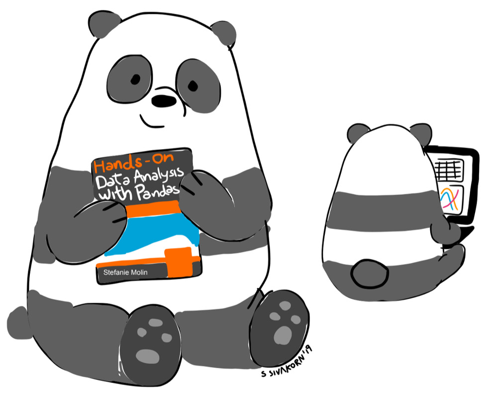

Lab 14: The Road Ahead
=================================================

Throughout this course, we have covered a lot of material, and you are now
capable of performing data analysis and machine learning tasks entirely
in Python. We began our journey by learning about some introductory
statistics and how to set up our environment for data science in Python.
Then, we learned about the basics of using `pandas` and how to
bring data into Python. With this knowledge, we were able to work with
APIs, read from files, and query databases to grab data for our
analyses.

After we collected our data, we learned how to perform data wrangling in
order to clean up our data and get it into a usable format. Next, we
learned how to work with time series and combine data from different
sources as well as aggregate it. Once we had a good handle on data
wrangling, we moved on to visualizations and used `pandas`,
`matplotlib`, and `seaborn` to create a variety of
plot types, and we also learned how to customize them.

Armed with this knowledge, we were able to tackle some real-world
analyses by looking at the financial data for bitcoin and the FAANG
stocks and trying to detect hackers attempting to authenticate to a web
application. In addition, we learned how to build our own Python
packages, write our own classes, and simulate data.

Finally, we got an introduction to machine learning using
`scikit-learn`. We discussed how to build model pipelines,
taking us from preprocessing the data through to model fitting.
Afterward, we discussed how we can evaluate the performance of our
models and how we can try to improve their performance. Our discussion
of machine learning culminated in using machine learning models to
detect hackers attempting to gain access to a web application through a
brute-force attack.

Now that you have gained all this knowledge, it is important to nurture
it so that you retain it. This means that you must practice every chance
you get. This lab provides the following resources for continuing
your data science journey:

-   Resources for finding data on a variety of topics
-   Websites and services to practice working with data
-   Coding challenges and educational content to improve your Python
    skills

Data resources
==============

As with any skill, to get better we need to practice, which for us means
we need to find data to practice on. There is no best dataset to
practice with; rather, each person should find data that they
are interested in exploring. While this section
is by no means comprehensive, it contains resources for data from
various topics in the hopes that everyone will find something they want
to use.

**Tip:** 

Unsure of what kind of data to look for? What are some of the things you
have wondered about related to a topic that you find interesting? Has
data been collected on this topic, and can you access it? Let your
curiosity guide you.

Python packages
---------------

Both `seaborn` and `scikit-learn` provide built-in
sample datasets that you can experiment with in order to get
more practice with the material we\'ve covered in
the course and to try out new techniques. These datasets are often very
clean and thus easy to work with. Once you\'re comfortable
with the techniques, you can move on to finding
data using the other resources that are mentioned in the following
sections, which will be more representative of real-world data.

### Seaborn

Seaborn provides the `load_dataset()` function, which reads
the data from a CSV file in a small GitHub
repository for `seaborn` data. These datasets are the ones
that are used in the `seaborn` documentation, so it is
important to keep in mind that they may change. The data can be obtained
from the repository directly at
<https://github.com/mwaskom/seaborn-data>.

### Scikit-learn

Scikit-learn includes a `datasets` module, which can be used
to generate random datasets to test algorithms or
to import certain datasets that are popular in the machine learning
community. Be sure to check out the documentation for more information:

-   **Generating random datasets for machine learning tasks**:
    <https://scikit-learn.org/stable/modules/classes.html#samples-generator>
-   **Loading supported datasets**:
    <https://scikit-learn.org/stable/modules/classes.html#loaders>

There is also the `fetch_openml()` function in the
`sklearn.datasets` module, which will fetch datasets by name
from OpenML (<https://www.openml.org/>), which contains many free
datasets for machine learning.

Searching for data
------------------

The following are a few places you can use to
search for data on a variety of topics:

-   **DataHub**: <https://datahub.io/search>
-   **Google Dataset Search**:
    <https://datasetsearch.research.google.com/>
-   **Open Data on Amazon Web Services**:
    <https://registry.opendata.aws/>
-   **OpenML**: [https://www.openml.org](https://www.openml.org/)
-   **SNAP library of datasets collected by Stanford University**:
    <https://snap.stanford.edu/data/index.html>
-   **UCI Machine Learning Repository**:
    <http://archive.ics.uci.edu/ml/index.php>

APIs
----

We saw how great working with APIs can be for
gathering data; the following are some APIs for gathering data that may
be of interest to you:

-   **Facebook API**: <https://developers.facebook.com/docs/graph-api>
-   **NOAA Climate Data API**:
    <https://www.ncdc.noaa.gov/cdo-web/webservices/v2>
-   **NYTimes API**: <https://developer.nytimes.com/>
-   **OpenWeatherMap API**: <https://openweathermap.org/api>
-   **Twitter API**: <https://developer.twitter.com/en/docs>
-   **USGS Earthquake API**:
    <https://earthquake.usgs.gov/fdsnws/event/1/>

Websites
--------

This section contains selected data resources
across various topics that can be accessed through a website. Obtaining
the data for an analysis may be as simple as downloading a CSV file or
it may require parsing HTML with `pandas`. If you must resort
to scraping the page (make sure you have tried
the ways we discussed in this course first), be sure that you aren\'t
violating the terms of use of the website.

### Finance

We worked with finance data several times
throughout this course. If you are interested in further financial
analysis, consult the following resources:

-   **Google Finance**: <https://google.com/finance>
-   **NASDAQ historical stock prices**:
    <https://www.nasdaq.com/market-activity/quotes/historical>
-   **Quandl**: [https://www.quandl.com](https://www.quandl.com/)
-   **Yahoo! Finance**:
    [https://finance.yahoo.com](https://finance.yahoo.com/)

### Government data

Government data is often open to the public. The
following resources contain data provided by some governments:

-   **European Union open data**: <http://data.europa.eu/euodp/en/data>
-   **NASA**: <https://nasa.github.io/data-nasa-gov-frontpage/>
-   **NYC data**: <https://opendata.cityofnewyork.us/data/>
-   **UK government data**: <https://data.gov.uk/>
-   **UN data**: <http://data.un.org/>
-   **US census data**: <https://census.gov/data.html>
-   **US government data**: <https://www.data.gov/>

### Health and economy

Economic, medical, and social data from around
the world is available at the following websites:

-   **Gapminder**: <https://www.gapminder.org/data/>
-   **Health Data**: <https://healthdata.gov/search/type/dataset>
-   **World Health Organization**: <https://www.who.int/data/gho>

The following are additional resources for data on the COVID-19
pandemic:

-   **Coronavirus (COVID-19) data in the United States (NYTimes)**:
    <https://github.com/nytimes/covid-19-data>
-   **COVID-19 data repository by the Center for Systems Science and
    Engineering (CSSE) at Johns Hopkins University**:
    <https://github.com/CSSEGISandData/COVID-19>
-   **COVID-19 pandemic (ECDC)**:
    <https://www.ecdc.europa.eu/en/covid-19-pandemic>
-   **Open COVID-19 datasets**:
    <https://researchdata.wisc.edu/open-covid-19-datasets/>

### Social networks

For those interested in text-based data or graph
data, check out the following resources on social networks:

-   **List of Twitter data resources**:
    <https://github.com/shaypal5/awesome-twitter-data>
-   **Social network data**:
    <https://snap.stanford.edu/data/ego-Facebook.html>

### Sports

For the sports lover, check out the following
websites, which provide databases and web pages
for statistics on all your favorite players:

-   **Baseball database (practice working with a DB)**:
    <http://www.seanlahman.com/baseball-archive/statistics/>
-   **Baseball player statistics**:
    <https://www.baseball-reference.com/players/>
-   **Basketball player statistics**:
    <https://www.basketball-reference.com/players/>
-   **Football (American) player statistics**:
    <https://www.pro-football-reference.com/players/>
-   **Football (soccer) statistics**:
    <https://www.whoscored.com/Statistics>
-   **Hockey player statistics**:
    <https://www.hockey-reference.com/players/>

### Miscellaneous

The following resources vary in topic, but be sure to check these out if
nothing has piqued your interest so far:

-   **Amazon reviews data**:
    <https://snap.stanford.edu/data/web-Amazon.html>
-   **Data extracted from Wikipedia**:
    <https://wiki.dbpedia.org/develop/datasets>
-   **Google Trends**: <https://trends.google.com/trends/>
-   **Movies from MovieLens**:
    <https://grouplens.org/datasets/movielens/>
-   **Yahoo Webscope (reference library of datasets)**:
    <https://webscope.sandbox.yahoo.com/>

Practicing working with data
============================

Throughout this course, we have worked with various
datasets from different sources with step-by-step instructions. It
doesn\'t have to stop here, though. This section is dedicated to some
resources that can be used to continue with guided instruction and,
eventually, work toward building a model for a predefined problem.

**Kaggle** (<https://www.kaggle.com/>) offers
content for learning data science, datasets for exploration that are
shared by members of the community, and competitions that have been
posted by companies---perhaps the Netflix recommendation contest sounds
familiar (<https://www.kaggle.com/netflix-inc/netflix-prize-data>)?
These contests are a great way for you to practice your machine learning
skills and become more visible in the community (especially to potential
employers).

**Important note:**

Kaggle isn\'t the only place you can participate
in data science competitions. Some additional ones are listed at
<https://towardsdatascience.com/top-competitive-data-science-platforms-other-than-kaggle-2995e9dad93c>.

**DataCamp** (<https://www.datacamp.com/>), while not entirely free,
provides various data science courses in Python. They
include instructional videos and
fill-in-the-blank coding practice problems so that you can build up your
understanding of the topics.

Python practice
===============

We have seen throughout this course that working with data in Python
isn\'t just `pandas`, `matplotlib`, and
`numpy`; there are many ways our workflow can benefit from us
being strong Python programmers in general. With strong Python skills,
we can build web applications with Flask, make requests of an API,
efficiently iterate over combinations or permutations, and find ways to
speed up our code. While this course didn\'t focus on honing these
skills directly, here are some free resources for
practicing with Python and thinking like a programmer:

-   **HackerRank**:
    [https://www.hackerrank.com](https://www.hackerrank.com/)
-   **Codewars**: [https://www.codewars.com](https://www.codewars.com/)
-   **LeetCode**: [https://www.leetcode.com](https://www.leetcode.com/)
-   **CodinGame**:
    [https://www.codingame.com](https://www.codingame.com/)

While not free, **Python Morsels** (<https://www.pythonmorsels.com/>)
provides weekly Python exercises that will help
you learn to write more Pythonic code and get more familiar with the
Python standard library. Exercises vary in difficulty but can be set to
a higher or lower difficulty as needed.

Another great resource is **Pramp**
([https://www.pramp.com](https://www.pramp.com/)), which lets you
practice for a programming interview with a
randomly assigned peer. Your peer will interview you with a random
question and evaluate how you approach the interview, your code, and how
well you explain yourself. After 30 minutes, it\'s your turn to
interview your peer.

**Khan Academy** (<https://www.khanacademy.org/>) can be a great
resource for learning more about a subject. If
you want a primer on computer science algorithms or some of the
mathematics behind machine learning algorithms (such as linear algebra
and calculus), then this is a great place to start.

Lastly, **LinkedIn Learning** (<https://www.linkedin.com/learning/>) has
many video courses on a wide range of topics,
including Python, data science, and machine learning. New users get a
free month-long trial. Consider taking the *Learning the Python 3
Standard Library* course
(<https://www.linkedin.com/learning/learning-the-python-3-standard-library>)
to level up your Python skills; as we saw throughout this course, a solid
command of the standard library helps us write more concise
and efficient code.

Summary
=======

This lab provided you with many places where you can find datasets
across myriad topics. In addition, you also learned about various
websites where you can take courses and work through tutorials, practice
machine learning, and improve your Python skills.It\'s important to keep
your skills sharp and stay curious, so, for whatever interests you, look
for data and perform your own analyses. These are things you can put on
your GitHub account as your data portfolio.

Exercises
=========

The exercises in this lab are open-ended---no solutions are
provided. They are meant to give you some ideas so that you can get
started on your own:

1.  Practice machine learning classification by participating in the
    Titanic challenge on Kaggle at <https://www.kaggle.com/c/titanic>.

2.  Practice machine learning regression techniques by participating in
    the housing prices challenge on Kaggle at
    <https://www.kaggle.com/c/house-prices-advanced-regression-techniques>.

3.  Perform an analysis on something that interests you. Some
    interesting ideas include the following:

    a\) *Predicting likes on Instagram*:
    <https://towardsdatascience.com/predict-the-number-of-likes-on-instagram-a7ec5c020203>

    b\) *Analyzing delays of NJ transit trains*:
    <https://medium.com/@pranavbadami/how-data-can-help-fix-nj-transit-c0d15c0660fe>

    c\) *Using visualizations to solve data science problems*:
    <https://towardsdatascience.com/solving-a-data-science-challenge-the-visual-way-355cfabcb1c5>

4.  Complete five challenges across any one of the sites in the *Python
    practice* section of this lab. For example, you can try the
    following challenges:

    a\) *Finding two numbers that add to a specific sum exactly*:
    <https://leetcode.com/problems/two-sum/>

    b\) *Validating credit card numbers*:
    <https://www.hackerrank.com/challenges/validating-credit-card-number/problem>

