Lab 7: Working with Pandas DataFrames
========================================


The time has come for us to begin our journey into the
`pandas` universe. This lab will get us comfortable
working with some of the basic, yet powerful, operations we will be
performing when conducting our data analyses with `pandas`. The following topics will be covered in this lab:

-   Pandas data structures
-   Creating DataFrame objects from files, API requests, SQL queries,
    and other Python objects
-   Inspecting DataFrame objects and calculating summary statistics
-   Grabbing subsets of the data via selection, slicing, indexing, and
    filtering
-   Adding and removing data


#### Pre-reqs:
- Google Chrome (Recommended)

#### Lab Environment
Notebooks are ready to run. All packages have been installed. There is no requirement for any setup.

All examples are present in `~/work/machine-learning-essentials-module1/lab_07` folder. 


Lab materials
=================

We will be working with earthquake data from the **US Geological Survey** (**USGS**) by using the USGS API and CSV files, which can be
found in the `data/` directory.

There are four CSV files and a SQLite database file, all of which will
be used at different points throughout this lab. The
`earthquakes.csv` file contains data that\'s been pulled from
the USGS API for September 18, 2018 through October 13, 2018. For our
discussion of data structures, we will work with the
`example_data.csv` file, which contains five rows and a subset
of the columns from the `earthquakes.csv` file. The
`tsunamis.csv` file is a subset of the data in the
`earthquakes.csv` file for all earthquakes that were
accompanied by tsunamis during the aforementioned date range. The
`quakes.db` file contains a SQLite database with a single
table for the tsunamis data. We will use this to learn how to read from
and write to a database with `pandas`. Lastly, the
`parsed.csv` file will be used for the end-of-lab
exercises, and we will also walk through the creation of it during this
lab.

#### Lab Notebooks

In the `1-pandas_data_structures.ipynb` notebook, we will
start learning about the main `pandas` data structures.
Afterward, we will discuss the various ways to create
`DataFrame` objects in the
`2-creating_dataframes.ipynb` notebook. Our discussion on this
topic will continue in the
`3-making_dataframes_from_api_requests.ipynb` notebook, where
we will explore the USGS API to gather data for use with
`pandas`. After learning about how we
can collect our data, we will begin to learn how to conduct
**exploratory data analysis** (**EDA**) in the
`4-inspecting_dataframes.ipynb` notebook. Then, in the
`5-subsetting_data.ipynb `notebook, we will discuss various
ways to select and filter data. Finally, we will learn how to add and
remove data in the `6-adding_and_removing_data.ipynb`
notebook. Let\'s get started.


**Important note:**

For the remainder of this course, we will refer to `DataFrame`
objects as dataframes, `Series` objects as series, and
`Index` objects as index/indices, unless we are referring to
the class itself.

For this section, we will work in the
`1-pandas_data_structures.ipynb` notebook. To begin, we will
import `numpy` and use it to read the contents of the
`example_data.csv` file into a `numpy.array` object.
The data comes from the USGS API for earthquakes (source:
<https://earthquake.usgs.gov/fdsnws/event/1/>). Note that this is the
only time we will use NumPy to read in a file and
that this is being done for illustrative purposes only; the important
part is to look at the way the data is represented with NumPy:

```
>>> import numpy as np
>>> data = np.genfromtxt(
...     'data/example_data.csv', delimiter=';', 
...     names=True, dtype=None, encoding='UTF'
... )
>>> data
array([('2018-10-13 11:10:23.560',
        '262km NW of Ozernovskiy, Russia', 
        'mww', 6.7, 'green', 1),
       ('2018-10-13 04:34:15.580', 
        '25km E of Bitung, Indonesia', 'mww', 5.2, 'green', 0),
       ('2018-10-13 00:13:46.220', '42km WNW of Sola, Vanuatu', 
        'mww', 5.7, 'green', 0),
       ('2018-10-12 21:09:49.240', 
        '13km E of Nueva Concepcion, Guatemala',
        'mww', 5.7, 'green', 0),
       ('2018-10-12 02:52:03.620', 
        '128km SE of Kimbe, Papua New Guinea',
        'mww', 5.6, 'green', 1)],
      dtype=[('time', '<U23'), ('place', '<U37'),
             ('magType', '<U3'), ('mag', '<f8'),
             ('alert', '<U5'), ('tsunami', '<i8')])
```


We now have our data in a NumPy array. Using the `shape` and
`dtype` attributes, we can gather information
about the dimensions of the array and the data
types it contains, respectively:

```
>>> data.shape
(5,)
>>> data.dtype
dtype([('time', '<U23'), ('place', '<U37'), ('magType', '<U3'), 
       ('mag', '<f8'), ('alert', '<U5'), ('tsunami', '<i8')])
```


Each of the entries in the array is a row from the CSV file. NumPy
arrays contain a single data type (unlike lists, which allow mixed
types); this allows for fast, vectorized operations. When we read in the
data, we got an array of `numpy.void` objects, which are used
to store flexible types. This is because NumPy had to store several
different data types per row: four strings, a float, and an integer.
Unfortunately, this means that we can\'t take advantage of the
performance improvements NumPy provides for single data type objects.

Say we want to find the maximum magnitude --- we can use a **list comprehension** to select
the third index of each row, which is represented as a
`numpy.void` object. This makes a list, meaning that we can
take the maximum using the `max()` function. We can use the
`%%timeit` **magic command** from IPython (a special command
preceded by `%`) to see how long this implementation takes
(times will vary):

```
>>> %%timeit
>>> max([row[3] for row in data])
9.74 µs ± 177 ns per loop 
(mean ± std. dev. of 7 runs, 100000 loops each)
```


Note that we should use a list comprehension whenever we would write a
`for` loop with just a single line under it or want to run an
operation against the members of some initial list. This is a rather
simple list comprehension, but we can make them more complex with the
addition of `if...else` statements. List comprehensions are an
extremely powerful tool to have in our arsenal.


If we create a NumPy array for each column
instead, this operation is much easier (and more efficient) to perform.
To do so, we will use a **dictionary comprehension**
(https://www.python.org/dev/peps/pep-0274/) to make a dictionary where
the keys are the column names and the values are NumPy arrays of the
data. Again, the important part here is how the data is now represented
using NumPy:

```
>>> array_dict = {
...     col: np.array([row[i] for row in data])
...     for i, col in enumerate(data.dtype.names)
... }
>>> array_dict
{'time': array(['2018-10-13 11:10:23.560',
        '2018-10-13 04:34:15.580', '2018-10-13 00:13:46.220',
        '2018-10-12 21:09:49.240', '2018-10-12 02:52:03.620'],
        dtype='<U23'),
 'place': array(['262km NW of Ozernovskiy, Russia', 
        '25km E of Bitung, Indonesia',
        '42km WNW of Sola, Vanuatu',
        '13km E of Nueva Concepcion, Guatemala',
        '128km SE of Kimbe, Papua New Guinea'], dtype='<U37'),
 'magType': array(['mww', 'mww', 'mww', 'mww', 'mww'], 
        dtype='<U3'),
 'mag': array([6.7, 5.2, 5.7, 5.7, 5.6]),
 'alert': array(['green', 'green', 'green', 'green', 'green'], 
        dtype='<U5'),
 'tsunami': array([1, 0, 0, 0, 1])}
```


Grabbing the maximum magnitude is now simply a matter of selecting the
`mag` key and calling the `max()` method on the
NumPy array. This is nearly twice as fast as the list comprehension
implementation, when dealing with just five entries---imagine how much
worse the first attempt will perform on large
datasets:

```
>>> %%timeit
>>> array_dict['mag'].max()
5.22 µs ± 100 ns per loop 
(mean ± std. dev. of 7 runs, 100000 loops each)
```


However, this representation has other issues. Say we wanted to grab all
the information for the earthquake with the maximum magnitude; how would
we go about that? We need to find the index of the maximum, and then for
each of the keys in the dictionary, grab that index. The result is now a
NumPy array of strings (our numeric values were converted), and we are
now in the format that we saw earlier:

```
>>> np.array([
...     value[array_dict['mag'].argmax()]
...     for key, value in array_dict.items()
... ])
array(['2018-10-13 11:10:23.560',
       '262km NW of Ozernovskiy, Russia',
       'mww', '6.7', 'green', '1'], dtype='<U31')
```


Consider how we would go about sorting the data by magnitude from
smallest to largest. In the first representation, we would have to sort
the rows by examining the third index. With the second representation,
we would have to determine the order of the indices
from the `mag` column, and then sort all
the other arrays with those same indices. Clearly, working with several
NumPy arrays containing different data types at once is a bit
cumbersome; however, `pandas` builds on top of NumPy arrays to
make this easier. Let\'s start our exploration of `pandas`
with an overview of the `Series` data structure.


Series
------

The `Series` class provides a data
structure for arrays of a single type, just like the NumPy array.
However, it comes with some additional functionality. This
one-dimensional representation can be thought of as a column in a
spreadsheet. We have a name for our column, and the data we hold in it
is of the same type (since we are measuring the same variable):

```
>>> import pandas as pd
>>> place = pd.Series(array_dict['place'], name='place')
>>> place
0          262km NW of Ozernovskiy, Russia
1              25km E of Bitung, Indonesia
2                42km WNW of Sola, Vanuatu
3    13km E of Nueva Concepcion, Guatemala
4      128km SE of Kimbe, Papua New Guinea
Name: place, dtype: object
```


Note the numbers on the left of the result; these correspond to the row
number in the original dataset (offset by 1 since, in Python, we start
counting at 0). These row numbers form the index, which we will discuss
in the following section. Next to the row numbers, we have the actual
value of the row, which, in this example, is a string indicating where
the earthquake occurred. Notice that we have `dtype: object`
next to the name of the `Series` object; this is telling us
that the data type of `place` is `object`. A string
will be classified as `object` in `pandas`.

To access attributes of the `Series`
object, we use attribute notation of the form
`<object>.<attribute_name>`. The following are some common
attributes we will access. Notice that `dtype` and
`shape` are available, just as we saw with the NumPy array:


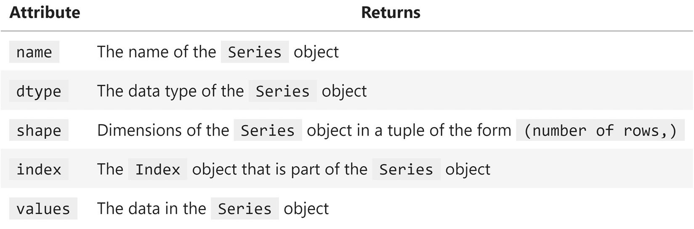


**Important note:**

For the most part, `pandas` objects use NumPy arrays for their
internal data representations. However, for some data types,
`pandas` builds upon NumPy to create its own arrays
(https://pandas.pydata.org/pandas-docs/stable/reference/arrays.html).
For this reason, depending on the data type, `values` can
return either a `pandas.array` or a `numpy.array`
object. Therefore, if we need to ensure we get a specific type back, it
is recommended to use the `array` attribute or
`to_numpy()` method, respectively, instead of
`values`.

Be sure to bookmark the `pandas.Series` documentation
(<https://pandas.pydata.org/pandas-docs/stable/reference/api/pandas.Series.html>)
for reference later. It contains more information on how to create a
`Series` object, the full list of attributes and methods that
are available, as well as a link to the source code. With this
high-level introduction to the `Series` class, we are ready to
move on to the `Index` class.


Index
-----

The addition of the `Index` class makes the `Series`
class significantly more powerful than a NumPy array. The
`Index` class gives us row labels, which enable selection by
row. Depending on the type, we can provide a row
number, a date, or even a string to select our row. It plays a key role
in identifying entries in the data and is used for a multitude of
operations in `pandas`, as we will see throughout this course.
We can access the index through the `index` attribute:

```
>>> place_index = place.index
>>> place_index
RangeIndex(start=0, stop=5, step=1)
```


Note that this is a `RangeIndex` object. Its values start at
`0` and end at `4`. The step of `1`
indicates that the indices are all `1` apart, meaning that we
have all the integers in that range. The default index class is
`RangeIndex`; however, we can change the index. Often, we will either work with an
`Index` object of row numbers or date(time)s.

As with `Series` objects, we can access the underlying data
via the `values` attribute. Note that this `Index`
object is built on top of a NumPy array:

```
>>> place_index.values
array([0, 1, 2, 3, 4], dtype=int64)
```


Some of the useful attributes of `Index` objects include the
following:


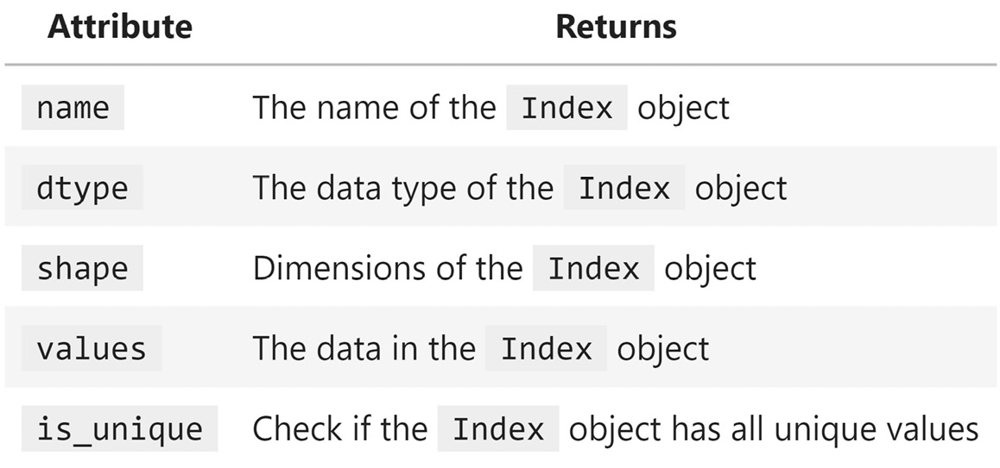


Both NumPy and `pandas` support arithmetic operations, which
will be performed element-wise. NumPy will use the position in the array
for this:

```
>>> np.array([1, 1, 1]) + np.array([-1, 0, 1])
array([0, 1, 2])
```


With `pandas`, this element-wise arithmetic is performed on
matching index values. If we add a `Series` object with an
index from `0` to `4` (stored in `x`) and
another, `y`, from `1` to `5`, we will
only get results were the indices align (`1` through
`4`). In upcoming lab, we will discuss some ways to change and align
the index so that we can perform these types of
operations without losing data:

```
>>> numbers = np.linspace(0, 10, num=5) # [0, 2.5, 5, 7.5, 10]
>>> x = pd.Series(numbers) # index is [0, 1, 2, 3, 4]
>>> y = pd.Series(numbers, index=pd.Index([1, 2, 3, 4, 5]))
>>> x + y
0     NaN
1     2.5
2     7.5
3    12.5
4    17.5
5     NaN
dtype: float64
```


Now that we have had a primer on both the `Series` and
`Index` classes, we are ready to learn about the
`DataFrame` class. Note that more information on the
`Index` class can be found in the respective documentation at
<https://pandas.pydata.org/pandas-docs/stable/reference/api/pandas.Index.html>.


DataFrame
---------

With the `Series` class, we essentially
had columns of a spreadsheet, with the data all being of the same type.
The `DataFrame` class builds upon the `Series` class
and can have many columns, each with its own data type; we can think of
it as representing the spreadsheet as a whole. We can turn either of the
NumPy representations we built from the example data into a
`DataFrame` object:

```
>>> df = pd.DataFrame(array_dict) 
>>> df
```


This gives us a dataframe of six series. Note the
column before the `time` column; this is the `Index`
object for the rows. When creating a `DataFrame` object,
`pandas` aligns all the series to the same index. In this
case, it is just the row number, but we could easily use the
`time` column for this, which would enable some additional
`pandas` features:


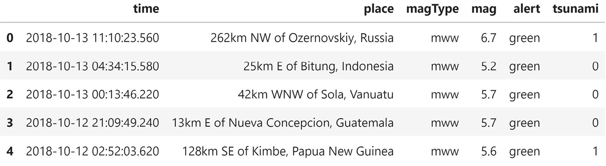


Our columns each have a single data type, but they don\'t all share the
same data type:

```
>>> df.dtypes
time        object
place       object
magType     object
mag        float64
alert       object
tsunami      int64
dtype: object
```


The values of the dataframe look very similar to the initial NumPy
representation we had:

```
>>> df.values
array([['2018-10-13 11:10:23.560',
        '262km NW of Ozernovskiy, Russia',
        'mww', 6.7, 'green', 1],
       ['2018-10-13 04:34:15.580', 
        '25km E of Bitung, Indonesia', 'mww', 5.2, 'green', 0],
       ['2018-10-13 00:13:46.220', '42km WNW of Sola, Vanuatu', 
        'mww', 5.7, 'green', 0],
       ['2018-10-12 21:09:49.240',
        '13km E of Nueva Concepcion, Guatemala',
        'mww', 5.7, 'green', 0],
       ['2018-10-12 02:52:03.620','128 km SE of Kimbe, 
         Papua New Guinea', 'mww', 5.6, 'green', 1]], 
      dtype=object)
```


We can access the column names via the
`columns` attribute. Note that they are actually stored in an
`Index` object as well:

```
>>> df.columns
Index(['time', 'place', 'magType', 'mag', 'alert', 'tsunami'], 
      dtype='object')
```


The following are some commonly used dataframe attributes:


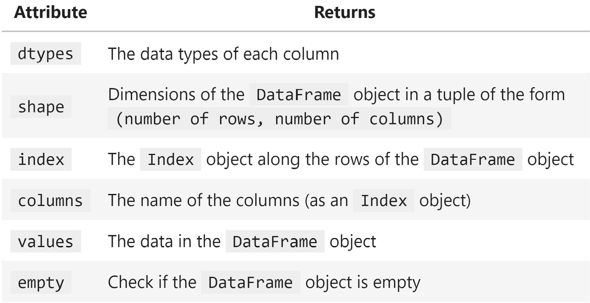


Note that we can also perform arithmetic on
dataframes. For example, we can add `df` to itself, which will
sum the numeric columns and concatenate the string columns:

```
>>> df + df
```


Pandas will only perform the operation when both the index and column
match. Here, `pandas` concatenated the string columns
(`time`, `place`, `magType`, and
`alert`) across dataframes. The numeric columns
(`mag` and `tsunami`) were summed:


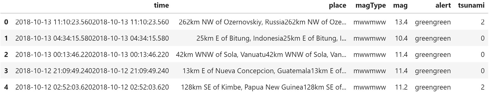


More information on `DataFrame` objects and all the operations
that can be performed directly on them is available in the official
documentation at
<https://pandas.pydata.org/pandas-docs/stable/reference/api/pandas.DataFrame.html>;
be sure to bookmark it for future reference. Now, we are ready to begin
learning how to create `DataFrame` objects from a variety of
sources.


Creating a pandas DataFrame
===========================


Now that we understand the data structures we will be working with, we
can discuss the different ways we can create them.
Before we dive into the code however, it\'s important to know how to get
help right from Python. Should we ever find ourselves unsure of how to
use something in Python, we can utilize the built-in `help()`
function. We simply run `help()`, passing in the package,
module, class, object, method, or function that we want to read the
documentation on. We can, of course, look up the documentation online;
however, in most cases, the **docstrings** (the documentation text
written in the code) that are returned with `help()` will be
equivalent to this since they are used to generate the documentation.

Assuming we first ran `import pandas as pd`, we can run
`help(pd)` to display information about the `pandas`
package; `help(pd.DataFrame)` for all the methods and
attributes of `DataFrame` objects (note we can also pass in a
`DataFrame` object instead); and `help(pd.read_csv)`
to learn more about the `pandas` function for reading CSV
files into Python and how to use it. We can also try using the
`dir()` function and the `__dict__` attribute, which
will give us a list or dictionary of what\'s available, respectively;
these might not be as useful as the `help()` function, though.

Additionally, we can use `?` and `??` to get help,
thanks to IPython, which is part of what makes Jupyter Notebooks so
powerful. Unlike the `help()` function, we can use question
marks by putting them after whatever we want to know more about, as if
we were asking Python a question; for example, `pd.read_csv?`
and `pd.read_csv??`. These three will yield slightly different
outputs: `help()` will give us the docstring; `?`
will give the docstring, plus some additional information, depending on
what we are inquiring about; and `??` will give us even more
information and, if possible, the source code behind it.

Let\'s now turn to the next notebook,
`2-creating_dataframes.ipynb`, and import the packages we will
need for the upcoming examples. We will be using `datetime`
from the Python standard library, along with the third-party packages
`numpy` and `pandas`:

```
>>> import datetime as dt
>>> import numpy as np
>>> import pandas as pd
```


**Important note:**

We have **aliased** each of our imports. This allows us to use the
`pandas` package by referring to it with the alias we assign
to be `pd`, which is the most common way of importing it. In
fact, we can only refer to it as `pd`, since that is what we
imported into the namespace. Packages need to be imported before we can
use them; installation puts the files we need on our computer, but, in
the interest of memory, Python won\'t load every installed package when
we start it up---just the ones we tell it to.

We are now ready to begin using
`pandas`. First, we will learn how to create
`pandas` objects from other Python objects. Then, we will
learn how to do so with flat files, tables in a database, and responses
from API requests.


From a Python object
--------------------

Before we cover all the ways we can create a `DataFrame`
object from a Python object, we should learn how
to make a `Series` object. Remember that a `Series`
object is essentially a column in a `DataFrame` object, so,
once we know this, it should be easy to understand how to create a
`DataFrame` object. Say that we wanted to create a series of
five random numbers between `0` and `1`. We could
use NumPy to generate the random numbers as an array and create the
series from that.


To ensure that the result is reproducible, we will set the seed here.
The **seed** gives a starting point for the generation of pseudorandom
numbers. No algorithms for random number generation are truly
random---they are deterministic, so by setting this starting point, the
numbers that are generated will be the same each time the code is run.
This is good for testing things, but not for simulation (where we want
randomness). In this fashion, we can make a
`Series` object with any list-like structure (such as NumPy
arrays):

```
>>> np.random.seed(0) # set a seed for reproducibility
>>> pd.Series(np.random.rand(5), name='random')
0    0.548814
1    0.715189
2    0.602763
3    0.544883
4    0.423655
Name: random, dtype: float64
```


Making a `DataFrame` object is an extension of making a
`Series` object; it will be composed of one or more series,
and each will be distinctly named. This should remind us of
dictionary-like structures in Python: the keys are
the column names, and the values are the contents of the columns. Note
that if we want to turn a single `Series` object into a
`DataFrame` object, we can use its `to_frame()`
method.

**Tip:** 

In computer science, a **constructor** is a piece of code that
initalizes new instances of a class, preparing them for use. Python
classes implement this with the `__init__()` method. When we
run `pd.Series()`, Python calls
`pd.Series.__init__()`, which contains instructions for
instantiating a new `Series` object.

Since columns can all be different data types, let\'s get a little fancy
with this example. We are going to create a `DataFrame` object
containing three columns, with five observations each:

-   `random`: Five random numbers between `0` and
    `1` as a NumPy array
-   `text`: A list of five strings or `None`
-   `truth`: A list of five random Booleans

We will also create a `DatetimeIndex` object with the
`pd.date_range()` function. The index will contain five dates
(`periods=5`), all one day apart (`freq='1D'`),
ending with April 21, 2019 (`end`), and will be called
`date`.

All we have to do is package the columns in a
dictionary using the desired column names as the keys and pass this in
when we call the `pd.DataFrame()` constructor. The index gets
passed as the `index` argument:

```
>>> np.random.seed(0) # set seed so result is reproducible
>>> pd.DataFrame(
...     {
...         'random': np.random.rand(5),
...         'text': ['hot', 'warm', 'cool', 'cold', None],
...         'truth': [np.random.choice([True, False]) 
...                   for _ in range(5)]
...     }, 
...     index=pd.date_range(
...         end=dt.date(2019, 4, 21),
...         freq='1D', periods=5, name='date'
...     )
... )
```


Having dates in the index makes it easy to select entries by date (or even in a date range):

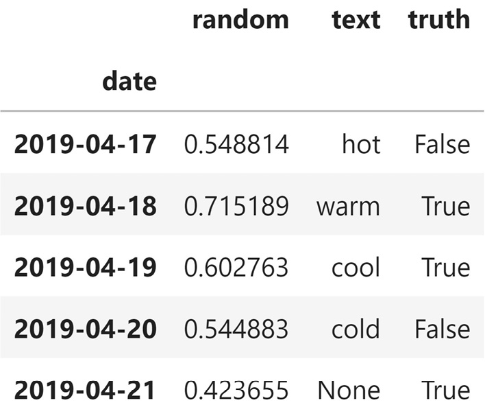


In cases where the data isn\'t a dictionary, but rather a list of
dictionaries, we can still use `pd.DataFrame()`. Data in this
format is what we would expect when consuming from an API. Each entry in
the list will be a dictionary, where the keys of the dictionary are the
column names and the values of the dictionary are the values for that
column at that index:

```
>>> pd.DataFrame([
...     {'mag': 5.2, 'place': 'California'},
...     {'mag': 1.2, 'place': 'Alaska'},
...     {'mag': 0.2, 'place': 'California'},
... ])
```


This gives us a dataframe of three rows (one for each entry in the list)
with two columns (one for each key in the dictionaries):


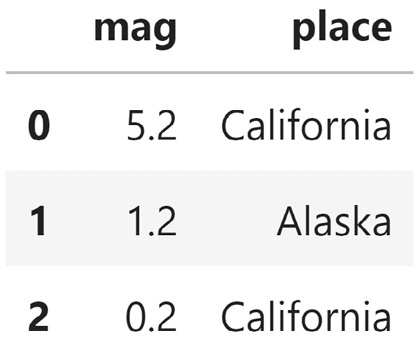


In fact, `pd.DataFrame()` also works for lists of tuples. Note
that we can also pass in the column names as a
list through the `columns` argument:

```
>>> list_of_tuples = [(n, n**2, n**3) for n in range(5)]
>>> list_of_tuples
[(0, 0, 0), (1, 1, 1), (2, 4, 8), (3, 9, 27), (4, 16, 64)]
>>> pd.DataFrame(
...     list_of_tuples,
...     columns=['n', 'n_squared', 'n_cubed']
... )
```


Each tuple is treated like a record and becomes a row in the dataframe:


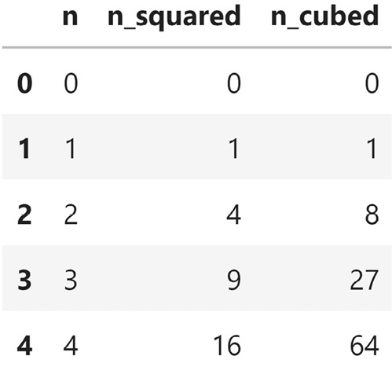


We also have the option of using `pd.DataFrame()` with NumPy
arrays:

```
>>> pd.DataFrame(
...     np.array([
...         [0, 0, 0],
...         [1, 1, 1],
...         [2, 4, 8],
...         [3, 9, 27],
...         [4, 16, 64]
...     ]), columns=['n', 'n_squared', 'n_cubed']
... )
```


This will have the effect of stacking each entry
in the array as rows in a dataframe, giving us a result that\'s
identical to *Figure 2.8*.


From a file
-----------

The data we want to analyze will most often come from outside Python. In
many cases, we may obtain a **data dump** from a
database or website and bring it into Python to sift through it. A data
dump gets its name from containing a large amount of data (possibly at a
very granular level) and often not discriminating against any of it
initially; for this reason, they can be unwieldy.

Often, these data dumps will come in the form of a text file
(`.txt`) or a CSV file (`.csv`). Pandas provides
many methods for reading in different types of files, so it is simply a
matter of looking up the one that matches our file format. Our
earthquake data is a CSV file; therefore, we use the
`pd.read_csv()` function to read it in. However, we should
always do an initial inspection of the file before attempting to read it
in; this will inform us of whether we need to pass additional arguments,
such as `sep` to specify the delimiter or `names` to
provide the column names ourselves in the absence of a header row in the
file.

**Important note:**

**Windows users**: Depending on your setup, the commands in the next few
code blocks may not work. The notebook contains alternatives if you
encounter issues.

We can perform our due diligence directly in our Jupyter Notebook thanks
to IPython, provided we prefix our commands with `!` to
indicate they are to be run as shell commands. First, we should check
how big the file is, both in terms of lines and in terms of bytes. To
check the number of lines, we use the `wc` utility (word
count) with the `–l` flag to count the number of lines. We
have 9,333 rows in the file:

```
>>> !wc -l data/earthquakes.csv
9333 data/earthquakes.csv
```


Now, let\'s check the file\'s size. For this task, we will use
`ls` on the `data` directory. This will show
us the list of files in that directory. We can add
the `-lh` flag to get information about the files in a
human-readable format. Finally, we send this output to the
`grep` utility, which will help us isolate the files we want.
This tells us that the `earthquakes.csv` file is 3.4 MB:

```
>>> !ls -lh data | grep earthquakes.csv
-rw-r--r-- 1 stefanie stefanie 3.4M ... earthquakes.csv
```


Note that IPython also lets us capture the result of the command in a
Python variable, so if we aren\'t comfortable with pipes (`|`)
or `grep`, we can do the following:

```
>>> files = !ls -lh data
>>> [file for file in files if 'earthquake' in file]
['-rw-r--r-- 1 stefanie stefanie 3.4M ... earthquakes.csv']
```


Now, let\'s take a look at the top few rows to see if the file comes
with headers. We will use the `head` utility and specify the
number of rows with the `-n` flag. This tells us that the
first row contains the headers for the data and that the data is
delimited with commas (just because the file has the `.csv`
extension does not mean it is comma-delimited):

```
>>> !head -n 2 data/earthquakes.csv
alert,cdi,code,detail,dmin,felt,gap,ids,mag,magType,mmi,net,nst,place,rms,sig,sources,status,time,title,tsunami,type,types,tz,updated,url
,,37389218,https://earthquake.usgs.gov/[...],0.008693,,85.0,",ci37389218,",1.35,ml,,ci,26.0,"9km NE of Aguanga, CA",0.19,28,",ci,",automatic,1539475168010,"M 1.4 - 9km NE of Aguanga, CA",0,earthquake,",geoserve,nearby-cities,origin,phase-data,",-480.0,1539475395144,https://earthquake.usgs.gov/earthquakes/eventpage/ci37389218
```


Note that we should also check the bottom rows to make sure there is no
extraneous data that we will need to ignore by using the
`tail` utility. This file is fine, so the result won\'t be
reproduced here; however, the notebook contains the result.

Lastly, we may be interested in seeing the column count in our data.
While we could just count the fields in the first row of the result of
`head`, we have the option of using the `awk`
utility (for pattern scanning and processing) to count our columns. The
`-F` flag allows us to specify the
delimiter (a comma, in this case). Then, we specify what to do for each
record in the file. We choose to print `NF`, which is a
predefined variable whose value is the number of fields in the current
record. Here, we say `exit` immediately after the print so
that we print the number of fields in the first row of the file; then,
we stop. This will look a little complicated, but this is by no means
something we need to memorize:

```
>>> !awk -F',' '{print NF; exit}' data/earthquakes.csv
26
```


Since we know that the first line of the file contains headers and that
the file is comma-separated, we can also count the columns by using
`head` to get the headers and Python to parse them:

```
>>> headers = !head -n 1 data/earthquakes.csv
>>> len(headers[0].split(','))
26
```


**Important note:**

The ability to run shell commands directly from our Jupyter Notebook
dramatically streamlines our workflow. However, if we don\'t have past
experience with the command line, it may be complicated to learn these
commands initially. IPython has some helpful information on running
shell commands in their documentation at
<https://ipython.readthedocs.io/en/stable/interactive/reference.html#system-shell-access>.

To summarize, we now know that the file is 3.4 MB and is comma-delimited
with 26 columns and 9,333 rows, with the first one being the header.
This means that we can use the `pd.read_csv()` function with
the defaults:

```
>>> df = pd.read_csv('earthquakes.csv')
```


Note that we aren\'t limited to reading in data from files on our local
machines; file paths can be URLs as well. As an example, let\'s read in
the same CSV file from GitHub:

```
>>> df = pd.read_csv(
...     'https://github.com/fenago/'
...     'machine-learning-essentials-module1'
...     '/blob/master/lab_07/data/earthquakes.csv?raw=True'
... )
```


Pandas is usually very good at figuring out which
options to use based on the input data, so we often won\'t need to add
arguments to this call; however, there are many options available should
we need them, some of which include the following:


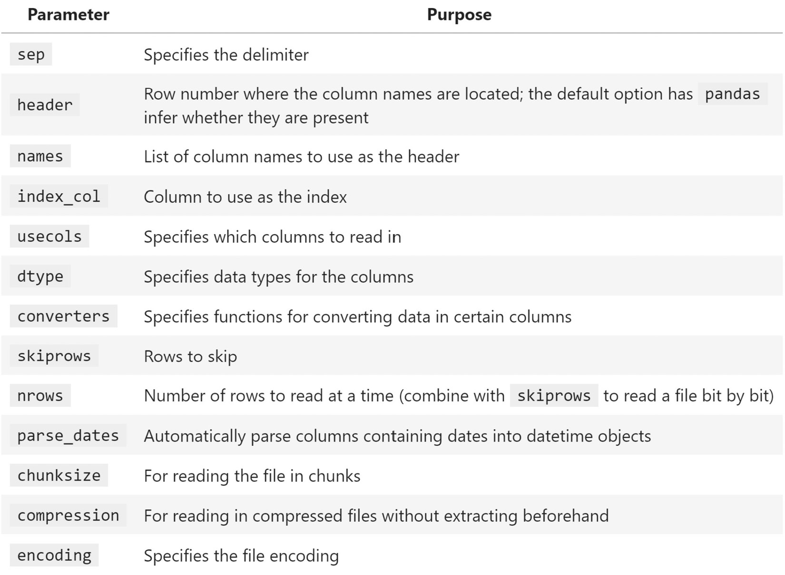


To write our dataframe to a
CSV file, we call its `to_csv()` method. We have to be careful
here; if our dataframe\'s index is just row numbers, we probably don\'t
want to write that to our file (it will have no meaning to the consumers
of the data), but it is the default. We can write our data without the
index by passing in `index=False`:

```
>>> df.to_csv('output.csv', index=False)
```


As with reading from files, `Series` and `DataFrame`
objects have methods to write data to Excel (`to_excel()`) and
JSON files (`to_json()`). Note that, while we use functions
from `pandas` to read our data in, we must use methods to
write our data; the reading functions create the `pandas`
objects that we want to work with, but the writing methods are actions
that we take using the `pandas` object.


From a database
---------------

Before we read from a database, let\'s write to one. We simply call
`to_sql()` on our dataframe, telling it which table to write
to, which database connection to use, and how to handle if the table
already exists. There is already a SQLite database in the folder for
this lab in this course\'s GitHub repository:
`data/quakes.db`. Note that, to create a new database, we can
change `'data/quakes.db'` to the path for the new database
file. Let\'s write the tsunami data from the
`data/tsunamis.csv` file to a table in the database called
`tsunamis`, replacing the table if it already exists:

```
>>> import sqlite3
>>> with sqlite3.connect('data/quakes.db') as connection:
...     pd.read_csv('data/tsunamis.csv').to_sql(
...         'tsunamis', connection, index=False,
...         if_exists='replace'
...     )
```


Let\'s query our database for the full `tsunamis` table. When
we write a SQL query, we first state the columns that we want to select,
which in our case is all of them, so we write `"SELECT *"`.
Next, we state the table to select the data from, which for us is
`tsunamis`, so we add `"FROM tsunamis"`. This is our
full query now (of course, it can get much more complicated than this).
To actually query the database, we use `pd.read_sql()`,
passing in our query and the database connection:

```
>>> import sqlite3
>>> with sqlite3.connect('data/quakes.db') as connection:
...     tsunamis = \
...         pd.read_sql('SELECT * FROM tsunamis', connection)
>>> tsunamis.head()
```


We now have the tsunamis data in a dataframe:


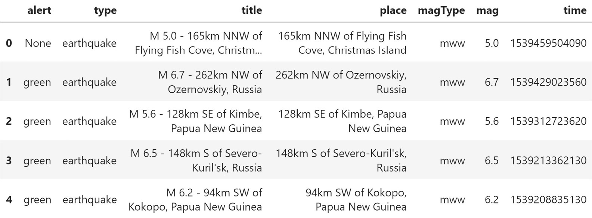


From an API
-----------

For this section, we will be working in the
`3-making_dataframes_from_api_requests.ipynb` notebook, so we
have to import the packages we need once again. As with the previous
notebook, we need `pandas` and `datetime`, but we
also need the `requests` package to make API requests:

```
>>> import datetime as dt
>>> import pandas as pd
>>> import requests
```


Next, we will make a `GET` request to the USGS API for a JSON
payload (a dictionary-like response containing the data that\'s sent
with a request or response) by specifying the format of
`geojson`. We will ask for earthquake data for the last 30
days (we can use `dt.timedelta` to perform arithmetic on
`datetime` objects). Note that we are using
`yesterday` as the end of our date
range, since the API won\'t have complete information for today yet:

```
>>> yesterday = dt.date.today() - dt.timedelta(days=1)
>>> api = 'https://earthquake.usgs.gov/fdsnws/event/1/query'
>>> payload = {
...     'format': 'geojson',
...     'starttime': yesterday - dt.timedelta(days=30),
...     'endtime': yesterday
... }
>>> response = requests.get(api, params=payload)
```


Before we try to create a dataframe out of this, we should make sure
that our request was successful. We can do this by checking the
`status_code` attribute of the `response` object. A
listing of status codes and their meanings can be found at
<https://en.wikipedia.org/wiki/List_of_HTTP_status_codes>. A
`200` response will indicate that everything is OK:

```
>>> response.status_code
200
```


Our request was successful, so let\'s see what the data we got looks
like. We asked the API for a JSON payload, which is essentially a
dictionary, so we can use dictionary methods on it to get more
information about its structure. This is going to be a lot of data;
hence, we don\'t want to print it to the screen just to inspect it. We
need to isolate the JSON payload from the HTTP response (stored in the
`response` variable), and then look at the keys to view the
main sections of the resulting data:

```
>>> earthquake_json = response.json()
>>> earthquake_json.keys()
dict_keys(['type', 'metadata', 'features', 'bbox'])
```


We can inspect what kind of data we have as values
for each of these keys; one of them will be the data we are after. The
`metadata` portion tells us some information about our
request. While this can certainly be useful, it isn\'t what we are after
right now:

```
>>> earthquake_json['metadata']
{'generated': 1604267813000,
 'url': 'https://earthquake.usgs.gov/fdsnws/event/1/query?
format=geojson&starttime=2020-10-01&endtime=2020-10-31',
 'title': 'USGS Earthquakes',
 'status': 200,
 'api': '1.10.3',
 'count': 13706}
```


The `features` key looks promising; if this does indeed
contain all our data, we should check what type it is so that we don\'t
end up trying to print everything to the screen:

```
>>> type(earthquake_json['features'])
list
```


This key contains a list, so let\'s take a look at the first entry to
see if this is the data we want. Note that the USGS data may be altered
or added to for dates in the past as more information on the earthquakes
comes to light, meaning that querying for the same date range may yield
a different number of results later on. For this reason, the following
is an example of what an entry looks like:

```
>>> earthquake_json['features'][0]
{'type': 'Feature',
 'properties': {'mag': 1,
  'place': '50 km ENE of Susitna North, Alaska',
  'time': 1604102395919, 'updated': 1604103325550, 'tz': None,
  'url': 'https://earthquake.usgs.gov/earthquakes/eventpage/ak020dz5f85a',
  'detail': 'https://earthquake.usgs.gov/fdsnws/event/1/query?eventid=ak020dz5f85a&format=geojson',
  'felt': None, 'cdi': None, 'mmi': None, 'alert': None,
  'status': 'reviewed', 'tsunami': 0, 'sig': 15, 'net': 'ak',
  'code': '020dz5f85a', 'ids': ',ak020dz5f85a,',
  'sources': ',ak,', 'types': ',origin,phase-data,',
  'nst': None, 'dmin': None, 'rms': 1.36, 'gap': None,
  'magType': 'ml', 'type': 'earthquake',
  'title': 'M 1.0 - 50 km ENE of Susitna North, Alaska'},
 'geometry': {'type': 'Point', 'coordinates': [-148.9807, 62.3533, 5]},
 'id': 'ak020dz5f85a'} 
```


This is definitely the data we are after, but do we need all of it? Upon
closer inspection, we only really care about what is inside the
`properties` dictionary. Now, we have a problem
because we have a list of dictionaries where we
only want a specific key from inside them. How can we pull this
information out so that we can make our dataframe? We can use a list
comprehension to isolate the `properties` section from each of
the dictionaries in the `features` list:

```
>>> earthquake_properties_data = [
...     quake['properties'] 
...     for quake in earthquake_json['features']
... ]
```


Finally, we are ready to create our dataframe. Pandas knows how to
handle data in this format already (a list of dictionaries), so all we
have to do is pass in the data when we call `pd.DataFrame()`:

```
>>> df = pd.DataFrame(earthquake_properties_data)
```


Now that we know how to create dataframes from a variety of sources, we
can start learning how to work with them.


Inspecting a DataFrame object
=============================


The first thing we should do when we read in our data is inspect it; we
want to make sure that our dataframe isn\'t empty
and that the rows look as we would expect. Our main goal is to verify
that it was read in properly and that all the data is there; however,
this initial inspection will also give us ideas with regard to where we
should direct our data wrangling efforts. In this section, we will
explore ways in which we can inspect our dataframes in the
`4-inspecting_dataframes.ipynb` notebook.

Since this is a new notebook, we must once again handle our setup. This
time, we need to import `pandas` and `numpy`, as
well as read in the CSV file with the earthquake data:

```
>>> import numpy as np
>>> import pandas as pd
>>> df = pd.read_csv('data/earthquakes.csv')
```


Examining the data
------------------

First, we want to make sure that we actually have
data in our dataframe. We can check the `empty` attribute to
find out:

```
>>> df.empty
False
```


So far, so good; we have data. Next, we should check how much data we
read in; we want to know the number of observations (rows) and the
number of variables (columns) we have. For this task, we use the
`shape` attribute. Our data contains 9,332 observations of 26
variables, which matches our initial inspection of the file:

```
>>> df.shape
(9332, 26)
```


Now, let\'s use the `columns` attribute to see the names of
the columns in our dataset:

```
>>> df.columns
Index(['alert', 'cdi', 'code', 'detail', 'dmin', 'felt', 'gap', 
       'ids', 'mag', 'magType', 'mmi', 'net', 'nst', 'place', 
       'rms', 'sig', 'sources', 'status', 'time', 'title', 
       'tsunami', 'type', 'types', 'tz', 'updated', 'url'],
      dtype='object')
```


We know the dimensions of our data, but what does
it actually look like? For this task, we can use the `head()`
and `tail()` methods to look at the top and bottom rows,
respectively. This will default to five rows, but we can change this by
passing a different number to the method. Let\'s take a look at the
first few rows:

```
>>> df.head()
```


The following are the first five rows we get using `head()`:


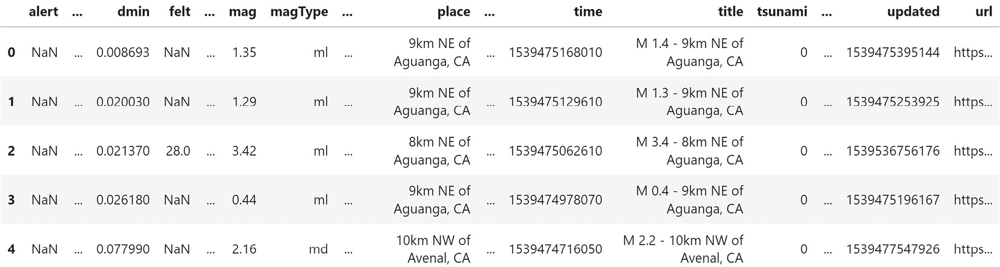


To get the last two rows, we use the `tail()` method and pass
`2` as the number of rows:

```
>>> df.tail(2)
```


The following is the result:


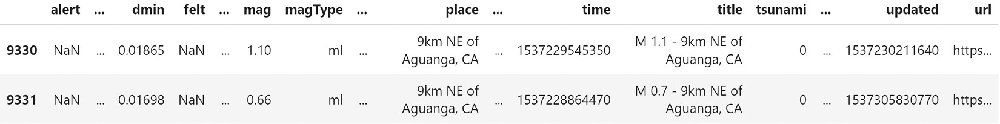


We can use the `dtypes` attribute to see
the data types of the columns, which makes it easy to see when columns
are being stored as the wrong type. (Remember that strings will be
stored as `object`.) Here, the `time` column is
stored as an integer, which is something we will learn how to fix in
upcoming lab:

```
>>> df.dtypes
alert       object
...
mag        float64
magType     object
...
time         int64
title       object
tsunami      int64
...
tz         float64
updated      int64
url         object
dtype: object
```


Lastly, we can use the `info()` method to see how many
non-null entries of each column we have and get
information on our index. **Null** values are missing values, which, in
`pandas`, will typically be represented as `None`
for objects and `NaN` (**Not a Number**) for
non-numeric values in a `float` or
`integer` column:

```
>>> df.info()
<class 'pandas.core.frame.DataFrame'>
RangeIndex: 9332 entries, 0 to 9331
Data columns (total 26 columns):
 #   Column   Non-Null Count  Dtype  
---  ------   --------------  -----  
 0   alert    59 non-null     object 
 ... 
 8   mag      9331 non-null   float64
 9   magType  9331 non-null   object 
 ... 
 18  time     9332 non-null   int64  
 19  title    9332 non-null   object 
 20  tsunami  9332 non-null   int64  
 ... 
 23  tz       9331 non-null   float64
 24  updated  9332 non-null   int64  
 25  url      9332 non-null   object 
dtypes: float64(9), int64(4), object(13)
memory usage: 1.9+ MB
```


After this initial inspection, we know a lot about
the structure of our data and can now begin to try and make sense of it.


Describing and summarizing the data
-----------------------------------

So far, we\'ve examined the structure of the `DataFrame`
object we created from the earthquake data, but we
don\'t know anything about the data other than
what a couple of rows look like. The next step is to calculate summary
statistics, which will help us get to know our data better. Pandas
provides several methods for easily doing so; one such method is
`describe()`, which also works on `Series` objects
if we are only interested in a particular column. Let\'s get a summary
of the numeric columns in our data:

```
>>> df.describe()
```


This gives us the 5-number summary, along with the count, mean, and
standard deviation of the numeric columns:


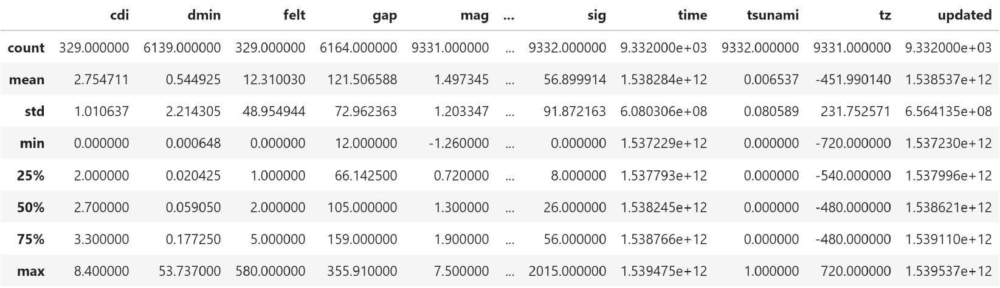


**Tip:** 

If we want different percentiles, we can pass them in with the
`percentiles` argument. For example, if we wanted only the
5[th]{.superscript} and 95[th]{.superscript} percentiles, we would run
`df.describe(percentiles=[0.05, 0.95])`. Note we will still
get the 50[th]{.superscript} percentile back because that is the median.

By default, `describe()` won\'t give us any information about
the columns of type `object`, but we can either provide
`include='all'` as an argument or run it separately for the
data of type `np.object`:

```
>>> df.describe(include=np.object)
```


When describing non-numeric data, we still get the
count of non-null occurrences (**count**);
however, instead of the other summary statistics, we get the number of
unique values (**unique**), the mode (**top**), and the number of times
the mode was observed (**freq**):


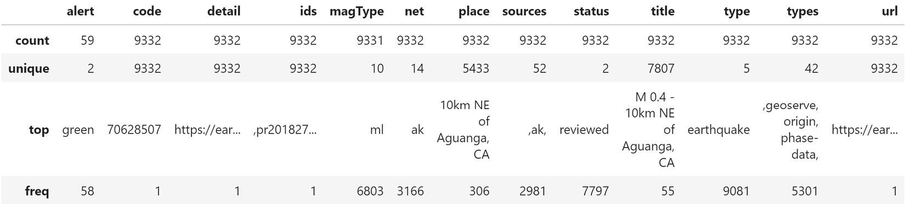


**Important note:**

The `describe()` method only gives us summary statistics for
non-null values. This means that, if we had 100 rows and half of our
data was null, then the average would be calculated as the sum of the 50
non-null rows divided by 50.

It is easy to get a snapshot of our data using the
`describe()` method, but sometimes, we just want a particular
statistic, either for a specific column or for all the columns. Pandas
makes this a cinch as well. The following table includes methods that
will work for both `Series` and `DataFrame` objects:


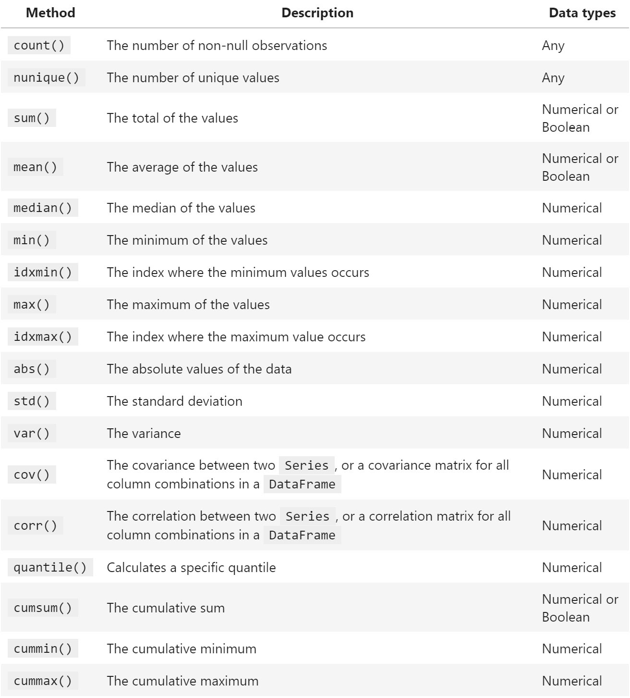


**Tip:** 

Python makes it easy to count how many times
something is `True`. Under the hood,
`True` evaluates to `1` and `False`
evaluates to `0`. Therefore, we can run the `sum()`
method on a series of Booleans and get the count of `True`
outputs.

With `Series` objects, we have some additional methods for
describing our data:

-   `unique()`: Returns the distinct values of the column.
-   `value_counts()`: Returns a frequency table of the number
    of times each unique value in a given column appears, or,
    alternatively, the percentage of times each unique value appears
    when passed `normalize=True`.
-   `mode()`: Returns the most common value of the column.

Consulting the USGS API documentation for the
`alert` field (which can be found at
<https://earthquake.usgs.gov/data/comcat/data-eventterms.php#alert>)
tells us that it can be `'green'`, `'yellow'`,
`'orange'`, or `'red'` (when populated), and
that it is the alert level from the **Prompt
Assessment of Global Earthquakes for Response** (**PAGER**) earthquake
impact scale. According to the USGS
(<https://earthquake.usgs.gov/data/pager/>), \"*the PAGER system
provides fatality and economic loss impact estimates following
significant earthquakes worldwide*.\" From our initial inspection of the
data, we know that the `alert` column is a string of two
unique values and that the most common value is `'green'`,
with many null values. What is the other unique value, though?

```
>>> df.alert.unique()
array([nan, 'green', 'red'], dtype=object)
```


Now that we understand what this field means and the values we have in
our data, we expect there to be far more `'green'` than
`'red'`; we can check our intuition with a frequency table by
using `value_counts()`. Notice that we only get counts for the
non-null entries:

```
>>> df.alert.value_counts()
green    58
red       1
Name: alert, dtype: int64
```


Note that `Index` objects also have several methods that can
help us describe and summarize our data:


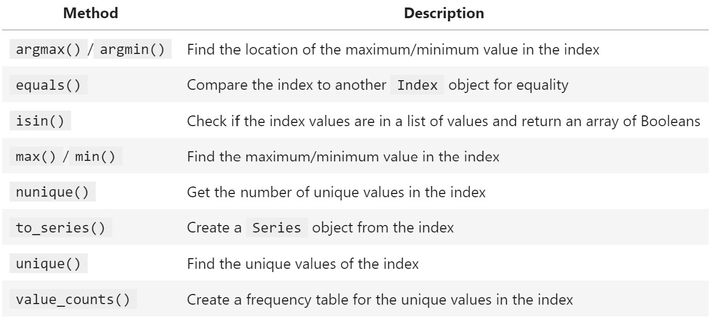


When we used `unique()` and
`value_counts()`, we got a preview of
how to select subsets of our data. Now, let\'s go into more detail and
cover selection, slicing, indexing, and filtering.

Grabbing subsets of the data
============================


So far, we have learned how to work with and summarize the data as a
whole; however, we will often be interested in
performing operations and/or analyses on subsets of our data. There are
many types of subsets we may look to isolate from our data, such as
selecting only specific columns or rows as a whole or when a specific
criterion is met. In order to obtain subsets of the data, we need to be
familiar with selection, slicing, indexing, and filtering.

For this section, we will work in the
`5-subsetting_data.ipynb` notebook. Our setup is as follows:

```
>>> import pandas as pd
>>> df = pd.read_csv('data/earthquakes.csv')
```


Selecting columns
-----------------

In the previous section, we saw an example of column selection when we
looked at the unique values in the
`alert` column; we accessed the column as an attribute of the
dataframe. Remember that a column is a `Series` object, so,
for example, selecting the `mag` column in the earthquake data
gives us the magnitudes of the earthquakes as a `Series`
object:

```
>>> df.mag
0       1.35
1       1.29
2       3.42
3       0.44
4       2.16
        ... 
9327    0.62
9328    1.00
9329    2.40
9330    1.10
9331    0.66
Name: mag, Length: 9332, dtype: float64
```


Pandas provides us with a few ways to select columns. An alternative to
using attribute notation to select a column is to access it with a
dictionary-like notation:

```
>>> df['mag']
0       1.35
1       1.29
2       3.42
3       0.44
4       2.16
        ... 
9327    0.62
9328    1.00
9329    2.40
9330    1.10
9331    0.66
Name: mag, Length: 9332, dtype: float64
```


**Tip:** 

We can also select columns using the `get()` method. This has
the benefits of not raising an error if the column doesn\'t exist and
allowing us to provide a backup value---the default is `None`.
For example, if we call `df.get('event', False)`, it will
return `False` since we don\'t have an `event`
column.

Note that we aren\'t limited to selecting one
column at a time. By passing a list to the dictionary lookup, we can
select many columns, giving us a `DataFrame` object that is a
subset of our original dataframe:

```
>>> df[['mag', 'title']]
```


This gives us the full `mag` and `title` columns
from the original dataframe:


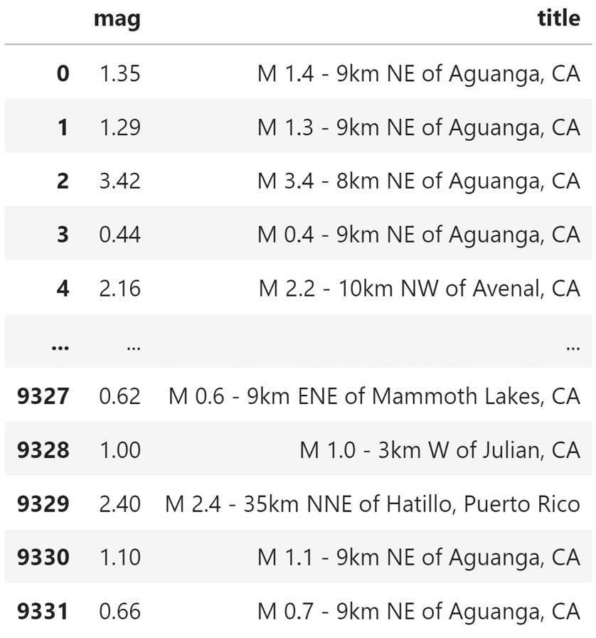


String methods are a very powerful way to select
columns. For example, if we wanted to select all the columns that start
with `mag`, along with the `title` and
`time` columns, we would do the following:

```
>>> df[
...     ['title', 'time'] 
...     + [col for col in df.columns if col.startswith('mag')]
... ]
```


We get back a dataframe composed of the four columns that matched our
criteria. Notice how the columns were returned in the order we
requested, which is not the order they originally appeared in. This
means that if we want to reorder our columns, all we have to do is
select them in the order we want them to appear:


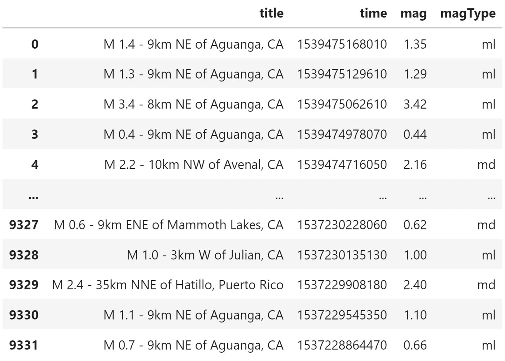


Let\'s break this example down. We used a list
comprehension to go through each of the columns in the dataframe and
only keep the ones whose names started with `mag`:

```
>>> [col for col in df.columns if col.startswith('mag')]
['mag', 'magType']
```


Then, we added this result to the other two columns we wanted to keep
(`title` and `time`):

```
>>> ['title', 'time'] \
... + [col for col in df.columns if col.startswith('mag')]
['title', 'time', 'mag', 'magType']
```


Finally, we were able to use this list to run the actual column
selection on the dataframe, resulting in the dataframe in *Figure 2.18*:

```
>>> df[
...     ['title', 'time'] 
...     + [col for col in df.columns if col.startswith('mag')]
... ]
```


**Tip:** 

A complete list of string methods can be found in
the Python 3 documentation at
<https://docs.python.org/3/library/stdtypes.html#string-methods>.


Slicing
-------

When we want to extract certain rows (slices) from
our dataframe, we use **slicing**. `DataFrame` slicing works
similarly to slicing with other Python objects, such
as lists and tuples, with the first index being
inclusive and the last index being exclusive:

```
>>> df[100:103]
```


When specifying a slice of `100:103`, we get back rows
`100`, `101`, and `102`:


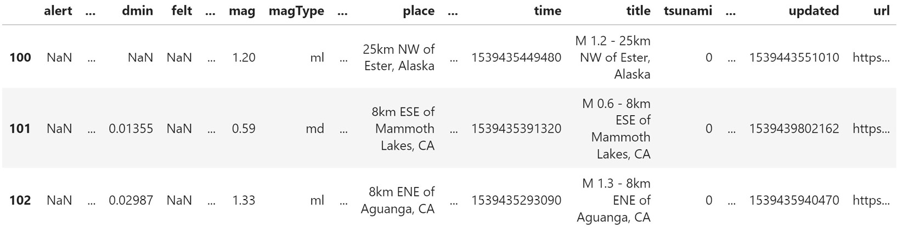


We can combine our row and column selections by
using what is known as **chaining**:

```
>>> df[['title', 'time']][100:103]
```


First, we selected the `title` and `time` columns
for all the rows, and then we pulled out rows with indices
`100`, `101`, and `102`:


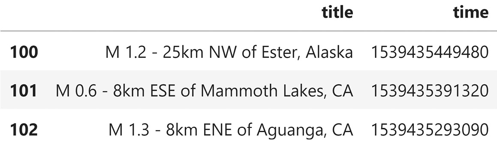


In the preceding example, we selected the columns and then sliced the
rows, but the order doesn\'t matter:

```
>>> df[100:103][['title', 'time']].equals(
...     df[['title', 'time']][100:103]
... )
True
```

If we decide to use chaining to update the values
in our data, we will find `pandas` complaining that we aren\'t
doing so correctly (even if it works). This is to warn us that setting
data with a sequential selection may not give us the result we
anticipate.

Let\'s trigger this warning to understand it better. We will try to
update the entries in the `title` column for a few earthquakes
so that they\'re in lowercase:

```
>>> df[110:113]['title'] = df[110:113]['title'].str.lower()
/.../book_env/lib/python3.7/[...]:1: SettingWithCopyWarning:  
A value is trying to be set on a copy of a slice from a DataFrame.
Try using .loc[row_indexer,col_indexer] = value instead
See the caveats in the documentation: https://pandas.pydata.org/pandas-docs/stable/user_guide/indexing.html#returning-a-view-versus-a-copy
  """Entry point for launching an IPython kernel.
```


As indicated by the warning, to be an effective
`pandas` user, it\'s not enough to know selection and
slicing---we must also master **indexing**. Since this is just a
warning, our values have been updated, but this may not always be the
case:

```
>>> df[110:113]['title']
110               m 1.1 - 35km s of ester, alaska
111    m 1.9 - 93km wnw of arctic village, alaska
112      m 0.9 - 20km wsw of smith valley, nevada
Name: title, dtype: object
```


Now, let\'s discuss how to use indexing to set values properly.


Indexing
--------

Pandas indexing operations provide us with a one-method way to select
both the rows and the columns we want. We can use
`loc[]` and `iloc[]` to subset our dataframe using
label-based or integer-based lookups, respectively. A good way to
remember the difference is to think of them as **loc**ation versus
**i**nteger **loc**ation. For all indexing methods, we provide the row
indexer first and then the column indexer, with a comma separating them:

```
df.loc[row_indexer, column_indexer]
```


Note that by using `loc[]`, as indicated in the warning
message, we no longer trigger any warnings from `pandas` for
this operation. We also changed the end index from `113` to
`112` because `loc[]` is inclusive of endpoints:

```
>>> df.loc[110:112, 'title'] = \
...     df.loc[110:112, 'title'].str.lower()
>>> df.loc[110:112, 'title']
110               m 1.1 - 35km s of ester, alaska
111    m 1.9 - 93km wnw of arctic village, alaska
112      m 0.9 - 20km wsw of smith valley, nevada
Name: title, dtype: object
```


We can select all the rows (columns) if we use
`:` as the row (column) indexer, just like with regular Python
slicing. Let\'s grab all the rows of the `title` column with
`loc[]`:

```
>>> df.loc[:,'title']
0                  M 1.4 - 9km NE of Aguanga, CA
1                  M 1.3 - 9km NE of Aguanga, CA
2                  M 3.4 - 8km NE of Aguanga, CA
3                  M 0.4 - 9km NE of Aguanga, CA
4                  M 2.2 - 10km NW of Avenal, CA
                          ...                   
9327        M 0.6 - 9km ENE of Mammoth Lakes, CA
9328                 M 1.0 - 3km W of Julian, CA
9329    M 2.4 - 35km NNE of Hatillo, Puerto Rico
9330               M 1.1 - 9km NE of Aguanga, CA
9331               M 0.7 - 9km NE of Aguanga, CA
Name: title, Length: 9332, dtype: object
```


We can select multiple rows and columns at the same time with
`loc[]`:

```
>>> df.loc[10:15, ['title', 'mag']]
```


This leaves us with rows `10` through `15` for the
`title` and `mag` columns only:


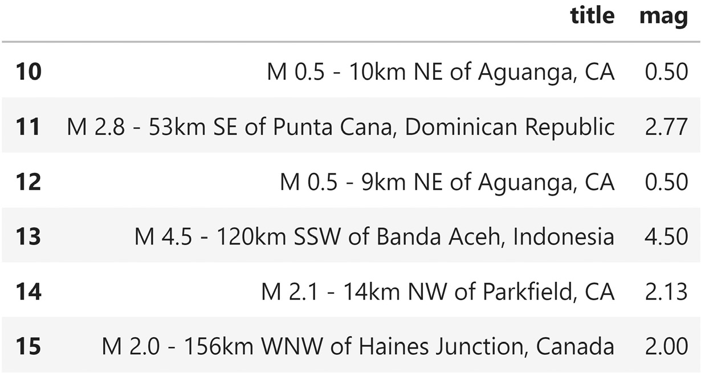


As we have seen, when using `loc[]`, our
end index is inclusive. This isn\'t the case with `iloc[]`:

```
>>> df.iloc[10:15, [19, 8]]
```


Observe how we had to provide a list of integers to select the same
columns; these are the column numbers (starting from `0`).
Using `iloc[]`, we lost the row at index `15`; this
is because the integer slicing that `iloc[]` employs is
exclusive of the end index, as with Python slicing syntax:


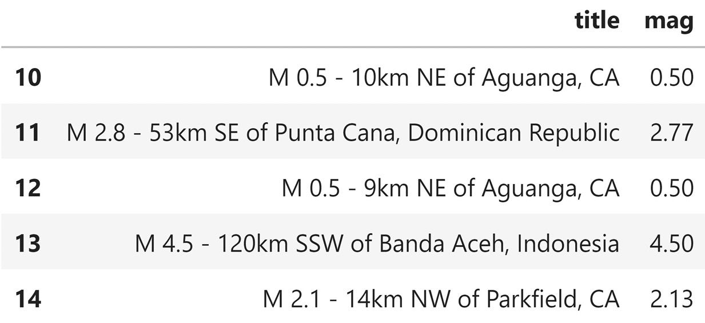


We aren\'t limited to using the slicing syntax for the rows, though;
columns work as well:

```
>>> df.iloc[10:15, 6:10]
```


By using slicing, we can easily grab adjacent rows and columns:


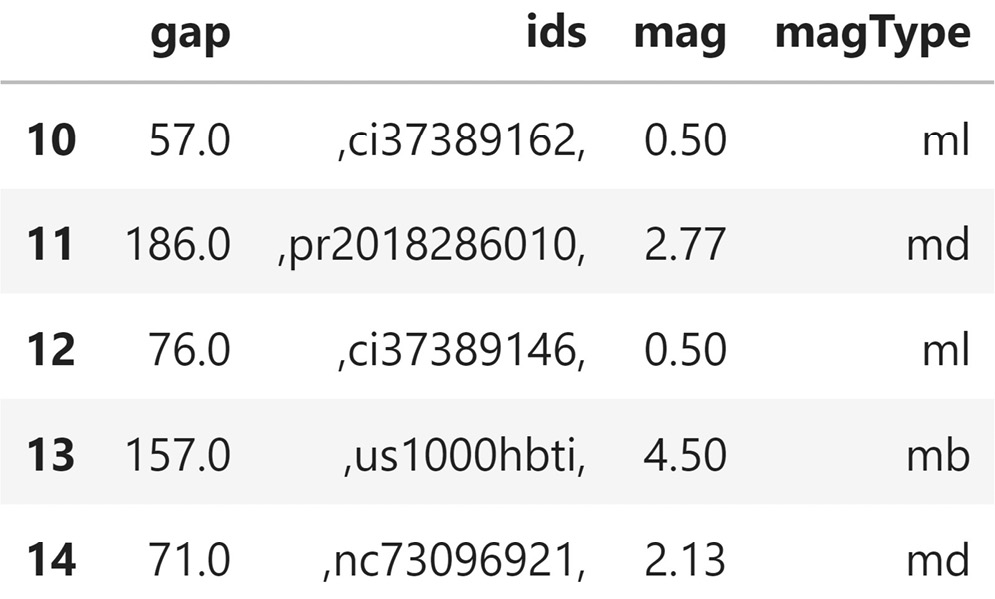


When using `loc[]`, this slicing can be done on the column
names as well. This gives us many ways to achieve the same result:

```
>>> df.iloc[10:15, 6:10].equals(df.loc[10:14, 'gap':'magType'])
True
```


To look up scalar values, we use `at[]`
and `iat[]`, which are faster. Let\'s select the magnitude
(the `mag` column) of the earthquake that was recorded in the
row at index `10`:

```
>>> df.at[10, 'mag']
0.5
```


The magnitude column has a column index of `8`; therefore, we
can also look up the magnitude with `iat[]`:

```
>>> df.iat[10, 8]
0.5
```


So far, we have seen how to get subsets of our data using row/column
names and ranges, but how do we only take the data that meets some
criteria? For this, we need to learn how to filter our data.


Filtering
---------

Pandas gives us a few options for filtering our
data, including **Boolean masks** and some special
methods. With Boolean masks, we test our data against some value and get
a structure of the same shape back, except it is filled with
`True`/`False` values; `pandas` can use
this to select the appropriate rows/columns for us. There are endless
possibilities for creating Boolean masks---all we need is some code that
returns one Boolean value for each row. For example, we can see which
entries in the `mag` column had a magnitude greater than two:

```
>>> df.mag > 2
0       False
1       False
2        True
3       False
        ...  
9328    False
9329     True
9330    False
9331    False
Name: mag, Length: 9332, dtype: bool
```


While we can run this on the entire dataframe, it
wouldn\'t be too useful with our earthquake data since we have columns
of various data types. However, we can use this strategy to get the
subset of the data where the magnitude of the earthquake was greater
than or equal to 7.0:

```
>>> df[df.mag >= 7.0]
```


Our resulting dataframe has just two rows:


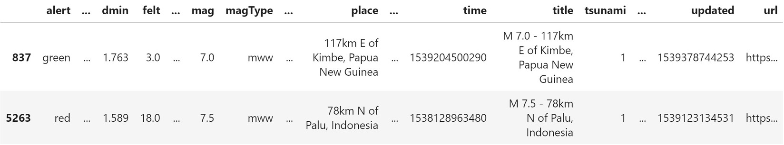


We got back a lot of columns we didn\'t need, though. We could have
chained a column selection to the end of the last
code snippet; however, `loc[]` can handle Boolean masks as
well:

```
>>> df.loc[
...     df.mag >= 7.0, 
...     ['alert', 'mag', 'magType', 'title', 'tsunami', 'type']
... ]
```


The following dataframe has been filtered so that it only contains
relevant columns:


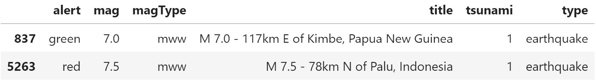


We aren\'t limited to just one criterion, either. Let\'s grab the
earthquakes with a red alert and a tsunami. To combine masks, we need to
surround each of our conditions with parentheses and
use the **bitwise AND operator** (`&`)
to require *both* to be true:

```
>>> df.loc[
...     (df.tsunami == 1) & (df.alert == 'red'), 
...     ['alert', 'mag', 'magType', 'title', 'tsunami', 'type']
... ]
```


There was only a single earthquake in the data that met our criteria:


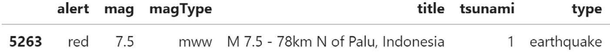


If, instead, we want *at least one* of our conditions
to be true, we can use the **bitwise OR operator**
(`|`):

```
>>> df.loc[
...     (df.tsunami == 1) | (df.alert == 'red'), 
...     ['alert', 'mag', 'magType', 'title', 'tsunami', 'type']
... ]
```


Notice that this filter is much less restrictive
since, while both conditions can be true, we only require that one of
them is:


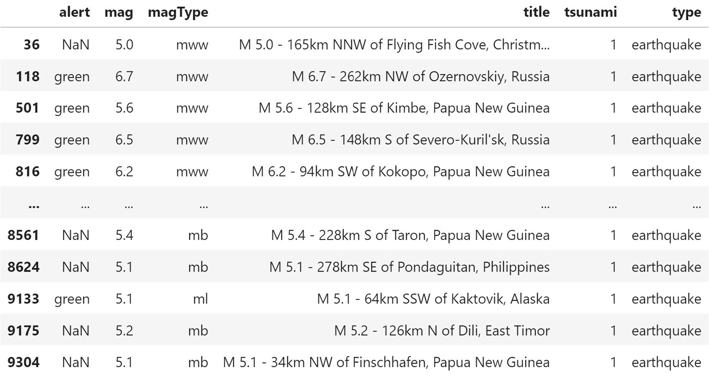


**Important note:**

When creating Boolean masks, we must use bitwise operators
(`&`, `|`, `~`) instead of logical
operators (`and`, `or`, `not`). A good way
to remember this is that we want a Boolean for each item in the series
we are testing rather than a single Boolean. For example, with the
earthquake data, if we want to select the rows where the magnitude is
greater than 1.5, then we want one Boolean value for each row,
indicating whether the row should be selected. In cases where we want a
single value for the data, perhaps to summarize it, we can use
`any()`/`all()` to condense a Boolean series into a
single Boolean value that can be used with logical operators.

In the previous two examples, our conditions
involved equality; however, we are by no means limited to this. Let\'s
select all the earthquakes in Alaska where we have a non-null value for
the `alert` column:

```
>>> df.loc[
...     (df.place.str.contains('Alaska')) 
...     & (df.alert.notnull()), 
...     ['alert', 'mag', 'magType', 'title', 'tsunami', 'type']
... ]
```


All the earthquakes in Alaska that have a value for `alert`
are `green`, and some were accompanied by tsunamis, with the
highest magnitude being 5.1:


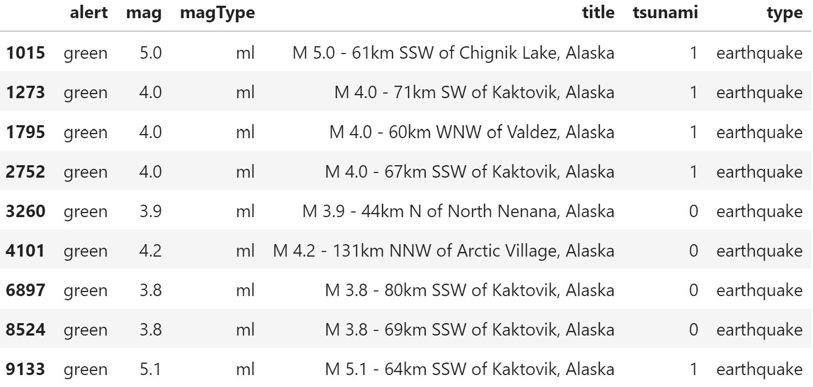


Let\'s break down how we got this. `Series` objects have some
string methods that can be accessed via the `str` attribute.
Using this, we can create a Boolean mask of all the rows where the
`place` column contained the word `Alaska`:

```
df.place.str.contains('Alaska')
```


To get all the rows where the `alert`
column was not null, we used the `Series` object\'s
`notnull()` method (this works for `DataFrame`
objects as well) to create a Boolean mask of all the rows where the
`alert` column was not null:

```
df.alert.notnull()
```


**Tip:** 

We can use the **bitwise negation operator**
(`~`), also called **NOT**, to negate
all the Boolean values, which makes all
`True` values `False` and vice versa. So,
`df.alert.notnull()` and `~df.alert.isnull()`are
equivalent.

Then, like we did previously, we combine the two conditions with the
`&` operator to complete our mask:

```
(df.place.str.contains('Alaska')) & (df.alert.notnull())
```


Note that we aren\'t limited to checking if each row contains text; we
can use regular expressions as well. **Regular expressions** (often
called *regex*, for short) are very powerful
because they allow us to define a search pattern
rather than the exact content we want to find. This means that we can do
things such as find all the words or digits in a string without having
to know what all the words or digits are beforehand (or go through one
character at a time). To do so, we simply pass in a string preceded by
an `r` character outside the quotes; this lets Python know it
is a **raw string**, which means that we can
include backslash (`\`) characters in the string without
Python thinking we are trying to escape the character immediately
following it (such as when we use `\n` to mean a new line
character instead of the letter `n`). This makes it perfect
for use with regular expressions. The `re` module in the
Python standard library (<https://docs.python.org/3/library/re.html>)
handles regular expression operations; however, `pandas` lets
us use regular expressions directly.

Using a regular expression, let\'s select all the earthquakes in
California that have magnitudes of at least 3.8. We need to select
entries in the `place` column that end in `CA` or
`California` because the data isn\'t consistent (we will look
at how to fix this in the next section). The `$` character
means *end* and `'CA$'` gives us entries that end in
`CA`, so we can use `'CA|California$'` to get
entries that end in either:

```
>>> df.loc[
...     (df.place.str.contains(r'CA|California$'))
...     & (df.mag > 3.8),         
...     ['alert', 'mag', 'magType', 'title', 'tsunami', 'type']
... ]
```


There were only two earthquakes in California with
magnitudes greater than 3.8 during the time period we are studying:


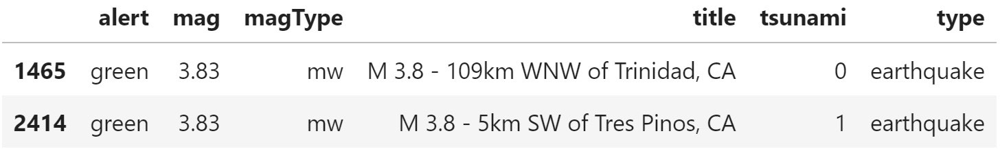


**Tip:** 

Regular expressions are extremely powerful, but unfortunately, also
difficult to get right. It is often helpful to grab some sample lines
for parsing and use a website to test them. Note that regular
expressions come in many flavors, so be sure to select Python. This
website supports Python flavor regular expressions, and also provides a
nice cheat sheet on the side: https://regex101.com/.

What if we want to get all earthquakes with magnitudes between 6.5 and
7.5? We could use two Boolean masks---one to check for magnitudes
greater than or equal to 6.5, and another to check for magnitudes less
than or equal to 7.5---and then combine them with the `&`
operator. Thankfully, `pandas` makes this type of mask much
easier to create by providing us with the `between()` method:

```
>>> df.loc[
...     df.mag.between(6.5, 7.5), 
...     ['alert', 'mag', 'magType', 'title', 'tsunami', 'type']
... ]
```


The result contains all the earthquakes with magnitudes in the range
\[6.5, 7.5\]---it\'s inclusive of both ends by default, but we can pass
in `inclusive=False` to change this:


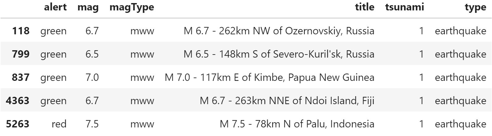


We can use the `isin()` method to create a Boolean mask for
values that match one of a list of values. This means that we don\'t
have to write one mask for each of the values that we could
match and then use `|` to join them.
Let\'s utilize this to filter on the `magType` column, which
indicates the measurement technique that was used to quantify the
earthquake\'s magnitude. We will take a look at earthquakes measured
with either the `mw` or `mwb` magnitude type:

```
>>> df.loc[
...     df.magType.isin(['mw', 'mwb']), 
...     ['alert', 'mag', 'magType', 'title', 'tsunami', 'type']
... ]
```


We have two earthquakes that were measured with the `mwb`
magnitude type and four that were measured with the `mw`
magnitude type:


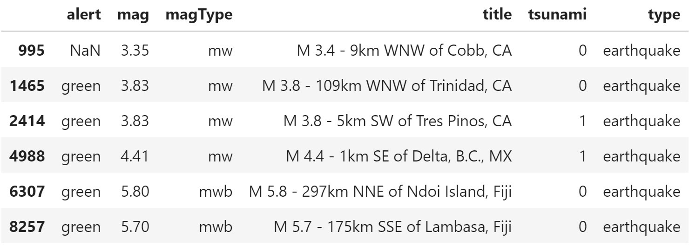


So far, we have been filtering on specific values, but suppose we wanted
to see all the data for the lowest-magnitude and highest-magnitude
earthquakes. Rather than finding the minimum and
maximum of the `mag` column first and then creating a Boolean
mask, we can ask `pandas` to give us the index where these
values occur, and easily filter to grab the full rows. We can use
`idxmin()` and `idxmax()` for the indices of the
minimum and maximum, respectively. Let\'s grab the row numbers for the
lowest-magnitude and highest-magnitude earthquakes:

```
>>> [df.mag.idxmin(), df.mag.idxmax()]
[2409, 5263]
```


We can use these indices to grab the rows themselves:

```
>>> df.loc[
...     [df.mag.idxmin(), df.mag.idxmax()], 
...     ['alert', 'mag', 'magType', 'title', 'tsunami', 'type']
... ]
```


The minimum magnitude earthquake occurred in Alaska and the highest
magnitude earthquake occurred in Indonesia, accompanied by a tsunami:

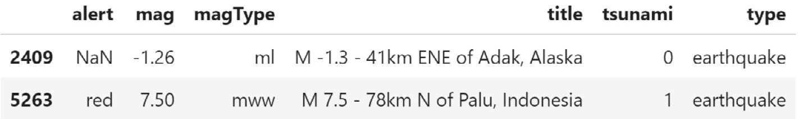


Adding and removing data
========================

Before we begin adding and removing data, it\'s important to understand
that while most methods will return a new `DataFrame` object,
some will be in-place and change our data. If we write a function where
we pass in a dataframe and change it, it will change our original
dataframe as well. Should we find ourselves in a situation where we
don\'t want to change the original data, but rather want to return a new
copy of the data that has been modified, we must be sure to copy our
dataframe before making any changes:

```
df_to_modify = df.copy()
```


**Important note:**

By default, `df.copy()` makes a **deep copy** of the
dataframe, which allows us to make changes to
either the copy or the original without
repercussions. If we pass in `deep=False`, we can obtain a
**shallow copy**---changes to the shallow copy affect the original and
vice versa. We will almost always want the deep copy, since we can
change it without affecting the original.


Now, let\'s turn to the final notebook,
`6-adding_and_removing_data.ipynb`, and get set up for the
remainder of this lab. We will once again be
working with the earthquake data, but this time, we will only read in a
subset of the columns:

```
>>> import pandas as pd
>>> df = pd.read_csv(
...     'data/earthquakes.csv', 
...     usecols=[
...         'time', 'title', 'place', 'magType', 
...         'mag', 'alert', 'tsunami'
...     ]
... )
```


Creating new data
-----------------

Creating new columns can be achieved in the same fashion as variable
assignment. For example, we can create a column to
indicate the source of our data; since all our data came from the same
source, we can take advantage of **broadcasting** to set every row of
this column to the same value:

```
>>> df['source'] = 'USGS API'
>>> df.head()
```


The new column is created to the right of the original columns, with a
value of `USGS API` for every row:


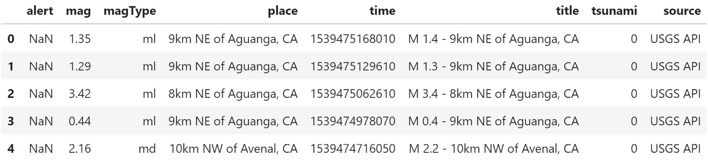


**Important note:**

We cannot create the column with attribute notation
(`df.source`) because the dataframe doesn\'t have that
attribute yet, so we must use dictionary notation
(`df['source']`).

We aren\'t limited to broadcasting one value to the entire column; we
can have the column hold the result of Boolean
logic or a mathematical equation. For example, if we had data on
distance and time, we could create a speed column that is the result of
dividing the distance column by the time column. With our earthquake
data, let\'s create a column that tells us whether the earthquake\'s
magnitude was negative:

```
>>> df['mag_negative'] = df.mag < 0
>>> df.head()
```


Note that the new column has been added to the right:


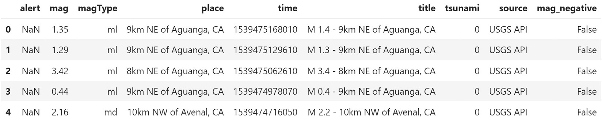


In the previous section, we saw that the `place` column has
some data consistency issues---we have multiple names for the same
entity. In some cases, earthquakes occurring in California are marked as
`CA` and as `California` in others. Needless to say,
this is confusing and can easily cause issues for us if we don\'t
carefully inspect our data beforehand. For example, by just selecting
`CA`, we miss out on 124 earthquakes marked as
`California`. This isn\'t the only place
with an issue either (`Nevada` and `NV` are also
both present). By using a regular expression to extract everything in
the `place` column after the comma, we can see some of the
issues firsthand:

```
>>> df.place.str.extract(r', (.*$)')[0].sort_values().unique()
array(['Afghanistan', 'Alaska', 'Argentina', 'Arizona',
       'Arkansas', 'Australia', 'Azerbaijan', 'B.C., MX',
       'Barbuda', 'Bolivia', ..., 'CA', 'California', 'Canada',
       'Chile', ..., 'East Timor', 'Ecuador', 'Ecuador region',
       ..., 'Mexico', 'Missouri', 'Montana', 'NV', 'Nevada', 
       ..., 'Yemen', nan], dtype=object)
```


If we want to treat countries and anything near them as a single entity,
we have some additional work to do (see `Ecuador` and
`Ecuador region`). In addition, our naive attempt at parsing
the location by looking at the information after the comma appears to
have failed; this is because, in some cases, we don\'t have a comma. We
will need to change our approach to parsing.

This is an **entity recognition problem**, and it\'s not trivial to
solve. With a relatively small list of unique
values (which we can view with `df.place.unique()`), we can
simply look through and infer how to properly match up these names.
Then, we can use the `replace()` method to replace patterns in
the `place` column as we see fit:

```
>>> df['parsed_place'] = df.place.str.replace(
...     r'.* of ', '', regex=True # remove <x> of <x> 
... ).str.replace(
...     'the ', '' # remove "the "
... ).str.replace(
...     r'CA$', 'California', regex=True # fix California
... ).str.replace(
...     r'NV$', 'Nevada', regex=True # fix Nevada
... ).str.replace(
...     r'MX$', 'Mexico', regex=True # fix Mexico
... ).str.replace(
...     r' region$', '', regex=True # fix " region" endings
... ).str.replace(
...     'northern ', '' # remove "northern "
... ).str.replace(
...     'Fiji Islands', 'Fiji' # line up the Fiji places
... ).str.replace( # remove anything else extraneous from start 
...     r'^.*, ', '', regex=True 
... ).str.strip() # remove any extra spaces
```


Now, we can check the parsed places we are left
with. Notice that there is arguably still more to fix here with
`South Georgia and South Sandwich Islands` and
`South Sandwich Islands`. We could address this with another
call to `replace()`; however, this goes to show that entity
recognition can be quite challenging:

```
>>> df.parsed_place.sort_values().unique()
array([..., 'California', 'Canada', 'Carlsberg Ridge', ...,
       'Dominican Republic', 'East Timor', 'Ecuador',
       'El Salvador', 'Fiji', 'Greece', ...,
       'Mexico', 'Mid-Indian Ridge', 'Missouri', 'Montana',
       'Nevada', 'New Caledonia', ...,
       'South Georgia and South Sandwich Islands', 
       'South Sandwich Islands', ..., 'Yemen'], dtype=object)
```

Pandas also provides us with a way to make many
new columns at once in one method call. With the `assign()`
method, the arguments are the names of the columns we want to create (or
overwrite), and the values are the data for the columns. Let\'s create
two new columns; one will tell us if the earthquake happened in
California, and the other will tell us if it happened in Alaska. Rather
than just show the first five entries (which are all in California), we
will use `sample()` to randomly select five rows:

```
>>> df.assign(
...     in_ca=df.parsed_place.str.endswith('California'), 
...     in_alaska=df.parsed_place.str.endswith('Alaska')
... ).sample(5, random_state=0)
```


Note that `assign()` doesn\'t change our original dataframe;
instead, it returns a new `DataFrame` object with these
columns added. If we want to replace our original dataframe with this,
we just use variable assignment to store the result of
`assign()` in `df` (for example,
`df = df.assign(...)`):


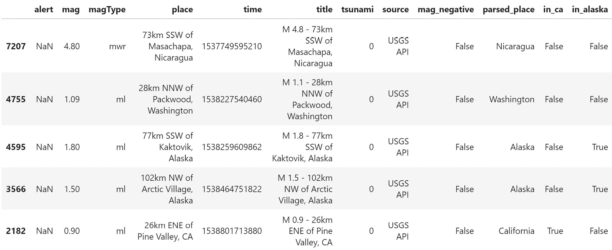


The `assign()` method also accepts
**lambda functions** (anonymous functions usually defined in one line
and for single use); `assign()` will pass the dataframe into
the `lambda` function as `x`, and we can work from
there. This makes it possible for us to use the
columns we are creating in `assign()` to calculate others. For
example, let\'s once again create the `in_ca` and
`in_alaska` columns, but this time also create a new column,
`neither`, which is `True` if both `in_ca`
and `in_alaska` are `False`:

```
>>> df.assign(
...     in_ca=df.parsed_place == 'California', 
...     in_alaska=df.parsed_place == 'Alaska',
...     neither=lambda x: ~x.in_ca & ~x.in_alaska
... ).sample(5, random_state=0)
```


Remember that `~` is the bitwise negation operator, so this
allows us to create a column with the result of
`NOT in_ca AND NOT in_alaska` per row:


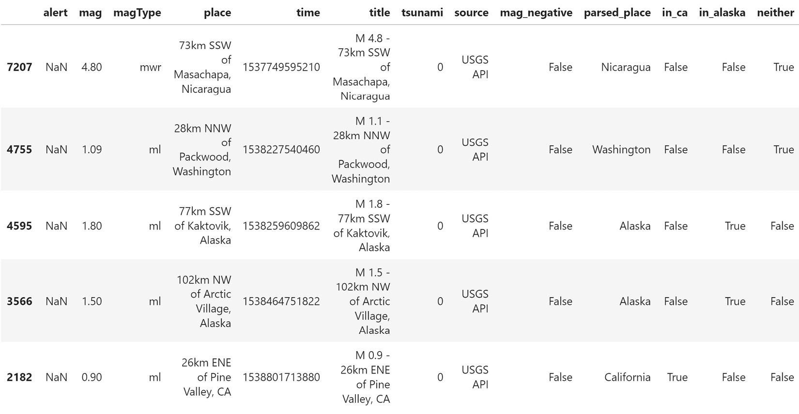


Now that we have seen how to add new columns,
let\'s take a look at adding new rows. Say we were working with two
separate dataframes; one with earthquakes accompanied by tsunamis and
the other with earthquakes without tsunamis:

```
>>> tsunami = df[df.tsunami == 1]
>>> no_tsunami = df[df.tsunami == 0]
>>> tsunami.shape, no_tsunami.shape
((61, 10), (9271, 10))
```


If we wanted to look at earthquakes as a whole, we would want to
concatenate the dataframes into a single one. To append rows to the
bottom of our dataframe, we can either use `pd.concat()` or
the `append()` method of the dataframe itself. The
`concat()` function allows us to specify the axis that the
operation will be performed along---`0` for appending rows to
the bottom of the dataframe, and `1` for appending to the
right of the last column with respect to the leftmost `pandas`
object in the concatenation list. Let\'s use `pd.concat()`
with the default `axis` of `0` for rows:

```
>>> pd.concat([tsunami, no_tsunami]).shape
(9332, 10) # 61 rows + 9271 rows
```


Note that the previous result is equivalent to running the
`append()` method on the dataframe. This still returns a new
`DataFrame` object, but it saves us from having to remember
which axis is which, since `append()` is actually a wrapper
around the `concat()` function:

```
>>> tsunami.append(no_tsunami).shape
(9332, 10) # 61 rows + 9271 rows
```


So far, we have been working with a subset of the
columns from the CSV file, but suppose that we now want to work with
some of the columns we ignored when we read in the data. Since we have
added new columns in this notebook, we won\'t want to read in the file
and perform those operations again. Instead, we will concatenate along
the columns (`axis=1`) to add back what we are missing:

```
>>> additional_columns = pd.read_csv(
...     'data/earthquakes.csv', usecols=['tz', 'felt', 'ids']
... )
>>> pd.concat([df.head(2), additional_columns.head(2)], axis=1)
```


Since the indices of the dataframes align, the additional columns are
placed to the right of our original columns:


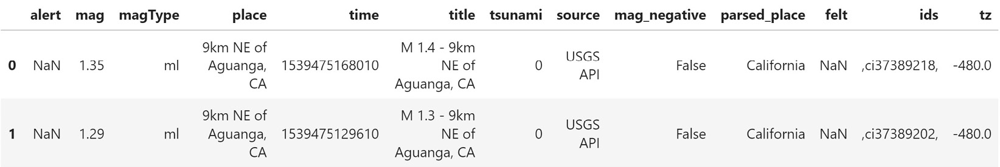


The `concat()` function uses the index to determine how to
concatenate the values. If they don\'t align, this will generate
additional rows because `pandas` won\'t know how to align
them. Say we forgot that our original dataframe
had the row numbers as the index, and we read in the additional columns
by setting the `time` column as the index:

```
>>> additional_columns = pd.read_csv(
...     'data/earthquakes.csv',
...     usecols=['tz', 'felt', 'ids', 'time'], 
...     index_col='time'
... )
>>> pd.concat([df.head(2), additional_columns.head(2)], axis=1)
```


Despite the additional columns containing data for the first two rows,
`pandas` creates a new row for them because the index doesn\'t
match. In the next lab, *Data Wrangling with Pandas*, we will see how to reset the index and set the
index, both of which could resolve this issue:


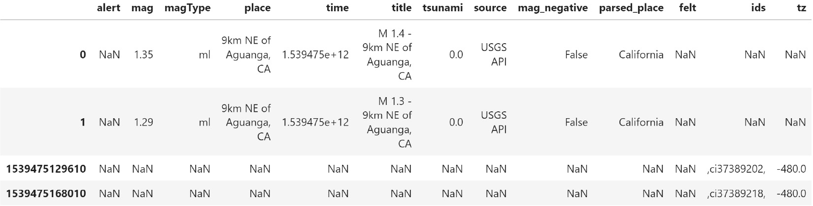


Say we want to concatenate the `tsunami` and
`no_tsunami` dataframes, but the `no_tsunami`
dataframe has an additional column (suppose we added a new column to it
called `type`). The `join` parameter
specifies how to handle any overlap in column
names (when appending to the bottom) or in row names (when concatenating
to the right). By default, this is `outer`, so we keep
everything; however, if we use `inner`, we will only keep what
they have in common:

```
>>> pd.concat(
...     [
...         tsunami.head(2),
...         no_tsunami.head(2).assign(type='earthquake')
...     ], 
...     join='inner'
... )
```


Notice that the `type` column from the `no_tsunami`
dataframe doesn\'t show up because it wasn\'t present in the
`tsunami` dataframe. Take a look at the index, though; these
were the row numbers from the original dataframe before we divided it
into `tsunami` and `no_tsunami`:


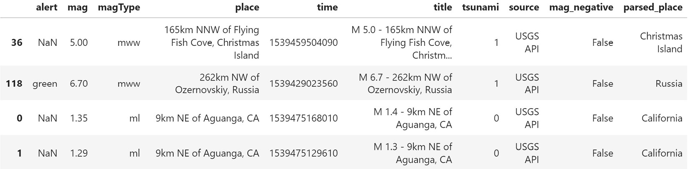


If the index is not meaningful, we can also pass in
`ignore_index` to get sequential values in the index:

```
>>> pd.concat(
...     [
...         tsunami.head(2), 
...         no_tsunami.head(2).assign(type='earthquake')
...     ],
...     join='inner', ignore_index=True
... )
```


The index is now sequential, and the row numbers
no longer match the original dataframe:


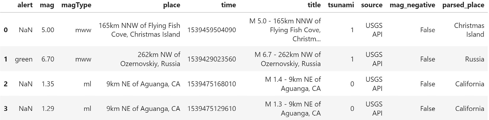


Be sure to consult the `pandas` documentation for more
information on the `concat()` function and other operations
for combining data, which we will discuss in *Lab 4*, *Aggregating
Pandas DataFrames*:
http://pandas.pydata.org/pandas-docs/stable/user\_guide/merging.html\#concatenating-objects.


Deleting unwanted data
----------------------

After adding that data to our dataframe, we can
see the need to delete unwanted data. We need a way to undo our mistakes
and get rid of data that we aren\'t going to use. Like adding data, we
can use dictionary syntax to delete unwanted columns, just as we would
when removing keys from a dictionary. Both
`del df['<column_name>']` and
`df.pop('<column_name>')` will work, provided that there is
indeed a column with that name; otherwise, we will get a
`KeyError`. The difference here is that while `del`
removes it right away, `pop()` will return the column that we
are removing. Remember that both of these operations will change our
original dataframe, so use them with care.

Let\'s use dictionary notation to delete the
`source` column. Notice that it no longer appears in the
result of `df.columns`:

```
>>> del df['source']
>>> df.columns
Index(['alert', 'mag', 'magType', 'place', 'time', 'title', 
       'tsunami', 'mag_negative', 'parsed_place'],
      dtype='object')
```


Note that if we aren\'t sure whether the column exists, we should put
our column deletion code in a `try...except` block:

```
try:
    del df['source']
except KeyError:
    pass # handle the error here
```


Earlier, we created the `mag_negative` column for filtering
our dataframe; however, we no longer want this column as part of our
dataframe. We can use `pop()` to grab the series for the
`mag_negative` column, which we can use as a Boolean mask
later without having it in our dataframe:

```
>>> mag_negative = df.pop('mag_negative')
>>> df.columns
Index(['alert', 'mag', 'magType', 'place', 'time', 'title', 
       'tsunami', 'parsed_place'],
      dtype='object')
```


We now have a Boolean mask in the `mag_negative` variable that
used to be a column in `df`:

```
>>> mag_negative.value_counts()
False    8841
True      491
Name: mag_negative, dtype: int64
```


Since we used `pop()` to remove the
`mag_negative` series rather than deleting it, we can still
use it to filter our dataframe:

```
>>> df[mag_negative].head()
```


This leaves us with the earthquakes that had negative magnitudes. Since
we also called `head()`, we get back the first five such
earthquakes:


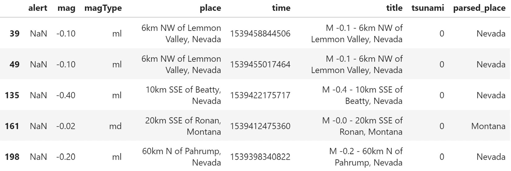


`DataFrame` objects have a `drop()` method for
removing multiple rows or columns either in-place (overwriting the
original dataframe without having to reassign it) or returning a new
`DataFrame` object. To remove rows, we pass the list of
indices. Let\'s remove the first two rows:

```
>>> df.drop([0, 1]).head(2)
```


Notice that the index starts at `2` because we dropped
`0` and `1`:


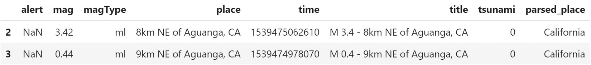


By default, `drop()` assumes that we want to delete rows
(`axis=0`). If we want to drop columns, we can
either pass `axis=1` or specify our list
of column names using the `columns` argument. Let\'s delete
some more columns:

```
>>> cols_to_drop = [
...     col for col in df.columns
...     if col not in [
...         'alert', 'mag', 'title', 'time', 'tsunami'
...     ]
... ]
>>> df.drop(columns=cols_to_drop).head()
```


This drops all the columns that aren\'t in the list we wanted to keep:


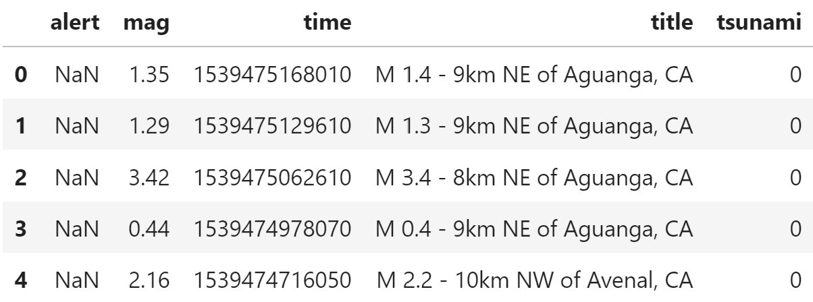


Whether we decide to pass `axis=1` to `drop()` or
use the `columns` argument, our result will be equivalent:

```
>>> df.drop(columns=cols_to_drop).equals(
...     df.drop(cols_to_drop, axis=1)
... )
True
```


By default, `drop()` will return a new `DataFrame`
object; however, if we really want to remove the data from our original
dataframe, we can pass in `inplace=True`, which will save us
from having to reassign the result back to our dataframe. The result is
the same as in *Figure 2.43*:

```
>>> df.drop(columns=cols_to_drop, inplace=True)
>>> df.head()
```


Always be careful with in-place operations. In
some cases, it may be possible to undo them; however, in others, it may
require starting over from the beginning and recreating the dataframe.

Summary
=======


In this lab, we learned how to use `pandas` for the data
collection portion of data analysis and to describe our data with
statistics, which will be helpful when we get to the drawing conclusions
phase. We learned the main data structures of the `pandas`
library, along with some of the operations we can perform on them. Next,
we learned how to create `DataFrame` objects from a variety of
sources, including flat files and API requests. Using earthquake data,
we discussed how to summarize our data and calculate statistics from it.
Subsequently, we addressed how to take subsets of data via selection,
slicing, indexing, and filtering. Finally, we practiced adding and
removing both columns and rows from our dataframe.

Exercises
=========

Using the `data/parsed.csv` file and the material from this
lab, complete the following exercises to practice your
`pandas` skills:

1.  Find the 95[th]{.superscript} percentile of earthquake magnitude in
    Japan using the `mb` magnitude type.
2.  Find the percentage of earthquakes in Indonesia that were coupled
    with tsunamis.
3.  Calculate summary statistics for earthquakes in Nevada.
4.  Add a column indicating whether the earthquake happened in a country
    or US state that is on the Ring of Fire. Use Alaska, Antarctica
    (look for Antarctic), Bolivia, California, Canada, Chile, Costa
    Rica, Ecuador, Fiji, Guatemala, Indonesia, Japan, Kermadec Islands,
    Mexico (be careful not to select New Mexico), New Zealand, Peru,
    Philippines, Russia, Taiwan, Tonga, and Washington.
5.  Calculate the number of earthquakes in the Ring of Fire locations
    and the number outside of them.
6.  Find the tsunami count along the Ring of Fire.
