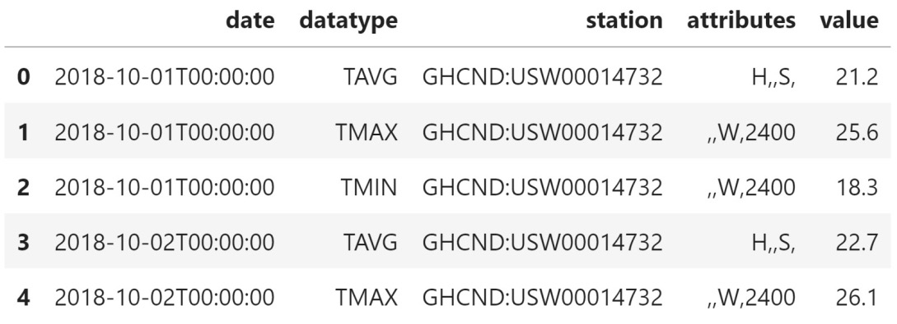
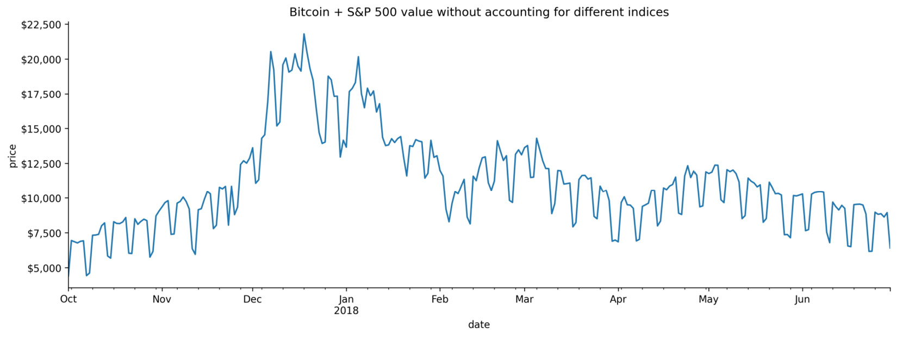
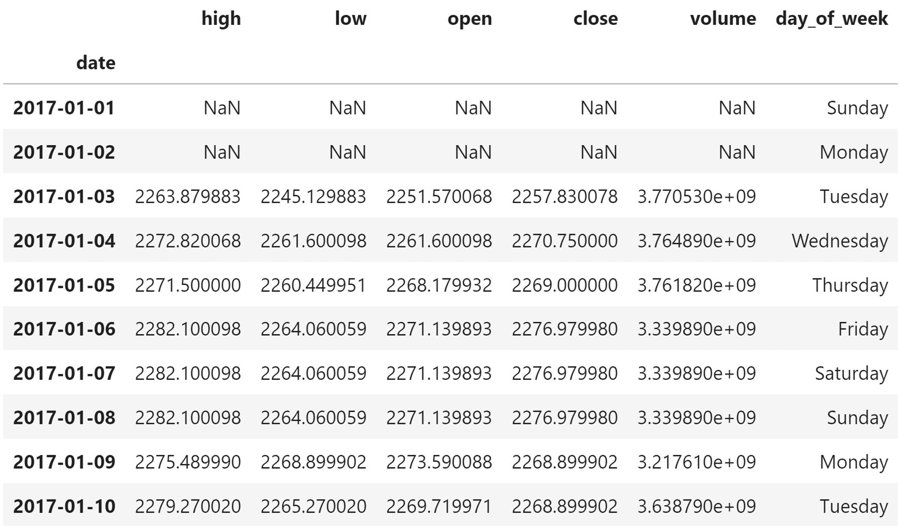

Lab 8: Data Wrangling with Pandas
====================================


In the previous lab, we learned about the main `pandas`
data structures, how to create `DataFrame` objects with our
collected data, and various ways to inspect, summarize, filter, select,
and work with `DataFrame` objects. Now that we are well versed
in the initial data collection and inspection stage, we can begin our
foray into the world of data wrangling.

In this lab, we will cover the following topics:

-   Understanding data wrangling
-   Exploring an API to find and collect temperature data
-   Cleaning data
-   Reshaping data
-   Handling duplicate, missing, or invalid data


#### Pre-reqs:
- Google Chrome (Recommended)

#### Lab Environment
Notebooks are ready to run. All packages have been installed. There is no requirement for any setup.

All examples are present in `~/work/machine-learning-essentials-module1/lab_08` folder. 

Lab materials
=================

There are five notebooks that we will work through, each numbered
according to when they will be used, and two directories,
`data/` and `exercises/`, which contain all the CSV
files necessary for the aforementioned notebooks and end-of-lab
exercises, respectively. The following files are in the
`data/` directory:


We will begin in the `1-wide_vs_long.ipynb` notebook by
discussing wide versus long format data. Then, we will collect daily
temperature data from the NCEI API, which can be found at
<https://www.ncdc.noaa.gov/cdo-web/webservices/v2>, in the
`2-using_the_weather_api.ipynb` notebook. The
documentation for the **Global Historical
Climatology Network -- Daily** (**GHCND**) dataset we will be using can
be found at
<https://www1.ncdc.noaa.gov/pub/data/cdo/documentation/GHCND_documentation.pdf>.

In the `3-cleaning_data.ipynb` notebook, we will learn how to
perform an initial round of cleaning on the temperature data and some
financial data, which was collected using the `stock_analysis`
package that we will build in *Lab 12*. Afterward, we will
walk through ways to reshape our data in the
`4-reshaping_data.ipynb` notebook. Finally, in the
`5-handling_data_issues.ipynb` notebook, we will learn about
some strategies for dealing with duplicate, missing, or invalid data
using some dirty data that can be found in
`data/dirty_data.csv`. The text will indicate when it\'s time
to switch between notebooks.


Data transformation
-------------------

Most data we will find is either **wide format**
or **long format**; each of these formats has its
merits, and it\'s important to know which one we will need for our
analysis. Often, people will record and present data in wide format, but
there are certain visualizations that require the data to be in long
format:


Now, let\'s navigate to the `1-wide_vs_long.ipynb` notebook to
see some examples. First, we will import `pandas` and
`matplotlib` and read in the
CSV files containing wide and long format data:

```
>>> import matplotlib.pyplot as plt
>>> import pandas as pd
>>> wide_df = \
...     pd.read_csv('data/wide_data.csv', parse_dates=['date'])
>>> long_df = pd.read_csv(
...     'data/long_data.csv', 
...     usecols=['date', 'datatype', 'value'], 
...     parse_dates=['date']
... )[['date', 'datatype', 'value']] # sort columns
```


### The wide data format

With wide format data, we represent measurements of variables with their
own columns, and each row represents an
observation of those variables. This makes it easy
for us to compare variables across observations, get summary statistics,
perform operations, and present our data; however, some visualizations
don\'t work with this data format because they may rely on the long
format to split, size, and/or color the plot content.

Let\'s look at the top six observations from the wide format data in
`wide_df`:

```
>>> wide_df.head(6)
```


Each column contains the top six observations of a specific class of
temperature data in degrees Celsius---maximum temperature (**TMAX**),
minimum temperature (**TMIN**), and temperature at the time of
observation (**TOBS**)---at a daily frequency:


When working with wide format data, we can easily grab summary
statistics on this data by using the `describe()` method. Note
that while older versions of `pandas` treated
`datetimes` as categorical, `pandas` is moving
toward treating them as numeric, so we pass
`datetime_is_numeric=True` to suppress the warning:

```
>>> wide_df.describe(include='all', datetime_is_numeric=True)
```


With hardly any effort on our part, we get summary statistics for the
dates, maximum temperature, minimum temperature, and temperature at the
time of observation:


As we discussed previously, the summary data in
the preceding table is easy to obtain and is
informative. This format can easily be plotted with `pandas`
as well, provided we tell it exactly what we want to plot:

```
>>> wide_df.plot(
...     x='date', y=['TMAX', 'TMIN', 'TOBS'], figsize=(15, 5),
...     title='Temperature in NYC in October 2018' 
... ).set_ylabel('Temperature in Celsius')
>>> plt.show()
```


Pandas plots the daily maximum temperature, minimum temperature, and
temperature at the time of observation as their own lines on a single
line plot:


### The long data format

Long format data will have a row for each
observation of a variable; this means that, if we
have three variables being measured daily, we will have three rows for
each day we record observations. The long format setup can be achieved
by turning the variable column names into a single column, where the
data is the variable name, and putting their values in a separate
column.

We can look at the top six rows of the long format data in
`long_df` to see the difference between wide format and long
format data:

```
>>> long_df.head(6)
```


Notice that we now have three entries for each date, and the
**datatype** column tells us what the data in the **value** column is
for that row:


If we try to get summary statistics, like we did
with the wide format data, the result isn\'t as
helpful:

```
>>> long_df.describe(include='all', datetime_is_numeric=True)
```


The **value** column shows us summary statistics, but this is
summarizing the daily maximum temperatures, minimum temperatures, and
temperatures at the time of observation. The maximum will be the maximum
of the daily maximum temperatures and the minimum will be the minimum of
the daily minimum temperatures. This means that this summary data is not
very helpful:


This format is not very easy to digest and certainly shouldn\'t be how
we present data; however, it makes it easy to
create visualizations where our plotting library
can color lines by the name of the variable, size the points by the
values of a certain variable, and perform splits for faceting. Pandas
expects its data for plotting to be in wide format, so, to easily make
the same plot that we did with the wide format data, we must use another
plotting library, called `seaborn`:

```
>>> import seaborn as sns
>>> sns.set(rc={'figure.figsize': (15, 5)}, style='white')
>>> ax = sns.lineplot(
...     data=long_df, x='date', y='value', hue='datatype'
... )
>>> ax.set_ylabel('Temperature in Celsius')
>>> ax.set_title('Temperature in NYC in October 2018')
>>> plt.show()
```


Seaborn can subset based on the `datatype` column to give us
individual lines for the daily maximum temperature, minimum temperature,
and temperature at the time of observation:


Seaborn lets us specify the column to use for
`hue`, which colored the lines in
*Figure 3.8* by the temperature type. We aren\'t limited to this,
though; with long format data, we can easily facet our plots:

```
>>> sns.set(
...     rc={'figure.figsize': (20, 10)},
...     style='white', font_scale=2 
... )
>>> g = sns.FacetGrid(long_df, col='datatype', height=10)
>>> g = g.map(plt.plot, 'date', 'value')
>>> g.set_titles(size=25)
>>> g.set_xticklabels(rotation=45)
>>> plt.show()
```


Seaborn can use long format data to create subplots for each distinct
value in the `datatype` column:


Exploring an API to find and collect temperature data
=====================================================


In lab 7, *Working with Pandas DataFrames*, we worked on data collection and how
to perform an initial inspection
and filtering of the data; this
usually gives us ideas of things that need to be
addressed before we move further in our analysis. Since this lab
builds on those skills, we will get to practice some of them here as
well. To begin, we will start by exploring the weather API that\'s
provided by the NCEI. Then, in the next section, we will learn about
data wrangling using temperature data that was previously obtained from
this API.

**Important note:**

To use the NCEI API, you will have to request a token by filling out
this form with your email address:
<https://www.ncdc.noaa.gov/cdo-web/token>.

For this section, we will be working in the
`2-using_the_weather_api.ipynb` notebook to
request temperature data from the NCEI API. We can use the `requests` library to
interact with APIs. In the following code block,
we import the `requests` library and
create a convenience function for making the requests to a specific
endpoint, sending our token along. To use this function, we need to
provide a token, as indicated in bold:

```
>>> import requests
>>> def make_request(endpoint, payload=None):
...     """
...     Make a request to a specific endpoint on the 
...     weather API passing headers and optional payload.
...     Parameters:
...         - endpoint: The endpoint of the API you want to 
...                     make a GET request to.
...         - payload: A dictionary of data to pass along 
...                    with the request.
...     
...     Returns:
...         A response object.
...     """
...     return requests.get(
...         'https://www.ncdc.noaa.gov/cdo-web/'
...         f'api/v2/{endpoint}',
...         headers={'token': 'PASTE_YOUR_TOKEN_HERE'},
...         params=payload
...     )
```


**Tip:** 

This function is making use of **f-strings**,
which were introduced in Python 3.6; they improve code readability and
reduce verbosity compared to using the `format()` method:
`'api/v2/{}'.format(endpoint)`.

To use the `make_request()` function, we need to learn how to
form our request. The NCEI has a helpful getting
started page
(<https://www.ncdc.noaa.gov/cdo-web/webservices/v2#gettingStarted>) that
shows us how to form requests; we can
progress through the tabs on the page to figure
out what filters we want on our query. The `requests` library
takes care of turning our dictionary of search parameters (passed in as
`payload`) into a **query string** that gets appended to the
end URL (for example, if we pass `2018-08-28` for
`start` and `2019-04-15` for `end`, we
will get `?start=2018-08-28&end=2019-04-15`), just like the
examples on the website. This API provides many different endpoints for
exploring what is offered and building up our ultimate request for the
actual dataset. We will start by figuring out the ID of the dataset we
want to query for (`datasetid`) using the `datasets`
endpoint. Let\'s check which datasets have data within the date range of
October 1, 2018 through today:

```
>>> response = \
...     make_request('datasets', {'startdate': '2018-10-01'})
```


Remember that we check the `status_code` attribute to make
sure the request was successful. Alternatively, we can use the
`ok` attribute to get a Boolean indicator if everything went
as expected:

```
>>> response.status_code
200
>>> response.ok
True
```


**Tip:** 

The API limits us to 5 requests per second and 10,000 requests per day.
If we exceed these limits, the status code will indicate a client error
(meaning that the error appears to have been caused by us). Client
errors have status codes in the 400s; for example, 404, if the requested
resource can\'t be found, or 400, if the server can\'t understand our
request (or refuses to process it). Sometimes, the server has an issue
on its side when processing our request, in which case we see status
codes in the 500s. You can find a listing of
common status codes and their meanings at
<https://restfulapi.net/http-status-codes/>.

Once we have our response, we can
use the `json()` method to get the
payload. Then, we can use dictionary methods to
determine which part we want to look at:

```
>>> payload = response.json()
>>> payload.keys()
dict_keys(['metadata', 'results'])
```


The `metadata` portion of the JSON payload tells us
information about the result, while the `results` section
contains the actual results. Let\'s see how much data we got back, so
that we know whether we can print the results or whether we should try
to limit the output:

```
>>> payload['metadata']
{'resultset': {'offset': 1, 'count': 11, 'limit': 25}}
```


We got back 11 rows, so let\'s see what fields are in the
`results` portion of the JSON payload. The `results`
key contains a list of dictionaries. If we select the first one, we can
look at the keys to see what fields the data contains. We can then
reduce the output to the fields we care about:

```
>>> payload['results'][0].keys()
dict_keys(['uid', 'mindate', 'maxdate', 'name', 
           'datacoverage', 'id'])
```


For our to
look at the IDs and names of the datasets, so
let\'s use a list comprehension to look at those only:

```
>>> [(data['id'], data['name']) for data in payload['results']]
[('GHCND', 'Daily Summaries'),
 ('GSOM', 'Global Summary of the Month'),
 ('GSOY', 'Global Summary of the Year'),
 ('NEXRAD2', 'Weather Radar (Level II)'),
 ('NEXRAD3', 'Weather Radar (Level III)'),
 ('NORMAL_ANN', 'Normals Annual/Seasonal'),
 ('NORMAL_DLY', 'Normals Daily'),
 ('NORMAL_HLY', 'Normals Hourly'),
 ('NORMAL_MLY', 'Normals Monthly'),
 ('PRECIP_15', 'Precipitation 15 Minute'),
 ('PRECIP_HLY', 'Precipitation Hourly')]
```


The first entry in the result is what we are looking for. Now that we
have a value for `datasetid` (`GHCND`), we proceed
to identify one for `datacategoryid`, which we need to request
temperature data. We do so using the `datacategories`
endpoint. Here, we can print the JSON payload since it isn\'t that large
(only nine entries):

```
>>> response = make_request(
...     'datacategories', payload={'datasetid': 'GHCND'}
... )
>>> response.status_code
200
>>> response.json()['results']
[{'name': 'Evaporation', 'id': 'EVAP'},
 {'name': 'Land', 'id': 'LAND'},
 {'name': 'Precipitation', 'id': 'PRCP'},
 {'name': 'Sky cover & clouds', 'id': 'SKY'},
 {'name': 'Sunshine', 'id': 'SUN'},
 {'name': 'Air Temperature', 'id': 'TEMP'},
 {'name': 'Water', 'id': 'WATER'},
 {'name': 'Wind', 'id': 'WIND'},
 {'name': 'Weather Type', 'id': 'WXTYPE'}]
```


Based on the previous result, we know
that we want a value of `TEMP` for
`datacategoryid`. Next, we use this to identify the data types
we want by using the `datatypes`
endpoint. We will use a list comprehension once again to only print the
names and IDs; this is still a rather large list, so the output has been
abbreviated:

```
>>> response = make_request(
...     'datatypes', 
...     payload={'datacategoryid': 'TEMP', 'limit': 100}
... )
>>> response.status_code
200
>>> [(datatype['id'], datatype['name'])
...  for datatype in response.json()['results']]
[('CDSD', 'Cooling Degree Days Season to Date'),
 ...,
 ('TAVG', 'Average Temperature.'),
 ('TMAX', 'Maximum temperature'),
 ('TMIN', 'Minimum temperature'),
 ('TOBS', 'Temperature at the time of observation')]
```


We are looking for the `TAVG`,
`TMAX`, and `TMIN` data types. Now that we have
everything we need to request temperature data for
all locations, we need to narrow it down to a
specific location. To determine a value for
`locationcategoryid`, we must use the
`locationcategories` endpoint:

```
>>> response = make_request(
...     'locationcategories', payload={'datasetid': 'GHCND'}
... )
>>> response.status_code
200
```


Note that we can use `pprint` from the
Python standard library
(<https://docs.python.org/3/library/pprint.html>) to print our JSON
payload in an easier-to-read format:

```
>>> import pprint
>>> pprint.pprint(response.json())
{'metadata': {
     'resultset': {'count': 12, 'limit': 25, 'offset': 1}},
 'results': [{'id': 'CITY', 'name': 'City'},
             {'id': 'CLIM_DIV', 'name': 'Climate Division'},
             {'id': 'CLIM_REG', 'name': 'Climate Region'},
             {'id': 'CNTRY', 'name': 'Country'},
             {'id': 'CNTY', 'name': 'County'},
             ...,
             {'id': 'ST', 'name': 'State'},
             {'id': 'US_TERR', 'name': 'US Territory'},
             {'id': 'ZIP', 'name': 'Zip Code'}]}
```


We want to look at New York City, so, for the
`locationcategoryid` filter, `CITY` is the proper
value. The notebook we are working in has a function to search for a
field by name using **binary search** on the API; binary search is a
more efficient way of searching through an ordered
list. Since we know that the fields can be sorted alphabetically, and
the API gives us metadata about the request, we know how many items the
API has for a given field and can tell whether we have passed the one we
are looking for.

With each request, we grab
the middle entry and compare
its location in the alphabet with our target; if
the result comes before our target, we look at the half of the data
that\'s greater than what we just got; otherwise, we look at the smaller
half. Each time, we are slicing the data in half, so when we grab the
middle entry to test, we are moving closer to the value we seek (see
*Figure 3.10*):

```
>>> def get_item(name, what, endpoint, start=1, end=None):
...     """
...     Grab the JSON payload using binary search.
... 
...     Parameters:
...         - name: The item to look for.
...         - what: Dictionary specifying what item `name` is.
...         - endpoint: Where to look for the item.
...         - start: The position to start at. We don't need
...           to touch this, but the function will manipulate
...           this with recursion.
...         - end: The last position of the items. Used to 
...           find the midpoint, but like `start` this is not 
...           something we need to worry about.
... 
...     Returns: Dictionary of the information for the item 
...              if found, otherwise an empty dictionary.
...     """
...     # find the midpoint to cut the data in half each time 
...     mid = (start + (end or 1)) // 2
...     
...     # lowercase the name so this is not case-sensitive
...     name = name.lower()
...     # define the payload we will send with each request
...     payload = {
...         'datasetid': 'GHCND', 'sortfield': 'name',
...         'offset': mid, # we'll change the offset each time
...         'limit': 1 # we only want one value back
...     }
...     
...     # make request adding additional filters from `what`
...     response = make_request(endpoint, {**payload, **what})
...     
...     if response.ok:
...         payload = response.json()
...     
...         # if ok, grab the end index from the response 
...         # metadata the first time through
...         end = end or \
...             payload['metadata']['resultset']['count']
...         
...         # grab the lowercase version of the current name
...         current_name = \
...             payload['results'][0]['name'].lower()  
...
...         # if what we are searching for is in the current 
...         # name, we have found our item
...         if name in current_name:
...             # return the found item
...             return payload['results'][0] 
...         else:
...             if start >= end: 
...                 # if start index is greater than or equal
...                 # to end index, we couldn't find it
...                 return {}
...             elif name < current_name:
...                 # name comes before the current name in the 
...                 # alphabet => search further to the left
...                 return get_item(name, what, endpoint, 
...                                 start, mid - 1)
...             elif name > current_name:
...                 # name comes after the current name in the 
...                 # alphabet => search further to the right
...                 return get_item(name, what, endpoint,
...                                 mid + 1, end) 
...     else:
...         # response wasn't ok, use code to determine why
...         print('Response not OK, '
...               f'status: {response.status_code}')
```


This is a **recursive** implementation of the
algorithm, meaning that we call the function
itself from inside; we must be
very careful when we do this to define a **base
condition** so that it will eventually stop and
not enter an infinite loop. It is possible to implement this
iteratively. See the *Further reading* section at the end of this
lab for additional reading on binary search and **recursion**.

**Important note:**

In a traditional implementation of binary search,
it is trivial to find the length of the list that we are searching. With
the API, we have to make one request to get the count; therefore, we
must ask for the first entry (offset of 1) to orient ourselves. This
means that we make an extra request here compared to what we would have
needed if we knew how many locations were in the list before starting.

Now, let\'s use the binary search implementation to find the ID for New
York City, which will be the value we will use for
`locationid` in subsequent queries:

```
>>> nyc = get_item(
...     'New York', {'locationcategoryid': 'CITY'}, 'locations'
... )
>>> nyc
{'mindate': '1869-01-01',
 'maxdate': '2021-01-14',
 'name': 'New York, NY US',
 'datacoverage': 1,
 'id': 'CITY:US360019'}
```


By using here,
we find **New York** in **8** requests, despite it
being close to the middle of 1,983 entries! For comparison, using linear
search, we would have looked at 1,254 entries before finding it. In the
following diagram, we can see how binary search eliminates sections of
the list of locations systematically, which is represented by black on
the number line (white means it is still possible that the desired value
is in that section):


**Tip:** 

Some APIs (such as the NCEI API) restrict the number of requests we can
make within certain periods of time, so it\'s important to be smart
about our requests. When searching a very long ordered list, think of
binary search.

Optionally, we can drill down to the ID of
the station that is collecting the data. This
is the most granular level. Using binary search
again, we can grab the station ID for the Central Park station:

```
>>> central_park = get_item(
...     'NY City Central Park',
...     {'locationid': nyc['id']}, 'stations'
... )
>>> central_park
{'elevation': 42.7,
 'mindate': '1869-01-01',
 'maxdate': '2020-01-13',
 'latitude': 40.77898,
 'name': 'NY CITY CENTRAL PARK, NY US',
 'datacoverage': 1,
 'id': 'GHCND:USW00094728',
 'elevationUnit': 'METERS',
 'longitude': -73.96925}
```


Now, let\'s request NYC\'s temperature data in Celsius for October 2018,
recorded from Central Park. For this, we will use the `data`
endpoint and provide all the parameters we picked up throughout our
exploration of the API:

```
>>> response = make_request(
...     'data', 
...     {'datasetid': 'GHCND',
...      'stationid': central_park['id'],
...      'locationid': nyc['id'],
...      'startdate': '2018-10-01',
...      'enddate': '2018-10-31',
...      'datatypeid': ['TAVG', 'TMAX', 'TMIN'],
...      'units': 'metric',
...      'limit': 1000}
... )
>>> response.status_code
200
```


Lastly, we will create a `DataFrame`
object; since the `results` portion
of the JSON payload is a list of dictionaries, we
can pass it directly to `pd.DataFrame()`:

```
>>> import pandas as pd
>>> df = pd.DataFrame(response.json()['results'])
>>> df.head()
```


We get back long format data. The **datatype** column is the temperature
variable being measured, and the **value** column contains the measured
temperature:


**Tip:** 

We can use the previous code to turn any of the JSON responses we worked
with in this section into a `DataFrame` object, if we find
that easier to work with. However, it should be stressed that JSON
payloads are pretty much ubiquitous when it comes to APIs (and, as
Python users, we should be familiar with dictionary-like objects), so it
won\'t hurt to get comfortable with them.

We asked for `TAVG`, `TMAX`, and `TMIN`,
but notice that we didn\'t get `TAVG`. This is because
the Central Park station
isn\'t recording average temperature, despite
being listed in the API as offering
it---real-world data is dirty:

```
>>> df.datatype.unique()
array(['TMAX', 'TMIN'], dtype=object)
>>> if get_item(
...     'NY City Central Park', 
...     {'locationid': nyc['id'], 'datatypeid': 'TAVG'}, 
...     'stations'
... ):
...     print('Found!')
Found!
```


Time for plan B: let\'s use LaGuardia Airport as the station instead of
Central Park for the remainder of this lab. Alternatively, we could
have grabbed data for all the stations that cover New York City;
however, since this would give us multiple entries per day for some of
the temperature
measurements, we won\'t do
so here.


Cleaning data
=============


Let\'s move on to the `3-cleaning_data.ipynb` notebook for our
discussion of data cleaning. As usual, we will
begin by importing `pandas` and reading
in our data. For this section, we will be using the
`nyc_temperatures.csv` file, which contains the maximum daily
temperature (`TMAX`), minimum daily temperature
(`TMIN`), and the average daily temperature (`TAVG`)
from the LaGuardia Airport station in New York City for October 2018:

```
>>> import pandas as pd
>>> df = pd.read_csv('data/nyc_temperatures.csv')
>>> df.head()
```


We retrieved long format data from the API; for our analysis, we want
wide format data, but we will address that in the *Pivoting DataFrames*
section, later in this lab:





Renaming columns
----------------

Since the API endpoint we used could return data of any units and
category, it had to call that column
`value`. We only pulled temperature data in Celsius, so all
our observations have the same units. This means that we can rename the
`value` column so that it\'s clear what data we are working
with:

```
>>> df.columns
Index(['date', 'datatype', 'station', 'attributes', 'value'],
      dtype='object')
```


The `DataFrame` class has a `rename()` method that
takes a dictionary mapping the old column name to the new column name.
In addition to renaming the `value` column, let\'s rename the
`attributes` column to `flags` since the API
documentation mentions that that column contains flags for information
about data collection:

```
>>> df.rename(
...     columns={'value': 'temp_C', 'attributes': 'flags'},
...     inplace=True
... )
```


Most of the time, `pandas` will return a new
`DataFrame` object; however, since we passed in
`inplace=True`, our original dataframe was updated instead.
Always be careful with in-place operations, as they might be difficult
or impossible to undo. Our columns now have their new names:

```
>>> df.columns
Index(['date', 'datatype', 'station', 'flags', 'temp_C'], 
      dtype='object')
```


**Tip:** 

Both `Series` and `Index` objects can also be
renamed using their `rename()` methods. Simply pass in the new
name. For example, if we have a `Series` object called
`temperature` and we want to rename it `temp_C`, we
can run `temperature.rename('temp_C')`. The variable will
still be called `temperature`, but the name of the data in the
series itself will now be `temp_C`.

We can also do transformations on the column names
with `rename()`. For instance, we can put all the column names
in uppercase:

```
>>> df.rename(str.upper, axis='columns').columns
Index(['DATE', 'DATATYPE', 'STATION', 'FLAGS', 'TEMP_C'], 
      dtype='object')
```


This method even lets us rename the values of the index, although this
is something we don\'t have use for now since our index is just numbers.
However, for reference, we would simply change
`axis='columns'` in the preceding code to
`axis='rows'`.


Type conversion
---------------

Now that the column names are indicative of the
data they contain, we can check what types of data they hold. We should
have formed an intuition as to what the data types should be after
looking at the first few rows when we inspected the dataframe with the
`head()` method previously. With type conversion, we aim to
reconcile what the current data types are with what we believe they
should be; we will be changing how our data is represented.

Note that, sometimes, we may have data that we believe should be a
certain type, such as a date, but it is stored as a string; this could
be for a very valid reason---data could be missing. In the case of
missing data encoded as text (for example, `?` or
`N/A`), `pandas` will store it as a string when
reading it in to allow for this data. It will be marked as
`object` when we use the `dtypes` attribute on our
dataframe. If we try to convert (or **cast**) these columns, we will
either get an error or our result won\'t be what we expected. For
example, if we have strings of decimal numbers, but try to convert the
column into integers, we will get an error since Python knows they
aren\'t integers; however, if we try to convert
decimal numbers into integers, we will lose any information after the
decimal point.

That being said, let\'s examine the data types in our temperature data.
Note that the `date` column isn\'t actually being stored as a
datetime:

```
>>> df.dtypes
date         object
datatype     object
station      object
flags        object  
temp_C      float64
dtype: object
```


We can use the `pd.to_datetime()` function to convert it into
a datetime:

```
>>> df.loc[:,'date'] = pd.to_datetime(df.date)
>>> df.dtypes 
date        datetime64[ns] 
datatype            object
station             object
flags               object 
temp_C             float64
dtype: object
```


This is much better. Now, we can get useful information when we
summarize the `date` column:

```
>>> df.date.describe(datetime_is_numeric=True)
count                     93
mean     2018-10-16 00:00:00
min      2018-10-01 00:00:00
25%      2018-10-08 00:00:00
50%      2018-10-16 00:00:00
75%      2018-10-24 00:00:00
max      2018-10-31 00:00:00
Name: date, dtype: object
```


Dealing with dates can be tricky since they come
in many different formats and time zones; fortunately,
`pandas` has more methods we can use for dealing with
converting datetime objects. For example, when working with a
`DatetimeIndex` object, if we need to keep track of time
zones, we can use the `tz_localize()` method to associate our
datetimes with a time zone:

```
>>> pd.date_range(start='2018-10-25', periods=2, freq='D')\
...     .tz_localize('EST')
DatetimeIndex(['2018-10-25 00:00:00-05:00', 
               '2018-10-26 00:00:00-05:00'], 
              dtype='datetime64[ns, EST]', freq=None)
```


This also works with `Series` and `DataFrame`
objects that have an index of type `DatetimeIndex`. We can
read in the CSV file again and, this time, specify that the
`date` column will be our index and that we should parse any
dates in the CSV file into datetimes:

```
>>> eastern = pd.read_csv(
...     'data/nyc_temperatures.csv',
...     index_col='date', parse_dates=True
... ).tz_localize('EST')
>>> eastern.head()
```


We had to read the file in again for this example because we haven\'t
learned how to change the index of our data yet
(covered in the *Reordering, reindexing, and sorting data* section,
later this lab). Note that we have added the Eastern Standard Time
offset (-05:00 from UTC) to the datetimes in the index:


We can use the `tz_convert()` method to change the time zone
into a different one. Let\'s change our data into UTC:

```
>>> eastern.tz_convert('UTC').head()
```


Now, the offset is UTC (+00:00), but note that the time portion of the
date is now 5 AM; this conversion took into account the -05:00 offset:


We can also truncate datetimes with the `to_period()` method,
which comes in handy if we don\'t care about the full date. For example,
if we wanted to aggregate our data by month, we could truncate our index
to just the month and year and then perform the aggregation. We will just do the truncation here.
Note that we first remove the time zone information to avoid a warning
from `pandas` that the `PeriodArray` class doesn\'t
have time zone information, and therefore it will
be lost. This is because the underlying data for a
`PeriodIndex` object is stored as a `PeriodArray`
object:

```
>>> eastern.tz_localize(None).to_period('M').index
PeriodIndex(['2018-10', '2018-10', ..., '2018-10', '2018-10'],
            dtype='period[M]', name='date', freq='M')
```


We can use the `to_timestamp()` method to convert our
`PeriodIndex` object into a `DatetimeIndex` object;
however, the datetimes all start at the first of the month now:

```
>>> eastern.tz_localize(None)\
...     .to_period('M').to_timestamp().index
DatetimeIndex(['2018-10-01', '2018-10-01', '2018-10-01', ...,
               '2018-10-01', '2018-10-01', '2018-10-01'],
              dtype='datetime64[ns]', name='date', freq=None)
```


Alternatively, we can use the `assign()` method to handle any
type conversions by passing the column names as named parameters and
their new values as the value for that argument to the method call. In
practice, this will be more beneficial since we can perform many tasks
in one call and use the columns we create in that call to calculate
additional columns. For example, let\'s cast the `date` column
to a datetime and add a new column for the temperature in Fahrenheit
(`temp_F`). The `assign()` method returns a new
`DataFrame` object, so we must remember to assign it to a
variable if we want to keep it. Here, we will
create a new one. Note that our original
conversion of the dates modified the column, so, in order to illustrate
that we can use `assign()`, we need to read our data in once
more:

```
>>> df = pd.read_csv('data/nyc_temperatures.csv').rename(
...     columns={'value': 'temp_C', 'attributes': 'flags'}
... )
>>> new_df = df.assign(
...     date=pd.to_datetime(df.date),
...     temp_F=(df.temp_C * 9/5) + 32
... )
>>> new_df.dtypes
date        datetime64[ns] 
datatype            object
station             object
flags               object 
temp_C             float64
temp_F             float64
dtype: object
>>> new_df.head()
```


We now have datetimes in the `date` column and a new column,
`temp_F`:


Additionally, we can use the `astype()` method to convert one
column at a time. As an example, let\'s say we only cared about the
temperatures at every whole number, but we don\'t want
to round. In this case, we simply want to chop
off the information after the decimal. To
accomplish this, we can cast the floats as integers. This time, we will
use **lambda functions**, which make it possible to access the
`temp_F` column to create the `temp_F_whole` column,
even though `df` doesn\'t have this column before we call
`assign()`. It is very common (and useful) to use lambda
functions with `assign()`:

```
>>> df = df.assign(
...     date=lambda x: pd.to_datetime(x.date),
...     temp_C_whole=lambda x: x.temp_C.astype('int'),
...     temp_F=lambda x: (x.temp_C * 9/5) + 32,
...     temp_F_whole=lambda x: x.temp_F.astype('int')
... )
>>> df.head()
```


Note that we can refer to columns we\'ve just created if we use a lambda
function. It\'s also important to mention that we don\'t have to know
whether to convert the column into a float or an integer: we can use
`pd.to_numeric()`, which will convert the data into floats if
it sees decimals. If all the numbers are whole, they will be converted
into integers (obviously, we will still get errors if the data isn\'t
numeric at all):


Lastly, we have two columns with data currently being stored as strings
that can be represented in a better way for this dataset. The
`station` and `datatype` columns only have one and
three distinct values, respectively, meaning that
we aren\'t being efficient with our memory use since we are storing them
as strings. We could potentially have issues with analyses further down
the line. Pandas has the ability to define columns
as **categorical**; certain statistical operations both within
`pandas` and other packages will be able to handle this data,
provide meaningful statistics on them, and use them properly.
Categorical variables can take on one of a few values; for example,
blood type would be a categorical variable---people can only have one of
A, B, AB, or O.

Going back to the temperature data, we only have one value for the
`station` column and only three distinct values for the
`datatype` column (`TAVG`, `TMAX`,
`TMIN`). We can use the `astype()` method to cast
these into categories and look at the summary statistics:

```
>>> df_with_categories = df.assign(
...     station=df.station.astype('category'),
...     datatype=df.datatype.astype('category')
... )
>>> df_with_categories.dtypes 
date            datetime64[ns]
datatype              category
station               category
flags                   object
temp_C                 float64
temp_C_whole             int64
temp_F                 float64
temp_F_whole             int64
dtype: object
>>> df_with_categories.describe(include='category')
```


The summary statistics for categories are just
like those for strings. We can see the number of non-null entries
(**count**), the number of unique values (**unique**), the mode
(**top**), and the number of occurrences of the mode (**freq**):


The categories we just made don\'t have any order to them, but
`pandas` does support this:

```
>>> pd.Categorical(
...     ['med', 'med', 'low', 'high'], 
...     categories=['low', 'med', 'high'], 
...     ordered=True
... )
['med', 'med', 'low', 'high'] 
Categories (3, object): ['low' < 'med' < 'high']
```


When the columns in our dataframe are stored in the appropriate type, it
opens up additional avenues for exploration, such as calculating
statistics, aggregating the data, and sorting the values. For example,
depending on our data source, it\'s possible that the numeric
data is represented as a string, in which case
attempting to sort on the values will reorder the contents lexically,
meaning the result could be 1, 10, 11, 2, rather than 1, 2, 10, 11
(numerical sort). Similarly, if we have dates represented as strings in
a format other than YYYY-MM-DD, sorting on this information may result
in non-chronological order; however, by converting the date strings with
`pd.to_datetime()`, we can chronologically sort dates that are
provided in any format. Type conversion makes it possible to reorder
both the numeric data and the dates according to their values, rather
than their initial string representations.


Reordering, reindexing, and sorting data
----------------------------------------

We will often find the need to sort our data by the values of one or
many columns. Say we wanted to find the days that
reached the highest temperatures in New York City
during October 2018; we could sort our values by
the `temp_C` (or `temp_F`) column in descending
order and use `head()` to select the number of days we wanted
to see. To accomplish this, we can use the `sort_values()`
method. Let\'s look at the top 10 days:

```
>>> df[df.datatype == 'TMAX']\
...     .sort_values(by='temp_C', ascending=False).head(10)
```


This shows us that on October 7th and October 10th the temperature
reached its highest value during the month of October 2018, according to
the LaGuardia station. We also have ties between October 2nd and 4th,
October 1st and 9th, and October 5th and 8th, but notice that the dates
aren\'t always sorted---the 10th is after the 7th, but the 4th comes
before the 2nd:


The `sort_values()` method can be used with a list of column
names to break ties. The order in which the
columns are provided will determine the sort
order, with each subsequent column being used to
break ties. As an example, let\'s make sure the dates are sorted in
ascending order when breaking ties:

```
>>> df[df.datatype == 'TMAX'].sort_values(
...     by=['temp_C', 'date'], ascending=[False, True] 
... ).head(10)
```


Since we are sorting in ascending order, in the case of a tie, the date
that comes earlier in the year will be above the later one. Notice how
October 2nd is now above October 4th, despite both having the same
temperature reading:


**Tip:** 

In `pandas`, the index is tied to the rows---when we drop
rows, filter, or do anything that returns only some of the rows, our
index may look out of order (as we saw in the previous examples). At the
moment, the index just represents the row number in our data, so we may
be interested in changing the values so that we have the first entry at
index `0`. To have `pandas` do so automatically, we
can pass `ignore_index=True` to `sort_values()`.

Pandas also provides an additional way to look at
a subset of the sorted values; we can use
`nlargest()` to grab the `n`
rows with the largest values according to specific criteria and
`nsmallest()` to grab the `n` smallest rows, without
the need to sort the data beforehand. Both accept a list of column names
or a string for a single column. Let\'s grab the top 10 days by average
temperature this time:

```
>>> df[df.datatype == 'TAVG'].nlargest(n=10, columns='temp_C')
```


We get the warmest days (on average) in October:


We aren\'t limited to sorting values; if we wish,
we can even order the columns alphabetically and
sort the rows by their index values. For these
tasks, we can use the `sort_index()` method. By default,
`sort_index()` will target the rows so that we can do things
such as order the index after performing an operation that shuffles it.
For instance, the `sample()` method will give us randomly
selected rows, which will lead to a jumbled index, so we can use
`sort_index()` to order them afterward:

```
>>> df.sample(5, random_state=0).index
Int64Index([2, 30, 55, 16, 13], dtype='int64')
>>> df.sample(5, random_state=0).sort_index().index
Int64Index([2, 13, 16, 30, 55], dtype='int64')
```


**Tip:** 

If we need the result of `sample()` to be reproducible, we can
pass in a **seed**, set to a number of our choosing (using the
`random_state` argument). The seed initializes a pseudorandom
number generator, so, provided that the same seed is used, the results
will be the same.

When we want to target columns, we must pass in `axis=1`; rows
will be the default (`axis=0`). Note that this argument is
present in many `pandas` methods and functions (including
`sample()`), so it\'s important to understand what it means.
Let\'s use this knowledge to sort the columns of our dataframe
alphabetically:

```
>>> df.sort_index(axis=1).head()
```


Having our columns in alphabetical order can come
in handy when using `loc[]` because we
can specify a range of columns with similar names;
for example, we could now use
`df.loc[:,'station':'temp_F_whole']` to easily grab all of our
temperature columns, along with the station information:


**Important note:**

Both `sort_index()` and `sort_values()` return new
`DataFrame` objects. We must pass in `inplace=True`
to update the dataframe we are working with.

The `sort_index()` method can also help us get an accurate
answer when we\'re testing two dataframes for equality. Pandas will
check that, in addition to having the same data, both have the same
values for the index when it compares the rows. If we sort our dataframe
by temperature in Celsius and check whether it is equal to the original
dataframe, `pandas` tells us that it isn\'t. We must sort the
index to see that they are the same:

```
>>> df.equals(df.sort_values(by='temp_C'))
False
>>> df.equals(df.sort_values(by='temp_C').sort_index())
True
```


Sometimes, we don\'t care too much about the numeric index, but we would
like to use one (or more) of the other columns as the index instead. In
this case, we can use the `set_index()` method. Let\'s set the
`date` column as our index:

```
>>> df.set_index('date', inplace=True)
>>> df.head()
```


Notice that the `date` column has moved
to the far left where the index goes, and we no
longer have the numeric index:


Setting the index to a datetime lets us take
advantage of datetime slicing and indexing. As long as we provide a date format
that `pandas` understands, we can grab the data. To select all
of 2018, we can use `df.loc['2018']`; for the fourth quarter
of 2018, we can use `df.loc['2018-Q4']`; and for October, we
can use `df.loc['2018-10']`. These can also be combined to
build ranges. Note that `loc[]` is optional when using ranges:

```
>>> df['2018-10-11':'2018-10-12']
```


This gives us the data from October 11, 2018 through October 12, 2018
(inclusive of both endpoints):


We can use the `reset_index()` method to
restore the `date` column:

```
>>> df['2018-10-11':'2018-10-12'].reset_index()
```


Our index now starts at `0`, and the
dates are now in a column called `date`.
This is especially useful if we have data that we don\'t want to lose in
the index, such as the date, but need to perform an operation as if it
weren\'t in the index:


As an example, we will turn to the S&P 500 stock data in the
`sp500.csv` file. It contains the **opening**, **high**,
**low**, and **closing** (also called **OHLC**)
prices daily for the S&P 500 from 2017 through the end of 2018, along
with volume traded and the adjusted close (which we won\'t use). Let\'s
read it in, setting the `date` column as the index and parsing
the dates:

```
>>> sp = pd.read_csv(
...     'data/sp500.csv', index_col='date', parse_dates=True
... ).drop(columns=['adj_close']) # not using this column
```


Let\'s see what our data looks like and mark the
day of the week for each row in order to
understand what the index contains. We can easily
isolate the date part from an index of type `DatetimeIndex`.
When isolating date parts, `pandas` will give us the numeric
representation of what we are looking for; if we are looking for the
string version, we should look to see whether there is already a method
before writing our own conversion function. In this case, it\'s
`day_name()`:

```
>>> sp.head(10)\
...     .assign(day_of_week=lambda x: x.index.day_name())
```


**Tip:** 

We can also do this with a series, but first, we need to access the
`dt` attribute. For example, if we had a `date`
column in the `sp` dataframe, we could grab the month with
`sp.date.dt.month`.

Since the stock market is closed on the weekend (and holidays), we only
have data for weekdays:


If we were analyzing the performance of a group of assets in a portfolio
that included the S&P 500 and something that trades on the weekend, such
as bitcoin, we would need to have values for every
day of the year for the S&P 500. Otherwise, when looking at the daily
value of our portfolio we would see huge drops
every day the market was closed. To illustrate
this, let\'s read in the bitcoin data from the `bitcoin.csv`
file and combine the S&P 500 and bitcoin data into a portfolio. The
bitcoin data also contains OHLC data and volume traded, but it comes
with a column called `market_cap` that we don\'t need, so we
have to drop that first:

```
>>> bitcoin = pd.read_csv(
...     'data/bitcoin.csv', index_col='date', parse_dates=True
... ).drop(columns=['market_cap'])
```


To analyze the portfolio, we will need to aggregate the data by day;
this is a topic for next lab, so, for now, don\'t worry too much
about how this aggregation is being performed---just know that we are
summing up the data by day. For example, each day\'s closing price will
be the sum of the closing price of the S&P 500 and
the closing price of bitcoin:

```
# every day's closing price = S&P 500 close + Bitcoin close
# (same for other metrics)
>>> portfolio = pd.concat([sp, bitcoin], sort=False)\
...     .groupby(level='date').sum()
>>> portfolio.head(10).assign(
...     day_of_week=lambda x: x.index.day_name()
... )
```


Now, if we examine our portfolio, we will see that
we have values for every day of the week; so far,
so good:


However, there is a problem with this approach, which is much easier to
see with a visualization. Plotting will be covered
in depth in the next labs:

```
>>> import matplotlib.pyplot as plt # module for plotting
>>> from matplotlib.ticker import StrMethodFormatter 
# plot the closing price from Q4 2017 through Q2 2018
>>> ax = portfolio['2017-Q4':'2018-Q2'].plot(
...     y='close', figsize=(15, 5), legend=False,
...     title='Bitcoin + S&P 500 value without accounting '
...           'for different indices'
... )
# formatting
>>> ax.set_ylabel('price')
>>> ax.yaxis\
...     .set_major_formatter(StrMethodFormatter('${x:,.0f}'))
>>> for spine in ['top', 'right']:
...     ax.spines[spine].set_visible(False)
# show the plot
>>> plt.show()
```


Notice how there is a cyclical pattern here? It is
dropping every day the market is closed because the aggregation only had
bitcoin data to sum for those days:





Clearly, this is a problem; an asset\'s value
doesn\'t drop to zero whenever the market is
closed. If we want `pandas` to fill the
missing data in for us, we will need to reindex the S&P 500 data with
bitcoin\'s index using the `reindex()` method, passing one of
the following strategies to the `method` parameter:

-   `'ffill'`: This method brings values
    forward. In the previous example, this fills the days the market was
    closed with the data for the last time the market was open before
    those days.
-   `'bfill'`: This method
    backpropagates the values, which will result in carrying future
    results to past dates, meaning that this isn\'t the right option
    here.
-   `'nearest'`: This method fills
    according to the rows closest to the missing ones, which in this
    case will result in Sundays getting the data for the following
    Mondays, and Saturdays getting the data from the previous Fridays.

Forward-filling seems to be the best option, but since we aren\'t sure,
we will see how this works on a few rows of the data first:

```
>>> sp.reindex(bitcoin.index, method='ffill').head(10)\
...     .assign(day_of_week=lambda x: x.index.day_name())
```


Notice any issues with this? Well, the volume traded
(`volume`) column makes it seem like the days we used
forward-filling for are actually days when the market is open:





Ideally, we only want to maintain the value of the
stock when the stock market is closed---the volume
traded should be zero. In order to handle the
`NaN` values in a different manner for each column, we will
turn to the `assign()` method. To fill any `NaN`
values in the `volume` column with `0`, we will use
the `fillna()` method, which we will see more of in the
*Handling duplicate, missing, or invalid data* section, later in this
lab. The `fillna()` method also allows us to pass in a
method instead of a value, so we can forward-fill the `close`
column, which was the only column that made sense from our previous
attempt. Lastly, we can use the `np.where()` function for the
remaining columns, which allows us to build a vectorized
`if...else`. It takes the following form:

```
np.where(boolean condition, value if True, value if False)
```


**Vectorized operations** are performed on all the elements in the array
at once; since each element has the same data
type, these calculations can be run rather
quickly. As a general rule of thumb, with `pandas`, we should
avoid writing loops in favor of vectorized operations for better
performance. NumPy functions are designed to
work on arrays, so they are perfect candidates for
high-performance `pandas` code. This will make it easy for us
to set any `NaN` values in the `open`,
`high`, or `low` columns to the value in the
`close` column for the same day. Since these come after the
`close` column gets worked on, we will have the forward-filled
value for `close` to use for the other columns where
necessary:

```
>>> import numpy as np
>>> sp_reindexed = sp.reindex(bitcoin.index).assign(
...     # volume is 0 when the market is closed
...     volume=lambda x: x.volume.fillna(0),
...     # carry this forward
...     close=lambda x: x.close.fillna(method='ffill'),
...     # take the closing price if these aren't available
...     open=lambda x: \
...         np.where(x.open.isnull(), x.close, x.open),
...     high=lambda x: \
...         np.where(x.high.isnull(), x.close, x.high),
...     low=lambda x: np.where(x.low.isnull(), x.close, x.low)
... )
>>> sp_reindexed.head(10).assign(
...     day_of_week=lambda x: x.index.day_name()
... )
```


On Saturday, January 7th and Sunday, January 8th,
we now have volume traded at zero. The OHLC
prices are all equal to the closing price on
Friday, the 6th:


**Tip:** 

Here, we use `np.where()` to both
introduce a function we will see throughout this course and to make it
easier to understand what is going on, but note that
`np.where(x.open.isnull(), x.close, x.open)` can be replaced
with the `combine_first()` method, which (for this use case)
is equivalent to `x.open.combine_first(x.close)`. We will use
the `combine_first()` method in the *Handling duplicate,
missing, or invalid data* section, later this lab.

Now, let\'s recreate the portfolio with the reindexed S&P 500 data and
use a visualization to compare it with the
previous attempt:

```
# every day's closing price = S&P 500 close adjusted for
# market closure + Bitcoin close (same for other metrics)
>>> fixed_portfolio = sp_reindexed + bitcoin
# plot the reindexed portfolio's close (Q4 2017 - Q2 2018)
>>> ax = fixed_portfolio['2017-Q4':'2018-Q2'].plot(
...     y='close', figsize=(15, 5), linewidth=2, 
...     label='reindexed portfolio of S&P 500 + Bitcoin', 
...     title='Reindexed portfolio vs.' 
...           'portfolio with mismatched indices'
... )
# add line for original portfolio for comparison
>>> portfolio['2017-Q4':'2018-Q2'].plot(
...     y='close', ax=ax, linestyle='--',
...     label='portfolio of S&P 500 + Bitcoin w/o reindexing' 
... ) 
# formatting
>>> ax.set_ylabel('price')
>>> ax.yaxis\
...     .set_major_formatter(StrMethodFormatter('${x:,.0f}'))
>>> for spine in ['top', 'right']:
...     ax.spines[spine].set_visible(False)
# show the plot
>>> plt.show() 
```


The orange dashed line is our original attempt at
studying the portfolio (without reindexing), while
the blue solid line is the portfolio we just built
with reindexing and different filling strategies per column. Keep this
strategy in mind for the exercises in *Lab 12*:


**Tip:** 

We can also use the `reindex()` method
to reorder the rows. For example, if our data is stored in
`x`, then `x.reindex([32, 20, 11])` will return a
new `DataFrame` object of three rows: 32, 20, and 11 (in that
order). This can be done along the columns with `axis=1` (the
default is `axis=0` for rows).


Reshaping data
==============

Let\'s move to the next notebook, `4-reshaping_data.ipynb`. We will
begin by importing `pandas` and reading in the
`long_data.csv` file, adding the temperature in Fahrenheit
column (`temp_F`), and performing some of the data cleaning we
just learned about:

```
>>> import pandas as pd
>>> long_df = pd.read_csv(
...     'data/long_data.csv',
...     usecols=['date', 'datatype', 'value']
... ).rename(columns={'value': 'temp_C'}).assign(
...     date=lambda x: pd.to_datetime(x.date),
...     temp_F=lambda x: (x.temp_C * 9/5) + 32
... )
```


Our long format data looks like this:


In this section, we will discuss transposing, pivoting, and melting our
data. Note that after reshaping the data, we will often revisit the data
cleaning tasks as things may have changed, or we may need to change
things we couldn\'t access easily before. For example, we will want to
perform some type conversion if the values were all turned into strings
in long format, but in wide format some columns are clearly numeric.


Transposing DataFrames
----------------------

While we will be pretty much only working with wide or long formats,
`pandas` provides ways to restructure
our data as we see fit, including taking the
**transpose** (flipping the rows with the columns), which we may find
useful to make better use of our display area when we\'re printing parts
of our dataframe:

```
>>> long_df.set_index('date').head(6).T
```


Notice that the index is now in the columns, and that the column names
are in the index:


Pivoting DataFrames
-------------------

We **pivot** our data to go from long format to wide format. The
`pivot()` method performs this
restructuring of our `DataFrame` object.
To pivot, we need to tell `pandas` which column currently
holds the values (with the `values` argument) and the column
that contains what will become the column names in wide format (the
`columns` argument). Optionally, we can provide a new index
(the `index` argument). Let\'s pivot into wide format, where
we have a column for each of the temperature measurements in Celsius and
use the dates as the index:

```
>>> pivoted_df = long_df.pivot(
...     index='date', columns='datatype', values='temp_C'
... )
>>> pivoted_df.head()
```


In our starting dataframe, there was a `datatype` column that
contained only `TMAX`, `TMIN`, or `TOBS`
as strings. Now, these are column names because we passed in
`columns='datatype'`. By passing in `index='date'`,
the `date` column became our index, without
needing to run `set_index()`. Finally,
the values for each combination of `date` and
`datatype` are the corresponding temperatures in Celsius since
we passed in `values='temp_C'`:


As we discussed at the beginning of this lab, with the data in wide
format, we can easily get meaningful summary statistics with the
`describe()` method:

```
>>> pivoted_df.describe()
```


We can see that we have 31 observations for all three temperature
measurements and that this month has a wide range of temperatures
(highest daily maximum of 26.7C and lowest daily minimum of -1.1C):


We lost the temperature in Fahrenheit, though. If
we want to keep it, we can provide multiple columns to
`values`:

```
>>> pivoted_df = long_df.pivot(
...     index='date', columns='datatype',
...     values=['temp_C', 'temp_F']
... )
>>> pivoted_df.head()
```


However, we now get an extra level above the
column names. This is called a **hierarchical index**:


With this hierarchical index, if we want to select
`TMIN` in Fahrenheit, we will first need to select
`temp_F` and then `TMIN`:

```
>>> pivoted_df['temp_F']['TMIN'].head()
date
2018-10-01    48.02
2018-10-02    57.02
2018-10-03    60.08
2018-10-04    53.06
2018-10-05    53.06
Name: TMIN, dtype: float64
```


We have been working with a single index throughout this lab;
however, we can create an index from any number of columns with
`set_index()`. This gives us an index of type
`MultiIndex`, where the outermost level corresponds to the
first element in the list provided to `set_index()`:

```
>>> multi_index_df = long_df.set_index(['date', 'datatype'])
>>> multi_index_df.head().index
MultiIndex([('2018-10-01', 'TMAX'),
            ('2018-10-01', 'TMIN'),
            ('2018-10-01', 'TOBS'),
            ('2018-10-02', 'TMAX'),
            ('2018-10-02', 'TMIN')],
           names=['date', 'datatype'])
>>> multi_index_df.head()
```


Notice that we now have two levels in the
index---`date` is the outermost level and `datatype`
is the innermost:


The `pivot()` method expects the data to only have one column
to set as the index; if we have a multi-level index, we should use the
`unstack()` method instead. We can use `unstack()`
on `multi_index_df` and get a similar result to what we had
previously. Order matters here because, by default,
`unstack()` will move the innermost level of the index to the
columns; in this case, that means we will keep the `date`
level in the index and move the `datatype` level to the column
names. To unstack a different level, simply pass in the index of the
level to unstack, where 0 is the leftmost and -1 is the rightmost, or
the name of the level (if it has one). Here, we will use the default:

```
>>> unstacked_df = multi_index_df.unstack()
>>> unstacked_df.head()
```


With `multi_index_df`, we had `datatype` as the
innermost level of the index, so, after using `unstack()`, it
is along the columns. Note that we once again have a hierarchical index
in the columns. In *Lab 9*, we will discuss a
way to squash this back into a single level of
columns:


The `unstack()` method has the added benefit of allowing us to
specify how to fill in missing values that come into existence upon
reshaping the data. To do so, we can use the `fill_value`
parameter. Imagine a case where we have been given the data for
`TAVG` for October 1, 2018 only. We could append this to
`long_df` and set our index to the `date` and
`datatype` columns, as we did previously:

```
>>> extra_data = long_df.append([{
...     'datatype': 'TAVG', 
...     'date': '2018-10-01', 
...     'temp_C': 10, 
...     'temp_F': 50
... }]).set_index(['date', 'datatype']).sort_index()
>>> extra_data['2018-10-01':'2018-10-02']
```


We now have four temperature measurements for
October 1, 2018, but only three for the remaining days:


Using `unstack()`, as we did previously, will result in
`NaN` values for most of the `TAVG` data:

```
>>> extra_data.unstack().head()
```


Take a look at the `TAVG` columns after we unstack:


To address this, we can pass in an appropriate `fill_value`.
However, we are restricted to passing in a value
for this, not a strategy (as we saw when we discussed reindexing), so
while there is no good value for this case, we can use `-40`
to illustrate how this works:

```
>>> extra_data.unstack(fill_value=-40).head()
```


The `NaN` values have now been replaced with
`-40.0`. However, note that now both `temp_C` and
`temp_F` have the same temperature reading. Actually, this is
the reason we picked `-40` for `fill_value`; it is
the temperature at which both Fahrenheit and Celsius are equal, so we
won\'t confuse people with them both being the same number; for example,
`0` (since 0C = 32F and 0F = -17.78C). Since this
temperature is also much colder than the temperatures measured in New
York City and is below `TMIN` for all the data we have, it is
more likely to be deemed a data entry error or a signal that data is
missing compared to if we had used `0`. Note that, in
practice, it is better to be explicit about the missing data if we are
sharing this with others and leave the `NaN` values:


To summarize, `unstack()` should be our method of choice when
we have a multi-level index and would like to move
one or more of the levels to the columns; however, if we are simply
using a single index, the `pivot()` method\'s syntax is likely
to be easier to specify correctly since it\'s more apparent which data
will end up where.


Melting DataFrames
------------------

To go from wide format to long format, we need to **melt** the data.
Melting undoes a pivot. For this example, we will
read in the data from the `wide_data.csv` file:

```
>>> wide_df = pd.read_csv('data/wide_data.csv')
>>> wide_df.head()
```


Our wide data contains a column for the date and a column for each
temperature measurement we have been working with:


We can use the `melt()` method for flexible
reshaping---allowing us to turn this into long format, similar to what
we got from the API. Melting requires that we specify the following:

-   Which column(s) uniquely identify a row in the wide format data with
    the `id_vars` argument
-   Which column(s) contain(s) the variable(s) with the
    `value_vars` argument

Optionally, we can also specify how to name the
column containing the variable names in the long format data
(`var_name`) and the name for the column containing their
values (`value_name`). By default, these will be
`variable` and `value`, respectively.

Now, let\'s use the `melt()` method to turn the wide format
data into long format:

```
>>> melted_df = wide_df.melt(
...     id_vars='date', value_vars=['TMAX', 'TMIN', 'TOBS'], 
...     value_name='temp_C', var_name='measurement'
... )
>>> melted_df.head()
```


The `date` column was the identifier for our rows, so we
provided that as `id_vars`. We turned the values in the
`TMAX`, `TMIN`, and `TOBS` columns into a
single column with the temperatures (`value_vars`) and used
their column names as the values for a measurement column
(`var_name='measurement'`). Lastly, we named the values column
(`value_name='temp_C'`). We now have just three columns; the
date, the temperature reading in Celsius (`temp_C`), and a
column indicating which temperature measurement is in that row\'s
`temp_C` cell (`measurement`):


Just as we had an alternative way of pivoting data with the
`unstack()` method, we also have another way of melting data
with the `stack()` method. This method will pivot the
columns into the innermost level of the index
(resulting in an index of type `MultiIndex`), so we need to
double-check our index before calling it. It also lets us drop
row/column combinations that result in no data, if we choose. We can do
the following to get a similar output to the `melt()` method:

```
>>> wide_df.set_index('date', inplace=True)
>>> stacked_series = wide_df.stack() # put datatypes in index
>>> stacked_series.head()
date          
2018-10-01  TMAX    21.1
            TMIN     8.9
            TOBS    13.9
2018-10-02  TMAX    23.9
            TMIN    13.9
dtype: float64
```


Notice that the result came back as a `Series` object, so we
will need to create the `DataFrame` object once more. We can
use the `to_frame()` method and pass in a name to use for the
column once it is a dataframe:

```
>>> stacked_df = stacked_series.to_frame('values')
>>> stacked_df.head()
```


Now, we have a dataframe with a multi-level index,
containing `date` and `datatype`, with
`values` as the only column. Notice, however, that only the
`date` portion of our index has a name:


Initially, we used `set_index()` to set the index to the
`date` column because we didn\'t want to melt that; this
formed the first level of the multi-level index. Then, the
`stack()` method moved the `TMAX`, `TMIN`,
and `TOBS` columns into the second level of the index.
However, this level was never named, so it shows up as `None`,
but we know that the level should be called `datatype`:

```
>>> stacked_df.head().index
MultiIndex([('2018-10-01', 'TMAX'),
            ('2018-10-01', 'TMIN'),
            ('2018-10-01', 'TOBS'),
            ('2018-10-02', 'TMAX'),
            ('2018-10-02', 'TMIN')],
           names=['date', None])
```


We can use the `set_names()` method to address this:

```
>>> stacked_df.index\
...     .set_names(['date', 'datatype'], inplace=True)
>>> stacked_df.index.names
FrozenList(['date', 'datatype'])
```


Now that we understand the basics of data cleaning
and reshaping, we will walk through an example of how these techniques
can be combined when working with data that contains various issues.


Handling duplicate, missing, or invalid data
============================================


So far, we have discussed things we could change with the way the data
was represented with zero ramifications. However, we didn\'t discuss a
very important part of data cleaning: how to deal
with data that appears to be duplicated, invalid, or missing. This is
separated from the rest of the
data cleaning discussion because it is an example
where we will do some initial data cleaning, then reshape our data, and
finally look to handle these potential issues; it is also a rather hefty
topic.

We will be working in the `5-handling_data_issues.ipynb`
notebook and using the `dirty_data.csv` file. Let\'s start by
importing `pandas` and reading in the data:

```
>>> import pandas as pd
>>> df = pd.read_csv('data/dirty_data.csv')
```


The `dirty_data.csv` file contains wide format data from the
weather API that has been altered to introduce many common data issues
that we will encounter in the wild. It contains the following fields:

-   `PRCP`: Precipitation in millimeters
-   `SNOW`: Snowfall in millimeters
-   `SNWD`: Snow depth in millimeters
-   `TMAX`: Maximum daily temperature in Celsius
-   `TMIN`: Minimum daily temperature in Celsius
-   `TOBS`: Temperature at the time of observation in Celsius
-   `WESF`: Water equivalent of snow in millimeters

This section is divided into two parts. In the
first part, we will discuss some tactics to
uncover issues within a dataset, and in the second
part, we will learn how to mitigate some of the issues present in this
dataset.


Finding the problematic data
----------------------------

Examining the results of calling `head()` and `tail()` on the data is always a good first step:

```
>>> df.head()
```


In practice, `head()` and `tail()` aren\'t as robust
as the rest of what we will discuss in this section, but we can still
get some useful information by starting here. Our data is in wide
format, and at a quick glance, we can see that we have some potential
issues. Sometimes, the `station` field is recorded as
`?`, while other times, it has a station ID. We have values of
negative infinity (`-inf`) for snow depth (`SNWD`),
along with some very hot temperatures for `TMAX`. Lastly, we
can observe many `NaN` values in several columns, including
the `inclement_weather` column, which appears to also contain
Boolean values:


Using `describe()`, we can see if we have any missing data and
look at the 5-number summary to spot potential issues:

```
>>> df.describe()
```


The `SNWD` column appears to be useless, and the
`TMAX` column seems unreliable. For perspective, the
temperature of the Sun\'s photosphere is around 5,505C, so we certainly
wouldn\'t expect to observe those air temperatures in New York City (or
anywhere on Earth, for that matter). This likely means that the
`TMAX` column was set to a nonsensical, large number when it
wasn\'t available. The fact that it is so large is actually what
helps identify it using the summary statistics we
get from `describe()`. If unknowns were encoded with another
value, say 40C, we couldn\'t be sure it wasn\'t actual data:


We can use the `info()` method to see if we have any missing
values and check that our columns have the expected data types. In doing
so, we immediately see two issues: we have 765 rows, but for five of the
columns, we have many fewer non-null entries. This output also shows us
that the data type of the `inclement_weather` column is not
Boolean, though we may have thought so from the name. Notice that the
`?` value that we saw for the `station` column when
we used `head()` doesn\'t show up here---it\'s important to
inspect our data from many different angles:

```
>>> df.info()
<class 'pandas.core.frame.DataFrame'>
RangeIndex: 765 entries, 0 to 764
Data columns (total 10 columns):
 #   Column             Non-Null Count  Dtype  
---  ------             --------------  -----  
 0   date               765 non-null    object 
 1   station            765 non-null    object 
 2   PRCP               765 non-null    float64
 3   SNOW               577 non-null    float64
 4   SNWD               577 non-null    float64
 5   TMAX               765 non-null    float64
 6   TMIN               765 non-null    float64
 7   TOBS               398 non-null    float64
 8   WESF               11 non-null     float64
 9   inclement_weather  408 non-null    object 
dtypes: float64(7), object(3)
memory usage: 59.9+ KB
```


Now, let\'s track down those null values. Both
`Series` and `DataFrame` objects provide two methods
to do so: `isnull()` and `isna()`. Note that if we
use the method on the `DataFrame` object, the result will tell
us which rows have all null values, which isn\'t what we want in this
case. Here, we want to examine the rows that have null values in the
`SNOW`, `SNWD`, `TOBS`, `WESF`,
or `inclement_weather` columns. This means that we will need
to combine checks for each of the columns with the `|`
(bitwise OR) operator:

```
>>> contain_nulls = df[
...     df.SNOW.isna() | df.SNWD.isna() | df.TOBS.isna() 
...     | df.WESF.isna() | df.inclement_weather.isna()
... ]
>>> contain_nulls.shape[0]
765
>>> contain_nulls.head(10)
```


If we look at the `shape` attribute of our
`contain_nulls` dataframe, we will see that every single row
contains some null data. Looking at the top 10
rows, we can see some `NaN` values in each of these rows:


**Tip:** 

By default, the `sort_values()` method
that we discussed earlier in this lab will put
any `NaN` values last. We can change this behavior (to put
them first) by passing in `na_position='first'`, which can
also be helpful when looking for patterns in the data when the sort
columns have null values.

Note that we can\'t check whether the value of the column is equal to
`NaN` because `NaN` is not equal to anything:

```
>>> import numpy as np
>>> df[df.inclement_weather == 'NaN'].shape[0] # doesn't work
0
>>> df[df.inclement_weather == np.nan].shape[0] # doesn't work
0
```


We must use the aforementioned options
(`isna()`/`isnull()`):

```
>>> df[df.inclement_weather.isna()].shape[0] # works
357
```


Note that `inf` and `-inf` are actually
`np.inf` and `-np.inf`. Therefore, we can find the
number of rows with `inf` or `-inf` values by doing
the following:

```
>>> df[df.SNWD.isin([-np.inf, np.inf])].shape[0]
577
```


This only tells us about a single column, though,
so we could write a function that will use a dictionary comprehension to
return the number of infinite values per column in our dataframe:

```
>>> def get_inf_count(df):
...     """Find the number of inf/-inf values per column"""
...     return {
...         col: df[
...             df[col].isin([np.inf, -np.inf])
...         ].shape[0] for col in df.columns
...     }
```


Using our function, we find that the `SNWD` column is the only
column with infinite values, but the majority of the values in the
column are infinite:

```
>>> get_inf_count(df)
{'date': 0, 'station': 0, 'PRCP': 0, 'SNOW': 0, 'SNWD': 577,
 'TMAX': 0, 'TMIN': 0, 'TOBS': 0, 'WESF': 0,
 'inclement_weather': 0}
```


Before we can decide on how to handle the infinite values of snow depth,
we should look at the summary statistics for snowfall
(`SNOW`), which forms a big part of determining the snow depth
(`SNWD`). To do so, we can make a dataframe with two series,
where one contains the summary statistics for the snowfall column when
the snow depth is `np.inf`, and the other for when it is
`-np.inf`. In addition, we will use the `T`
attribute to transpose the data for easier viewing:

```
>>> pd.DataFrame({
...     'np.inf Snow Depth':
...         df[df.SNWD == np.inf].SNOW.describe(),
...     '-np.inf Snow Depth': 
...         df[df.SNWD == -np.inf].SNOW.describe()
... }).T
```


The snow depth was recorded as negative infinity
when there was no snowfall; however, we can\'t be sure this isn\'t just
a coincidence going forward. If we are just going to be working with
this fixed date range, we can treat that as having a depth of
`0` or `NaN` because it didn\'t snow. Unfortunately,
we can\'t really make any assumptions with the positive infinity
entries. They most certainly aren\'t that, but we can\'t decide what
they should be, so it\'s probably best to leave them alone or not look
at this column:


](./images/Figure_3.48_B16834.jpg)


We are working with a year of data, but somehow, we have 765 rows, so we
should check why. The only columns we have yet to inspect are the
`date` and `station` columns. We can use the
`describe()` method to see the summary statistics for them:

```
>>> df.describe(include='object')
```


In 765 rows of data, the `date` column only has 324 unique
values (meaning that some dates are missing), with some dates being
present as many as eight times (**freq**). There are only two unique
values for the `station` column, with the most frequent being
**GHCND:USC00280907**. Since we saw some station IDs with the value of
`?` when we used `head()` earlier (*Figure 3.45*),
we know that is the other value; however, we can use
`unique()` to see all the unique values if we hadn\'t. We also
know that `?` occurs 367 times (765 - 398), without the need
to use `value_counts()`:


In practice, we may not know why the station is sometimes recorded as
`?`---it could be intentional to show
that they don\'t have the station, an error in the recording software,
or an accidental omission that got encoded as `?`. How we deal
with this would be a judgment call, as we will discuss in the next
section.

Upon seeing that we had 765 rows of data and two distinct values for the
station ID, we might have assumed that each day had two entries---one
per station. However, this would only account for 730 rows, and we also
now know that we are missing some dates. Let\'s see whether we can find
any duplicate data that could account for this. We can use the result of
the `duplicated()` method as a Boolean mask to find the
duplicate rows:

```
>>> df[df.duplicated()].shape[0]
284
```


Depending on what we are trying to achieve, we may handle duplicates
differently. The rows that are returned can be modified with the
`keep` argument. By default, it is `'first'`, and,
for each row that is present more than once, we will get only the
additional rows (besides the first). However, if we pass in
`keep=False`, we will get all the rows that are present more
than once, not just each additional appearance they make:

```
>>> df[df.duplicated(keep=False)].shape[0] 
482
```


There is also a `subset` argument (first positional argument),
which allows us to focus just on the duplicates of certain columns.
Using this, we can see that when the `date` and
`station` columns are duplicated, so is the rest of the data
because we get the same result as before. However, we don\'t know if
this is actually a problem:

```
>>> df[df.duplicated(['date', 'station'])].shape[0]
284
```


Now, let\'s examine a few of the duplicated rows:

```
>>> df[df.duplicated()].head()
```


Just looking at the first five rows shows us that some rows are repeated
at least three times. Remember that the default
behavior of `duplicated()` is to not show the first
occurrence, which means that rows **1** and **2** have another matching
value in the data (same for rows **5** and **6**):


Now that we know how to find problems in our data, let\'s learn about
some ways we can try to address them. Note that there is no panacea
here, and it will often come down to knowing the data we are working
with and making judgment calls.


Mitigating the issues
---------------------

We are in an unsatisfactory state with our data, and while we can work
to make it better, the best plan of action isn\'t
always evident. Perhaps the easiest thing we can do when faced with this
class of data issues is to remove the duplicate rows. However, it is
crucial that we evaluate the ramifications such a decision may have on
our analysis. Even in cases where it appears that the data we are
working with was collected from a larger dataset that had additional
columns, thus making all our data distinct, we can\'t be sure that
removing these columns is the reason the remaining data was
duplicated---we would need to consult the source of the data and any
available documentation.

Since we know that both stations will be for New York City, we may
decide to drop the `station` column---they may have just been
collecting different data. If we then decide to remove duplicate rows
using the `date` column and keep the data for the station that
wasn\'t `?`, in the case of duplicates, we will lose all data
we have for the `WESF` column because the `?`
station is the only one reporting `WESF` measurements:

```
>>> df[df.WESF.notna()].station.unique()
array(['?'], dtype=object)
```


One satisfactory solution in this case may be to
carry out the following actions:

1.  Perform type conversion on the `date` column:

    ```
    >>> df.date = pd.to_datetime(df.date)
    ```

2.  Save the `WESF` column as a series:

    ```
    >>> station_qm_wesf = df[df.station == '?']\
    ...     .drop_duplicates('date').set_index('date').WESF
    ```

3.  Sort the dataframe by the `station` column in descending
    order to put the station with no ID (`?`) last:

    ```
    >>> df.sort_values(
    ...     'station', ascending=False, inplace=True
    ... )
    ```


4.  Remove rows that are duplicated based on the date, keeping the first
    occurrences, which will be ones where the `station` column
    has an ID (if that station has measurements). Note that
    `drop_duplicates()` can be done in-place, but if what we
    are trying to do is complicated, it\'s best not to start out with
    the in-place operation:

    ```
    >>> df_deduped = df.drop_duplicates('date')
    ```


5.  Drop the `station` column and set the index to the
    `date` column (so that it matches the `WESF`
    data):

    ```
    >>> df_deduped = df_deduped.drop(columns='station')\
    ...     .set_index('date').sort_index()
    ```


6.  Update the `WESF` column using the
    `combine_first()` method to **coalesce** (just as in SQL
    for those coming from a SQL background) the values to the first
    non-null entry; this means that if we had data from both stations,
    we would first take the value provided by the
    station with an ID, and if (and only if) that station was null would
    we take the value from the station without an ID (`?`).
    Since both `df_deduped` and `station_qm_wesf`
    are using the date as the index, the values are properly matched to
    the appropriate date:

    ```
    >>> df_deduped = df_deduped.assign(WESF= 
    ...     lambda x: x.WESF.combine_first(station_qm_wesf)
    ... )
    ```


This may sound a little complicated, but that\'s largely because we
haven\'t learned about aggregation yet. Let\'s take a look at the result using the aforementioned
implementation:

```
>>> df_deduped.shape
(324, 8)
>>> df_deduped.head()
```


We are now left with 324 rows---one for each unique date in our data. We
were able to save the `WESF` column by putting it alongside
the data from the other station:


To drop all the rows with any null data (this doesn\'t have to be true
for all the columns of the row, so be careful), we use the
`dropna()` method; in our case, this leaves us with just 4
rows:

```
>>> df_deduped.dropna().shape
(4, 8)
```


We can change the default behavior to only drop a row if all the columns
are null with the `how` argument, except this doesn\'t get rid
of anything:

```
>>> df_deduped.dropna(how='all').shape # default is 'any'
(324, 8)
```


Thankfully, we can also use a subset of columns to determine what to
drop. Say we wanted to look at snow data; we would most likely want to
make sure that our data had values for `SNOW`,
`SNWD`, and `inclement_weather`. This can be
achieved with the `subset` argument:

```
>>> df_deduped.dropna(
...     how='all', subset=['inclement_weather', 'SNOW', 'SNWD']
... ).shape
(293, 8)
```


Note that this operation can also be performed
along the columns, and that we can provide a threshold for the number of
null values that must be observed to drop the data with the
`thresh` argument. For example, if we say that at least 75% of
the rows must be null to drop the column, we will drop the
`WESF` column:

```
>>> df_deduped.dropna(
...     axis='columns', 
...     thresh=df_deduped.shape[0] * .75 # 75% of rows
... ).columns
Index(['PRCP', 'SNOW', 'SNWD', 'TMAX', 'TMIN', 'TOBS',
       'inclement_weather'],
      dtype='object')
```


Since we have a lot of null values, we will likely be more interested in
keeping these values, and perhaps finding a better way to represent
them. If we replace the null data, we must exercise caution when
deciding what to fill in instead; filling in all the values we don\'t
have with some other value may yield strange results later on, so we
must think about how we will use this data first.

To fill in null values with other data, we use the `fillna()`
method, which gives us the option of specifying a value or a strategy
for how to perform the filling. We will discuss filling with a single
value first. The `WESF` column contains mostly null values,
but since it is a measurement in milliliters that takes on the value of
`NaN` when there is no water equivalent of snowfall, we can
fill in the nulls with zeros. Note that this can be done in-place
(again, as a general rule of thumb, we should use caution with in-place
operations):

```
>>> df_deduped.loc[:,'WESF'].fillna(0, inplace=True)
>>> df_deduped.head()
```


The `WESF` column no longer contains `NaN` values:


Let\'s try to address some of the remaining issues with
the temperature data. We know that when `TMAX` is the
temperature of the Sun, it must be because there was no measured value,
so let\'s replace it with `NaN`. We will also do so for
`TMIN`, which currently uses -40C for its placeholder,
despite the coldest temperature ever recorded in NYC being -15F
(-26.1C) on February 9, 1934
(<https://www.weather.gov/media/okx/Climate/CentralPark/extremes.pdf>):

```
>>> df_deduped = df_deduped.assign(
...     TMAX=lambda x: x.TMAX.replace(5505, np.nan), 
...     TMIN=lambda x: x.TMIN.replace(-40, np.nan) 
... )
```


We will also make an assumption that the temperature won\'t change
drastically from day to day. Note that this is actually a big
assumption, but it will allow us to understand how the
`fillna()` method works when we provide a strategy through the
`method` parameter: `'ffill'` to forward-fill or
`'bfill'` to back-fill. Notice we don\'t have the
`'nearest'` option, like we did when we
were reindexing, which would have been the best option; so, to
illustrate how this works, let\'s use forward-filling:

```
>>> df_deduped.assign(
...     TMAX=lambda x: x.TMAX.fillna(method='ffill'),
...     TMIN=lambda x: x.TMIN.fillna(method='ffill')
... ).head()
```


Take a look at the `TMAX` and `TMIN` columns on
January 1st and 4th. Both are `NaN` on the 1st because we
don\'t have data before then to bring forward, but the 4th now has the
same values as the 3rd:


If we want to handle the nulls and infinite values in the
`SNWD` column, we can use the `np.nan_to_num()`
function; it turns `NaN` into 0 and
`inf`/`-inf` into very large positive/negative
finite numbers, making it possible for machine learning models to learn from this
data:

```
>>> df_deduped.assign(
...     SNWD=lambda x: np.nan_to_num(x.SNWD)
... ).head()
```


This doesn\'t make much sense for our use case though. For instances of
`-np.inf`, we may choose to set `SNWD` to 0 since we
saw there was no snowfall on those days. However, we don\'t know what to
do with `np.inf`, and the large positive numbers, arguably,
make this more confusing to interpret:


Depending on the data we are working with, we may choose to use the
`clip()` method as an alternative to the
`np.nan_to_num()` function. The `clip()` method
makes it possible to cap values at a specific
minimum and/or maximum threshold. Since the snow depth can\'t be
negative, let\'s use `clip()` to enforce a lower bound of
zero. To show how the upper bound works, we will use the snowfall
(`SNOW`) as an estimate:

```
>>> df_deduped.assign(
...     SNWD=lambda x: x.SNWD.clip(0, x.SNOW)
... ).head()
```


The values of `SNWD` for January 1st through 3rd are now
`0` instead of `-inf`, while the values of
`SNWD` for January 4th and 5th went from `inf` to
that day\'s value for `SNOW`:


We can combine imputation with the `fillna()` method. As an
example, let\'s fill in the `NaN` values for `TMAX`
and `TMIN` with their medians and `TOBS` with the
average of `TMIN` and `TMAX` (after imputing them):

```
>>> df_deduped.assign(
...     TMAX=lambda x: x.TMAX.fillna(x.TMAX.median()),
...     TMIN=lambda x: x.TMIN.fillna(x.TMIN.median()),
...     # average of TMAX and TMIN
...     TOBS=lambda x: x.TOBS.fillna((x.TMAX + x.TMIN) / 2)
... ).head()
```


Notice from the changes to the data for January 1st and 4th that the
median maximum and minimum temperatures were 14.4C and 5.6C,
respectively. This means that when we impute `TOBS` and also
don\'t have `TMAX` and `TMIN` in the data, we get
10C:


If we want to run the same calculation on all the columns, we should use
the `apply()` method instead of `assign()`, since it
saves us the redundancy of having to write the same calculation for each
of the columns. For example, let\'s fill in all the missing values with
the rolling 7-day median of their values, setting
the number of periods required for the calculation to zero to ensure
that we don\'t introduce extra null values:

```
>>> df_deduped.apply(lambda x:
...     # Rolling 7-day median (covered in lab 4).
...     # we set min_periods (# of periods required for
...     # calculation) to 0 so we always get a result
...     x.fillna(x.rolling(7, min_periods=0).median())
... ).head(10)
```


It\'s kind of hard to tell where our imputed values are
here --- temperatures can fluctuate quite a bit day to day. We know that
January 4th had missing data from our previous attempt; our imputed
temperatures are colder that day than those around it with this
strategy. In reality, it was slightly warmer that day (around -3C):


Another way of imputing missing data is to have `pandas`
calculate what the values should be with the `interpolate()`
method. By default, it will perform linear interpolation, making the
assumption that all the rows are evenly spaced.
Our data is daily data, although some days are missing, so it is just a
matter of reindexing first. Let\'s combine this with the
`apply()` method to interpolate all of our columns at once:

```
>>> df_deduped.reindex(
...     pd.date_range('2018-01-01', '2018-12-31', freq='D')
... ).apply(lambda x: x.interpolate()).head(10)
```


Check out January 9th, which we didn\'t have previously---the values for
`TMAX`, `TMIN`, and `TOBS` are the average
of the values for the day prior (January 8th) and the day after (January
10th):


Different strategies for interpolation can be
specified via the `method` argument; be sure to check out the
`interpolate()` method documentation to view the available
options.

Summary
=======


Congratulations on making it through this lab! Data wrangling may
not be the most exciting part of the analytics workflow, but we will
spend a lot of time on it, so it\'s best to be well versed in what
`pandas` has to offer.

In this lab, we learned more about what data wrangling is (aside
from a data science buzzword) and got some firsthand experience with
cleaning and reshaping our data. Utilizing the `requests`
library, we once again practiced working with APIs to extract data of
interest; then, we used `pandas` to begin our introduction to
data wrangling, which we will continue in the next lab. Finally, we
learned how to deal with duplicate, missing, and invalid data points in
various ways and discussed the ramifications of those decisions.

Exercises
=========

Complete the following exercises using what we have learned so far in
this course and the data in the `exercises/` directory:

1.  We want to look at data for the **Facebook, Apple, Amazon, Netflix,
    and Google** (**FAANG**) stocks, but we were given each as a
    separate CSV file (obtained using the `stock_analysis`
    package we will build in *Lab 12*,
    *Financial Analysis -- Bitcoin and the Stock Market*). Combine them
    into a single file and store the dataframe of the FAANG data as
    `faang` for the rest of the exercises:

    a\) Read in the `aapl.csv`, `amzn.csv`,
    `fb.csv`, `goog.csv`, and `nflx.csv`
    files.

    b\) Add a column to each dataframe, called `ticker`,
    indicating the ticker symbol it is for (Apple\'s is AAPL, for
    example); this is how you look up a stock. In this case, the
    filenames happen to be the ticker symbols.

    c\) Append them together into a single dataframe.

    d\) Save the result in a CSV file called `faang.csv`.

2.  With `faang`, use type conversion to cast the values of
    the `date` column into datetimes and the
    `volume` column into integers. Then, sort by
    `date` and `ticker`.

3.  Find the seven rows in `faang` with the lowest value for
    `volume`.

4.  Right now, the data is somewhere between long and wide format. Use
    `melt()` to make it completely long format. Hint:
    `date` and `ticker` are our ID variables (they
    uniquely identify each row). We need to melt the rest so that we
    don\'t have separate columns for `open`, `high`,
    `low`, `close`, and `volume`.

5.  Suppose we found out that on July 26, 2018 there was a glitch in how
    the data was recorded. How should we handle this? Note that there is
    no coding required for this exercise.

6.  The **European Centre for Disease Prevention and Control**
    (**ECDC**) provides an open dataset on COVID-19 cases called *daily
    number of new reported cases of COVID-19 by country worldwide*
    (<https://www.ecdc.europa.eu/en/publications-data/download-todays-data-geographic-distribution-covid-19-cases-worldwide>).
    This dataset is updated daily, but we will use a snapshot that
    contains data from January 1, 2020 through September 18, 2020. Clean
    and pivot the data so that it is in wide format:

    a\) Read in the `covid19_cases.csv` file.

    b\) Create a `date` column using the data in the
    `dateRep` column and the `pd.to_datetime()`
    function.

    c\) Set the `date` column as the index and sort the index.

    d\) Replace all occurrences of `United_States_of_America`
    and `United_Kingdom` with `USA` and
    `UK`, respectively. Hint: the `replace()` method
    can be run on the dataframe as a whole.

    e\) Using the `countriesAndTerritories` column, filter the
    cleaned COVID-19 cases data down to Argentina, Brazil, China,
    Colombia, India, Italy, Mexico, Peru, Russia, Spain, Turkey, the UK,
    and the USA.

    f\) Pivot the data so that the index contains the dates, the columns
    contain the country names, and the values are the case counts (the
    `cases` column). Be sure to fill in `NaN` values
    with `0`.

7.  In order to determine the case totals per country efficiently, we
    need the aggregation skills we will learn about in *Lab 9*,
    *Aggregating Pandas DataFrames*, so the ECDC data in the
    `covid19_cases.csv` file has been aggregated for us and
    saved in the `covid19_total_cases.csv` file. It contains
    the total number of cases per country. Use this data to find the 20
    countries with the largest COVID-19 case totals. Hints: when reading
    in the CSV file, pass in `index_col='cases'`, and note
    that it will be helpful to transpose the data before isolating the
    countries.