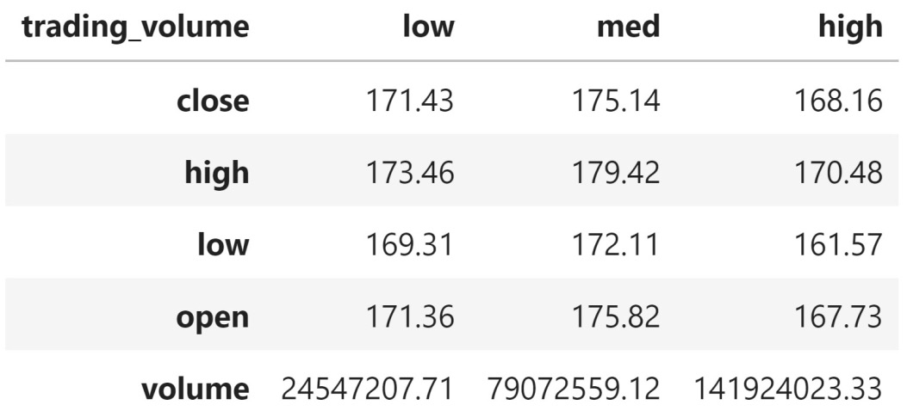

Lab 9: Aggregating Pandas DataFrames
=====================================

The following topics will be covered in this lab:

-   Performing database-style operations on DataFrames
-   Using DataFrame operations to enrich data
-   Aggregating data
-   Working with time series data


#### Pre-reqs:
- Google Chrome (Recommended)

#### Lab Environment
Notebooks are ready to run. All packages have been installed. There is no requirement for any setup.

All examples are present in `~/work/machine-learning-essentials-module1/lab_09` folder. 

Lab materials
=================

There are four notebooks that we will work through, each numbered
according to when they will be used. The text will prompt you to switch.
We will begin with the `1-querying_and_merging.ipynb` notebook
to learn about querying and merging dataframes. Then, we will move on to
the `2-dataframe_operations.ipynb` notebook to discuss data
enrichment through operations such as binning, window functions, and
pipes. For this section, we will also use the `window_calc.py`
Python file, which contains a function for performing window
calculations using pipes.

**Tip:** 

The `understanding_window_calculations.ipynb` notebook
contains some interactive visualizations for understanding window
functions. This may require some additional setup, but the instructions
are in the notebook.

Next, in the `3-aggregations.ipynb` notebook, we will discuss
aggregations, pivot tables, and crosstabs. Finally, we will focus on
additional capabilities `pandas` provides when working with
time series data in the `4-time_series.ipynb` notebook. Note
that we will not go over the `0-weather_data_collection.ipynb`
notebook; however, for those interested, it contains the code that was
used to collect the data from the **National Centers for Environmental Information** (**NCEI**) API, which can be found at
<https://www.ncdc.noaa.gov/cdo-web/webservices/v2>.

Throughout this lab, we will use a variety of datasets, which can be
found in the `data/` directory:


Note that the `exercises/` directory contains the CSV files
that are required to complete the end-of-lab exercises. More
information on these datasets can be found in the
`exercises/README.md` file.

Performing database-style operations on DataFrames
==================================================

For this section, we will be working in the
`1-querying_and_merging.ipynb` notebook. We will begin with
our imports and read in the NYC weather data CSV file:

```
>>> import pandas as pd
>>> weather = pd.read_csv('data/nyc_weather_2018.csv')
>>> weather.head()
```


This is long format data --- we have several
different weather observations per day for various stations covering NYC
in 2018:


Querying DataFrames
-------------------

Pandas provides the `query()` method so that
we can easily write complicated filters instead of
using a Boolean mask. The syntax is similar to the `WHERE`
clause in a SQL statement. To illustrate this, let\'s query the weather
data for all the rows where the value of the `SNOW` column was
greater than zero:

```
>>> snow_data = weather.query(
...     'datatype == "SNOW" and value > 0 '
... ) 
>>> snow_data.head()
```


Each row is a snow observation for a given combination of date and
station. Notice that the values vary quite a bit for January 4th---some
stations received more snow than others:


This query is equivalent to the following in SQL.
Note that `SELECT *` selects all the columns in the table (our
dataframe, in this case):

```
SELECT * FROM weather
WHERE
  datatype == "SNOW" AND value > 0 AND station LIKE "%US1NY%";
```


In *Working with Pandas DataFrames*, we learned how to use a Boolean mask
to get the same result:

```
>>> weather[
...     (weather.datatype == 'SNOW') & (weather.value > 0)
...     & weather.station.str.contains('US1NY')
... ].equals(snow_data)
True
```


For the most part, which one we use is a matter of preference; however,
if we have a long name for our dataframe, we will probably prefer the
`query()` method. In the previous example, we had to type the
dataframe\'s name an additional three times in order to use the mask.


Merging DataFrames
------------------

Let\'s look at some Venn diagrams and then do some sample
joins on the weather data. Here, the darker regions represent the data
we are left with after performing the join:


The NCEI API\'s `stations` endpoint gives us all the
information we need for the stations. This is in the
`weather_stations.csv` file, as well as in the
`stations` table in the SQLite database. Let\'s read this data
into a dataframe:

```
>>> station_info = pd.read_csv('data/weather_stations.csv')
>>> station_info.head()
```


For reference, Central Park in NYC is at 40.7829° N, 73.9654° W
(latitude 40.7829 and longitude -73.9654), and NYC has an elevation of
10 meters. The first five stations that record NYC data are not in New
York. The ones in New Jersey are southwest of NYC, while the ones in
Connecticut are northeast of NYC:


Joins require us to specify how to match the data up. The only data the
`weather` dataframe has in common with the
`station_info` dataframe is the station ID. However, the
columns containing this information are not named the same: in the
`weather` dataframe, this column is called
`station`, while in the `station_info` dataframe, it
is called `id`. Before we join the data, let\'s get some
information on how many distinct stations we have and how many entries
are in each dataframe:

```
>>> station_info.id.describe()
count                   279
unique                  279
top       GHCND:US1NJBG0029
freq                      1
Name: id, dtype: object
>>> weather.station.describe()
count                 78780
unique                  110
top       GHCND:USW00094789
freq                   4270
Name: station, dtype: object
```


The difference in the number of unique stations across the dataframes
tells us they don\'t contain all the same
stations. Depending on the type of join we pick, we may lose some data.
Therefore, it\'s important to look at the row count before and after the
join. We can see this in the **count** entry from the output of
`describe()`, but we don\'t need to run that just to get the
row count. Instead, we can use the `shape` attribute, which
gives us a tuple of the form
`(number of rows, number of columns)`. To select the rows, we
just grab the value at index `0` (`1` for columns):

```
>>> station_info.shape[0], weather.shape[0] # 0=rows, 1=cols
(279, 78780)
```


Since we will be checking the row count often, it makes more sense to
write a function that will give us the row count for any number of
dataframes. The `*dfs` argument collects all the input to this
function in a tuple, which we can iterate over in a list comprehension
to get the row count:

```
>>> def get_row_count(*dfs):
...     return [df.shape[0] for df in dfs]
>>> get_row_count(station_info, weather)
[279, 78780]
```


Now that we know that we have 78,780 rows of weather data and 279 rows
of station information data, we can begin looking at the types of joins.
We\'ll begin with the inner join, which will result in the least amount
of rows (unless the two dataframes have all the same values for the
column being joined on, in which case all the joins will be equivalent).
The **inner join** will return the columns from
both dataframes where they have a match on the specified key column.
Since we will be joining on the `weather.station` column and
the `station_info.id` column, we will only get weather data
for stations that are in `station_info`.

We will use the `merge()` method to
perform the join (which is an inner join by
default) by providing the left and right dataframes, along with
specifying which columns to join on. Since the station ID column is
named differently across dataframes, we must specify the names with
`left_on` and `right_on`. The left dataframe is the
one we call `merge()` on, while the right one is the dataframe
that gets passed in as an argument:

```
>>> inner_join = weather.merge(
...     station_info, left_on='station', right_on='id'
... )
>>> inner_join.sample(5, random_state=0)
```


Notice that we have five additional columns, which have been added to
the right. These came from the `station_info` dataframe. This
operation also kept both the `station` and `id`
columns, which are identical:


!](./images/Figure_4.6_B16834.jpg)


In order to remove the duplicate information in
the `station` and `id` columns, we can rename one of
them before the join. Consequently, we will only have to supply a value
for the `on` parameter because the columns will share the same
name:

```
>>> weather.merge(
...     station_info.rename(dict(id='station'), axis=1), 
...     on='station'
... ).sample(5, random_state=0)
```


Since the columns shared the name, we only get one back after joining on
them:


!](./images/Figure_4.7_B16834.jpg)


**Tip:** 

We can join on multiple columns by passing the list of column names to
the `on` parameter or to the `left_on` and
`right_on` parameters.

Remember that we had 279 unique stations in the `station_info`
dataframe, but only 110 unique stations for the weather data. When we
performed the inner join, we lost all the stations that didn\'t have
weather observations associated with them. If we don\'t want to lose
rows on a particular side of the join, we can
perform a left or right join instead. A **left
join** requires us to list the dataframe with the rows that we want to
keep (even if they don\'t exist in the other dataframe) on the left and
the other dataframe on the right; a **right join**
is the inverse:

```
>>> left_join = station_info.merge(
...     weather, left_on='id', right_on='station', how='left'
... )
>>> right_join = weather.merge(
...     station_info, left_on='station', right_on='id',
...     how='right'
... )
>>> right_join[right_join.datatype.isna()].head() # see nulls
```


Wherever the other dataframe contains no data, we will get null values.
We may want to investigate why we don\'t have any weather data
associated with these stations. Alternatively, our analysis may involve
determining the availability of data per station, so getting null values
isn\'t necessarily an issue:


](./images/Figure_4.8_B16834.jpg)


Since we placed the `station_info` dataframe on the left for
the left join and on the right for the right join, the results here are
equivalent. In both cases, we chose to keep all the stations
present in the `station_info` dataframe,
accepting null values for the weather observations. To prove they are
equivalent, we need to put the columns in the same order, reset the
index, and sort the data:

```
>>> left_join.sort_index(axis=1)\
...     .sort_values(['date', 'station'], ignore_index=True)\
...     .equals(right_join.sort_index(axis=1).sort_values(
...         ['date', 'station'], ignore_index=True
...     ))
True
```


Note that we have additional rows in the left and right joins because we
kept all the stations that didn\'t have weather observations:

```
>>> get_row_count(inner_join, left_join, right_join)
[78780, 78949, 78949]
```


The final type of join is a **full outer join**, which will
keep all the values, regardless of whether or not
they exist in both dataframes. For instance, say we queried for stations
with `US1NY` in their station ID because we believed that
stations measuring NYC weather would have to be labeled as such. This
means that an inner join would result in losing observations from the
stations in Connecticut and New Jersey, while a left/right join would
result in either lost station information or lost weather data. The
outer join will preserve all the data. We will
also pass in `indicator=True` to add an additional column to
the resulting dataframe, which will indicate which dataframe each row
came from:

```
>>> outer_join = weather.merge(
...     station_info[station_info.id.str.contains('US1NY')], 
...     left_on='station', right_on='id',
...     how='outer', indicator=True
... )
# view effect of outer join
>>> pd.concat([
...     outer_join.query(f'_merge == "{kind}"')\
...         .sample(2, random_state=0)
...     for kind in outer_join._merge.unique()
... ]).sort_index()
```


Indices **23634** and **25742** come from stations located in New York,
and the match gives us information about the station. Indices **60645**
and **70764** are for stations that don\'t have `US1NY` in
their station ID, causing nulls for the station information columns. The
bottom two rows are stations in New York that aren\'t providing weather
observations for NYC. This join keeps all the data and will often
introduce null values, unlike inner joins, which won\'t:


The aforementioned joins are equivalent to SQL
statements of the following form, where we simply change
`<JOIN_TYPE>` to `(INNER) JOIN`,
`LEFT JOIN`, `RIGHT JOIN`, or
`FULL OUTER JOIN` for the appropriate join:

```
SELECT *
FROM left_table
<JOIN_TYPE> right_table
ON left_table.<col> == right_table.<col>;
```


Joining dataframes makes working with the dirty data in *Lab 8*, *Data
Wrangling with Pandas*, easier. Remember, we had data from two distinct
stations: one had a valid station ID and the other was `?`.
The `?` station was the only one recording the water
equivalent of snow (`WESF`). Now that we know about joining
dataframes, we can join the data from the valid station ID to the data
from the `?` station that we are missing by date. First, we
will need to read in the CSV file, setting the `date` column
as the index. We will drop the duplicates and the `SNWD`
column (snow depth), which we found to be uninformative since most of
the values were infinite (both in the presence and absence of snow):

```
>>> dirty_data = pd.read_csv(
...     'data/dirty_data.csv', index_col='date'
... ).drop_duplicates().drop(columns='SNWD')
>>> dirty_data.head()
```


Our starting data looks like this:


Now, we need to create a dataframe for each
station. To reduce output, we will drop some additional columns:

```
>>> valid_station = dirty_data.query('station != "?"')\
...     .drop(columns=['WESF', 'station'])
>>> station_with_wesf = dirty_data.query('station == "?"')\
...     .drop(columns=['station', 'TOBS', 'TMIN', 'TMAX'])
```


This time, the column we want to join on (the date) is actually the
index, so we will pass in `left_index` to indicate that the
column to use from the left dataframe is the index, and then
`right_index` to indicate the same for the right dataframe. We
will perform a left join to make sure we don\'t lose any rows from our
valid station, and, where possible, augment them with the observations
from the `?` station:

```
>>> valid_station.merge(
...     station_with_wesf, how='left',
...     left_index=True, right_index=True
... ).query('WESF > 0').head()
```


For all the columns that the dataframes had in common, but weren\'t part
of the join, we have two versions now. The versions coming from the left
dataframe have the `_x` suffix appended to the column names,
and those coming from the right dataframe have `_y` as the
suffix:


We can provide our own suffixes with the
`suffixes` parameter. Let\'s use a suffix for the
`?` station only:

```
>>> valid_station.merge(
...     station_with_wesf, how='left',
...     left_index=True, right_index=True, 
...     suffixes=('', '_?')
... ).query('WESF > 0').head()
```


Since we specified an empty string for the left suffix, the columns
coming from the left dataframe have their original names. However, the
right suffix of `_?` was added to the names of the columns
that came from the right dataframe:


When we are joining on the index, an easier way to do this is to use the
`join()` method instead of `merge()`. It also
defaults to an inner join, but this behavior can be changed with the
`how` parameter, just like with `merge()`. The
`join()` method will always use the index of the left
dataframe to join, but it can use a column in the right dataframe if its
name is passed to the `on` parameter. Note that suffixes are
now specified using `lsuffix` for the left dataframe\'s suffix
and `rsuffix` for the right one. This yields the same result
as the previous example (*Figure 4.12*):

```
>>> valid_station.join(
...     station_with_wesf, how='left', rsuffix='_?'
... ).query('WESF > 0').head()
```


One important thing to keep in mind is that joins
can be rather resource-intensive, so it is often beneficial to figure
out what will happen to the rows before going through with it. If we
don\'t already know what type of join we want, this can help give us an
idea. We can use **set operations** on the index
we plan to join on to figure this out.

Remember that the mathematical definition of a **set** is a collection
of distinct objects. By definition, the index is a set. Set operations
are often explained with Venn diagrams:


**Important note:**

Note that `set` is also a Python type that\'s available in the
standard library. A common use of sets is to remove duplicates from a
list. More information on sets in Python can be found in the
documentation at
<https://docs.python.org/3/library/stdtypes.html#set-types-set-frozenset>.

Let\'s use the `weather` and `station_info`
dataframes to illustrate set operations. First, we must set the index to
the column(s) that will be used for the join operation:

```
>>> weather.set_index('station', inplace=True)
>>> station_info.set_index('id', inplace=True)
```


To see what will remain with an inner join, we can
take the **intersection** of the indices, which shows us the overlapping
stations:

```
>>> weather.index.intersection(station_info.index)
Index(['GHCND:US1CTFR0039', ..., 'GHCND:USW1NYQN0029'],
      dtype='object', length=110)
```


As we saw when we ran the inner join, we only got station information
for the stations with weather observations. This doesn\'t tell us what
we lost, though; for this, we need to find the **set difference**, which
will subtract the sets and give us the values of
the first index that aren\'t in the second. With the set difference, we
can easily see that, when performing an inner join, we don\'t lose any
rows from the weather data, but we lose 169 stations that don\'t have
weather observations:

```
>>> weather.index.difference(station_info.index)
Index([], dtype='object')
>>> station_info.index.difference(weather.index)
Index(['GHCND:US1CTFR0022', ..., 'GHCND:USW00014786'],
      dtype='object', length=169)
```


Note that this output also tells us how left and right joins will turn
out. To avoid losing rows, we want to put the `station_info`
dataframe on the same side as the join (on the left for a left join and
on the right for a right join).

**Tip:** 

We can use the `symmetric_difference()` method on the indices
of the dataframes involved in the join to see what will be lost from
both sides: `index_1.symmetric_difference(index_2)`. The
result will be the values that are only in one of the indices. An
example is in the notebook.

Lastly, we can use the **union** to view all the values we
will keep if we run a full outer join. Remember,
the `weather` dataframe contains the stations repeated
throughout because they provide daily
measurements, so we call the `unique()` method before taking
the union to see the number of stations we will keep:

```
>>> weather.index.unique().union(station_info.index)
Index(['GHCND:US1CTFR0022', ..., 'GHCND:USW00094789'],
      dtype='object', length=279)
```


The *Further reading* section at the end of this lab contains some
resources on set operations and how `pandas` compares to SQL.
For now, let\'s move on to data enrichment.


Using DataFrame operations to enrich data
=========================================


Now that we\'ve discussed how to query and merge
`DataFrame` objects, let\'s learn how to perform complex
operations on them to create and modify columns and rows. For this
section, we will be working in the
`2-dataframe_operations.ipynb` notebook using the weather
data, along with Facebook stock\'s volume traded and opening, high, low,
and closing prices daily for 2018. Let\'s import what we will need and
read in the data:

```
>>> import numpy as np
>>> import pandas as pd
>>> weather = pd.read_csv(
...     'data/nyc_weather_2018.csv', parse_dates=['date']
... )
>>> fb = pd.read_csv(
...     'data/fb_2018.csv', index_col='date', parse_dates=True
... )
```


We will begin by reviewing operations that
summarize entire rows and columns before moving on to binning, applying
functions across rows and columns, and window calculations, which
summarize data along a certain number of observations at a time (such as
moving averages).


Arithmetic and statistics
-------------------------

To start off, let\'s create a column with the Z-score for the volume
traded in Facebook stock and use it to find the days where the Z-score
is greater than three in absolute value. These values are more than
three standard deviations from the mean, which may be abnormal
(depending on the data). Remember from our discussion of Z-scores in *Lab 1*, that we calculate them by subtracting
the mean and dividing by the standard deviation. Rather than using
mathematical operators for subtraction and division, we will use the
`sub()` and `div()` methods, respectively:

```
>>> fb.assign(
...     abs_z_score_volume=lambda x: x.volume \
...         .sub(x.volume.mean()).div(x.volume.std()).abs()
... ).query('abs_z_score_volume > 3')
```


Five days in 2018 had Z-scores for volume traded greater than three in
absolute value. These dates in particular will come up often in the rest
of this lab as they mark some trouble points for Facebook\'s stock
price:


Two other very useful methods are `rank()` and
`pct_change()`, which let us rank the values of a column (and
store them in a new column) and calculate the percentage change
between periods, respectively. By combining these,
we can see which five days had the largest percentage change of volume
traded in Facebook stock from the day prior:

```
>>> fb.assign(
...     volume_pct_change=fb.volume.pct_change(),
...     pct_change_rank=lambda x: \
...         x.volume_pct_change.abs().rank(ascending=False)
... ).nsmallest(5, 'pct_change_rank')
```


The day with the largest percentage change in volume traded was January
12, 2018, which happens to coincide with one of the many Facebook
scandals that shook the stock in 2018
(<https://www.cnbc.com/2018/11/20/facebooks-scandals-in-2018-effect-on-stock.html>).
This was when they announced changes to the news feed to prioritize
content from a user\'s friends over brands they follow. Given that a
large component of Facebook\'s revenue comes from advertising (nearly
89% in 2017, *source*:
<https://www.investopedia.com/ask/answers/120114/how-does-facebook-fb-make-money.asp>),
this caused panic as many sold the stock, driving
up the volume traded drastically and dropping the stock price:


We can use slicing to look at the change around this announcement:

```
>>> fb['2018-01-11':'2018-01-12']
```


Notice how we are able to combine everything we learned in the last few
labs to get interesting insights from our data. We were able to sift
through a year\'s worth of stock data and find some days that had large
effects on Facebook stock (good or bad):


Lastly, we can inspect the dataframe with aggregated Boolean operations.
For example, we can see that Facebook stock never had a daily low price
greater than \$215 in 2018 with the `any()` method:

```
>>> (fb > 215).any()
open          True
high          True
low          False
close         True
volume        True
dtype: bool
```


If we want to see if all the rows in a column meet
the criteria, we can use the `all()` method. This tells us
that Facebook has at least one day for the opening, high, low, and
closing prices with a value less than or equal to \$215:

```
>>> (fb > 215).all()
open      False
high      False
low       False
close     False
volume     True
dtype: bool
```


Now, let\'s take a look at how we can use binning to divide up our data
rather than a specific value, such as \$215 in the `any()` and
`all()` examples.


Binning
-------

Sometimes, it\'s more convenient to work with
categories rather than the specific values. A common example is working
with ages---most likely, we don\'t want to look at the data for each
age, such as 25 compared to 26; however, we may very well be interested
in how the group of individuals aged 25-34 compares to the group of
those aged 35-44. This is called **binning** or **discretizing** (going
from continuous to discrete); we take our data and
place the observations into bins (or buckets)
matching the range they fall into. By doing so, we
can drastically reduce the number of distinct values our data can take
on and make it easier to analyze.

**Important note:**

While binning our data can make certain parts of the analysis easier,
keep in mind that it will reduce the information in that field since the
granularity is reduced.

One interesting thing we could do with the volume traded would be to see
which days had high trade volume and look for news about Facebook on
those days or large swings in price. Unfortunately, it is highly
unlikely that the volume will be the same any two days; in fact, we can
confirm that, in the data, no two days have the same volume traded:

```
>>> (fb.volume.value_counts() > 1).sum()
0
```


Remember that `fb.volume.value_counts()` gives us the number
of occurrences for each unique value for `volume`. We can then
create a Boolean mask for whether the count is greater than 1 and sum it
up (`True` evaluates to `1` and `False`
evaluates to `0`). Alternatively, we can use `any()`
instead of `sum()`, which, rather than telling us the number
of unique values of `volume` that had more than one
occurrence, would give us `True` if at least one volume traded
amount occurred more than once and `False` otherwise.

Clearly, we will need to create some ranges for the volume traded in
order to look at the days of high trading volume, but how do we decide
which range is a good range? One way is to use the `pd.cut()`
function for binning based on value. First, we should decide how many
bins we want to create---three seems like a good split, since we can
label the bins low, medium, and high. Next, we need to determine the
width of each bin; `pandas` tries to make this process as
painless as possible, so if we want equally-sized bins, all we have to
do is specify the number of bins we want (otherwise, we must specify the
upper bound for each bin as a list):

```
>>> volume_binned = pd.cut(
...     fb.volume, bins=3, labels=['low', 'med', 'high']
... )
>>> volume_binned.value_counts()
low     240
med       8
high      3
Name: volume, dtype: int64
```


**Tip:** 

Note that we provided labels for each bin here; if we don\'t do this,
each bin will be labeled by the interval of values it includes, which
may or may not be helpful for us, depending on our application. If we
want to both label the values and see the bins afterward, we can pass in
`retbins=True` when we call `pd.cut()`. Then, we can
access the binned data as the first element of the tuple that is
returned, and the bin ranges themselves as the second element.

It looks like an overwhelming majority of the trading days were in the
low-volume bin; keep in mind that this is all relative because we evenly
divided the range between the minimum and maximum
trading volumes. Let\'s look at the data for the three days of high
volume:

```
>>> fb[volume_binned == 'high']\
...     .sort_values('volume', ascending=False)
```


Even among the high-volume days, we can see that July 26, 2018 had a
much higher trade volume compared to the other two dates in March
(nearly 40 million additional shares were traded):


In fact, querying a search engine for *Facebook stock price July 26,
2018* reveals that Facebook had announced their earnings and
disappointing user growth after market close on July 25th, which was
followed by lots of after-hours selling. When the market opened the next
morning, the stock had dropped from \$217.50 at
close on the 25th to \$174.89 at market open on the 26th. Let\'s pull
out this data:

```
>>> fb['2018-07-25':'2018-07-26']
```


Not only was there a huge drop in stock price, but the volume traded
also skyrocketed, increasing by more than 100 million. All of this
resulted in a loss of about \$120 billion in Facebook\'s market
capitalization
(<https://www.marketwatch.com/story/facebook-stock-crushed-after-revenue-user-growth-miss-2018-07-25>):


!](./images/Figure_4.18_B16834.jpg)


If we look at the other two days marked as high-volume trading days, we
will find a plethora of information as to why. Both of these days were
marked by scandal for Facebook. The Cambridge Analytica political data
privacy scandal broke on Saturday, March 17, 2018, so trading with this
information didn\'t commence until Monday the 19th
(<https://www.nytimes.com/2018/03/19/technology/facebook-cambridge-analytica-explained.html>):

```
>>> fb['2018-03-16':'2018-03-20']
```


Things only got worse once more information was revealed in the
following days with regards to the severity of the incident:


As for the third day of high trading volume (March 26, 2018), the FTC
launched an investigation into the Cambridge Analytica scandal, so
Facebook\'s woes continued
(<https://www.cnbc.com/2018/03/26/ftc-confirms-facebook-data-breach-investigation.html>).

If we look at some of the dates within the medium
trading volume group, we can see that many are part of the three trading
events we just discussed. This forces us to reexamine how we created the
bins in the first place. Perhaps equal-width bins wasn\'t the answer?
Most days were pretty close in volume traded; however, a few days caused
the bin width to be rather large, which left us with a large imbalance
of days per bin:


If we want each bin to have an equal number of observations, we can
split the bins based on evenly-spaced quantiles using the
`pd.qcut()` function. We can bin the volumes into quartiles to
evenly bucket the observations into bins of varying width, giving us the
63 highest trading volume days in the **q4** bin:

```
>>> volume_qbinned = pd.qcut(
...     fb.volume, q=4, labels=['q1', 'q2', 'q3', 'q4']
... )
>>> volume_qbinned.value_counts()
q1    63
q2    63
q4    63
q3    62
Name: volume, dtype: int64
```


Notice that the bins don\'t cover the same range
of volume traded anymore:


**Tip:** 

In both of these examples, we let `pandas` calculate the bin
ranges; however, both `pd.cut()` and `pd.qcut()`
allow us to specify the upper bounds for each bin as a list.


Applying functions
------------------

So far, most of the actions we have taken on our data have been
column-specific. When we want to run the same code on
all the columns in our dataframe, we can use the
`apply()` method for more succinct code. Note that this will
not be done in-place.

Before we get started, let\'s isolate the weather observations from the
Central Park station and pivot the data:

```
>>> central_park_weather = weather.query(
...     'station == "GHCND:USW00094728"'
... ).pivot(index='date', columns='datatype', values='value')
```


Let\'s calculate the Z-scores of the `TMIN` (minimum
temperature), `TMAX` (maximum temperature), and
`PRCP` (precipitation) observations in Central Park in October
2018. It\'s important that we don\'t try to take the Z-scores across the
full year. NYC has four seasons, and what is considered normal weather
will depend on which season we are looking at. By isolating our
calculation to October, we can see if October had any days with very
different weather:

```
>>> oct_weather_z_scores = central_park_weather\
...     .loc['2018-10', ['TMIN', 'TMAX', 'PRCP']]\
...     .apply(lambda x: x.sub(x.mean()).div(x.std()))
>>> oct_weather_z_scores.describe().T
```


`TMIN` and `TMAX` don\'t appear to have any values
that differ much from the rest of October, but `PRCP` does:


We can use `query()` to extract the
value for this date:

```
>>> oct_weather_z_scores.query('PRCP > 3').PRCP
date
2018-10-27    3.936167
Name: PRCP, dtype: float64
```


If we look at the summary statistics for precipitation in October, we
can see that this day had much more precipitation than the rest:

```
>>> central_park_weather.loc['2018-10', 'PRCP'].describe()
count    31.000000
mean      2.941935
std       7.458542
min       0.000000
25%       0.000000
50%       0.000000
75%       1.150000
max      32.300000
Name: PRCP, dtype: float64
```


The `apply()` method lets us run vectorized operations on
entire columns or rows at once. We can apply pretty much any function we
can think of as long as those operations are valid on all the columns
(or rows) in our data. For example, we can use the `pd.cut()`
and `pd.qcut()` binning functions we
discussed in the previous section to divide each column into bins
(provided we want the same number of bins or value ranges). Note that
there is also an `applymap()` method if the function we want
to apply isn\'t vectorized. Alternatively, we can use
`np.vectorize()` to vectorize our functions for use with
`apply()`. Consult the notebook for an example.

Pandas does provide some functionality for iterating over the dataframe,
including the `iteritems()`, `itertuples()`, and
`iterrows()` methods; however, we should avoid using these
unless we absolutely can\'t find another solution. Pandas and NumPy are
designed for vectorized operations, which are much faster because they
are written in efficient C code; by writing a loop to iterate one
element at a time, we are making it more computationally intensive due
to the way Python implements integers and floats. For instance, look at
how the time to complete the simple operation of adding the number
`10` to each value in a series of floats grows linearly with
the number of rows when using `iteritems()`, but stays near
zero, regardless of size, when using a vectorized operation:


All the functions and methods we have used so far have involved the full
row or column; however, sometimes, we are more
interested in performing window calculations, which use a section of the
data.


Window calculations
-------------------

Pandas makes it possible to perform calculations
over a window or range of rows/columns. In this section, we will discuss
a few ways of constructing these windows. Depending on the type of
window, we get a different look at our data.

### Rolling windows

When our index is of type `DatetimeIndex`, we can
specify the window in day parts (such as
`2H` for two hours or `3D` for three days);
otherwise, we can specify the number of periods as an integer. Say we
are interested in the amount of rain that has fallen in a rolling 3-day
window; it would be quite tedious (and probably inefficient) to
implement this with what we have learned so far. Fortunately, we can use
the `rolling()` method to get this information easily:

```
>>> central_park_weather.loc['2018-10'].assign(
...     rolling_PRCP=lambda x: x.PRCP.rolling('3D').sum()
... )[['PRCP', 'rolling_PRCP']].head(7).T
```


After performing the rolling 3-day sum, each date
will show the sum of that day\'s and the previous two days\'
precipitation:


**Tip:** 

If we want to use dates for the rolling calculation, but don\'t have
dates in the index, we can pass the name of our date column to the
`on` parameter in the call to `rolling()`.
Conversely, if we want to use an integer index of row numbers, we can
simply pass in an integer as the window; for example,
`rolling(3)` for a 3-row window.

To change the aggregation, all we have to do is call a different method
on the result of `rolling()`; for example, `mean()`
for the average and `max()` for the maximum. The rolling
calculation can also be applied to all the columns at once:

```
>>> central_park_weather.loc['2018-10']\
...     .rolling('3D').mean().head(7).iloc[:,:6]
```


This gives us the 3-day rolling average for all the weather observations
from Central Park:


To apply different aggregations across columns, we can use the
`agg()` method instead; it allows us to specify the
aggregations to perform per column as a predefined or
custom function. We simply pass in a dictionary
mapping the columns to the aggregation to perform on them. Let\'s find
the rolling 3-day maximum temperature (`TMAX`), minimum
temperature (`TMIN`), average wind speed (`AWND`),
and total precipitation (`PRCP`). Then, we will join it to the
original data so that we can compare the results:

```
>>> central_park_weather\
...     ['2018-10-01':'2018-10-07'].rolling('3D').agg({
...     'TMAX': 'max', 'TMIN': 'min',
...     'AWND': 'mean', 'PRCP': 'sum'
... }).join( # join with original data for comparison
...     central_park_weather[['TMAX', 'TMIN', 'AWND', 'PRCP']], 
...     lsuffix='_rolling'
... ).sort_index(axis=1) # put rolling calcs next to originals
```


Using `agg()`, we were able to calculate different rolling
aggregations for each column:


**Tip:** 

We can also use variable-width windows with a little extra effort: we
can either create a subclass of `BaseIndexer` and provide the
logic for determining the window bounds in the
`get_window_bounds()` method (more information can be found at
<https://pandas.pydata.org/pandas-docs/stable/user_guide/computation.html#custom-window-rolling>),
or we can use one of the predefined classes in the
`pandas.api.indexers` module. The notebook we are currently
working in contains an example of using the
`VariableOffsetWindowIndexer` class to perform a 3-business
day rolling calculation.

With rolling calculations, we have a sliding
window over which we calculate our functions; however, in some cases, we
are more interested in the output of a function on all the data up to
that point, in which case we use an expanding window.

### Expanding windows

Expanding calculations will give us the cumulative
value of our aggregation function. We use the `expanding()`
method to perform a calculation with an expanding window; methods such
as `cumsum()` and `cummax()` use expanding windows
for their calculations. The advantage of using `expanding()`
directly is additional flexibility: we aren\'t limited to predefined
aggregations, and we can specify the minimum number of periods before
the calculation starts with the `min_periods` parameter
(defaults to 1). With the Central Park weather data, let\'s use the
`expanding()` method to calculate the month-to-date average
precipitation:

```
>>> central_park_weather.loc['2018-06'].assign(
...     TOTAL_PRCP=lambda x: x.PRCP.cumsum(),
...     AVG_PRCP=lambda x: x.PRCP.expanding().mean()
... ).head(10)[['PRCP', 'TOTAL_PRCP', 'AVG_PRCP']].T
```


Note that while there is no method for the cumulative mean, we are able
to use the `expanding()` method to calculate it. The values in
the `AVG_PRCP` column are the values in the
`TOTAL_PRCP` column divided by the number of days processed:


As we did with `rolling()`, we can provide column-specific
aggregations with the `agg()` method. Let\'s find the
expanding maximum temperature, minimum temperature, average wind speed,
and total precipitation. Note that we can also pass in NumPy functions
to `agg()`:

```
>>> central_park_weather\
...     ['2018-10-01':'2018-10-07'].expanding().agg({
...     'TMAX': np.max, 'TMIN': np.min, 
...     'AWND': np.mean, 'PRCP': np.sum
... }).join(
...     central_park_weather[['TMAX', 'TMIN', 'AWND', 'PRCP']], 
...     lsuffix='_expanding'
... ).sort_index(axis=1)
```


Once again, we joined the window calculations with
the original data for comparison:


!](./images/Figure_4.28_B16834.jpg)


Both rolling and expanding windows equally weight all the observations
in the window when performing calculations, but sometimes, we want to
place more emphasis on more recent values. One option is to
exponentially weight the observations.

### Exponentially weighted moving windows

Pandas also provides the `ewm()` method
for exponentially weighted moving calculations. Let\'s compare the
rolling 30-day average to the 30-day EWMA of the
maximum daily temperature. Note that we use the `span`
argument to specify the number of periods to use for the EWMA
calculation:

```
>>> central_park_weather.assign(
...     AVG=lambda x: x.TMAX.rolling('30D').mean(),
...     EWMA=lambda x: x.TMAX.ewm(span=30).mean()
... ).loc['2018-09-29':'2018-10-08', ['TMAX', 'EWMA', 'AVG']].T
```


Unlike the rolling average, the EWMA places higher
importance on more recent observations, so the jump in temperature on
October 7th has a larger effect on the EWMA than the rolling average:


**Tip:** 

Check out the `understanding_window_calculations.ipynb`
notebook, which contains some interactive visualizations for
understanding window functions. This may require some additional setup,
but the instructions are in the notebook.


Pipes
-----

Pipes facilitate chaining together operations that
expect `pandas` data structures as their first argument. By
using pipes, we can build up complex workflows without needing to write
highly nested and hard-to-read code. In general, pipes let us turn
something like `f(g(h(data), 20), x=True)` into the following,
making it much easier to read:

```
data.pipe(h)\ # first call h(data)
    .pipe(g, 20)\ # call g on the result with positional arg 20
    .pipe(f, x=True) # call f on result with keyword arg x=True
```


Say we wanted to print the dimensions of a subset of the Facebook
dataframe with some formatting by calling this function:

```
>>> def get_info(df):
...     return '%d rows, %d cols and max closing Z-score: %d' 
...             % (*df.shape, df.close.max()) 
```


Before we call the function, however, we want to
calculate the Z-scores for all the columns. One approach is the
following:

```
>>> get_info(fb.loc['2018-Q1']\
...            .apply(lambda x: (x - x.mean())/x.std()))
```


Alternatively, we could pipe the dataframe after calculating the
Z-scores to this function:

```
>>> fb.loc['2018-Q1'].apply(lambda x: (x - x.mean())/x.std())\
...     .pipe(get_info)
```


Pipes can also make it easier to write reusable code. In several of the
code snippets in this course, we have seen the idea of passing a function
into another function, such as when we pass a NumPy function to
`apply()` and it gets executed on each column. We can use
pipes to extend that functionality to methods of `pandas` data
structures:

```
>>> fb.pipe(pd.DataFrame.rolling, '20D').mean().equals(
...     fb.rolling('20D').mean()
... ) # the pipe is calling pd.DataFrame.rolling(fb, '20D')
True
```


To illustrate how this can benefit us, let\'s look at a function that
will give us the result of a window calculation of our choice. The
function is in the `window_calc.py` file. We will import the
function and use `??` from IPython to view the function
definition:

```
>>> from window_calc import window_calc
>>> window_calc??
Signature: window_calc(df, func, agg_dict, *args, **kwargs)
Source:   
def window_calc(df, func, agg_dict, *args, **kwargs):
    """
    Run a window calculation of your choice on the data.
    Parameters:
        - df: The `DataFrame` object to run the calculation on.
        - func: The window calculation method that takes `df` 
          as the first argument.
        - agg_dict: Information to pass to `agg()`, could be 
          a dictionary mapping the columns to the aggregation 
          function to use, a string name for the function, 
          or the function itself.
        - args: Positional arguments to pass to `func`.
        - kwargs: Keyword arguments to pass to `func`.
    
    Returns:
        A new `DataFrame` object.
    """
    return df.pipe(func, *args, **kwargs).agg(agg_dict)
File:      ~/.../lab_09/window_calc.py
Type:      function
```


Our `window_calc()` function takes the dataframe, the function
to execute (as long as it takes a dataframe as its first argument), and
information on how to aggregate the result, along with any optional
parameters, and gives us back a new dataframe with
the results of the window calculations. Let\'s use this function to find
the expanding median of the Facebook stock data:

```
>>> window_calc(fb, pd.DataFrame.expanding, np.median).head()
```


Note that the `expanding()` method doesn\'t require us to
specify any parameters, so all we had to do was pass in
`pd.DataFrame.expanding` (no parentheses), along with the
aggregation to perform as the window calculation on the dataframe:


The `window_calc()` function also takes `*args` and
`**kwargs`; these are optional parameters that, if supplied,
will be collected by Python into `kwargs` when they are passed
by name (such as `span=20`) and into `args` if not
(passed by position). These can then be **unpacked** and passed to
another function or method call by using `*` for
`args` and `**` for `kwargs`. We need this
behavior in order to use the `ewm()` method for the EWMA of
the closing price of Facebook stock:

```
>>> window_calc(fb, pd.DataFrame.ewm, 'mean', span=3).head()
```


In the previous example, we had to use `**kwargs` because the
`span` argument is not the first argument that
`ewm()` receives, and we didn\'t want to pass the ones before
it:


To calculate the rolling 3-day weather
aggregations for Central Park, we take advantage of `*args`
since we know that the window is the first argument to
`rolling()`:

```
>>> window_calc(
...     central_park_weather.loc['2018-10'], 
...     pd.DataFrame.rolling, 
...     {'TMAX': 'max', 'TMIN': 'min',
...      'AWND': 'mean', 'PRCP': 'sum'},
...     '3D'
... ).head()
```


We were able to aggregate each of the columns differently since we
passed in a dictionary instead of a single value:


Notice how we were able to create a consistent API for the window
calculations, without the caller needing to figure out which aggregation
method to call after the window function. This
hides some of the implementation details, while
making it easier to use. We will be using this function as the base for
some of the functionality in the `StockVisualizer` class we
will build in *Lab 12*.


Aggregating data
================


We already got a sneak peek at aggregation when we
discussed window calculations and pipes in the previous section. Here,
we will focus on summarizing the dataframe through
aggregation, which will change the shape of our dataframe (often through
row reduction). We also saw how easy it is to take
advantage of vectorized NumPy functions on `pandas` data
structures, especially to perform aggregations. This is what NumPy does
best: it performs computationally efficient mathematical operations on
numeric arrays.

NumPy pairs well with aggregating dataframes since it gives us an easy
way to summarize data with different pre-written functions; often, when
aggregating, we just need the NumPy function, since most of what we
would want to write ourselves has previously been built. We have already
seen some NumPy functions commonly used for aggregations, such as
`np.sum()`, `np.mean()`, `np.min()`, and
`np.max()`; however, we aren\'t limited to numeric
operations---we can use things such as `np.unique()` on
strings. Always check whether NumPy already has a function before
implementing one yourself.

For this section, we will be working in the
`3-aggregations.ipynb` notebook. Let\'s import
`pandas` and `numpy` and read in the data we will be
working with:

```
>>> import numpy as np
>>> import pandas as pd
>>> fb = pd.read_csv(
...     'data/fb_2018.csv', index_col='date', parse_dates=True
... ).assign(trading_volume=lambda x: pd.cut(
...     x.volume, bins=3, labels=['low', 'med', 'high'] 
... ))
>>> weather = pd.read_csv(
...     'data/weather_by_station.csv', 
...     index_col='date', parse_dates=True
... )
```


Note that the weather data for this section has
been merged with some of the station data:


Before we dive into any calculations, let\'s make
sure that our data won\'t be displayed in scientific notation. We will
modify how floats are formatted for displaying. The
format we will apply is `.2f`, which
will provide the float with two digits after the decimal point:

```
>>> pd.set_option('display.float_format', lambda x: '%.2f' % x)
```


First, we will take a look at summarizing the full dataset before moving
on to summarizing by groups and building pivot tables and crosstabs.


Summarizing DataFrames
----------------------

When we discussed window calculations, we saw that we could run the
`agg()` method on the result of `rolling()`,
`expanding()`, or `ewm()`; however, we can also call
it directly on the dataframe in the same fashion. The only difference is
that the aggregations done this way will be
performed on all the data, meaning that we will
only get a series back that contains the overall result. Let\'s
aggregate the Facebook stock data the same way we did with the window
calculations. Note that we won\'t get anything back for the
`trading_volume` column, which contains the volume traded bins
from `pd.cut()`; this is because we aren\'t specifying an
aggregation to run on that column:

```
>>> fb.agg({
...     'open': np.mean, 'high': np.max, 'low': np.min, 
...     'close': np.mean, 'volume': np.sum
... })
open            171.45
high            218.62
low             123.02
close           171.51
volume   6949682394.00
dtype: float64
```


We can use aggregations to easily find the total snowfall and
precipitation for 2018 in Central Park. In this case, since we will be
performing the sum on both, we can either use `agg('sum')` or
call `sum()` directly:

```
>>> weather.query('station == "GHCND:USW00094728"')\
...     .pivot(columns='datatype', values='value')\
...     [['SNOW', 'PRCP']].sum()
datatype
SNOW   1007.00
PRCP   1665.30
dtype: float64
```


Additionally, we can provide multiple functions to
run on each of the columns we want to aggregate. As we have already
seen, we get a `Series` object when each column has a single
aggregation. To distinguish between the aggregations in the case
of multiple ones per column, `pandas`
will return a `DataFrame` object instead. The index of this
dataframe will tell us which metric is being calculated for which
column:

```
>>> fb.agg({
...     'open': 'mean', 
...     'high': ['min', 'max'],
...     'low': ['min', 'max'], 
...     'close': 'mean'
... })
```


This results in a dataframe where the rows indicate the aggregation
function being applied to the data columns. Note that we get nulls for
any combination of aggregation and column that we didn\'t explicitly ask
for:


So far, we have learned how to aggregate over specific windows and over
the entire dataframe; however, the real power comes with the ability to
aggregate by group membership. This lets us calculate things such as the
total precipitation per month, per station and average OHLC stock prices
for each volume traded bin we\'ve created.


Aggregating by group
--------------------

To calculate the aggregations per group, we must
first call the `groupby()` method on the dataframe and provide
the column(s) we want to use to determine distinct
groups. Let\'s look at the average of our stock data points for each of
the volume traded bins we created with `pd.cut()`; remember,
these are three equal-width bins:

```
>>> fb.groupby('trading_volume').mean()
```


The average OHLC prices are smaller for larger trading volumes, which
was to be expected given that the three dates in the high-volume traded
bin were selloffs:


After running `groupby()`, we can also select specific columns
for aggregation:

```
>>> fb.groupby('trading_volume')\
...     ['close'].agg(['min', 'max', 'mean'])
```


This gives us the aggregations for the closing price in each volume
traded bucket:


If we need more fine-tuned control over how each
column gets aggregated, we use the `agg()` method again with a
dictionary that maps the columns to their aggregation function. As we
did previously, we can provide lists of functions
per column; the result, however, will look a
little different:

```
>>> fb_agg = fb.groupby('trading_volume').agg({
...     'open': 'mean', 'high': ['min', 'max'],
...     'low': ['min', 'max'], 'close': 'mean'
... })
>>> fb_agg
```


We now have a hierarchical index in the columns. Remember, this means
that if we want to select the minimum low price for the medium volume
traded bucket, we need to use
`fb_agg.loc['med', 'low']['min']`:


The columns are stored in a `MultiIndex`
object:

```
>>> fb_agg.columns
MultiIndex([( 'open', 'mean'),
            ( 'high',  'min'),
            ( 'high',  'max'),
            (  'low',  'min'),
            (  'low',  'max'),
            ('close', 'mean')],
           )
```


We can use a list comprehension to remove this
hierarchy and instead have our column names in the form of
`<column>_<agg>`. At each iteration, we will get a tuple of
the levels from the `MultiIndex` object, which we can combine
into a single string to remove the hierarchy:

```
>>> fb_agg.columns = ['_'.join(col_agg) 
...                   for col_agg in fb_agg.columns]
>>> fb_agg.head()
```


This replaces the hierarchy in the columns with a single level:


Say we want to see the average observed
precipitation across all the stations per day. We
would need to group by the date, but it is in the index. In this case,
we have a few options:

-   Resampling, which we will cover in the *Working with time series
    data* section, later in this lab.
-   Resetting the index and using the date column that gets created from
    the index.
-   Passing `level=0` to `groupby()` to indicate
    that the grouping should be performed on the outermost level of the
    index.
-   Using a `Grouper` object.

Here, we will pass `level=0` to `groupby()`, but
note that we can also pass in `level='date'` because our index
is named. This gives us the average precipitation observations across
the stations, which may give us a better idea of the weather than simply
picking a station to look at. Since the result is a single-column
`DataFrame` object, we call `squeeze()` to turn it
into a `Series` object:

```
>>> weather.loc['2018-10'].query('datatype == "PRCP"')\ 
...     .groupby(level=0).mean().head().squeeze()
date
2018-10-01    0.01
2018-10-02    2.23
2018-10-03   19.69
2018-10-04    0.32
2018-10-05    0.96
Name: value, dtype: float64
```


We can also group by many categories at once.
Let\'s find the quarterly total recorded precipitation per station.
Here, rather than pass in `level=0` to `groupby()`,
we need to use a `Grouper` object to aggregate from daily to
quarterly frequency. Since this will create a multi-level index, we will
also use `unstack()` to put the inner level (the quarter)
along the columns after the aggregation is performed:

```
>>> weather.query('datatype == "PRCP"').groupby(
...     ['station_name', pd.Grouper(freq='Q')]
... ).sum().unstack().sample(5, random_state=1)
```


There are many possible follow-ups for this
result. We could look at which stations receive the most/least
precipitation. We could go back to the location and elevation
information we had for each station to see if that affects
precipitation. We could also see which quarter has the most/least
precipitation across the stations:


**Tip:** 

The `DataFrameGroupBy` objects returned by the
`groupby()` method have a `filter()` method, which
allows us to filter groups. We can use this to exclude certain groups
from the aggregation. Simply pass a function that returns a Boolean for
each group\'s subset of the dataframe (`True` to include the
group and `False` to exclude it). An example is in the
notebook.

Let\'s see which months have the most
precipitation. First, we need to group by day and
average the precipitation across the stations. Then, we can group by
month and sum the resulting precipitation. Finally, we will use
`nlargest()` to get the five months with the most
precipitation:

```
>>> weather.query('datatype == "PRCP"')\
...     .groupby(level=0).mean()\
...     .groupby(pd.Grouper(freq='M')).sum().value.nlargest()
date
2018-11-30   210.59
2018-09-30   193.09
2018-08-31   192.45
2018-07-31   160.98
2018-02-28   158.11
Name: value, dtype: float64
```


Perhaps the previous result was surprising. The saying goes *April
showers bring May flowers*; however, April wasn\'t in the top five
(neither was May, for that matter). Snow will count toward
precipitation, but that doesn\'t explain why summer months are higher
than April. Let\'s look for days that accounted for a large percentage
of the precipitation in a given month to see if April shows up there.

To do so, we need to calculate the average daily
precipitation across stations and then find the total per month; this
will be the denominator. However, in order to divide the daily values by
the total for their month, we will need a `Series` object of
equal dimensions. This means that we will need to use the
`transform()` method, which will perform the specified
calculation on the data while always returning an object of equal
dimensions to what we started with. Therefore, we
can call it on a `Series` object and always get a
`Series` object back, regardless of what the aggregation
function itself would return:

```
>>> weather.query('datatype == "PRCP"')\
...     .rename(dict(value='prcp'), axis=1)\
...     .groupby(level=0).mean()\
...     .groupby(pd.Grouper(freq='M'))\
...     .transform(np.sum)['2018-01-28':'2018-02-03']
```


Rather than getting a single sum for January and another for February,
notice that we have the same value being repeated for the January
entries and a different one for the February ones. Note that the value
for February is the value we found in the previous result:


!](./images/Figure_4.40_B16834.jpg)


We can make this a column in our
dataframe to easily calculate the percentage of
the monthly precipitation that occurred each day. Then, we can use
`nlargest()` to pull out the largest values:

```
>>> weather.query('datatype == "PRCP"')\
...     .rename(dict(value='prcp'), axis=1)\
...     .groupby(level=0).mean()\
...     .assign(
...         total_prcp_in_month=lambda x: x.groupby(
...             pd.Grouper(freq='M')).transform(np.sum),
...         pct_monthly_prcp=lambda x: \
...             x.prcp.div(x.total_prcp_in_month)
...     ).nlargest(5, 'pct_monthly_prcp')
```


Together, the 4th- and 5th-place days in terms of
the amount of monthly precipitation they accounted for make up more than
50% of the rain in April. They were also consecutive days:


!](./images/Figure_4.41_B16834.jpg)


**Important note:**

The `transform()` method also works on
`DataFrame` objects, in which case it will return a
`DataFrame` object. We can use it to easily standardize all
the columns at once. An example is in the notebook.


Pivot tables and crosstabs
--------------------------

To wrap up this section, we will discuss some `pandas`
functions that will aggregate our data into some common formats. The
aggregation methods we discussed previously will
give us the highest level of customization; however, `pandas`
provides some functions to quickly generate a
pivot table and a crosstab in a common format.

In order to generate a pivot table, we must
specify what to group on and, optionally, which subset of columns we
want to aggregate and/or how to aggregate (average, by default). Let\'s
create a pivot table of averaged OHLC data for Facebook per volume
traded bin:

```
>>> fb.pivot_table(columns='trading_volume')
```


Since we passed in `columns='trading_volume'`, the distinct
values in the `trading_volume` column were placed along
the columns. The columns from the original
dataframe then went to the index. Notice that the
index for the columns has a name (**trading\_volume**):





With the `pivot()` method, we weren\'t able
to handle multi-level indices or indices with
repeated values. For this reason, we haven\'t been able to put the
weather data in wide format. The `pivot_table()` method solves
this issue. To do so, we need to put the
`date` and `station` information in the index and
the distinct values of the `datatype` column along the
columns. The values will come from the
`value` column. We will use the median to aggregate any
overlapping combinations (if any):

```
>>> weather.reset_index().pivot_table(
...     index=['date', 'station', 'station_name'], 
...     columns='datatype', 
...     values='value', 
...     aggfunc='median'
... ).reset_index().tail()
```


After resetting the index, we have our data in wide format. One final
step would be to rename the index:


![(./images/Figure_4.43_B16834.jpg)


We can use the `pd.crosstab()` function to create a frequency
table. For example, if we want to see how many low-, medium-,
and high-volume trading days Facebook stock had
each month, we can use a crosstab. The syntax is
pretty straightforward; we pass the row and column
labels to the `index` and `columns` parameters,
respectively. By default, the values in the cells will be the count:

```
>>> pd.crosstab(
...     index=fb.trading_volume, columns=fb.index.month,
...     colnames=['month'] # name the columns index
... )
```


This makes it easy to see the months when high volumes of Facebook stock
were traded:


](./images/Figure_4.44_B16834.jpg)


**Tip:** 

We can normalize the output to percentages of the row/column totals by
passing in `normalize='rows'`/`normalize='columns'`.
An example is in the notebook.

To change the aggregation function,
we can provide an argument to `values`
and then specify `aggfunc`. To illustrate this, let\'s find
the average closing price of each trading volume
bucket per month instead of the count in the previous example:

```
>>> pd.crosstab(
...     index=fb.trading_volume, columns=fb.index.month,
...     colnames=['month'], values=fb.close, aggfunc=np.mean
... )
```


We now get the average closing price per month, per volume traded bin,
with null values when that combination wasn\'t present in the data:


We can also get row and column subtotals with the `margins`
parameter. Let\'s count the number of times each station recorded snow
per month and include the subtotals:

```
>>> snow_data = weather.query('datatype == "SNOW"')
>>> pd.crosstab(
...     index=snow_data.station_name,
...     columns=snow_data.index.month, 
...     colnames=['month'],
...     values=snow_data.value,
...     aggfunc=lambda x: (x > 0).sum(),
...     margins=True, # show row and column subtotals
...     margins_name='total observations of snow' # subtotals
... )
```


Along the bottom row, we have the total snow
observations per month, while
down the rightmost column, we have the total snow
observations in 2018 per station:


](./images/Figure_4.46_B16834.jpg)


Just by looking at a few stations, we can see that, despite all of them
supplying weather information for NYC, they don\'t
share every facet of the weather. Depending on which stations we choose
to look at, we could be adding/subtracting snow
from what really happened in NYC.


Working with time series data
=============================


With time series data, we have some additional
operations we can use, for anything from selection and filtering to
aggregation. We will be exploring some of this functionality in the
`4-time_series.ipynb` notebook. Let\'s start off by reading in
the Facebook data from the previous sections:

```
>>> import numpy as np
>>> import pandas as pd
>>> fb = pd.read_csv(
...     'data/fb_2018.csv', index_col='date', parse_dates=True
... ).assign(trading_volume=lambda x: pd.cut( 
...     x.volume, bins=3, labels=['low', 'med', 'high']     
... ))
```


We will begin this section by discussing the selection and filtering of
time series data before moving on to shifting, differencing, resampling,
and finally merging based on time. Note that it\'s important to set the
index to our date (or datetime) column, which will allow us to take
advantage of the additional functionality we will be discussing. Some
operations may work without doing this, but for a smooth process
throughout our analysis, using an index of type
`DatetimeIndex` is recommended.


Time-based selection and filtering
----------------------------------

Let\'s start with a quick recap of datetime
slicing and indexing. We can easily isolate data for the year by
indexing on it: `fb.loc['2018']`. In the case of our stock
data, the full dataframe would be returned because we only have 2018
data; however, we can filter to a month (`fb.loc['2018-10']`)
or to a range of dates. Note that using `loc[]` is optional
with ranges:

```
>>> fb['2018-10-11':'2018-10-15']
```


We only get three days back because the stock market is closed on the
weekends:


Keep in mind that the date range can also be supplied using other
frequencies, such as month or the quarter of the year:

```
>>> fb.loc['2018-q1'].equals(fb['2018-01':'2018-03'])
True
```


When targeting the beginning or end of a date range, `pandas`
has some additional methods for selecting the first or last rows within
a specified unit of time. We can select the first week of stock prices
in 2018 using the `first()` method and an offset of
`1W`:

```
>>> fb.first('1W')
```


January 1, 2018 was a holiday, meaning that the market was closed. It
was also a Monday, so the week here is only four days long:


!](./images/Figure_4.48_B16834.jpg)


We can perform a similar operation for the most
recent dates as well. Selecting the last week in the data is as simple
as switching the `first()` method with the `last()`
method:

```
>>> fb.last('1W')
```


Since December 31, 2018 was a Monday, the last week only consists of one
day:


!](./images/Figure_4.49_B16834.jpg)


When working with daily stock data, we only have data for the dates the
stock market was open. Suppose that we reindexed the data to include
rows for each day of the year:

```
>>> fb_reindexed = fb.reindex(
...     pd.date_range('2018-01-01', '2018-12-31', freq='D')
... )
```


The reindexed data would have all nulls for January 1st and any other
days the market was closed. We can combine the `first()`,
`isna()`, and `all()` methods to confirm this. Here,
we will also use the `squeeze()` method to turn the 1-row
`DataFrame` object resulting from the call to
`first('1D').isna()` into a `Series` object so that
calling `all()` yields a single value:

```
>>> fb_reindexed.first('1D').isna().squeeze().all()
True
```


We can use the `first_valid_index()` method to obtain the
index of the first non-null entry in our data, which will be the first
day of trading in the data. To obtain the last day of trading, we can
use the `last_valid_index()` method. For the first quarter of
2018, the first day of trading was January 2nd and
the last was March 29th:

```
>>> fb_reindexed.loc['2018-Q1'].first_valid_index()
Timestamp('2018-01-02 00:00:00', freq='D')
>>> fb_reindexed.loc['2018-Q1'].last_valid_index()
Timestamp('2018-03-29 00:00:00', freq='D')
```


If we wanted to know what Facebook\'s stock price looked like as of
March 31, 2018, our initial idea may be to use indexing to retrieve it.
However, if we try to do so with `loc[]`
(`fb_reindexed.loc['2018-03-31']`), we will get null values
because the stock market wasn\'t open that day. If we use the
`asof()` method instead, it will give us the closest non-null
data that precedes the date we ask for, which in this case is March
29th. Therefore, if we wanted to see how Facebook performed on the last
day in each month, we could use `asof()`, and avoid having to
first check if the market was open that day:

```
>>> fb_reindexed.asof('2018-03-31')
open                   155.15
high                   161.42
low                    154.14
close                  159.79
volume            59434293.00
trading_volume            low
Name: 2018-03-31 00:00:00, dtype: object
```


For the next few examples, we will need time information in addition to
the date. The datasets we have been working with thus far lack a time
component, so we will switch to the Facebook stock data by the minute
from May 20, 2019 through May 24, 2019 from Nasdaq.com. In order to
properly parse the datetimes, we need to pass in a lambda function as
the `date_parser` argument since they are not in a standard
format (for instance, May 20, 2019 at 9:30 AM is represented as
`2019-05-20 09-30`); the lambda function
will specify how to convert the data in the
`date` field into datetimes:

```
>>> stock_data_per_minute = pd.read_csv(
...     'data/fb_week_of_may_20_per_minute.csv', 
...     index_col='date', parse_dates=True, 
...     date_parser=lambda x: \
...         pd.to_datetime(x, format='%Y-%m-%d %H-%M')
... )
>>> stock_data_per_minute.head()
```


We have the OHLC data per minute, along with the volume traded per
minute:


**Important note:**

In order to properly parse datetimes in a non-standard format, we need
to specify the format it is in. For a reference on the available codes,
consult the Python documentation at
<https://docs.python.org/3/library/datetime.html#strftime-strptime-behavior>.

We can use `first()` and `last()` with
`agg()` to bring this data to a daily granularity. To get the
true open value, we need to take the first observation per day;
conversely, for the true closing value, we need to take the last
observation per day. The high and low will be the
maximum and minimum of their respective columns
per day. Volume traded will be the daily sum:

```
>>> stock_data_per_minute.groupby(pd.Grouper(freq='1D')).agg({
...     'open': 'first', 
...     'high': 'max', 
...     'low': 'min', 
...     'close': 'last', 
...     'volume': 'sum'
... })
```


This rolls the data up to a daily frequency:


](./images/Figure_4.51_B16834.jpg)


The next two methods we will discuss help us select data based on the
time part of the datetime. The `at_time()` method allows us to
isolate rows where the time part of the datetime is the time we specify.
By running `at_time('9:30')`, we can grab all the market open
prices (the stock market opens at 9:30 AM):

```
>>> stock_data_per_minute.at_time('9:30')
```


This tells us what the stock data looked like at the opening bell each
day:


We can use the `between_time()` method to grab all the rows
where the time portion of the datetime is between two times (inclusive
of the endpoints by default). This method can be
very useful if we want to look at data within a certain time range, day
over day. Let\'s grab all the rows within the last two minutes of
trading each day (15:59 - 16:00):

```
>>> stock_data_per_minute.between_time('15:59', '16:00')
```


It looks like the last minute (16:00) has significantly more volume
traded each day compared to the previous minute (15:59). Perhaps people
rush to make trades before close:


We may wonder if this also happens in the first two minutes. Do people
put their trades in the night before, and they execute when the market
opens? It is trivial to change the previous code to
answer that question. Instead, let\'s see if, on
average, more shares were traded within the first 30 minutes of trading
or in the last 30 minutes for the week in question. We can combine
`between_time()` with `groupby()` to answer this
question. In addition, we need to use `filter()` to exclude
groups from the aggregation. The excluded groups are times that aren\'t
in the time range we want:

```
>>> shares_traded_in_first_30_min = stock_data_per_minute\
...     .between_time('9:30', '10:00')\
...     .groupby(pd.Grouper(freq='1D'))\
...     .filter(lambda x: (x.volume > 0).all())\
...     .volume.mean()
>>> shares_traded_in_last_30_min = stock_data_per_minute\
...     .between_time('15:30', '16:00')\
...     .groupby(pd.Grouper(freq='1D'))\
...     .filter(lambda x: (x.volume > 0).all())\
...     .volume.mean()
```


For the week in question, there were 18,593 more trades on average
around the opening time than the closing time:

```
>>> shares_traded_in_first_30_min \
... - shares_traded_in_last_30_min
18592.967741935485
```


**Tip:** 

We can use the `normalize()` method on
`DatetimeIndex` objects or after first accessing the
`dt` attribute of a `Series` object to normalize all
the datetimes to midnight. This is helpful when the time isn\'t adding
value to our data. There are examples of this in the notebook.

With the stock data, we have a snapshot of the
price for each minute or day (depending on the granularity), but we may
be interested in seeing the change between time periods as a time series
rather than aggregating the data. For this, we need to learn how to
create lagged data.


Shifting for lagged data
------------------------

We can use the `shift()` method to
create lagged data. By default, the shift will be
by one period, but this can be any integer (positive or negative).
Let\'s use `shift()` to create a new column that indicates the
previous day\'s closing price for the daily Facebook stock data. From
this new column, we can calculate the price change due to after-hours
trading (after the market close one day right up to the market open the
following day):

```
>>> fb.assign(
...     prior_close=lambda x: x.close.shift(),
...     after_hours_change_in_price=lambda x: \
...         x.open - x.prior_close,
...     abs_change=lambda x: \
...         x.after_hours_change_in_price.abs()
... ).nlargest(5, 'abs_change')
```


This gives us the days that were most affected by after-hours trading:


](./images/Figure_4.54_B16834.jpg)


**Tip:** 

To add/subtract time from the datetimes in the index, consider using
`Timedelta` objects instead. There is an example of this in
the notebook.

In the previous example, we used the shifted data
to calculate the change across columns. However, if, rather than the
after-hours trading, we were interested in the change in Facebook\'s
stock price each day, we would calculate the difference between the
closing price and the shifted closing price. Pandas makes it a little
easier than this, as we will see next.


Differenced data
----------------

We\'ve already discussed creating lagged data with the
`shift()` method. However, often, we are interested in how
the values change from one time period to the
next. For this, `pandas` has the `diff()` method. By
default, this will calculate the change from time period *t-1* to time
period *t*:


Note that this is equivalent to subtracting the result of
`shift()` from the original data:

```
>>> (fb.drop(columns='trading_volume') 
...  - fb.drop(columns='trading_volume').shift()
... ).equals(fb.drop(columns='trading_volume').diff())
True
```


We can use `diff()` to easily calculate
the day-over-day change in the Facebook stock data:

```
>>> fb.drop(columns='trading_volume').diff().head()
```


For the first few trading days of the year, we can see that the stock
price increased, and that the volume traded decreased daily:


**Tip:** 

To specify the number of periods that are used for the difference,
simply pass in an integer to `diff()`. Note that this number
can be negative. An example of this is in the notebook.


Resampling
----------

Sometimes, the data is at a granularity that
isn\'t conducive to our analysis. Consider the case where we have data
per minute for the full year of 2018. The level of granularity and
nature of the data may render plotting useless. Therefore, we will need
to aggregate the data to a less granular frequency:


Suppose we had a full year of the data. It\'s possible that this level of granularity is
beyond what is useful for us, in which case we can use the
`resample()` method to aggregate our time series data to a
different granularity. To use `resample()`, all we have to do
is say how we want to roll up the data and tack on an optional call to
an aggregation method. For example, we can resample this
minute-by-minute data to a daily frequency and specify how to aggregate
each column:

```
>>> stock_data_per_minute.resample('1D').agg({
...     'open': 'first', 
...     'high': 'max', 
...     'low': 'min', 
...     'close': 'last', 
...     'volume': 'sum'
... })
```


This is equivalent to the result we got back in the *Time-based
selection and filtering* section:


We can resample to any frequency supported by `pandas` (more
information can be found in the documentation at
<http://pandas.pydata.org/pandas-docs/stable/user_guide/timeseries.html>).
Let\'s resample the daily Facebook stock data to the quarterly average:

```
>>> fb.resample('Q').mean()
```


This gives us the average quarterly performance of
the stock. The fourth quarter of 2018 was clearly troublesome:


To look further into this, we can use the `apply()` method to
look at the difference between how the quarter began and how it ended.
We will also need the `first()` and `last()` methods
from the *Time-based selection and filtering* section:

```
>>> fb.drop(columns='trading_volume').resample('Q').apply(
...     lambda x: x.last('1D').values - x.first('1D').values
... )
```


Facebook\'s stock price declined in all but the
second quarter:


](./images/Figure_4.59_B16834.jpg)


Consider the melted minute-by-minute stock data in
`melted_stock_data.csv`:

```
>>> melted_stock_data = pd.read_csv(
...     'data/melted_stock_data.csv', 
...     index_col='date', parse_dates=True
... )
>>> melted_stock_data.head()
```


The OHLC format makes it easy to analyze the stock data, but a single
column is trickier:


The `Resampler` object we get back after
calling `resample()` has an `ohlc()` method, which
we can use to retrieve the OHLC data we are used to seeing:

```
>>> melted_stock_data.resample('1D').ohlc()['price']
```


Since the column in the original data was called `price`, we
select it after calling `ohlc()`, which is pivoting our data.
Otherwise, we will have a hierarchical index in the columns:


](./images/Figure_4.61_B16834.jpg)


In the previous examples, we **downsampled** to reduce the granularity
of the data; however, we can also **upsample** to increase the
granularity of the data. We can even call `asfreq()` after to
not aggregate the result:

```
>>> fb.resample('6H').asfreq().head()
```


Note that when we resample at a granularity
that\'s finer than the data we have, it will introduce `NaN`
values:


The following are a few ways we can handle the `NaN` values.
In the interest of brevity, examples of these are in the notebook:

-   Use `pad()` after `resample()` to forward fill.
-   Call `fillna()` after `resample()` to handle missing values.
-   Use `asfreq()` followed by `assign()` to handle
    each column individually.

So far, we have been working with time series data stored in a single
`DataFrame` object, but we may want to combine time series.
While the techniques discussed in the *Merging DataFrames* section will
work for time series, `pandas` provides additional
functionality for merging time series so that we can merge on close
matches rather than requiring an exact match. We will discuss these
next.


Merging time series
-------------------

Time series often go down to the second or are
even more granular, meaning that it can be difficult to merge if the
entries don\'t have the same datetime. Pandas solves this problem with
two additional merging functions. When we want to pair up observations
that are close in time, we can use `pd.merge_asof()` to match
on nearby keys rather than on equal keys, like we did with joins. On the
other hand, if we want to match up the equal keys and interleave the
keys without matches, we can use `pd.merge_ordered()`.

To illustrate how these work, we are going to use the
`fb_prices` and `aapl_prices` tables in the
`stocks.db` SQLite database. These contain the prices of
Facebook and Apple stock, respectively, along with a timestamp of when
the price was recorded. Note that the Apple data
was collected before the stock split in August 2020
(<https://www.marketwatch.com/story/3-things-to-know-about-apples-stock-split-2020-08-28>).
Let\'s read these tables from the database:

```
>>> import sqlite3
>>> with sqlite3.connect('data/stocks.db') as connection:
...     fb_prices = pd.read_sql(
...         'SELECT * FROM fb_prices', connection, 
...         index_col='date', parse_dates=['date']
...     )
...     aapl_prices = pd.read_sql(
...         'SELECT * FROM aapl_prices', connection, 
...         index_col='date', parse_dates=['date']
...     )
```


The Facebook data is at the minute granularity; however, we have
(fictitious) seconds for the Apple data:

```
>>> fb_prices.index.second.unique()
Int64Index([0], dtype='int64', name='date')
>>> aapl_prices.index.second.unique()
Int64Index([ 0, 52, ..., 37, 28], dtype='int64', name='date')
```


If we use `merge()` or `join()`, we will only have
values for both Apple and Facebook when the Apple price was at the top
of the minute. Instead, to try and line these up, we can perform an *as
of* merge. In order to handle the mismatch, we will specify to merge
with the nearest minute (`direction='nearest'`) and require
that a match can only occur between times that are within 30 seconds of
each other (`tolerance`). This will place the Apple data
with the minute that it is closest to, so
`9:31:52` will go with `9:32` and
`9:37:07` will go with `9:37`. Since the times are
on the index, we pass in `left_index` and
`right_index`, just like we did with `merge()`:

```
>>> pd.merge_asof(
...     fb_prices, aapl_prices, 
...     left_index=True, right_index=True,
...     # merge with nearest minute
...     direction='nearest',
...     tolerance=pd.Timedelta(30, unit='s')
... ).head()
```


This is similar to a left join; however, we are more lenient when
matching the keys. Note that in the case where multiple entries in the
Apple data match the same minute, this function will only keep the
closest one. We get a null value for `9:31` because the entry
for Apple at `9:31` was `9:31:52`, which gets placed
at `9:32` when using `nearest`:


If we don\'t want the behavior of a left join, we can use the
`pd.merge_ordered()` function instead. This will allow us to
specify our join type, which will be `'outer'` by default. We
will have to reset our index to be able to join on the datetimes,
however:

```
>>> pd.merge_ordered(
...     fb_prices.reset_index(), aapl_prices.reset_index()
... ).set_index('date').head()
```


This strategy will give us null values whenever
the times don\'t match exactly, but it will at least sort them for us:


**Tip:** 

We can pass `fill_method='ffill'` to
`pd.merge_ordered()` to forward-fill the first `NaN`
after a value, but it does not propagate beyond that; alternatively, we
can chain a call to `fillna()`. There is an example of this in
the notebook.

The `pd.merge_ordered()` function also makes it possible to
perform a group-wise merge, so be sure to check out the documentation
for more information.


Summary
=======


In this lab, we discussed how to join dataframes, how to determine
the data we will lose for each type of join using set operations, and
how to query dataframes as we would a database. We then went over some
more involved transformations on our columns, such as binning and
ranking, and how to do so efficiently with the `apply()`
method. We also learned the importance of vectorized operations in
writing efficient `pandas` code. Then, we explored window
calculations and using pipes for cleaner code. Our discussion of window
calculations served as a primer for aggregating across whole dataframes
and by groups. We also went over how to generate pivot tables and
crosstabs. Finally, we looked at some time series-specific functionality
in `pandas` for everything from selection and aggregation to
merging.

Exercises
=========

Using the CSV files in the `exercises/` folder and what we
have learned so far in this course, complete the following exercises:

1.  With the `earthquakes.csv` file, select all the
    earthquakes in Japan with a magnitude of 4.9 or greater using the
    `mb` magnitude type.

2.  Create bins for each full number of earthquake magnitude (for
    instance, the first bin is (0, 1\], the second is (1, 2\], and so
    on) with the `ml` magnitude type and count how many are in
    each bin.

3.  Using the `faang.csv` file, group by the ticker and
    resample to monthly frequency. Make the following aggregations:

    a\) Mean of the opening price

    b\) Maximum of the high price

    c\) Minimum of the low price

    d\) Mean of the closing price

    e\) Sum of the volume traded

4.  Build a crosstab with the earthquake data between the
    `tsunami` column and the `magType` column.
    Rather than showing the frequency count, show the maximum magnitude
    that was observed for each combination. Put the magnitude type along
    the columns.

5.  Calculate the rolling 60-day aggregations of the OHLC data by ticker
    for the FAANG data. Use the same aggregations as exercise *3*.

6.  Create a pivot table of the FAANG data that compares the stocks. Put
    the ticker in the rows and show the averages of the OHLC and volume
    traded data.

7.  Calculate the Z-scores for each numeric column of Amazon\'s data
    (`ticker` is AMZN) in Q4 2018 using `apply()`.

8.  Add event descriptions:

    a\) Create a dataframe with the following three columns:
    `ticker`, `date`, and `event`. The
    columns should have the following values:

    i\) `ticker`: `'FB'`

    ii\) `date`:
    `['2018-07-25', '2018-03-19', '2018-03-20']`

    iii\) `event`:
    `['Disappointing user growth announced after close.', 'Cambridge Analytica story', 'FTC investigation']`

    b\) Set the index to `['date', 'ticker']`.

    c\) Merge this data with the FAANG data using an outer join.

9.  Use the `transform()` method on the FAANG data to
    represent all the values in terms of the first date in the data. To
    do so, divide all the values for each ticker by the values for the
    first date in the data for that ticker. This is referred to as an
    **index**, and the data for the first date is the **base**
    (<https://ec.europa.eu/eurostat/statistics-explained/index.php/Beginners:Statistical_concept_-_Index_and_base_year>).
    When data is in this format, we can easily see growth over time.
    Hint: `transform()` can take a function name.

10. The **European Centre for Disease Prevention and Control**
    (**ECDC**) provides an open dataset on COVID-19 cases called *daily
    number of new reported cases of COVID-19 by country worldwide*
    (<https://www.ecdc.europa.eu/en/publications-data/download-todays-data-geographic-distribution-covid-19-cases-worldwide>).
    This dataset is updated daily, but we will use a snapshot that
    contains data through September 18, 2020. Complete the following
    tasks to practice the skills you\'ve learned up to this point in the
    course:

    a\) Prepare the data:

    i\) Read in the data in the `covid19_cases.csv` file.

    ii\) Create a `date` column by parsing the
    `dateRep` column into a datetime.

    iii\) Set the `date` column as the index.

    iv\) Use the `replace()` method to update all occurrences
    of `United_States_of_America` and
    `United_Kingdom` to `USA` and `UK`,
    respectively.

    v\) Sort the index.

    b\) For the five countries with the most cases (cumulative), find
    the day with the largest number of cases.

    c\) Find the 7-day average change in COVID-19 cases for the last
    week in the data for the five countries with the most cases.

    d\) Find the first date that each country other than China had
    cases.

    e\) Rank the countries by cumulative cases using percentiles.