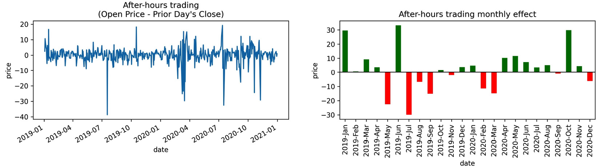
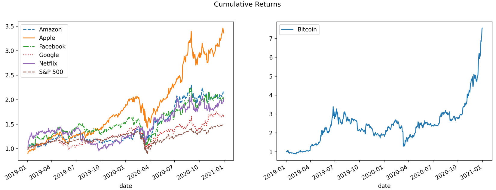

Lab 12: Financial Analysis -- Bitcoin and the Stock Market
=============================================================

Up until this point, we have been working with Python as more of a
functional programming language. However, Python also supports
**object-oriented programming** (**OOP**). This means we can build
classes that will carry out the major tasks we need to perform, which in
this lab are the following: collecting data from the Internet (with
the `StockReader` class), visualizing financial assets (with
the `Visualizer` classes), calculating financial metrics (with
the `StockAnalyzer` class), and modeling financial data (with
the `StockModeler` class). Since we will need a lot of code to
make the analysis process clean and easy to reproduce, we will build a
Python package to house these classes. The code will be reproduced in
the text and explained as usual; however, we don\'t need to type/run it
on our own---be sure to read the *Lab materials* section for this
lab to get set up properly.

The following topics will be covered in this lab:

-   Building a Python package
-   Collecting financial data
-   Conducting exploratory data analysis
-   Performing technical analysis of financial instruments
-   Modeling performance using historical data


#### Pre-reqs:
- Google Chrome (Recommended)

#### Lab Environment
Notebooks are ready to run. All packages have been installed. There is no requirement for any setup.

All examples are present in `~/work/machine-learning-essentials-module1/lab_12` folder. 


Lab materials
=================

**Note:** This package is already installed in the lab environment and ready to use

For this lab, we will be creating our own package for stock
analysis. This makes it extremely easy for us to distribute our code and
for others to use our code. The final product of this package is on
GitHub at
<https://github.com/fenago/stock-analysis/tree/2nd_edition>.


**Important note:**

We will be using this package throughout this lab. The directory for
this lab in this course\'s repository has the
`financial_analysis.ipynb` notebook we will use for our actual
analysis.
The `data/` folder contains backup files in case the data
sources have changed since publication or there are any errors when
collecting the data with the `StockReader` class; simply read
in the CSV files and follow along with the rest of this lab should
this happen. Similarly, the `exercises/` folder contains
backup files for the exercises.


Building a Python package
=========================

Building packages is considered good coding
practice since it allows for writing modular code and reuse. **Modular code** is code that is written in many smaller pieces for more pervasive
use, without needing to know the underlying implementation details of
everything involved in a task. For example, when we use
`matplotlib` to plot something, we don\'t need to know what
the code inside the functions we call is doing exactly---it suffices to
simply know what the input and output will be to build on top of it.


Package structure
-----------------

A **module** is a single
file of Python code that can
be imported; `window_calc.py` from *Lab 9*,
*Aggregating Pandas DataFrames*, and `viz.py` from *Lab 11*,
*Plotting with Seaborn and Customization Techniques*, were both modules.
A **package** is a collection of modules organized into directories.
Packages can also be imported, but when we import a package we have
access to certain modules inside, so we don\'t have to import each one
individually. This also allows us to build modules that import from each
other without the need to maintain a single very large module.

To turn modules into a package, we follow these steps:

1.  Create a directory with the name of the package
    (`stock_analysis` for this lab).
2.  Place the modules in the aforementioned directory.
3.  Add an `__init__.py` file containing any Python code to
    run upon importing the package (this can be---and often is---empty).
4.  Make a `setup.py` file at the same level as the package\'s
    top-level directory (`stock_analysis` here), which will
    give `pip` instructions on how to install the package. See
    the *Further reading* section for information on creating this.

Once the aforementioned steps are complete, the
package can be installed with `pip`. Note that, while our
package only contains a single directory, we can build a package with as
many subpackages as we desire. These subpackages are created just as if
we were creating a package, with the exception that they don\'t need a
`setup.py` file:

1.  Create a directory for the subpackage inside the main package
    directory (or inside some other subpackage).
2.  Place the subpackage\'s modules in this directory.
3.  Add the `__init__.py` file, with code that should be run
    when the subpackage is imported (this can be empty).

The directory hierarchy for a package with a single subpackage would
look something like this:

```
repo_folder
|-- <package_name>
|   |-- __init__.py
|   |-- some_module.py
|   `-- <subpackage_name>
|       |-- __init__.py
|       |-- another_module.py
|       `-- last_module.py
`-- setup.py
```


Some other things to be aware of when building a package include the
following:

-   Writing a **README** file for the repository
    so that others know what it contains (see
    <https://www.makeareadme.com/>).
-   **Linting** the code in order to conform to
    coding standards and analyze the code for possible errors (check out
    the `pylint` package at <https://www.pylint.org/>).
-   Adding tests that will make sure changes to the code don\'t break
    anything and that the code does what it is meant to do (take a look
    at the `pytest` package at
    <https://docs.pytest.org/en/latest/>).


Overview of the stock\_analysis package
---------------------------------------

In this lab, we will be creating a Python
package called `stock_analysis` using
the various Python packages we have discussed so far, along with the
Python standard library. This package is located in the
`stock-analysis` repository
(<https://github.com/fenago/stock-analysis>), which is arranged like
this:


The modules in our package will contain custom classes for conducting
the technical analysis of an asset. **Classes** should be designed for a
single purpose; this makes it easier to build, use, and debug if issues
arise. Therefore, we will be building several classes in order to cover
the various facets of our financial analysis. We will need a class for
each of following
purposes:


UML diagrams
------------

**UML diagrams** show information about which
attributes and methods classes have and how
classes are related to others. We can see in the following diagram that
all the modules rely on `utils.py` for utility functions:


Collecting financial data
=========================


Earlier, we worked with APIs to
gather data; however, there are other ways to collect data from the
Internet. We can use **web scraping** to extract
data from the HTML page itself, which `pandas` offers with the
`pd.read_html()` function --- it returns a dataframe for each of
the HTML tables it finds on the page. For economic and financial data,
an alternative is the `pandas_datareader` package, which the
`StockReader` class in the `stock_analysis` package
uses to collect financial data.

**Important note:**

In case anything has changed with the data sources that are used in this
lab or you encounter errors when using the `StockReader`
class to collect data, the CSV files in the `data/` folder can
be read in as a replacement in order to follow along with the text; for
example:

`pd.read_csv('data/bitcoin.csv', index_col='date', parse_dates=True)`


The StockReader class
---------------------

Since we will be collecting data for various
assets across the same date range, it makes sense to create a class that
hides all of the implementation details and, therefore, avoid lots of
copying and pasting (and potential mistakes). For this purpose, we will
build the `StockReader` class, which will make it easier to
collect data for bitcoin, stocks, and stock market indices. We can
simply create an instance of the `StockReader` class by
providing the date range we want for our analysis, and then use the
methods it provides to get whichever data we please. The following UML
diagram provides a high-level overview of the implementation:


The UML diagram tells us that the
`StockReader` class provides an attribute for the available
tickers (`available_tickers`) and can perform the following
actions:

-   Pull bitcoin data in the desired currency with the
    `get_bitcoin_data()` method.
-   Pull daily foreign exchange rates data with the
    `get_forex_rates()` method.
-   Pull data for an index on the stock market (such as the S&P 500)
    with the `get_index_data()` method.
-   Look up the ticker (stock market symbol) for a specific index (for
    instance, \^GSPC for the S&P 500 ticker on Yahoo! Finance) with the
    `get_index_ticker()` method.
-   Collect the risk-free rate of return with the
    `get_risk_free_rate_of_return()` method.
-   Pull data for a ticker on the stock market (such as NFLX for
    Netflix) with the `get_ticker_data()` method.

Now that we understand why we need this class and have a high-level
overview of its structure, we can proceed to looking at the code. Since
there is a lot of code in the `stock_analysis/stock_reader.py`
module to review, we will break down the file piece by piece. Note that
this may change the indentation level, so please consult the file itself
for the full version.

The first line of the module is the **docstring** for the module. If we
run `help()` on the module itself, that will appear near the
top. This describes the purpose of our module. This is
immediately followed by any imports we will need:

```
"""Gather select stock data."""
import datetime as dt
import re
import pandas as pd
import pandas_datareader.data as web
from .utils import label_sanitizer
```


Notice that the `import` statements are
organized in three groups, following **PEP 8**
(Python style guidelines available at
https://www.python.org/dev/peps/pep-0008/), which states that they
should be in the following order:

1.  Standard library imports (`datetime` and `re`)
2.  Third-party libraries (`pandas` and
    `pandas_datareader`)
3.  Relative import from another module in the
    `stock_analysis` package (`.utils`)

After our imports, we define the `StockReader` class. First,
we create a dictionary mapping tickers for indices to a descriptive name
in `_index_tickers`. Notice that our class also has a
docstring, which defines its purpose. Here, we will only reproduce a few
of the tickers available:

```
class StockReader:
    """Class for reading financial data from websites."""
    _index_tickers = {'S&P 500': '^GSPC', 'Dow Jones': '^DJI',
                      'NASDAQ': '^IXIC'}
```


When building a class, there are many **special methods** (colloquially
referred to as *dunder methods* because their names start and end with
double underscores) that we can provide to
customize the behavior of the class when it\'s used with language
operators:

-   Initialize an object (`__init__()`).
-   Make an object comparable for sorting (`__eq__()`,
    `__lt__()`, `__gt__()`, and more).
-   Perform arithmetic on the object (`__add__()`,
    `__sub__()`, `__mul__()`, and so on).
-   Be able to use built-in Python functions such as `len()`
    on it (`__len__()`).
-   Get a string representation of the object for use with the
    `print()` function (`__repr__()` and
    `__str__()`).
-   Support iteration and indexing (`__getitem__()`,
    `__iter__()`, and `__next__()`).

Thankfully, we don\'t have to write all this functionality every time we
make a class. In most cases, we just need the `__init__()`
method, which is run when we create an object. (More information on
special methods can be found at
<https://dbader.org/blog/python-dunder-methods> and
<https://docs.python.org/3/reference/datamodel.html#special-method-names.>)

Objects of the `StockReader` class hold on to the start and
end dates that data will be gathered for, so we put this in the
`__init__()` method. We parse the dates that are passed in by
the caller to allow for the use of any date separator; for example, we
will be able to handle inputs of Python `datetime` objects;
strings in the form of `'YYYYMMDD'`; or strings representing
dates using any separator that matches the non-digit regular expression
(`\D`), such as `'YYYY|MM|DD'` or
`'YYYY/MM/DD'`. The separator, if there is one, gets replaced
with an empty string so that we can build our datetimes using the
`'YYYYMMDD'` format in our method. In addition, we raise a
`ValueError` if the caller gives us a
start date equal to or after the end date:

```
    def __init__(self, start, end=None):
        """
        Create a `StockReader` object for reading across 
        a given date range.
        Parameters:
            - start: The first date to include, as a datetime 
              object or a string in the format 'YYYYMMDD'.
            - end: The last date to include, as a datetime
              object or string in the format 'YYYYMMDD'.
              Defaults to today if not provided.
        """
        self.start, self.end = map(
            lambda x: x.strftime('%Y%m%d')\
                if isinstance(x, dt.date)\
                else re.sub(r'\D', '', x),
            [start, end or dt.date.today()]
        )
        if self.start >= self.end:
            raise ValueError('`start` must be before `end`')
```


Note that we didn\'t define `_index_tickers` in the
`__init__()` method, which is called upon creation of this
object, because we only need one copy of this information for all the
objects that are created from this class. The
`_index_tickers` class attribute is private (signified, by
convention, with a preceding underscore) in the sense that unless a user
of this class knows the name of it, they won\'t find it easily (note
that methods can also be private). This is done with the intention of
protecting it (although it isn\'t guaranteed) and also because the user
doesn\'t need it directly (it\'s for the internal workings of the
class). Instead, we will provide a **property**, which we can access as
an attribute, and a class method for getting the value mapped to a given
key in that dictionary.

**Tip:** 

**Class methods** are methods that can be used on
the class itself, without having to create an instance of the class
beforehand. This contrasts with the instance
methods we have seen so far. **Instance methods**
are used with instances of a class for actions specific to that
instance. We often don\'t need class methods, but if we have data that
is shared across all instances of a class, it makes more sense to create
a class method rather than an instance method.

Since `_index_tickers` is private, we want to provide an easy
way for users of our class to see what is available. Therefore, we will
create a property for the keys of `_index_tickers`. To do so,
we use the `@property` decorator. **Decorators** are functions
that wrap around other functions, allowing for the
execution of extra code before and/or after the inner function executes.
This class makes heavy use of decorators: we will use some already
written ones (`@property` and `@classmethod`) and
write one of our own to clean up and standardize the results across the
methods that gather the data (`@label_sanitizer`). To use a
decorator, we place it above the function or method definition:

```
    @property
    def available_tickers(self):
        """Indices whose tickers are supported."""
        return list(self._index_tickers.keys())
```


Furthermore, we provide a way of getting the ticker using a class method
because our tickers are stored in a class variable. Class methods, by
convention, receive `cls` as their first argument
while instance methods receive `self`:

```
    @classmethod
    def get_index_ticker(cls, index):
        """
        Get the ticker of the specified index, if known.
        Parameters:
            - index: The name of the index; check 
              `available_tickers` for full list which includes:
                - 'S&P 500' for S&P 500,
                - 'Dow Jones' for Dow Jones Industrial Average,
                - 'NASDAQ' for NASDAQ Composite Index
        Returns: 
            The ticker as a string if known, otherwise `None`.
        """
        try:
            index = index.upper()
        except AttributeError:
            raise ValueError('`index` must be a string')
        return cls._index_tickers.get(index, None)
```


**Tip:** 

If we want to prohibit certain actions within our code, we can check for
them and `raise` errors as we see fit; this allows us to
provide more informative error messages or simply accompany specific
errors with some additional actions before reraising them (by using
`raise` without an expression). If, instead, we wish to run
certain code when something goes wrong, we use a
`try...except` block: we surround the possibly troublesome
code with `try` and put what to do if trouble occurs in the
`except` clause.

When we get to the *Technical analysis of financial instruments*
section, we will need the risk-free rate of return to calculate some of
the metrics. This is the rate of return of an investment that has no
risk of financial loss; in practice, we use the 10-year US Treasury
bill. Since this rate will depend on the date range we are analyzing, we
will add this functionality to the `StockReader` class and
avoid having to look it up ourselves. We will use
the `pandas_datareader` package to collect this data from the
Federal Reserve Bank of St. Louis
(<https://fred.stlouisfed.org/series/DGS10>), providing the option to
return the daily rates for the date range we are studying (to analyze
the data itself) or just the last one (if we need a single value for a
calculation):

```
    def get_risk_free_rate_of_return(self, last=True):
        """
        Get risk-free rate of return w/ 10-year US T-bill 
        from FRED (https://fred.stlouisfed.org/series/DGS10)
        Parameter:
            - last: If `True`, return the rate on the last
              date in the date range else, return a `Series` 
              object for the rate each day in the date range.
        Returns:
            A single value or a `pandas.Series` object.
        """
        data = web.DataReader(
            'DGS10', 'fred', start=self.start, end=self.end
        )
        data.index.rename('date', inplace=True)
        data = data.squeeze()
        return data.asof(self.end) \
            if last and isinstance(data, pd.Series) else data
```


The remaining method code is replaced with `pass`, which tells
Python to do nothing (and reminds us to update it
later) so that the code can function as it was reproduced. We will write
the following methods in the next section:

```
    @label_sanitizer
    def get_ticker_data(self, ticker):
        pass    
    def get_index_data(self, index):
        pass
    def get_bitcoin_data(self, currency_code):
        pass
    @label_sanitizer 
    def get_forex_rates(self, from_currency, to_currency,
                        **kwargs):
        pass
```


**Important note:**

Since we aren\'t going to be looking at foreign exchange rates, we
won\'t cover the `get_forex_rates()` method in this lab;
however, this method provides an additional example of how to use the
`pandas_datareader` package, so I encourage you to take a look
at it. Note that, in order to use this method, you will need to get a
free API key from AlphaVantage at
<https://www.alphavantage.co/support/#api-key>.

Both the `get_ticker_data()` and `get_forex_rates()`
methods are decorated with `@label_sanitizer`, which aligns
the data we receive from various sources to the same
column names so that we don\'t have to clean them
later. The `@label_sanitizer` decorator is defined in the
`stock_analysis/utils.py` module. As we did previously, let\'s
begin by looking at the docstring and imports of the `utils`
module:

```
"""Utility functions for stock analysis."""
from functools import wraps
import re
import pandas as pd
```


Next, we have the `_sanitize_label()` function, which will
clean up a single label. Note that we prefix the function name with an
underscore because we don\'t intend for the users of our package to use
this directly---it is for our decorator to use:

```
def _sanitize_label(label):
    """
    Clean up a label by removing non-letter, non-space 
    characters and putting in all lowercase with underscores
    replacing spaces.
    Parameters:
        - label: The text you want to fix.
    Returns: 
        The sanitized label.
    """
    return re.sub(r'[^\w\s]', '', label)\
        .lower().replace(' ', '_')
```


Finally, we define the `@label_sanitizer` decorator, which is
a function that cleans up the column and index
names in the data we get from the Internet. Without this decorator, the
column names in our collected data could have unexpected characters such
as asterisks or spaces in them, making them unwieldy. By using the
decorator, the methods will always return a dataframe with the names
cleaned, saving us a step:

```
def label_sanitizer(method):
    """
    Decorator around a method that returns a dataframe to
    clean up all labels in said dataframe (column names and 
    index name) by using `_sanitize_label()`.
    Parameters:
        - method: The method to wrap.
    Returns: 
        A decorated method or function.
    """
    @wraps(method) # keep original docstring for help()
    def method_wrapper(self, *args, **kwargs):
        df = method(self, *args, **kwargs)
        # fix the column names
        df.columns = [
            _sanitize_label(col) for col in df.columns
        ]
        # fix the index name
        df.index.rename(
            _sanitize_label(df.index.name), inplace=True
        )
        return df
    return method_wrapper
```


Note that there is also a decorator inside the
definition of the `label_sanitizer()` function. The
`@wraps` decorator from the `functools` module in
the standard library gives the decorated function/method the same
docstring it had beforehand; this is necessary because decoration
actually creates a new function/method, thus rendering
`help()` pretty useless unless we intervene.

**Tip:** 

Using the `@label_sanitizer` syntax is **syntactic sugar**,
meaning that it makes it easier to express, compared to defining the
method and then writing `method = label_sanitizer(method)`.
However, both are valid.

Now that we understand decorators, we are ready to finish building the
`StockReader` class. Note that we will be using and creating
additional decorators for the other classes in the
`stock_analysis` package as well, so make sure that you are
comfortable with them before moving on.


Collecting historical data from Yahoo! Finance
----------------------------------------------

The foundation of our data
collection will be the
`get_ticker_data()` method. It uses the
`pandas_datareader` package to grab the data from Yahoo!
Finance:

```
@label_sanitizer
def get_ticker_data(self, ticker):
    """
    Get historical OHLC data for given date range and ticker.
    Parameter:
        - ticker: The stock symbol to lookup as a string.
    Returns: A `pandas.DataFrame` object with the stock data.
    """
    return web.get_data_yahoo(ticker, self.start, self.end)
```


**Important note:**

There have been issues with `pandas_datareader` and the Yahoo!
Finance API in the past, causing the `pandas_datareader`
developers to deprecate support for it via the
`web.DataReader()` function
(<https://pandas-datareader.readthedocs.io/en/latest/whatsnew.html#v0-6-0-january-24-2018>);
instead, we have to use their workaround:
`web.get_data_yahoo()`.

To collect data for a stock market index, we can use the
`get_index_data()` method, which first looks up the index\'s
ticker and then calls the `get_ticker_data()` method we just
defined. Note that since the `get_ticker_data()` method
is decorated with `@label_sanitizer`,
the `get_index_data()` method doesn\'t
need the `@label_sanitizer` decorator:

```
def get_index_data(self, index):
    """
    Get historical OHLC data from Yahoo! Finance
    for the chosen index for given date range.
    Parameter:
        - index: String representing the index you want
          data for, supported indices include:
            - 'S&P 500' for S&P 500,
            - 'Dow Jones' for Dow Jones Industrial Average,
            - 'NASDAQ' for NASDAQ Composite Index
    Returns: 
        A `pandas.DataFrame` object with the index data.
    """
    if index not in self.available_tickers:
        raise ValueError(
            'Index not supported. Available tickers'
            f"are: {', '.join(self.available_tickers)}"
        )
    return self.get_ticker_data(self.get_index_ticker(index))
```


Yahoo! Finance also provides data for bitcoin;
however, we must pick a currency to use. The
`get_bitcoin_data()` method accepts a currency code to create
the symbol for the search on Yahoo! Finance (for instance, BTC-USD for
bitcoin data in USD). The actual collection of the
data is once again handled by the
`get_ticker_data()` method:

```
def get_bitcoin_data(self, currency_code):
    """
    Get bitcoin historical OHLC data for given date range. 
    Parameter:
        - currency_code: The currency to collect the bitcoin
          data in, e.g. USD or GBP.
    Returns: 
        A `pandas.DataFrame` object with the bitcoin data.
    """
    return self\
        .get_ticker_data(f'BTC-{currency_code}')\
        .loc[self.start:self.end] # clip dates
```


At this point, the `StockReader` class is ready for use, so
let\'s get started in the `financial_analysis.ipynb` notebook
and import the `stock_analysis` package that will be used for
the rest of this lab:

```
>>> import stock_analysis
```


Python runs the `stock_analysis/__init__.py` file when we
import the `stock_analysis` package:

```
"""Classes for making technical stock analysis easier."""
from .stock_analyzer import StockAnalyzer, AssetGroupAnalyzer
from .stock_modeler import StockModeler
from .stock_reader import StockReader
from .stock_visualizer import \
    StockVisualizer, AssetGroupVisualizer
```


**Important note:**

The code in the `stock_analysis/__init__.py` file makes it
easier for us to access the package\'s classes---for example, rather
than having to run
`stock_analysis.stock_reader.StockReader()`, we only have to
run `stock_analysis.StockReader()`to create a
`StockReader` object.

Next, we will an
instance of the `StockReader` class by providing the start and
(optionally) end dates for the data it will collect. We will work with
2019-2020 data. Note that when we run this code, Python is calling the
`StockReader.__init__()` method:

```
>>> reader = \
...     stock_analysis.StockReader('2019-01-01', '2020-12-31')
```


Now, we will collect the **Facebook, Apple, Amazon, Netflix, and
Google** (**FAANG**), S&P 500, and bitcoin data.
Since all the stocks we are working with are priced in USD, we will ask
for the bitcoin data in USD. Note that we are using a generator
expression and multiple assignment to get dataframes for each FAANG
stock:

```
>>> fb, aapl, amzn, nflx, goog = (
...     reader.get_ticker_data(ticker)
...     for ticker in ['FB', 'AAPL', 'AMZN', 'NFLX', 'GOOG']
... )
>>> sp = reader.get_index_data('S&P 500')
>>> bitcoin = reader.get_bitcoin_data('USD') 
```


**Tip:** 

Be sure to run `help(stock_analysis.StockReader)` or
`help(reader)` to see all the methods
and properties that are defined. The output
clearly denotes which methods are class methods in a different section,
and the properties will be listed at the bottom in the **data
descriptors** section. This is an important step to take in order to get
familiar with new code.


Exploratory data analysis
=========================

Just as we did with the `StockReader` class, we want to make it easier to visualize
both individual assets and groups of assets, so rather than expecting
users of our package (and, perhaps, our collaborators) to be proficient
with `matplotlib` and `seaborn`, we will create
wrappers around this functionality. This means that users of this
package only have to be able to use the `stock_analysis`
package to visualize their financial data. In addition, we are able to
set a standard for how the visualizations look and avoid copying and
pasting large amounts of code for each new analysis we want to conduct,
which brings consistency and efficiency gains.

To make all of this possible, we have the `Visualizer` classes
in `stock_analysis/stock_visualizer.py`. There are three
classes in this file:

-   `Visualizer`: This is the base class for defining the
    functionality of a `Visualizer` object. Most of the
    methods are **abstract**, meaning that the subclasses (children)
    that inherit from this superclass (parent) will need to override
    them and implement the code; these define what an object should do,
    without getting into the specifics.
-   `StockVisualizer`: This is the subclass we will use to
    visualize a single asset.
-   `AssetGroupVisualizer`: This is the subclass we will use
    to visualize multiple assets using `groupby()` operations.

Before we discuss the code for these classes,
let\'s go over some additional functions in the
`stock_analysis/utils.py` file, which will help create these
asset groups and describe them for EDA purposes. For these functions, we
need to import `pandas`:

```
import pandas as pd
```


The `group_stocks()` function takes in a dictionary that maps
the name of the asset to the dataframe for that asset and outputs a new
dataframe with all the data from the input dataframes and a new column,
denoting which asset the data belongs to:

```
def group_stocks(mapping):
    """
    Create a new dataframe with many assets and a new column 
    indicating the asset that row's data belongs to.
    Parameters:
        - mapping: A key-value mapping of the form 
                   {asset_name: asset_df}
    Returns: 
        A new `pandas.DataFrame` object
    """
    group_df = pd.DataFrame()
    for stock, stock_data in mapping.items():
        df = stock_data.copy(deep=True)
        df['name'] = stock
        group_df = group_df.append(df, sort=True)
    group_df.index = pd.to_datetime(group_df.index)
    return group_df
```


Let\'s take a look at how this is defined in the
`stock_analysis/utils.py` file:

```
def validate_df(columns, instance_method=True):
    """
    Decorator that raises a `ValueError` if input isn't a
    `DataFrame` or doesn't contain the proper columns. Note 
    the `DataFrame` must be the first positional argument
    passed to this method.
    Parameters:
        - columns: A set of required column names.
          For example, {'open', 'high', 'low', 'close'}.
        - instance_method: Whether or not the item being
          decorated is an instance method. Pass `False` to 
          decorate static methods and functions.
    Returns:
        A decorated method or function.
    """
    def method_wrapper(method):
        @wraps(method)
        def validate_wrapper(self, *args, **kwargs):
            # functions and static methods don't pass self so
            # self is the 1st positional argument in that case
            df = (self, *args)[0 if not instance_method else 1]
            if not isinstance(df, pd.DataFrame):
                raise ValueError(
                    'Must pass in a pandas `DataFrame`'
                )
            if columns.difference(df.columns):
                raise ValueError(
                    'Dataframe must contain the following'
                    f' columns: {columns}'
                )
            return method(self, *args, **kwargs)
        return validate_wrapper
    return method_wrapper
```


Groups made with the `group_stocks()` function can be
described in a single output using the
`describe_group()` function. The `group_stocks()`
function adds a column called `name` that
`describe_group()` looks for, so we use the
`@validate_df` decorator to make sure that the format is
correct before trying to run the function:

```
@validate_df(columns={'name'}, instance_method=False)
def describe_group(data):
    """
    Run `describe()` on the asset group.
    Parameters:
        - data: Grouped data resulting from `group_stocks()`
    Returns: 
        The transpose of the grouped description statistics.
    """
    return data.groupby('name').describe().T
```


Let\'s use the `group_stocks()` function
to make some asset groups for our analysis:

```
>>> from stock_analysis.utils import \
...     group_stocks, describe_group
>>> faang = group_stocks({
...     'Facebook': fb, 'Apple': aapl, 'Amazon': amzn, 
...     'Netflix': nflx, 'Google': goog
... })
>>> faang_sp = group_stocks({
...     'Facebook': fb, 'Apple': aapl, 'Amazon': amzn, 
...     'Netflix': nflx, 'Google': goog, 'S&P 500': sp
... })
>>> all_assets = group_stocks({
...     'Bitcoin': bitcoin, 'S&P 500': sp, 'Facebook': fb, 
...     'Apple': aapl, 'Amazon': amzn, 'Netflix': nflx, 
...     'Google': goog
... })
```


Using these groups, the output of `describe()` can be much
more informative for comparison purposes compared to running it on each
dataframe separately. The `describe_group()` function handles
running `describe()` with `groupby()`. This makes it
easier to look at the summary for the closing price across assets:

```
>>> describe_group(all_assets).loc['close',]
```


At a glance, we can see that we have more data for bitcoin than the
rest. This is because the prices change daily, whereas for stocks, we
only see the data for trading days. Another thing we can glean from this
is scale; bitcoin is not only much more volatile but is much higher in
value than everything else:


](./images/Figure_7.6_B16834.jpg)


If we don\'t want to look at the assets
individually, we can combine them into a portfolio, which we can treat
as a single asset. The `make_portfolio()` function from
`stock_analysis/utils.py` groups the data by date and sums all
the columns, giving us the total stock price and volume traded of our
portfolio:

```
@validate_df(columns=set(), instance_method=False)
def make_portfolio(data, date_level='date'):
    """
    Make a portfolio of assets by grouping by date and 
    summing all columns.
    Note: the caller is responsible for making sure the 
    dates line up across assets and handling when they don't.
    """
    return data.groupby(level=date_level).sum()
```


The Visualizer class family
---------------------------

As we learned from previous labs,
visualization will make our analysis much easier,
so let\'s begin our discussion of the `Visualizer` classes in
`stock_analysis/stock_visualizer.py`. First, we will define
our base class, `Visualizer`. The following UML diagram tells
us this is our base class because it has arrows pointing to it. These
arrows originate from the subclasses (`AssetGroupVisualizer`
and `StockVisualizer`):


We start the module with our docstring and imports. For our
visualizations, we will need `matplotlib`, `numpy`,
`pandas`, and `seaborn`, along with
`mplfinance` (a `matplotlib` derivative package for
financial visualizations):

```
"""Visualize financial instruments."""
import math
import matplotlib.pyplot as plt
import mplfinance as mpf
import numpy as np
import pandas as pd
import seaborn as sns
from .utils import validate_df
```


Next, we begin by defining the `Visualizer` class. This class
will hold the data it will be used to
visualize, so we put this in the
`__init__()` method:

```
class Visualizer:
    """Base visualizer class not intended for direct use."""
    @validate_df(columns={'open', 'high', 'low', 'close'})
    def __init__(self, df):
        """Store the input data as an attribute."""
        self.data = df
```


This base class will provide us with **static
methods** for adding reference lines to plots and also adding shaded
regions, without needing to remember which `matplotlib`
function we need to call for the orientation; static methods don\'t
depend on the class for data. We define the
`add_reference_line()` method for adding horizontal or
vertical lines (and anything in between) using the
`@staticmethod` decorator; notice we don\'t have
`self` or `cls` as the first argument:

```
    @staticmethod
    def add_reference_line(ax, x=None, y=None, **kwargs):
        """
        Static method for adding reference lines to plots.
        Parameters:
            - ax: `Axes` object to add the reference line to.
            - x, y: The x, y value to draw the line at as a 
              single value or numpy array-like structure.
                - For horizontal: pass only `y`
                - For vertical: pass only `x`
                - For AB line: pass both `x` and `y`
            - kwargs: Additional keyword args. to pass down.
        Returns:
            The matplotlib `Axes` object passed in.
        """
        try:
            # numpy array-like structures -> AB line
            if x.shape and y.shape:
                ax.plot(x, y, **kwargs)
        except:
            # error triggers if x or y isn't array-like
            try:
                if not x and not y:
                    raise ValueError(
                        'You must provide an `x` or a `y`'
                    )
                elif x and not y:
                    ax.axvline(x, **kwargs) # vertical line
                elif not x and y:
                    ax.axhline(y, **kwargs) # horizontal line
            except:
                raise ValueError(
                    'If providing only `x` or `y`, '
                    'it must be a single value'
                )
        ax.legend()
        return ax
```


**Tip:** 

See the *Further reading* section for more information on class methods,
static methods, and abstract methods.

The `shade_region()` static method for
adding shaded regions to a plot is similar to the
`add_reference_line()` static method:

```
    @staticmethod
    def shade_region(ax, x=tuple(), y=tuple(), **kwargs):
        """
        Static method for shading a region on a plot.
        Parameters:
            - ax: `Axes` object to add the shaded region to.
            - x: Tuple with the `xmin` and `xmax` bounds for 
              the rectangle drawn vertically.
            - y: Tuple with the `ymin` and `ymax` bounds for 
              the rectangle drawn horizontally.
            - kwargs: Additional keyword args. to pass down.
        Returns: 
            The matplotlib `Axes` object passed in.
        """
        if not x and not y:
            raise ValueError(
                'You must provide an x or a y min/max tuple'
            )
        elif x and y:
            raise ValueError('You can only provide x or y.')
        elif x and not y:
            ax.axvspan(*x, **kwargs) # vertical region
        elif not x and y:
            ax.axhspan(*y, **kwargs) # horizontal region
        return ax
```


Since we want our plotting capabilities to
be flexible, we are going to define a static
method that will make it easy for us to plot one or many items without
needing to check the number of items beforehand. This will be utilized
in the classes we build using the `Visualizer` class as our
base:

```
    @staticmethod
    def _iter_handler(items):
        """
        Static method for making a list out of an item if 
        it isn't a list or tuple already.
        Parameters:
            - items: The variable to make sure it is a list.
        Returns: The input as a list or tuple.
        """
        if not isinstance(items, (list, tuple)):
            items = [items]
        return items
```


We want to support window functions for
single assets and groups of them; however, the
implementation of this will vary, so we will
define an **abstract method** (a method without implementation) in the
superclass, and the subclasses will override it to provide the
implementation:

```
    def _window_calc(self, column, periods, name, func, 
                     named_arg, **kwargs):
        """
        To be implemented by subclasses. Defines how to add 
        lines resulting from window calculations.
        """
        raise NotImplementedError('To be implemented by '
                                  'subclasses.')
```


This allows us to define functionality that depends on
`_window_calc()` but doesn\'t need to know the
exact implementation, just the result. The
`moving_average()` method uses
`_window_calc()` to add moving average lines to the plot:

```
    def moving_average(self, column, periods, **kwargs):
        """
        Add line(s) for the moving average of a column.
        Parameters:
            - column: The name of the column to plot.
            - periods: The rule or list of rules for 
              resampling, like '20D' for 20-day periods.
            - kwargs: Additional arguments to pass down.
        Returns: A matplotlib `Axes` object.
        """
        return self._window_calc(
            column, periods, name='MA', named_arg='rule',
            func=pd.DataFrame.resample, **kwargs
        )
```


In a similar fashion, we define the `exp_smoothing()` method,
which will use `_window_calc()` to add exponentially smoothed
moving average lines to the plot:

```
    def exp_smoothing(self, column, periods, **kwargs):
        """
        Add line(s) for the exponentially smoothed moving 
        average of a column.
        Parameters:
            - column: The name of the column to plot.
            - periods: The span or list of spans for,
              smoothing like 20 for 20-day periods.
            - kwargs: Additional arguments to pass down.
        Returns: 
            A matplotlib `Axes` object.
        """
        return self._window_calc(
            column, periods, name='EWMA',
            func=pd.DataFrame.ewm, named_arg='span', **kwargs
        )
```


Note that while we have methods
for adding the moving average and the
exponentially smoothed moving average to a plot of a column, they both
call `_window_calc()`, which isn\'t defined here. This is
because each of the subclasses will have its own implementation of
`_window_calc()`, while they will inherit the top-level method
without the need to override `moving_average()` or
`exp_smoothing()`.

**Important note:**

Remember that methods preceded with a single underscore (`_`)
are Python\'s version of **private methods**---they
can still be accessed outside this class, but they
don\'t show up when we run `help()` on objects of that class.
We created `_window_calc()` as a private method because users
of the `Visualizer` classes will only need to call
`moving_average()` and `exp_smoothing()`.

Finally, we will add placeholders for the methods all subclasses will
have. These are abstract methods that will be defined by each subclass
individually because the implementation will be
different depending on if we are visualizing a
single asset or a group of them. For brevity, the
following is a subset of the abstract methods defined in this class:

```
    def evolution_over_time(self, column, **kwargs):
        """Creates line plots."""
        raise NotImplementedError('To be implemented by '
                                  'subclasses.')
    def after_hours_trades(self):
        """Show the effect of after-hours trading."""
        raise NotImplementedError('To be implemented by '
                                  'subclasses.')
    def pairplot(self, **kwargs):
        """Create pairplots."""
        raise NotImplementedError('To be implemented by '
                                  'subclasses.')
```


The subclasses will also define any methods that are unique to them
and/or override the implementation of the `Visualizer` class,
if necessary. Anything they don\'t override, they will inherit. By using
**inheritance**, we can define a broad class such as
`Visualizer` by what all `Visualizers` should do and
then have more specific versions, such as the
`StockVisualizer` class, which handles
single assets only.


Visualizing a stock
-------------------

Let\'s start the `StockVisualizer` class
by inheriting from `Visualizer`; we will choose not to
override the `__init__()` method because the
`StockVisualizer` class will only have a dataframe as an
attribute. Instead, we will provide implementations for the methods that
need to be added (which are unique to this class) or overridden.

**Important note:**

We will only cover a subset of the functionality in the interest of
brevity; however, I highly encourage you to both read through the full
code base and test out the functionality in the notebook.

The first method we will override is
`evolution_over_time()`, which will create a line plot of a
column over time:

```
class StockVisualizer(Visualizer):
    """Visualizer for a single stock."""
    def evolution_over_time(self, column, **kwargs):
        """
        Visualize the evolution over time of a column.
        Parameters:
            - column: The name of the column to visualize.
            - kwargs: Additional arguments to pass down.
        Returns:
            A matplotlib `Axes` object.
        """
        return self.data.plot.line(y=column, **kwargs)
```


Next, we will use `mplfinance` to create
a **candlestick plot**, which is a way to visualize the OHLC data
together. Each row of the OHLC time series will be plotted as a
candlestick. When the candlestick is black, the asset\'s closing price
was smaller than the opening price (it lost
value); when the candlestick is white, the asset\'s closing price was
higher than its opening price, as illustrated in the following diagram:


The `candlestick()` method also provides options to resample
the data, show volume traded, and plot a specific date range:

```
    def candlestick(self, date_range=None, resample=None, 
                    volume=False, **kwargs):
        """
        Create a candlestick plot for the OHLC data.
        Parameters:
            - date_range: String or `slice()` of dates to 
              pass to `loc[]`, if `None` the plot will be 
              for the full range of the data.
            - resample: The offset to use for resampling 
              the data, if desired.
            - volume: Whether to show a bar plot for volume 
              traded under the candlesticks
            - kwargs: Keyword args for `mplfinance.plot()`
        """
        if not date_range:
            date_range = slice(
                self.data.index.min(), self.data.index.max()
            )
        plot_data = self.data.loc[date_range]
        if resample:
            agg_dict = {
                'open': 'first', 'close': 'last',
                'high': 'max', 'low': 'min', 'volume': 'sum'
            }
            plot_data = plot_data.resample(resample).agg({
                col: agg_dict[col] for col in plot_data.columns
                if col in agg_dict
            })
        mpf.plot(
            plot_data, type='candle', volume=volume, **kwargs
        )
```


Now, we add the `after_hours_trades()` method, which helps us
visualize the effect after-hours trading had on an
individual asset, with bars colored red for losses and green for gains:

```
    def after_hours_trades(self):
        """
        Visualize the effect of after-hours trading.
        Returns: A matplotlib `Axes` object.
        """
        after_hours = self.data.open - self.data.close.shift()
        monthly_effect = after_hours.resample('1M').sum()
        fig, axes = plt.subplots(1, 2, figsize=(15, 3))
        after_hours.plot(
            ax=axes[0],
            title='After-hours trading\n'
                  '(Open Price - Prior Day\'s Close)'
        ).set_ylabel('price')
        monthly_effect.index = \
            monthly_effect.index.strftime('%Y-%b')
        monthly_effect.plot(
            ax=axes[1], kind='bar', rot=90,
            title='After-hours trading monthly effect',
            color=np.where(monthly_effect >= 0, 'g', 'r')
        ).axhline(0, color='black', linewidth=1)
        axes[1].set_ylabel('price')
        return axes
```


Next, we will add a static method that will allow us to fill the area
between two curves of our choosing. The
`fill_between()` method will use
`plt.fill_between()` to color the area green or red depending
on which curve is higher:

```
    @staticmethod
    def fill_between(y1, y2, title, label_higher, label_lower, 
                     figsize, legend_x):
        """
        Visualize the difference between assets.
        Parameters:
            - y1, y2: Data to plot, filling y2 - y1.
            - title: The title for the plot.
            - label_higher: Label for when y2 > y1.
            - label_lower: Label for when y2 <= y1.
            - figsize: (width, height) for the plot dimensions.
            - legend_x: Where to place legend below the plot.
        Returns: A matplotlib `Axes` object.
        """
        is_higher = y2 - y1 > 0
        fig = plt.figure(figsize=figsize)
        for exclude_mask, color, label in zip(
            (is_higher, np.invert(is_higher)),
            ('g', 'r'),
            (label_higher, label_lower)
        ):
            plt.fill_between(
                y2.index, y2, y1, figure=fig,
                where=exclude_mask, color=color, label=label
            )
        plt.suptitle(title)
        plt.legend(
            bbox_to_anchor=(legend_x, -0.1),
            framealpha=0, ncol=2
        )
        for spine in ['top', 'right']:
            fig.axes[0].spines[spine].set_visible(False)
        return fig.axes[0]
```


The `open_to_close()` method will help us visualize the daily
differential between opening and closing price via the
`fill_between()` static method. We will color the area green
if the closing price is higher than the opening
price and red if the opposite is true:

```
    def open_to_close(self, figsize=(10, 4)):
        """
        Visualize the daily change in price from open to close.
        Parameters:
            - figsize: (width, height) of plot
        Returns:
            A matplotlib `Axes` object.
        """
        ax = self.fill_between(
            self.data.open, self.data.close, 
            figsize=figsize, legend_x=0.67,
            title='Daily price change (open to close)',
            label_higher='price rose', label_lower='price fell'
        )
        ax.set_ylabel('price')
        return ax
```


In addition to visualizing the differential between the opening and
closing price of an individual asset, we will want to compare prices
between assets. The `fill_between_other()` method will help us
visualize the differential between the asset we created the visualizer
for and another asset, using `fill_between()` again. We will
color the differential green when the
visualizer\'s asset is higher than the other asset and red for when it
is lower:

```
    def fill_between_other(self, other_df, figsize=(10, 4)):
        """
        Visualize difference in closing price between assets.
        Parameters:
            - other_df: The other asset's data.
            - figsize: (width, height) for the plot.
        Returns: 
            A matplotlib `Axes` object.
        """
        ax = self.fill_between(
            other_df.open, self.data.close, figsize=figsize, 
            legend_x=0.7, label_higher='asset is higher', 
            label_lower='asset is lower', 
            title='Differential between asset price '
                  '(this - other)'
        )
        ax.set_ylabel('price')
        return ax 
```


The time has finally come to override the `_window_calc()`
method, which defines how to add reference lines based on window
calculations for a single asset. Note how we are able to use the
`pipe()` method to make our window calculation plots
work with different functions, and the `_iter_handler()`
method to make our loop work without having to check if we have more
than one reference line to plot:

```
    def _window_calc(self, column, periods, name, func, 
                     named_arg, **kwargs):
        """
        Helper method for plotting a series and adding
        reference lines using a window calculation.
        Parameters:
            - column: The name of the column to plot.
            - periods: The rule/span or list of them to pass 
              to the resampling/smoothing function, like '20D'
              for 20-day periods (resampling) or 20 for a 
              20-day span (smoothing)
            - name: The name of the window calculation (to 
              show in the legend).
            - func: The window calculation function.
            - named_arg: The name of the argument `periods` 
              is being passed as.
            - kwargs: Additional arguments to pass down.
        Returns:
            A matplotlib `Axes` object.
        """
        ax = self.data.plot(y=column, **kwargs)
        for period in self._iter_handler(periods):
            self.data[column].pipe(
                func, **{named_arg: period}
            ).mean().plot(
                ax=ax, linestyle='--',
                label=f"""{period if isinstance(
                    period, str
                ) else str(period) + 'D'} {name}"""
            )
        plt.legend()
        return ax
```


So far, each visualization concerned data for a
single asset; however, sometimes we want to be able to visualize the
relationship between assets, so we will build a wrapper around the
`jointplot()` function from `seaborn`:

```
    def jointplot(self, other, column, **kwargs):
        """
        Generate a seaborn jointplot for given column in 
        this asset compared to another asset.
        Parameters:
            - other: The other asset's dataframe.
            - column: Column to use for the comparison.
            - kwargs: Keyword arguments to pass down.
        Returns: A seaborn jointplot
        """
        return sns.jointplot(
            x=self.data[column], y=other[column], **kwargs
        )
```


Another way of viewing the relationship between assets is the
correlation matrix. `DataFrame` objects have a
`corrwith()` method that will calculate the correlation
coefficient between each column and the same column (by name) in another
dataframe. This doesn\'t fill the matrix that\'s needed for a heatmap,
as we saw in previous labs; rather, it is the diagonal. The
`correlation_heatmap()` method creates a matrix for the
`sns.heatmap()` function and fills in the diagonal with the
correlation coefficients; then, it makes sure that only the diagonal is
displayed using a mask. In addition, we will use
the daily percentage change of each column when calculating the
correlations to handle the difference in scale (for instance, between
Apple\'s stock price and Amazon\'s stock price):

```
    def correlation_heatmap(self, other):
        """
        Plot the correlations between this asset and another
        one with a heatmap.
        Parameters:
            - other: The other dataframe.
        Returns: A seaborn heatmap
        """
        corrs = \
            self.data.pct_change().corrwith(other.pct_change())
        corrs = corrs[~pd.isnull(corrs)]
        size = len(corrs)
        matrix = np.zeros((size, size), float)
        for i, corr in zip(range(size), corrs):
            matrix[i][i] = corr
        # create mask to only show diagonal
        mask = np.ones_like(matrix)
        np.fill_diagonal(mask, 0)
        return sns.heatmap(
            matrix, annot=True, center=0, vmin=-1, vmax=1,
            mask=mask, xticklabels=self.data.columns, 
            yticklabels=self.data.columns
        )
```


Now that we understand some of the functionality
available in the `StockVisualizer` class, we can begin our
exploratory analysis. Let\'s create a `StockVisualizer` object
to perform some EDA on the Netflix stock data:

```
>>> %matplotlib inline
>>> import matplotlib.pyplot as plt
>>> netflix_viz = stock_analysis.StockVisualizer(nflx)
```


Once we initialize our `StockVisualizer` object with the
Netflix dataframe, we can generate many different plot types. We won\'t
go over examples of everything this object lets us do (I will leave that
up to you to experiment with), but let\'s take a look at the closing
price over time with some moving averages to study the trend:

```
>>> ax = netflix_viz.moving_average('close', ['30D', '90D'])
>>> netflix_viz.shade_region(
...     ax, x=('2019-10-01', '2020-07-01'), 
...     color='blue', alpha=0.1
... )
>>> ax.set(title='Netflix Closing Price', ylabel='price ($)')
```


These moving averages give us a smoothed version of the stock price
curve. Notice that, in the shaded region, the 90-day moving average is
acting like a ceiling for the stock price:


Below figure shows an example of how support (green) and resistance
(red) act as lower and upper bounds, respectively, for the stock price;
once the price hits either of these bounds, it tends to bounce back in
the opposite direction due to buyers/sellers of the stock taking action:


Often, the **exponentially weighted moving average** (**EWMA**) can
provide a better trend
we can put additional emphasis on more recent values. Let\'s see how
exponential smoothing looks for our data:

```
>>> ax = netflix_viz.exp_smoothing('close', [30, 90]) 
>>> netflix_viz.shade_region(
...     ax, x=('2020-04-01', '2020-10-01'),
...     color='blue', alpha=0.1
... )
>>> ax.set(title='Netflix Closing Price', ylabel='price ($)')
```


The 90-day EWMA appears to be acting as the support level in the shaded region:


In the exercises for *Lab 5*,
*Visualizing Data with Pandas and Matplotlib*, we wrote code for
generating a visualization that represented the effect that after-hours
trading had on Facebook; the `StockVisualizer` class also has
this functionality. Let\'s use the `after_hours_trades()`
method to see how Netflix fared:

```
>>> netflix_viz.after_hours_trades()
```


Netflix had a rough third quarter in 2019 in terms of after-hours
trades:





We can use candlestick plots to study the OHLC data. Let\'s create one
for Netflix, along with a bar plot for volume traded, by using the
`candlestick()` method. We will also resample
the data into 2-week intervals to improve the
visibility of the candlesticks:

```
>>> netflix_viz.candlestick(
...     resample='2W', volume=True, xrotation=90, 
...     datetime_format='%Y-%b '
... )
```


**Tip:** 

Traders use candlestick plots to look for and
analyze patterns in an asset\'s performance, which can be used to make
trading decisions. Check out this article for an introduction to
candlestick plots and some common patterns traders look for:
<https://www.investopedia.com/trading/candlestick-charting-what-is-it/>.

Before moving on, we need to reset our plot styles. The
`mplfinance` package sets many of the available styling
options for its plots, so let\'s return to the style we are familiar
with for now:

```
>>> import matplotlib as mpl
>>> mpl.rcdefaults()
>>> %matplotlib inline
```


We have already taken a look at a stock in isolation (Facebook) in prior
labs, so let\'s take this in a different direction and compare
Netflix to others. Let\'s use the `jointplot()` method to see
how Netflix compares to the S&P 500:

```
>>> netflix_viz.jointplot(sp, 'close')
```


If we take a look at the plot, they appear to be weakly positively
correlated. With financial analysis, we can
calculate a metric called **beta** that indicates
an asset\'s correlation to an index, such as the
S&P 500. We will calculate beta in the *Technical analysis of financial
instruments* section later in this lab:


We can use the `correlation_heatmap()` method to visualize the
correlations between Netflix and Amazon as a heatmap, using the daily
percentage change of each of the columns:

```
>>> netflix_viz.correlation_heatmap(amzn)
```


Netflix and Amazon are weakly positively
correlated, but only on the OHLC data:


Lastly, we can use the `fill_between_other()` method to see
how another asset grew (or fell) in price compared to Netflix. We will
compare Netflix to Tesla here to see an example of one stock surpassing
another:

```
>>> tsla = reader.get_ticker_data('TSLA')
>>> change_date = (tsla.close > nflx.close).idxmax()
>>> ax = netflix_viz.fill_between_other(tsla)
>>> netflix_viz.add_reference_line(
...     ax, x=change_date, color='k', linestyle=':', alpha=0.5,
...     label=f'TSLA > NFLX {change_date:%Y-%m-%d}'
... )
```


Notice that the shaded region shrinks in height as it approaches the
reference line---this is the difference between the values in Netflix
stock and Tesla stock decreasing over time. On
November 11, 2020, as Tesla overtakes Netflix, the shaded region changes
in color (from green to red) and begins to increase in height as Tesla
widens the gap:


Up until this point, we have discussed visualizing a single asset---in
this case, Netflix---so let\'s move on and see how we can perform some
EDA across asset groups with the `AssetGroupVisualizer` class.


Visualizing multiple assets
---------------------------

As we did previously, we will start by inheriting
from the `Visualizer` class and writing our docstring. Note
that the `AssetGroupVisualizer` class also keeps track of the
column to use for `groupby()` operations, so we override the
`__init__()` method; since this change was meant to be in
addition to what was already there, we call the `__init__()`
method of the superclass as well:

```
class AssetGroupVisualizer(Visualizer):
    """Visualizes groups of assets in a single dataframe."""
    # override for group visuals
    def __init__(self, df, group_by='name'):
        """This object keeps track of the group by column."""
        super().__init__(df)
        self.group_by = group_by
```


Next, we define the `evolution_over_time()` method to plot the
same column for all the assets in the group in a
single plot for comparison purposes. Since our data is of a different
shape, we will use `seaborn` this time:

```
    def evolution_over_time(self, column, **kwargs):
        """
        Visualize the evolution over time for all assets.
        Parameters:
            - column: The name of the column to visualize.
            - kwargs: Additional arguments to pass down.
        Returns: A matplotlib `Axes` object.
        """
        if 'ax' not in kwargs:
            fig, ax = plt.subplots(1, 1, figsize=(10, 4))
        else:
            ax = kwargs.pop('ax')
        return sns.lineplot(
            x=self.data.index, y=column, hue=self.group_by,
            data=self.data, ax=ax, **kwargs
        )
```


When using `seaborn` or only plotting a single asset, we
didn\'t have to worry about the layout of our
subplots; however, for some of the other asset group visualizations, we
need a way to automatically determine a reasonable subplot layout. For
this, we will add the `_get_layout()` method, which will
generate the `Figure` and `Axes` objects we need for
a given number of subplots (determined by the number of unique assets in
the group):

```
    def _get_layout(self):
        """
        Helper method for getting an autolayout of subplots.
        Returns: `Figure` and `Axes` objects to plot with.
        """
        subplots_needed = self.data[self.group_by].nunique()
        rows = math.ceil(subplots_needed / 2)
        fig, axes = \
            plt.subplots(rows, 2, figsize=(15, 5 * rows))
        if rows > 1:
            axes = axes.flatten()
        if subplots_needed < len(axes):
            # remove excess axes from autolayout
            for i in range(subplots_needed, len(axes)):
                # can't use comprehension here
                fig.delaxes(axes[i])
        return fig, axes
```


Now, we need to define how
`_window_calc()` will work with groups. We will need to use
our `_get_layout()` method to build subplots for each of the
assets in the group:

```
    def _window_calc(self, column, periods, name, func,  
                     named_arg, **kwargs):
        """
        Helper method for plotting a series and adding
        reference lines using a window calculation.
        Parameters:
            - column: The name of the column to plot.
            - periods: The rule/span or list of them to pass 
              to the resampling/smoothing function, like '20D' 
              for 20-day periods (resampling) or 20 for a 
              20-day span (smoothing)
            - name: The name of the window calculation (to 
              show in the legend).
            - func: The window calculation function.
            - named_arg: The name of the argument `periods` 
              is being passed as.
            - kwargs: Additional arguments to pass down.
        Returns: 
            A matplotlib `Axes` object.
        """
        fig, axes = self._get_layout()
        for ax, asset_name in zip(
            axes, self.data[self.group_by].unique()
        ):
            subset = self.data.query(
                f'{self.group_by} == "{asset_name}"'
            )
            ax = subset.plot(
                y=column, ax=ax, label=asset_name, **kwargs
            )
            for period in self._iter_handler(periods):
                subset[column].pipe(
                    func, **{named_arg: period}
                ).mean().plot(
                    ax=ax, linestyle='--',
                    label=f"""{period if isinstance(
                        period, str
                    ) else str(period) + 'D'} {name}"""
                )
            ax.legend()
         plt.tight_layout()
         return ax
```


We can override `after_hours_trades()`
to visualize the effect of after-hours trading on
a group of assets using subplots and iterating over the assets in the
group:

```
    def after_hours_trades(self):
        """
        Visualize the effect of after-hours trading.
        Returns: A matplotlib `Axes` object.
        """
        num_categories = self.data[self.group_by].nunique()
        fig, axes = plt.subplots(
            num_categories, 2, figsize=(15, 3 * num_categories)
        )
        for ax, (name, data) in zip(
            axes, self.data.groupby(self.group_by)
        ):
            after_hours = data.open - data.close.shift()
            monthly_effect = after_hours.resample('1M').sum()
            after_hours.plot(
                ax=ax[0], 
                title=f'{name} Open Price - Prior Day\'s Close'
            ).set_ylabel('price')
            monthly_effect.index = \
                monthly_effect.index.strftime('%Y-%b')
            monthly_effect.plot(
                ax=ax[1], kind='bar', rot=90,
                color=np.where(monthly_effect >= 0, 'g', 'r'),
                title=f'{name} after-hours trading '
                      'monthly effect'
            ).axhline(0, color='black', linewidth=1)
            ax[1].set_ylabel('price')
        plt.tight_layout()
        return axes
```


With the `StockVisualizer` class, we
were able to generate a joint plot between two assets\' closing prices,
but here we can override `pairplot()` to allow us to see the
relationships between the closing prices across assets in the group:

```
    def pairplot(self, **kwargs):
        """
        Generate a seaborn pairplot for this asset group.
        Parameters:
            - kwargs: Keyword arguments to pass down.
        Returns: A seaborn pairplot
        """
        return sns.pairplot(
            self.data.pivot_table(
                values='close', index=self.data.index, 
                columns=self.group_by
            ), diag_kind='kde', **kwargs
        )
```


Finally, we add the `heatmap()` method,
which generates a heatmap of the correlations between the closing prices
of all the assets in the group:

```
    def heatmap(self, pct_change=True, **kwargs):
        """
        Generate a heatmap for correlations between assets.
        Parameters:
            - pct_change: Whether to show the correlations 
              of the daily percent change in price.
            - kwargs: Keyword arguments to pass down.
        Returns: A seaborn heatmap
        """
        pivot = self.data.pivot_table(
            values='close', index=self.data.index, 
            columns=self.group_by
        )
        if pct_change:
            pivot = pivot.pct_change()
        return sns.heatmap(
            pivot.corr(), annot=True, center=0, 
            vmin=-1, vmax=1, **kwargs
        )
```


We can use the `heatmap()` method to see
how the daily percentage change across assets compares. This will handle
the difference in scale between the assets (Google and Amazon have much
higher stock prices than Facebook and Apple, meaning that gains of a few
dollars mean more to Facebook and Apple):

```
>>> all_assets_viz = \
...     stock_analysis.AssetGroupVisualizer(all_assets)
>>> all_assets_viz.heatmap()
```


Apple-S&P 500 and Facebook-Google have the strongest correlations, with
bitcoin having no correlation with anything:


In the interest of brevity, rather than show all
the methods for visualizing an asset group, which will result in large
plots, I will leave that to you to view and try out in the notebook.
However, let\'s combine these `Visualizers` to see how all of
our assets evolved over time:

```
>>> faang_sp_viz = \
...     stock_analysis.AssetGroupVisualizer(faang_sp)
>>> bitcoin_viz = stock_analysis.StockVisualizer(bitcoin)
>>> fig, axes = plt.subplots(1, 2, figsize=(15, 5))
>>> faang_sp_viz.evolution_over_time(
...     'close', ax=axes[0], style=faang_sp_viz.group_by
... )
>>> bitcoin_viz.evolution_over_time(
...     'close', ax=axes[1], label='Bitcoin'
... )
```


Note that bitcoin had huge gains to close out 2020 (check out the scale
on the *y*-axis), and Amazon also saw a lot of
growth in 2020:


Now that we have a good feel for our data, we are ready to look at some
metrics. Note that, while we only looked at and used a subset of the
code, I encourage you to try out all the methods in the
`Visualizer` classes using the notebook for this lab; the
exercises will also offer an additional occasion to use them.


Technical analysis of financial instruments
===========================================


With technical analysis of assets, metrics (such
as cumulative returns and volatility) are calculated to compare various
assets to each other. As with the previous two sections in this lab,
we will be writing a module with classes to help us. We will need the
`StockAnalyzer` class for technical analysis of a single asset
and the `AssetGroupAnalyzer` class for technical analysis of a
group of assets. These classes are in the
`stock_analysis/stock_analyzer.py` file.

As with the other modules, we will start with our
docstring and imports:

```
"""Classes for technical analysis of assets."""
import math
from .utils import validate_df
```


The StockAnalyzer class
-----------------------

For individual
assets, we will build the `StockAnalyzer` class, which
calculates metrics for a given asset. The following UML diagram shows
all the metrics that it provides:


A `StockAnalyzer` instance will be
initialized with the data for the asset on which we want to
perform a technical analysis. This means that our
`__init__()` method will need to accept the data as a
parameter:

```
class StockAnalyzer:
    """Provides metrics for technical analysis of a stock."""
    @validate_df(columns={'open', 'high', 'low', 'close'})
    def __init__(self, df):
        """Create a `StockAnalyzer` object with OHLC data"""
        self.data = df
```


Most of the calculations for our technical analysis will rely on the
closing price of the stock, so rather than needing to write
`self.data.close` in all of our methods, we will create a
property so that we can access it with `self.close` instead.
This makes our code cleaner and easier to follow:

```
    @property
    def close(self):
        """Get the close column of the data."""
        return self.data.close
```


A few calculations will also need the percent
change of the `close` column, so we will
make a property for easier access to that as well:

```
    @property
    def pct_change(self):
        """Get the percent change of the close column."""
        return self.close.pct_change()
```


Since we will be calculating support and
resistance levels using the **pivot point**, which is the average of the
high, low, and close on the last day in the data, we will make a
property for it, as well:

```
    @property
    def pivot_point(self):
        """Calculate the pivot point."""
        return (self.last_close + self.last_high
                + self.last_low) / 3
```


Note that we are also using other
properties---`self.last_close`, `self.last_high`,
and `self.last_low`---which we define using the
`last()` method on the data, before selecting the column in
question and using `iat[]` to get just the price:

```
    @property
    def last_close(self):
        """Get the value of the last close in the data."""
        return self.data.last('1D').close.iat[0]
    @property
    def last_high(self):
        """Get the value of the last high in the data."""
        return self.data.last('1D').high.iat[0]
    @property
    def last_low(self):
        """Get the value of the last low in the data."""
        return self.data.last('1D').low.iat[0]
```


Now, we have everything we need to calculate
support and resistance. We will be calculating
each at three different levels, where the first level is the closest to
the closing price and the third level is the farthest. The first level
will therefore be the most restrictive level, and the third will be the
least restrictive. We define the `resistance()` method as
follows, allowing the caller to specify the level to calculate:

```
    def resistance(self, level=1):
        """Calculate the resistance at the given level."""
        if level == 1:
            res = (2 * self.pivot_point) - self.last_low
        elif level == 2:
            res = self.pivot_point \
                  + (self.last_high - self.last_low)
        elif level == 3:
            res = self.last_high \
                  + 2 * (self.pivot_point - self.last_low)
        else:
            raise ValueError('Not a valid level.')
        return res
```


The `support()` method is
defined in a similar fashion:

```
    def support(self, level=1):
        """Calculate the support at the given level."""
        if level == 1:
            sup = (2 * self.pivot_point) - self.last_high
        elif level == 2:
            sup = self.pivot_point \
                  - (self.last_high - self.last_low)
        elif level == 3:
            sup = self.last_low \
                  - 2 * (self.last_high - self.pivot_point)
        else:
            raise ValueError('Not a valid level.')
        return sup
```


Next, we will work on creating methods for analyzing asset volatility.
First, we will calculate the daily standard deviation of the percent
change in the closing price, for which we will need to specify the
number of trading periods. In order to make sure that we can\'t use more
trading periods than we have in the data, we will define a property with
the maximum value we can use for this argument:

```
    @property
    def _max_periods(self):
        """Get the number of trading periods in the data."""
        return self.data.shape[0]
```


Now that we have our maximum, we can define the
`daily_std()` method, which calculates
the daily standard deviation of the daily
percentage change:

```
    def daily_std(self, periods=252):
        """
        Calculate daily standard deviation of percent change.
        Parameters:
            - periods: The number of periods to use for the
              calculation; default is 252 for the trading days 
              in a year. Note if you provide a number greater  
              than the number of trading periods in the data,
              `self._max_periods` will be used instead.
        Returns: The standard deviation
        """
        return self.pct_change\
            [min(periods, self._max_periods) * -1:].std()
```


While `daily_std()` is useful on its own, we can take this a
step further and calculate annualized volatility by multiplying the
daily standard deviation by the square root of the number of trading
periods in the year, which we assume to be 252:

```
    def annualized_volatility(self):
        """Calculate the annualized volatility."""
        return self.daily_std() * math.sqrt(252)
```


In addition, we  look at
rolling volatility by using the `rolling()` method:

```
    def volatility(self, periods=252):
        """Calculate the rolling volatility.
        Parameters:
            - periods: The number of periods to use for the 
              calculation; default is 252 for the trading  
              days in a year. Note if you provide a number  
              greater than the number of trading periods in the
              data, `self._max_periods` will be used instead.
        Returns: A `pandas.Series` object.
        """
        periods = min(periods, self._max_periods)
        return self.close.rolling(periods).std()\
               / math.sqrt(periods)
```


We often want to compare assets, so we provide the
`corr_with()` method to calculate the correlations between
them using daily percentage change:

```
    def corr_with(self, other):
        """Calculate the correlations between dataframes.
        Parameters:
            - other: The other dataframe.
        Returns: A `pandas.Series` object
        """
        return \
            self.data.pct_change().corrwith(other.pct_change())
```


Next, we some metrics
for comparing the level of dispersion of assets. In Lab 1, we discussed the coefficient of
variation (the `cv()` method) and the quantile coefficient of
dispersion (the `qcd()` method), which we can use to achieve
this, both of which we will add here:

```
    def cv(self):
        """
        Calculate the coefficient of variation for the asset.
        The lower this is, the better the risk/return tradeoff.
        """
        return self.close.std() / self.close.mean()
    def qcd(self):
        """Calculate the quantile coefficient of dispersion."""
        q1, q3 = self.close.quantile([0.25, 0.75])
        return (q3 - q1) / (q3 + q1) 
```


In addition, we want a way to quantify the volatility of an asset
compared to an index, such as the S&P 500, for which we calculate
**beta**---the ratio of the covariance of the asset\'s return
 the index\'s return to
the variance of the asset\'s return. We add the `beta()`
method, which allows the user to specify the index to use as a
benchmark:

```
    def beta(self, index):
        """
        Calculate the beta of the asset.
        Parameters:
            - index: The data for the index to compare to.
        Returns: 
            Beta, a float.
        """
        index_change = index.close.pct_change()
        beta = self.pct_change.cov(index_change)\
               / index_change.var()
        return beta
```


Next, we define a method for calculating the cumulative returns of an
asset as a series. This is defined as the cumulative product of one plus
the percent change in closing price:

```
    def cumulative_returns(self):
        """Calculate cumulative returns for plotting."""
        return (1 + self.pct_change).cumprod()
```


The next few metrics we want to support require calculating the return
of the portfolio. To make things simpler, we will assume that there is
no distribution per share so that the return of
the portfolio is the percent change from the
starting price to the ending price over the time
period covered by the data. We will define this as a static method since
we will need to calculate this for an index, and not just the data
stored in `self.data`:

```
    @staticmethod
    def portfolio_return(df):
        """
        Calculate return assuming no distribution per share.
        Parameters:
            - df: The asset's dataframe.
        Returns: The return, as a float.
        """
        start, end = df.close[0], df.close[-1]
        return (end - start) / start
```


While beta allows us to compare an asset\'s
volatility to an index, **alpha** allows us to compare the returns of
the asset to those of an index. To do so, we also need the risk-free
rate of return, which is the rate of return of an investment that has no
risk of financial loss; in practice, we use US Treasury bills for this.
Calculating alpha requires calculating the
portfolio return of the index and the asset, along
with beta:

```
    def alpha(self, index, r_f):
        """
        Calculates the asset's alpha.
        Parameters:
            - index: The index to compare to.
            - r_f: The risk-free rate of return.
        Returns: Alpha, as a float.
        """
        r_f /= 100
        r_m = self.portfolio_return(index)
        beta = self.beta(index)
        r = self.portfolio_return(self.data)
        alpha = r - r_f - beta * (r_m - r_f)
        return alpha
```


**Tip:** 

`r_f /= 100` in the previous code snippet divides
`r_f` by `100` before storing the result back in
`r_f`. It\'s shorthand for `r_f = r_f / 100`. Python
also has these operators for other arithmetic functions---for example,
`+=`, `-=`, `*=`, and `%=`.

We also want to add methods
that will tell us whether the asset is in a **bear
market** or a **bull market**, meaning that it had a decline or increase
in stock price of 20% or more
in the last 2 months, respectively:

```
    def is_bear_market(self):
        """
        Determine if a stock is in a bear market, meaning its
        return in the last 2 months is a decline of 20% or more
        """
        return \
            self.portfolio_return(self.data.last('2M')) <= -.2
    def is_bull_market(self):
        """
        Determine if a stock is in a bull market, meaning its
        return in the last 2 months is an increase of >= 20%.
        """
        return \
            self.portfolio_return(self.data.last('2M')) >= .2
```


Lastly, we will add a method for calculating the
**Sharpe ratio**, which tells us the return we receive in excess of the
risk-free rate of return for the volatility we take on with the
investment:

```
    def sharpe_ratio(self, r_f):
        """
        Calculates the asset's Sharpe ratio.
        Parameters:
            - r_f: The risk-free rate of return.
        Returns: 
            The Sharpe ratio, as a float.
        """
        return (
            self.cumulative_returns().last('1D').iat[0] - r_f
        ) / self.cumulative_returns().std()
```


Take some time to digest the code in this module
as we are continuing to build upon what we have
discussed. We won\'t be using all of these metrics for our technical
analysis, but I encourage you to try them out in the notebook for this
lab.


The AssetGroupAnalyzer class
----------------------------

All the calculations we will work with in this
section are defined on the
`StockAnalyzer` class; however, rather than having to run
these for each of the assets we want to compare, we will also create the
`AssetGroupAnalyzer` class (in the same module) that\'s
capable of providing these metrics for a group of assets.

The `StockAnalyzer` and `AssetGroupAnalyzer` classes
will share much of their functionality, which makes a strong argument
for designing them with inheritance; however, sometimes---as in this
case---composition can make more sense. When objects contain instances
of other classes, it is referred to as **composition**. This design
decision leaves us with the following very simple UML diagram for the
`AssetGroupAnalyzer` class:


We create an `AssetGroupAnalyzer`
instance by providing the dataframe for the assets and the name of the
grouping column (if not `name`). Upon initialization, the
`_composition_handler()` method is called to create a
dictionary of `StockAnalyzer` objects (one for each asset):

```
class AssetGroupAnalyzer:
    """Analyzes many assets in a dataframe."""
    @validate_df(columns={'open', 'high', 'low', 'close'})
    def __init__(self, df, group_by='name'):
        """
        Create an `AssetGroupAnalyzer` object with a 
        dataframe of OHLC data and column to group by.
        """
        self.data = df 
        if group_by not in self.data.columns:
            raise ValueError(
                f'`group_by` column "{group_by}" not in df.'
            ) 
        self.group_by = group_by
        self.analyzers = self._composition_handler()
    def _composition_handler(self):
        """
        Create a dictionary mapping each group to its analyzer,
        taking advantage of composition instead of inheritance.
        """
        return {
            group: StockAnalyzer(data)
            for group, data in self.data.groupby(self.group_by)
        }
```


The `AssetGroupAnalyzer` class has only
one public method, `analyze()`---all the
actual calculations are delegated to the `StockAnalyzer`
objects stored in the `analyzers` attribute:

```
    def analyze(self, func_name, **kwargs):
        """
        Run a `StockAnalyzer` method on all assets.
        Parameters:
            - func_name: The name of the method to run.
            - kwargs: Additional arguments to pass down.
        Returns: 
            A dictionary mapping each asset to the result 
            of the calculation of that function.
        """
        if not hasattr(StockAnalyzer, func_name):
            raise ValueError(
                f'StockAnalyzer has no "{func_name}" method.'
            )
        if not kwargs:
            kwargs = {}
        return {
            group: getattr(analyzer, func_name)(**kwargs)
            for group, analyzer in self.analyzers.items()
        }
```


With inheritance, in this case, all the methods
would have to be overridden because they can\'t
handle the `groupby()` operation. Conversely, with
composition, all that\'s necessary is to create
`StockAnalyzer` objects for each asset and use dictionary
comprehensions for the calculations. Another neat thing is that, by
using `getattr()`, there is no need to mirror the methods in
the `AssetGroupAnalyzer` class because `analyze()`
can grab the method by name using the `StockAnalyzer` objects.


Comparing assets
----------------

Let\'s use the `AssetGroupAnalyzer`
class to compare all the assets we have collected data for. As with
prior sections, we won\'t use all the methods in the
`StockAnalyzer` class here, so be sure to try them out on your
own:

```
>>> all_assets_analyzer = \
...     stock_analysis.AssetGroupAnalyzer(all_assets)
```


Remember from *Lab 1* that the **coefficient of variation**
(**CV**) is the ratio of the standard deviation to
the mean; this helps us compare the variation of asset closing prices,
even though their means are of different magnitudes (for instance,
Amazon and Apple). The CV can also be used to compare the volatility to
the expected return of an investment and quantify the risk-return
trade-off. Let\'s use the CV to see which asset\'s closing price is the
most widely dispersed:

```
>>> all_assets_analyzer.analyze('cv')
{'Amazon': 0.2658012522278963,
 'Apple': 0.36991905161737615,
 'Bitcoin': 0.43597652683008137,
 'Facebook': 0.19056336194852783,
 'Google': 0.15038618497328074,
 'Netflix': 0.20344854330432688,
 'S&P 500': 0.09536374658108937}
```


It\'s probably not a surprise that bitcoin has the widest spread. Rather
than use the closing price, percent change daily can be used to
calculate the annualized volatility. This involves calculating the
standard deviations of percent change over the last year and
multiplying it by the square root of the number of
trading days in the year (the code assumes 252). By using percent
change, large changes in price (relative to the asset\'s price) will be
penalized more severely. Using annualized volatility, Facebook looks
much more volatile compared to when we used the CV (although still not
the most volatile):

```
>>> all_assets_analyzer.analyze('annualized_volatility')
{'Amazon': 0.3851099077041784,
 'Apple': 0.4670809643500882,
 'Bitcoin': 0.4635140114227397,
 'Facebook': 0.45943066572169544,
 'Google': 0.3833720603377728,
 'Netflix': 0.4626772090887299,
 'S&P 500': 0.34491195196047003}
```


Given that all the assets have gained value toward the end of our
dataset, let\'s check if any of them have entered a **bull market**,
meaning that the asset\'s return in the last 2 months is a 20% or
greater gain:

```
>>> all_assets_analyzer.analyze('is_bull_market')
{'Amazon': False,
 'Apple': True,
 'Bitcoin': True,
 'Facebook': False,
 'Google': False,
 'Netflix': False,
 'S&P 500': False}
```


It looks like Apple and bitcoin had quite a November and December in
2020. The other assets appear to not have fared as well; however, none
of them are in a bear market (we can confirm this by passing
`'is_bear_market'` to `analyze()`). Yet another way
to analyze volatility is to compare the assets to an index by
calculating **beta**. Positive values greater than
1 indicate volatility higher than the index, while negative values less
than -1 indicate inverse relationships to the index:

```
>>> all_assets_analyzer.analyze('beta', index=sp)
{'Amazon': 0.7563691182389207,
 'Apple': 1.173273501105916,
 'Bitcoin': 0.3716024282483362,
 'Facebook': 1.024592821854751,
 'Google': 0.98620762504024,
 'Netflix': 0.7408228073823271,
 'S&P 500': 1.0000000000000002}
```


Using the betas from the previous result, we can see that Apple is the
most volatile compared to the S&P 500, meaning that if this was our
portfolio (leaving out bitcoin for the moment), adding Apple would have
increased the portfolio risk. However, we know that bitcoin is not
correlated to the S&P 500 (see the correlation heatmap in *Figure
7.17*), so this low beta is misleading.

The last metric we will take a look at is **alpha**, which is used to
compare the return of an investment to the market. Calculating alpha
requires that we pass in the risk-free rate of return (`r_f`);
we typically use the return of a US Treasury bill for this number. Rates
can be looked up at
<https://www.treasury.gov/resource-center/data-chart-center/interest-rates/pages/TextView.aspx?data=yield>;
alternatively, we can use our `StockReader` object
(`reader`) to collect this for us. Let\'s compare the alphas
for the assets using the S&P 500 as our index:

```
>>> r_f = reader.get_risk_free_rate_of_return() # 0.93
>>> all_assets_analyzer.analyze('alpha', index=sp, r_f=r_f)
{'Amazon': 0.7383391908270172,
 'Apple': 1.7801122522388666,
 'Bitcoin': 6.355297988074054,
 'Facebook': 0.5048625273190841,
 'Google': 0.18537197824248092,
 'Netflix': 0.6500392764754642,
 'S&P 500': -1.1102230246251565e-16}
```


Everything beat the S&P 500, which essentially being a portfolio of 500
stocks has lower risk and lower
 due to
**diversification**. This brings us to cumulative returns, which shows
the return for each dollar we invested. To make this plot a little
easier to interpret in the black and white text, we will create a custom
`Cycler` object (<https://matplotlib.org/cycler/>) that varies
the color and line styles:

```
>>> from cycler import cycler
>>> bw_viz_cycler = (
...     cycler(color=[plt.get_cmap('tab10')(x/10)
...                   for x in range(10)])
...     + cycler(linestyle=['dashed', 'solid', 'dashdot',
...                         'dotted', 'solid'] * 2))
>>> fig, axes = plt.subplots(1, 2, figsize=(15, 5))
>>> axes[0].set_prop_cycle(bw_viz_cycler)
>>> cumulative_returns = \
...     all_assets_analyzer.analyze('cumulative_returns')
>>> for name, data in cumulative_returns.items():
...     data.plot(
...         ax=axes[1] if name == 'Bitcoin' else axes[0], 
...         label=name, legend=True
...     )
>>> fig.suptitle('Cumulative Returns')
```


Despite the struggles in early 2020, all of the
assets gained value. Notice that the bitcoin subplot\'s *y*-axis goes
from 0 to 7 (right subplot), while the stock market subplot (left)
covers half of that range:





Now that we have a good understanding of how to analyze financial
instruments, let\'s try our hand at forecasting future performance.


Modeling performance using historical data
==========================================


The goal of this section is to give us a taste of
how to build some models; as such, the following examples are not meant
to be the best possible model, but rather a simple
and relatively quick implementation for learning purposes. Once again,
the `stock_analysis` package has a class for this section\'s
task: `StockModeler`.

**Important note:**

To fully understand the statistical elements of this section and
modeling in general, we need a solid understanding of statistics;
however, the purpose of this discussion is to show how modeling
techniques can be applied to financial data without dwelling on the
underlying mathematics.


The StockModeler class
----------------------

The `StockModeler` class will
make it easier for us to build and evaluate some
simple financial models without needing to interact directly with the
`statsmodels` package. In addition, we will reduce the number
of steps that are needed to generate a model with the methods we create.
The following UML diagram shows that this is a rather simple class.
Notice that we have no attributes because `StockModeler` is a
**static class** (meaning that we don\'t instantiate it):


The `StockModeler` class is defined in
`stock_analysis/stock_modeler.py` and has methods for both
building models and doing some preliminary
analysis of their performance. As usual, we start the module with our
docstring and imports:

```
"""Simple time series modeling for stocks."""
import matplotlib.pyplot as plt
import pandas as pd
from statsmodels.tsa.arima.model import ARIMA
from statsmodels.tsa.seasonal import seasonal_decompose
import statsmodels.api as sm
from .utils import validate_df
```


Next, we will start the `StockModeler` class and raise an
error if someone tries to instantiate it:

```
class StockModeler:
    """Static methods for modeling stocks."""
    def __init__(self):
        raise NotImplementedError(
            "This class must be used statically: " 
            "don't instantiate it."
        )
```


One of the tasks we want this class to support is
time series decomposition, which we discussed
back in *lab 1*. We imported the
`seasonal_decompose()` function from `statsmodels`,
so we just have to call it on the closing price in our
`decompose()` method:

```
    @staticmethod
    @validate_df(columns={'close'}, instance_method=False)
    def decompose(df, period, model='additive'):
        """
        Decompose the closing price of the stock into 
        trend, seasonal, and remainder components.
        Parameters:
            - df: The dataframe containing the stock closing
              price as `close` and with a time index.
            - period: The number of periods in the frequency.
            - model: How to compute the decomposition
              ('additive' or 'multiplicative')
        Returns:
            A `statsmodels` decomposition object.
        """
        return seasonal_decompose(
            df.close, model=model, period=period
        )
```


Notice that we have two decorators for the
`decompose()` method. The topmost decorator is
applied on the result of the ones below it. In
this example, we have the following:

```
staticmethod(
    validate_df(
        decompose, columns={'close'}, instance_method=False
    )
)
```


The `StockModeler.arima()` method doesn\'t support the seasonal
components (for simplicity) and takes *p*, *d*, and *q* as parameters,
but to avoid confusion we will name them after the ARIMA feature they
represent---for example, `ar` for autoregressive (*p*). In
addition, we are going to have our static method
provide the option of fitting the model before
returning it:

```
    @staticmethod
    @validate_df(columns={'close'}, instance_method=False)
    def arima(df, *, ar, i, ma, fit=True, freq='B'):
        """
        Create an ARIMA object for modeling time series.
        Parameters:
            - df: The dataframe containing the stock closing
              price as `close` and with a time index.
            - ar: The autoregressive order (p).
            - i: The differenced order (q).
            - ma: The moving average order (d).
            - fit: Whether to return the fitted model
            - freq: Frequency of the time series
        Returns: 
            A `statsmodels` ARIMA object which you can use 
            to fit and predict.
        """
        arima_model = ARIMA(
            df.close.asfreq(freq).fillna(method='ffill'), 
            order=(ar, i, ma)
        )
        return arima_model.fit() if fit else arima_model
```


**Tip:** 

Note that the method signature (`df, *, ar, i, ma, ...`) has
an asterisk (`*`) in it. This forces the parameters listed
after it to be supplied as keyword arguments when calling the method.
It\'s a nice way to make sure that whoever uses this is explicit about
what they want.

To go along with this, we want a way to evaluate the ARIMA model\'s
predictions, so we will add the `arima_predictions()` static
method. We will also provide the option of
back the
predictions as a `Series` object or as a plot:

```
    @staticmethod
    @validate_df(columns={'close'}, instance_method=False)
    def arima_predictions(df, arima_model_fitted, start, end,       
                          plot=True, **kwargs):
        """
        Get ARIMA predictions as a `Series` object or plot.
        Parameters:
            - df: The dataframe for the stock.
            - arima_model_fitted: The fitted ARIMA model.
            - start: The start date for the predictions.
            - end: The end date for the predictions.
            - plot: Whether to plot the result, default is
              `True` meaning the plot is returned instead of
              the `Series` object containing the predictions.
            - kwargs: Additional arguments to pass down.
        Returns: 
            A matplotlib `Axes` object or predictions 
            depending on the value of the `plot` argument.
        """
        predictions = \
            arima_model_fitted.predict(start=start, end=end)
        if plot:
            ax = df.close.plot(**kwargs)
            predictions.plot(
                ax=ax, style='r:', label='arima predictions'
            )
            ax.legend()
        return ax if plot else predictions
```


Similar towe built
for ARIMA models, we will also provide the `regression()`
method for building a linear regression model of the closing price with
a lag of 1. For this, we will once again use `statsmodels`:

```
    @staticmethod
    @validate_df(columns={'close'}, instance_method=False)
    def regression(df):
        """
        Create linear regression of time series with lag=1.
        Parameters:
            - df: The dataframe with the stock data.
        Returns: 
            X, Y, and the fitted model
        """
        X = df.close.shift().dropna()
        Y = df.close[1:]
        return X, Y, sm.OLS(Y, X).fit()
```


As with the `arima_predictions()` method, we want to provide a
way to review the
predictions from the model, either as a
`Series` object or as a plot. Unlike the ARIMA model, it will
only predict one value at a time. Therefore, we will start our
predictions on the day after the last closing price and iteratively use
the previous prediction to predict the next one. To handle all this, we
will write the `regression_predictions()` method:

```
    @staticmethod
    @validate_df(columns={'close'}, instance_method=False)
    def regression_predictions(df, model, start, end, 
                               plot=True, **kwargs):
        """
        Get linear regression predictions as a `pandas.Series`
        object or plot.
        Parameters:
            - df: The dataframe for the stock.
            - model: The fitted linear regression model.
            - start: The start date for the predictions.
            - end: The end date for the predictions.
            - plot: Whether to plot the result, default is
              `True` meaning the plot is returned instead of
              the `Series` object containing the predictions.
            - kwargs: Additional arguments to pass down.
        Returns: 
            A matplotlib `Axes` object or predictions 
            depending on the value of the `plot` argument.
        """
        predictions = pd.Series(
            index=pd.date_range(start, end), name='close'
        )
        last = df.last('1D').close
        for i, date in enumerate(predictions.index):
            if not i:
                pred = model.predict(last)
            else:
                pred = model.predict(predictions.iloc[i - 1])
            predictions.loc[date] = pred[0]
        if plot:
            ax = df.close.plot(**kwargs)
            predictions.plot(
                ax=ax, style='r:', 
                label='regression predictions'
            )
            ax.legend()
        return ax if plot else predictions
```


Lastly, for both the ARIMA and linear regression
models, we want to visualize the errors in the
predictions, or **residuals**. The fitted models both have a
`resid` attribute, which will give us the residuals; we simply
need to plot them as a scatter plot to check their variance and a KDE to
check their mean. For this, we will add the `plot_residuals()`
method:

```
    @staticmethod
    def plot_residuals(model_fitted, freq='B'):
        """
        Visualize the residuals from the model.
        Parameters:
            - model_fitted: The fitted model
            - freq: Frequency that the predictions were 
              made on. Default is 'B' (business day).
        Returns: 
            A matplotlib `Axes` object.
        """
        fig, axes = plt.subplots(1, 2, figsize=(15, 5))
        residuals = pd.Series(
            model_fitted.resid.asfreq(freq), name='residuals'
        )
        residuals.plot(
            style='bo', ax=axes[0], title='Residuals'
        )
        axes[0].set(xlabel='Date', ylabel='Residual')
        residuals.plot(
            kind='kde', ax=axes[1], title='Residuals KDE'
        )
        axes[1].set_xlabel('Residual')
        return axes
```


Now, let\'s  the
`StockModeler` class for a spin, once again using the Netflix
data.


Time series decomposition
-------------------------

Time series can be decomposed into
trend, seasonal, and remainder components utilizing a specified
frequency. This can be achieved with the `statsmodels`
package, which `StockModeler.decompose()` is using:

```
>>> from stock_analysis import StockModeler
>>> decomposition = StockModeler.decompose(nflx, 20)
>>> fig = decomposition.plot()
>>> fig.suptitle(
...     'Netflix Stock Price Time Series Decomposition', y=1
... )
>>> fig.set_figheight(6)
>>> fig.set_figwidth(10)
>>> fig.tight_layout()
```


This returns the decomposition plot for Netflix with a frequency of 20 trading days:


For more complicated models, we could decompose
and then build our model around the components. That is beyond the scope
of this lab, however, so let\'s move on to ARIMA models.


ARIMA
-----
ARIMA models
have autoregressive, difference, and moving average components. They can
also be built using the `statsmodels` package, which the
`StockModeler.arima()` method is using; this method returns a
fitted ARIMA model for the stock according to the specifications
provided. Here, we will use the `%%capture` magic to avoid
printing any warnings triggered by the ARIMA model fitting, since we are
making a simple model to explore functionality:

```
>>> %%capture
>>> arima_model = StockModeler.arima(nflx, ar=10, i=1, ma=5)
```


**Tip:** 

We\'re picking these values because they run in a reasonable amount of
time. In practice, we can use the `autocorrelation_plot()`
function from the `pandas.plotting` module that was introduced
in *Visualizing Data with Pandas and Matplotlib*, to help find a good value
for `ar`.

Once the model is fitted, we can obtain information on it with the
model\'s `summary()` method:

```
>>> print(arima_model.summary())
```


The summary is quite extensive, and
we should read the documentation when looking to
interpret it; however, this article is likely to be a more digestible
introduction:
<https://medium.com/analytics-vidhya/interpreting-arma-model-results-in-statsmodels-for-absolute-beginners-a4d22253ad1c>.
Be advised that interpreting this summary will require a solid
understanding of statistics:


For our purposes, a simpler way of analyzing the model is to look at the
**residuals**, or the discrepancy between the observed values and
predictions made by the model. The residuals should have a mean of 0 and
have equal variance throughout, meaning that they should not depend on
the independent variable (which is the date, in this case). The latter
requirement is referred to as
**homoskedasticity**; when this assumption is not met, the estimates
given by the model are not optimal. The
`StockModeler.plot_residuals()` method helps check for this
visually:

```
>>> StockModeler.plot_residuals(arima_model)
```


While the residuals are centered at 0 (right
subplot), they are **heteroskedastic**---note how their
variance appears to increase
over time (left subplot):


**Tip:** 

When we looked at the model summary,
`statsmodels` ran a statistical test for heteroskedasticity
using the default significance level of 0.05. The value of the test
statistic is labeled **Heteroskedasticity (H)** and the p-value is
labeled **Prob(H) (two-sided)**. Note that the result was statistically
significant (the p-value was less than or equal to the significance
level), meaning it\'s very unlikely that our residuals are
homoskedastic.

As an alternative to building an
ARIMA model, the `StockModeler` class
also gives us the option of using linear regression to model the closing
price of a financial instrument.


Linear regression with statsmodels
----------------------------------

The `StockModeler.regression()` method
builds a linear regression model for closing
as a function of the
prior day\'s closing price using `statsmodels`:

```
>>> X, Y, lm = StockModeler.regression(nflx)
>>> print(lm.summary())
```


Once again, the `summary()` method gives us statistics on the
model\'s fit:


The  makes this model
look very good; however, we
know that this is simply because stock data is highly autocorrelated, so
let\'s look at the residuals again:

```
>>> StockModeler.plot_residuals(lm)
```


This model also suffers from heteroskedasticity:


Let\'s now whether the
ARIMA model or the linear regression model
performs better at forecasting Netflix stock\'s closing prices.


Comparing models
----------------

In order to compare our
models, we need to test their predictions on some
new data. Let\'s gather the daily closing price of Netflix stock for the
first two weeks in January 2021 and use the prediction methods in the
`StockModeler` class to visualize our model predictions versus
reality:

```
>>> import datetime as dt
>>> start = dt.date(2021, 1, 1)
>>> end = dt.date(2021, 1, 14)
>>> jan = stock_analysis.StockReader(start, end)\
...     .get_ticker_data('NFLX')
>>> fig, axes = plt.subplots(1, 2, figsize=(15, 5))
>>> arima_ax = StockModeler.arima_predictions(
...     nflx, arima_model, start=start, end=end, 
...     ax=axes[0], title='ARIMA', color='b'
... )
>>> jan.close.plot(
...     ax=arima_ax, style='b--', label='actual close'
... )
>>> arima_ax.legend()
>>> arima_ax.set_ylabel('price ($)')
>>> linear_reg = StockModeler.regression_predictions(
...     nflx, lm, start=start, end=end,
...     ax=axes[1], title='Linear Regression', color='b'
... )
>>> jan.close.plot(
...     ax=linear_reg, style='b--', label='actual close'
... )
>>> linear_reg.legend()
>>> linear_reg.set_ylabel('price ($)')
```


The ARIMA model\'s
predictions look more in line with the pattern we
would expect, but, given the unpredictable nature of the stock market,
both models are far off from what actually happened in the first two
weeks of January 2021:


As we can see, forecasting stock performance is
not easy, even for a few days. There is a lot of data that is not being
captured by these models, such as news stories,
regulations, and changes in management, to name a few. No matter how
well a model appears to fit, be weary of trusting predictions as these
will be extrapolations, and there is a lot of randomness not being
accounted for.

To further illustrate this, take a look at the following set of plots
that have been generated using random walks and stock data. Only one is
real data, but which one? The answer follows the plots, so be sure to
take a guess before looking:


Each of these time series originates at the same
point (Microsoft\'s closing price on July 1, 2019),
but only **A** is real stock data --- **B**, **C**,
and **D** are all random walks. Hard (or impossible) to tell, right?


Summary
=======


In this lab, we saw how building Python packages for our analysis
applications can make it very easy for others to carry out their own
analyses and reproduce ours, as well as for us to create repeatable
workflows for future analyses.

The `stock_analysis` package we created in this lab
contained classes for gathering stock data from the Internet
(`StockReader`); visualizing individual assets or groups of
them (`Visualizer` family); calculating metrics for single
assets or groups of them for comparisons (`StockAnalyzer` and
`AssetGroupAnalyzer`, respectively); and time series modeling
with decomposition, ARIMA, and linear regression
(`StockModeler`). We also got our first look at using the
`statsmodels` package in the `StockModeler` class.
This lab showed us how the `pandas`,
`matplotlib`, `seaborn`, and `numpy`
functionality that we\'ve covered so far in this course has come together
and how these libraries can work harmoniously with other packages for
custom applications. I strongly encourage you to reread the code in the
`stock_analysis` package and test out some of the methods we
didn\'t cover in this lab to make sure you have the concepts down.

Exercises
=========


Use the `stock_analysis` package to complete the following
exercises. Unless otherwise noted, use data from 2019 through the end of
2020. In case there are any issues collecting the data with the
`StockReader` class, backup CSV files are provided in the
`exercises/` directory:

1.  Using the `StockAnalyzer` and `StockVisualizer`
    classes, calculate and plot three levels of support and resistance
    for Netflix\'s closing price.

2.  With the `StockVisualizer` class, look at the effect of
    after-hours trading on the FAANG stocks:

    a\) As individual stocks

    b\) As a portfolio using the `make_portfolio()` function
    from the `stock_analysis.utils` module

3.  Using the `StockVisualizer.open_to_close()` method, create
    a plot that fills the area between the FAANG stocks\' opening price
    (as a portfolio) and its closing price each day in red if the price
    declined and in green if the price increased. As a bonus, do the
    same for a portfolio of bitcoin and the S&P 500.

4.  Mutual funds and **exchange-traded funds** (**ETFs**) are funds that
    are composed of many assets. They are built to mitigate risk, so
    volatility for the fund will be lower than that of the assets that
    compose it. (Information on how they differ can be found at
    <https://www.investopedia.com/articles/exchangetradedfunds/08/etf-mutual-fund-difference.asp>.)
    Compare a mutual fund or ETF of your choice to three of its largest
    stocks (by composition) using annualized volatility and the
    `AssetGroupAnalyzer` class.

5.  Write a function that returns a dataframe of one row with columns
    for `alpha`, `beta`, `sharpe_ratio`,
    `annualized_volatility`, `is_bear_market`, and
    `is_bull_market`, which each contain the results of
    running the respective methods on a given stock using the
    `StockAnalyzer` class. Dictionary comprehensions and the
    `getattr()` function, as used in the
    `AssetGroupAnalyzer.analyze()` method, will be useful.

6.  With the `StockModeler` class, build an ARIMA model fit on
    the S&P 500 data from January 1, 2019 through November 30, 2020 and
    use it to predict the performance in December 2020. Be sure to
    examine the residuals and compare the predicted performance to the
    actual performance.

7.  Request an API key for AlphaVantage
    (<https://www.alphavantage.co/support/#api-key>) and collect the
    daily foreign exchange rate from USD to JPY using the
    `get_forex_rates()` method on the same
    `StockReader` object you created to collect the data for
    the previous exercises. Build a candlestick plot with the data from
    February 2019 through January 2020, resampled to 1-week intervals.
    Hint: take a look at the `slice()` function from the
    standard library
    (<https://docs.python.org/3/library/functions.html#slice>) in order
    to provide the date range.
