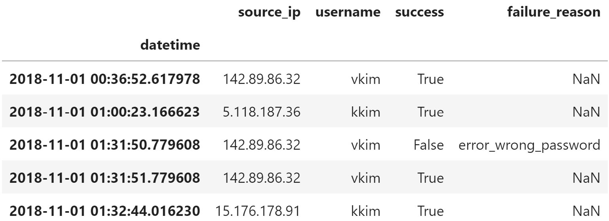
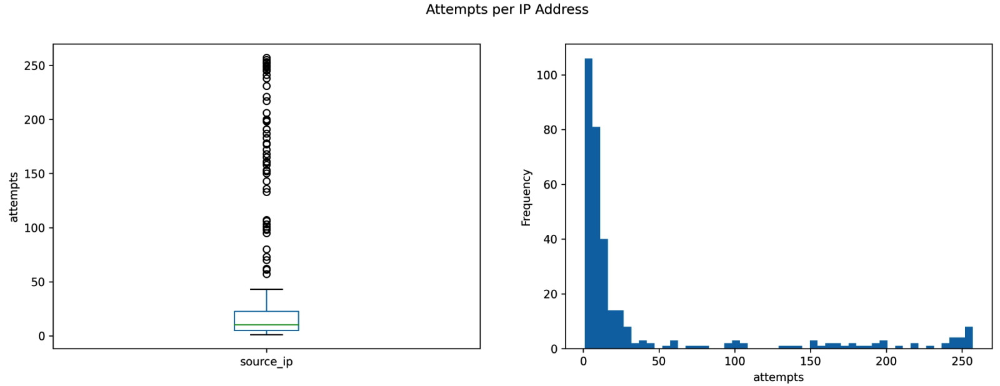
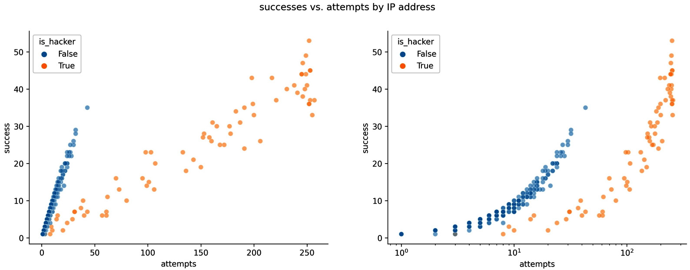
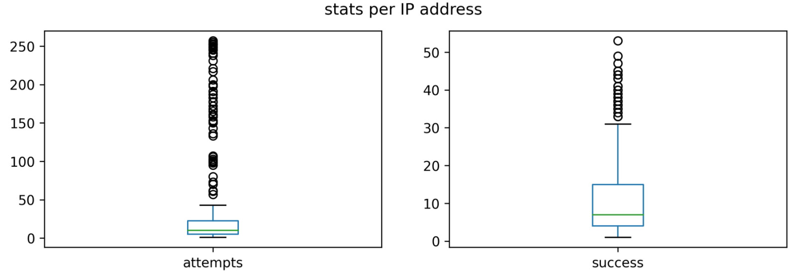

Lab 13: Rule-Based Anomaly Detection
=====================================

The following topics will be covered in this lab:

-   Simulating login attempts to create our dataset for the lab
-   Performing exploratory data analysis to understand the simulated
    data
-   Using rules and baselines for anomaly detection


#### Pre-reqs:
- Google Chrome (Recommended)

#### Lab Environment
Notebooks are ready to run. All packages have been installed. There is no requirement for any setup.

All examples are present in `~/work/machine-learning-essentials-module1/lab_13` folder. 


Lab materials
=================

We will be building a simulation package to generate the data for this
lab; it is on GitHub at
<https://github.com/fenago/login-attempt-simulator/tree/2nd_edition>.
This package is already installed from GitHub in the lab environment. 

The folder for this lab has the notebook we will use for our actual analysis
(`anomaly_detection.ipynb`), the data files we will be working
with in the `logs/` folder, the data used for the simulation
in the `user_data/` folder, and the `simulate.py`
file, which contains a Python script that we can run on the command line
to simulate the data for the lab.

Simulating login attempts
=========================

Since we can\'t easily find login attempt data from a breach (it\'s not
typically shared due to its sensitive nature), we will be simulating it.
Simulation requires a strong understanding of statistical modeling,
estimating probabilities of certain events, and identifying appropriate
assumptions to simplify where necessary. In order to run the simulation,
we will build a Python package (`login_attempt_simulator`) to
simulate a login process requiring a correct username and password
(without any extra authentication measures, such as two-factor
authentication) and a script (`simulate.py`) that can be run
on the command line, both of which we will discuss in this section.


The login\_attempt\_simulator package
-------------------------------------

This package is much more lightweight than the
`stock_analysis` package from the previous lab; we only
have three files:

```
login_attempt_simulator
|-- __init__.py
|-- login_attempt_simulator.py
`-- utils.py
```


We will walk through each of these files in the following sections. Note
that parts of the docstrings have been removed for brevity; check the
files themselves for the full documentation.

### Helper functions

Let\'s start our discussion with the `utils.py` functions,
which are helpers for our simulator class. First, we create our
docstring for the module and handle our imports:

```
"""Utility functions for the login attempt simulator."""
import ipaddress
import itertools
import json
import random
import string
```


Next, we define the `make_user_base()` function, which makes
the user base for our web application. It creates a file of usernames by
combining one lowercase letter from the English alphabet with each last
name in the list inside the function, and adds a few administrative
accounts as well; this results in a user base of 133 accounts. By
writing to a file, we ensure we don\'t have to generate this every time
we run our simulation and can simply read from it to simulate in the
future:

```
def make_user_base(out_file):
    """Generate a user base and save it to a file."""
    with open(out_file, 'w') as user_base:
        for first, last in itertools.product(
            string.ascii_lowercase, 
            ['smith', 'jones', 'kim', 'lopez', 'brown']
        ): # makes 130 accounts
            user_base.write(first + last + '\n')
        # adds 3 more accounts
        for account in ['admin', 'master', 'dba']: 
            user_base.write(account + '\n')
```


Since we will need to use this user base in our simulator, we also write
a function to read the user base file into a list. The
`get_valid_users()` function reads the file written by the
`make_user_base()` function back into a Python list:

```
def get_valid_users(user_base_file):
    """Read in users from the user base file."""
    with open(user_base_file, 'r') as file:
        return [user.strip() for user in file.readlines()]
```


The `random_ip_generator()` function creates IP addresses from
random numbers of the form `xxx.xxx.xxx.xxx`, where
`x` is an integer in the range \[0, 255\]. We are using the
`ipaddress` module from the Python standard library
(<https://docs.python.org/3/library/ipaddress.html>) to avoid assigning
private IP addresses:

```
def random_ip_generator():
    """Randomly generate a fake IP address."""
    try:
        ip_address = ipaddress.IPv4Address('%d.%d.%d.%d' %
            tuple(random.randint(0, 255) for _ in range(4))
        )
    except ipaddress.AddressValueError:
        ip_address = random_ip_generator()
    return str(ip_address) if ip_address.is_global \
        else random_ip_generator()
```


Each of our users will have a few IP addresses from which they attempt
to log in. The `assign_ip_addresses()` function maps 1-3
random IP addresses to each user, creating a dictionary:

```
def assign_ip_addresses(user_list):
    """Assign users 1-3 fake IP addresses."""
    return {
        user: [
            random_ip_generator()
            for _ in range(random.randint(1, 3))
        ] for user in user_list
    }
```


The `save_user_ips()` and `read_user_ips()`
functions save the user-IP address mapping to a JSON file and read it
back into the dictionary file, respectively:

```
def save_user_ips(user_ip_dict, file):
    """Save the user-IP address mapping to a JSON file."""
    with open(file, 'w') as file:
        json.dump(user_ip_dict, file)
def read_user_ips(file):
    """Read in the JSON file of the user-IP address mapping."""
    with open(file, 'r') as file:
        return json.loads(file.read())
```


**Tip:** 

The Python standard library has lots of helpful modules that we might
not find many occasions to use but are definitely worth knowing about.
Here, we use the `json` module to save dictionaries to JSON
files and read them back later. We are using the `ipaddress`
module to work with IP addresses, and the `string` module to
get the characters in the alphabet without having to type them all out.

### The LoginAttemptSimulator class

The `LoginAttemptSimulator` class in the
`login_attempt_simulator.py` file handles the heavy lifting of
carrying out the simulation with all the random number generation logic.
As usual, we start with our module docstring and imports:

```
"""Simulator of login attempts from valid users and hackers."""
import calendar
import datetime as dt
from functools import partial
import math
import random
import string
import numpy as np
import pandas as pd
from .utils import random_ip_generator, read_user_ips
```


Next, we begin defining the `LoginAttemptSimulator` class with
its docstring, along with some class variables for storing constants. We
do this to avoid magic numbers (numbers in the code that don\'t seem to
have meaning) and spelling errors with strings we will use in multiple
spots. Note that these messages are only for our logs; the web
application doesn\'t show the end users why the authentication attempt
failed (nor should it):

```
class LoginAttemptSimulator:
    """Simulate login attempts from valid users + attackers."""
    ATTEMPTS_BEFORE_LOCKOUT = 3
    ACCOUNT_LOCKED = 'error_account_locked'
    WRONG_USERNAME = 'error_wrong_username'
    WRONG_PASSWORD = 'error_wrong_password'
```


**Important note:**

Take note of how we used class variables to store constants, such as
error messages, so that we don\'t risk typos in the code. This means
that every time we use these error messages, the text will be identical,
which will keep the data clean. In Python, constants are typically
written in all caps
(<https://www.python.org/dev/peps/pep-0008/#constants>).

The `__init__()` method will handle the setup for the
simulator, such as reading in the user base from the file indicated,
initializing the logs, storing success probabilities, and determining
the start and end dates for the simulation, as needed:

```
    def __init__(self, user_base_json_file, start, end=None, *,
                 attacker_success_probs=[.25, .45],
                 valid_user_success_probs=[.87, .93, .95],
                 seed=None):
        # user, ip address dictionary
        self.user_base = read_user_ips(user_base_json_file)
        self.users = [user for user in self.user_base.keys()]
        self.start = start
        self.end = end if end else self.start + \
            dt.timedelta(days=random.uniform(1, 50))
        self.hacker_success_likelihoods = \
            attacker_success_probs
        self.valid_user_success_likelihoods = \
            valid_user_success_probs
        self.log = pd.DataFrame(columns=[
            'datetime', 'source_ip', 'username',
            'success', 'failure_reason'
        ])
        self.hack_log = \
            pd.DataFrame(columns=['start', 'end', 'source_ip'])
        self.locked_accounts = []
        # set seeds for random numbers from random and numpy:
        random.seed(seed)
        np.random.seed(seed)
```


The `_record()` method appends the result of each attempt to
the log, noting the IP address it came from, which username, at what
time, whether it succeeded, and the reason for failure, if there was
one:

```
    def _record(self, when, source_ip, username, success, 
                failure_reason):
        """
        Record the outcome of a login attempt.
        Parameters:
            - when: The datetime of the event.
            - source_ip: IP address the attempt came from.
            - username: The username used in the attempt.
            - success: Whether the attempt succeeded (Boolean).
            - failure_reason: Reason for the failure.
        Returns: 
            None, the `log` attribute is updated.
        """
        self.log = self.log.append({
            'datetime': when, 
            'source_ip': source_ip, 
            'username': username, 
            'success': success, 
            'failure_reason': failure_reason
        }, ignore_index=True)
```


The `_attempt_login()` method handles the logic of determining
whether the login attempt succeeds:


We provide the probability of entering a correct username
(`username_accuracy`) and the probabilities of successfully
entering the password for each attempt
(`success_likelihoods`). The number of attempts is the minimum
of the number of attempts allowed before an account lockout
and the length of the list of success
probabilities (`success_likelihoods`). The outcome of each
attempt is passed to `_record()` using **partials** (from
`functools`), which allow us to create functions that fix
certain parameters to a specific value (so we
don\'t have to pass the same value continuously):

```
    def _attempt_login(self, when, source_ip, username,
                       username_accuracy, success_likelihoods):
        """
        Simulates a login attempt, allowing for account
        lockouts, and recording the results.
        Parameters:
            - when: The datetime to start trying.
            - source_ip: IP address the attempt came from. 
            - username: The username being used in the attempt.
            - username_accuracy: Prob. username is correct.
            - success_likelihoods: List of probabilities that 
              password is correct (one per attempt).
        Returns:
            The datetime after trying.
        """
        current = when
        recorder = partial(self._record, source_ip=source_ip)
        if random.random() > username_accuracy:
            correct_username = username
            username = self._distort_username(username)
        if username not in self.locked_accounts:
            tries = len(success_likelihoods)
            for i in range(
                min(tries, self.ATTEMPTS_BEFORE_LOCKOUT)
            ):
                current += dt.timedelta(seconds=1)
                if username not in self.users:
                    recorder(
                        when=current, username=username, 
                        success=False,
                        failure_reason=self.WRONG_USERNAME
                    )
                    if random.random() <= username_accuracy:
                        username = correct_username
                    continue
                if random.random() <= success_likelihoods[i]:
                    recorder(
                        when=current, username=username,
                        success=True, failure_reason=None
                    )
                    break
                else:
                    recorder(
                        when=current, username=username, 
                        success=False,
                        failure_reason=self.WRONG_PASSWORD
                    )
            else:
                if tries >= self.ATTEMPTS_BEFORE_LOCKOUT \
                and username in self.users:
                    self.locked_accounts.append(username)
        else:
            recorder(
                when=current, username=username, success=False,
                failure_reason=self.ACCOUNT_LOCKED
            )
            if random.random() >= .5: # unlock account randomly
                self.locked_accounts.remove(username)
        return current
```


The `_valid_user_attempts_login()` and
`_hacker_attempts_login()` methods are wrappers around the
`_attempt_login()` method that handle the adjustment in
probabilities for valid users and hackers, respectively. Notice that
while both use a Gaussian (normal) distribution to determine how
accurate the username will be, the valid user\'s
distribution has a higher mean and lower standard deviation, meaning
they are more likely to provide the correct username when trying to log
in. This is because, while valid users may make typos (infrequently),
the hackers are guessing:

```
    def _hacker_attempts_login(self, when, source_ip,
                               username):
        """Simulates a login attempt from an attacker."""
        return self._attempt_login(
            when=when, source_ip=source_ip, username=username,
            username_accuracy=random.gauss(mu=0.35, sigma=0.5),
            success_likelihoods=self.hacker_success_likelihoods
        )
    def _valid_user_attempts_login(self, when, username):
        """Simulates a login attempt from a valid user."""
        return self._attempt_login(
            when=when, username=username,
            source_ip=random.choice(self.user_base[username]),
            username_accuracy=\
                random.gauss(mu=1.01, sigma=0.01),
            success_likelihoods=\
                self.valid_user_success_likelihoods
        )
```


When the simulator determines that the username will not be provided
correctly, it calls the `_distort_username()` method, which
randomly decides to omit a letter from the valid username or to replace
one of the letters with another one. While hackers enter incorrect
usernames because they are guessing (not due to
typos), we abstract away this detail in order to use a single function
for introducing username errors for both valid users and hackers:

```
    @staticmethod
    def _distort_username(username):
        """
        Alters the username to allow for wrong username login 
        failures. Randomly removes a letter or replaces a 
        letter in a valid username.
        """
        username = list(username)
        change_index = random.randint(0, len(username) - 1)
        if random.random() < .5: # remove random letter
            username.pop(change_index)
        else: # randomly replace a single letter
            username[change_index] = \
                random.choice(string.ascii_lowercase)
        return ''.join(username)
```


We use the `_valid_user_arrivals()` method to generate the
number of users that will arrive in a given hour
and the interarrival times using Poisson and
exponential distributions, respectively:

```
    @staticmethod
    def _valid_user_arrivals(when):
        """
        Static method for simulating Poisson process of 
        arrivals (users wanting to log in). Lambda for the 
        Poisson varies depending upon the day and time of week.
        """
        is_weekday = when.weekday() not in (
            calendar.SATURDAY, calendar.SUNDAY
        )
        late_night = when.hour < 5 or when.hour >= 11
        work_time = is_weekday \
                    and (when.hour >= 9 or when.hour <= 17)
        if work_time:
            # hours 9-5 on work days get higher lambda 
            poisson_lambda = random.triangular(1.5, 5, 2.75)
        elif late_night:
            # hours in middle of night get lower lambda
            poisson_lambda = random.uniform(0.0, 5.0)
        else:
            poisson_lambda = random.uniform(1.5, 4.25)
        hourly_arrivals = np.random.poisson(poisson_lambda)
        interarrival_times = np.random.exponential(
            1/poisson_lambda, size=hourly_arrivals
        )
        return hourly_arrivals, interarrival_times
```


**Important note:**

We are using `numpy` instead of `random` to generate
random numbers from the exponential distribution because we can ask for
multiple values at once (one for each of the hourly arrivals determined
by the Poisson process). Also, note that `random` doesn\'t
provide a Poisson distribution, so we need `numpy`.

Our simulation uses many different distributions,
so it can be helpful to see what they look like. The following subplots
show examples for each of the distributions we are using. Notice that
the Poisson distribution is drawn differently. This is because the
Poisson distribution is discrete. For this reason, we often use it to
model arrivals---here, we use it for modeling the arrivals of users
attempting to log in. Discrete distributions have
a **probability mass function** (**PMF**) instead
of a **probability density function** (**PDF**):


The `_hack()` method generates a random
IP address for the hacker and carries out a brute-force attack on a
given user list:

```
    def _hack(self, when, user_list, vary_ips):
        """
        Simulate an attack by a random hacker.
        Parameters:
            - when: The datetime to start the attack.
            - user_list: The list of users to try to hack.
            - vary_ips: Whether or not to vary the IP address.
        Returns:
            Initial IP address and the end time for recording.
        """
        hacker_ip = random_ip_generator()
        random.shuffle(user_list)
        for user in user_list:
            when = self._hacker_attempts_login(
                when=when, username=user,
                source_ip=random_ip_generator() if vary_ips \
                    else hacker_ip
            )
        return hacker_ip, when
```


Now that we have the functionality to carry out
the main parts of the simulation, we write the `simulate()`
method to put it all together:

```
    def simulate(self, *, attack_prob, try_all_users_prob,
                 vary_ips):
        """
        Simulate login attempts.
        Parameters:
            - attack_probs: Probability of attack in given hour
            - try_all_users_prob: Prob. hacker will try to 
              guess credentials for all users vs random subset.
            - vary_ips: Whether to vary the IP address.
        """
        hours_in_date_range = math.floor(
            (self.end - self.start).total_seconds() / 60 / 60
        )
        for offset in range(hours_in_date_range + 1):
            current = self.start + dt.timedelta(hours=offset)
            # simulate hacker
            if random.random() < attack_prob:
                attack_start = current \
                    + dt.timedelta(hours=random.random())
                source_ip, end_time = self._hack(
                    when=attack_start,
                    user_list=self.users if \
                        random.random() < try_all_users_prob \
                        else random.sample(
                            self.users, 
                            random.randint(0, len(self.users))
                    ),
                    vary_ips=vary_ips
                )
                self.hack_log = self.hack_log.append(
                    dict(
                        start=attack_start, end=end_time, 
                        source_ip=source_ip
                    ), ignore_index=True
                )
            # simulate valid users
            hourly_arrivals, interarrival_times = \
                self._valid_user_arrivals(current)
            random_user = random.choice(self.users)
            random_ip = \
                random.choice(self.user_base[random_user])
            for i in range(hourly_arrivals):
                current += \
                    dt.timedelta(hours=interarrival_times[i])
                current = self._valid_user_attempts_login(
                    current, random_user
                )
```


We want to save the logs to CSV files, so we add the `_save()`
method as a static method to allow for less repetition in the code for
the two save methods. The `save_log()` method will save the
login attempts and the `save_hack_log()` method will save
the record of the attacks:

```
    @staticmethod
    def _save(data, filename, sort_column):
        """Sort data by the datetime and save to a CSV file."""
        data.sort_values(sort_column)\
            .to_csv(filename, index=False)
    def save_log(self, filename):
        """Save the login attempts log to a CSV file."""
        self._save(self.log, filename, 'datetime')
    def save_hack_log(self, filename):
        """Save the record of the attacks to a CSV file."""
        self._save(self.hack_log, filename, 'start')
```


Notice that there were many private methods in this class; this is
because users of this class only need to be able to create an instance
of this class (`__init__()`), simulate by hour
(`simulate()`), and save the output (`save_log()`
and `save_hack_log()`)---all other methods are for internal
use by objects of this class. The methods behind the scenes will handle
the bulk of the work.

Lastly, we have the `__init__.py` file, which makes this a
package, but also provides us with an easier way to import the main
class:

```
"""Package for simulating login data."""
from .login_attempt_simulator import LoginAttemptSimulator
```


Now that we understand how the simulator works, we will discuss how to
run the simulation to collect the login attempts
data.


Simulating from the command line
--------------------------------

Rather than writing the code to simulate the
login attempts every time, we can package this up in a script that we
can easily run from the command line. The Python standard library has
the `argparse` module
(<https://docs.python.org/3/library/argparse.html>), which allows us to
specify arguments to our script that can be supplied from the command
line.

Let\'s take a look at the `simulate.py` file to see how to do
this. We start with our imports:

```
"""Script for simulating login attempts."""
import argparse
import datetime as dt
import os
import logging
import random
import login_attempt_simulator as sim
```


In order to provide status updates when using this from the command
line, we are going to set up logging messages using the standard
library\'s `logging` module
(<https://docs.python.org/3/library/logging.html>):

```
# Logging configuration
FORMAT = '[%(levelname)s] [ %(name)s ] %(message)s'
logging.basicConfig(level=logging.INFO, format=FORMAT)
logger = logging.getLogger(os.path.basename(__file__))
```


Next, we define some utility functions for generating file paths that we
will need for reading and writing data during the
simulation:

```
def get_simulation_file_path(path_provided, directory,
                             default_file):
    """Get filepath, make directory if necessary."""
    if path_provided:
        file = path_provided
    else:
        if not os.path.exists(directory):
            os.mkdir(directory)
        file = os.path.join(directory, default_file)
    return file
def get_user_base_file_path(path_provided, default_file):
    """Get the path for a user_data directory file."""
    return get_simulation_file_path(
        path_provided, 'user_data', default_file
    )
def get_log_file_path(path_provided, default_file):
    """Get the path for a logs directory file."""
    return get_simulation_file_path(
        path_provided, 'logs', default_file
    )
```


The largest part of this script defines which command-line parameters
can be passed---we will allow the user to specify whether they want to
create a new user base, set a seed, when to start the simulation, how
long to simulate, and where to save all the files. The actual simulation
is taken care of in a few lines thanks to the package we built. This
section will only run when this module is run,
rather than imported:

```
if __name__ == '__main__':
    # command-line argument parsing
    parser = argparse.ArgumentParser()
    parser.add_argument(
        'days', type=float,
        help='number of days to simulate from start'
    )
    parser.add_argument(
        'start_date', type=str,
        help="datetime to start in the form 'YYYY-MM-DD(...)'"
    )
    parser.add_argument(
        '-m', '--make', action='store_true', 
        help='make user base'
    )
    parser.add_argument(
        '-s', '--seed', type=int, 
        help='set a seed for reproducibility'
    )
    parser.add_argument(
        '-u', '--userbase', 
        help='file to write the user base to'
    )
    parser.add_argument(
        '-i', '--ip', 
        help='file to write user-IP address map to'
    )
    parser.add_argument(
        '-l', '--log', help='file to write the attempt log to'
    )
    parser.add_argument(
        '-hl', '--hacklog', 
        help='file to write the hack log to'
    )
```


**Tip:** 

The code placed in the `if __name__ == '__main__'` block will
only be run when this module is run as a script. This makes it possible
for us to import the functions defined in the module without running the
simulation.

After defining the arguments, we need to parse
them in order to use them:

```
    args = parser.parse_args()
```


Once we have the command-line arguments parsed, we check to see whether
we need to generate the user base or read it in:

```
    user_ip_mapping_file = \
        get_user_base_file_path(args.ip, 'user_ips.json')
    if args.make:
        logger.warning(
            'Creating new user base, mapping IP addresses.'
        )
        user_base_file = get_user_base_file_path(
            args.userbase, 'user_base.txt'
        )
        # seed the creation of user base
        random.seed(args.seed)
        # create usernames and write to file
        sim.utils.make_user_base(user_base_file)
        # create 1 or more IP addresses per user, save mapping 
        valid_users = sim.utils.get_valid_users(user_base_file)
        sim.utils.save_user_ips(
            sim.utils.assign_ip_addresses(valid_users), 
            user_ip_mapping_file
        )
```


Afterward, we parse the start date from the
command-line arguments, and determine the end date by adding the
duration from the command-line arguments to the start date:

```
    try:
        start = \
            dt.datetime(*map(int, args.start_date.split('-')))
    except TypeError:
        logger.error('Start date must be in "YYYY-MM-DD" form')
        raise
    except ValueError:
        logger.warning(
            f'Could not interpret {args.start_date}, '
            'using January 1, 2020 at 12AM as start instead'
        )
        start = dt.datetime(2020, 1, 1)
    end = start + dt.timedelta(days=args.days)
```


**Tip:** 

Check out the `try...except` block in the previous code
snippet. We have a single `try` clause and multiple
`except` clauses. We can specify how to handle specific errors
occurring during code execution (called
**exceptions**) by stating which exception type belongs to a given
`except` clause. In this case, we have the `logger`
object print a more helpful message for the user, and then re-raise the
same exception (because we don\'t intend to handle it) by simply writing
`raise`. This ends the program---the user can then try again
with valid input. Try triggering this exception to see how much more
useful this is. One thing to keep in mind, though, is that order
matters---be sure to handle specific exceptions before having a general
`except` clause; otherwise, the code specific to each
exception type will never trigger. Also, note that using
`except` without providing a specific exception will catch
everything, even exceptions not meant to be caught.

Finally, we run the actual simulation and write
our results to the files specified (or the default paths). We set the
probability of attack in a given hour to 10% (`attack_prob`),
the probability the hacker will attempt to guess all usernames at 20%
(`try_all_users_prob`), and have the hackers use the same
IP address for all of their attempts
(`vary_ips`):

```
    try:
        logger.info(f'Simulating {args.days} days...')
        simulator = sim.LoginAttemptSimulator(
            user_ip_mapping_file, start, end, seed=args.seed
        )
        simulator.simulate(
            attack_prob=0.1, try_all_users_prob=0.2, 
            vary_ips=False
        )
        # save logs
        logger.info('Saving logs')
        simulator.save_hack_log(
            get_log_file_path(args.hacklog, 'attacks.csv')
        )
        simulator.save_log(
            get_log_file_path(args.log, 'log.csv')
        )
        logger.info('All done!')
    except:
        logger.error('Oops! Something went wrong...')
        raise
```


**Tip:** 

Notice that we used the `logger` object to print helpful
messages to the screen throughout the script; this will help the users
of this script know how far along in the process it is. These messages
come in different levels of severity (we are using `INFO`,
`WARNING`, and `ERROR` here), allowing them to be
placed for debugging (the `DEBUG` level), and left there once
the code goes into production, since the minimum level for printing can
be raised to `INFO`, so that no `DEBUG` messages are
printed. This is leaps and bounds above simple `print()`
statements, since we don\'t have to worry about removing them as we move
to production or adding back these messages as development continues.

Let\'s now take a look at how we can run this
script. We know that `simulate.py` can be run on the command
line, but how can we see what arguments we need to pass? Simple---we add
the help flag (`-h` or `--help`) to the call:

```
(book_env) $ python3 simulate.py -h
usage: simulate.py [-h] [-m] [-s SEED] [-u USERBASE] [-i IP] 
                   [-l LOG] [-hl HACKLOG]
                   days start_date
positional arguments:
  days                  number of days to simulate from start
  start_date            datetime to start in the form 
                        'YYYY-MM-DD' or 'YYYY-MM-DD-HH'
optional arguments:
  -h, --help            show this help message and exit
  -m, --make            make user base
  -s SEED, --seed SEED  set a seed for reproducibility
  -u USERBASE, --userbase USERBASE
                        file to write the user base to
  -i IP, --ip IP        file to write the user-IP address 
                        map to
  -l LOG, --log LOG     file to write the attempt log to
  -hl HACKLOG, --hacklog HACKLOG
                        file to write the hack log to
```


**Important note:**

Note that we didn\'t specify the `help` argument when we added
the other arguments with `argparse`; it was automatically
created by `argparse`.

Once we know which arguments we can pass and have
decided which of these we want to provide, we can run the simulation.
Let\'s simulate 30 days, starting from 12 AM on November 1, 2018, while
having the script create the user base and IP address mappings needed:

```
(book_env) $ python3 simulate.py -ms 0 30 '2018-11-01'
[WARNING] [ simulate.py ] Creating new user base and mapping IP addresses to them.
[INFO] [ simulate.py ] Simulating 30.0 days...
[INFO] [ simulate.py ] Saving logs
[INFO] [ simulate.py ] All done!
```


The previous code block is therefore equivalent to the following command since it is already installed in lab environment:

```
# leave off the .py
(book_env) $ python3 -m simulate -ms 0 30 "2018-11-01"
```


Now that we have our simulated data, let\'s begin our analysis.


Exploratory data analysis
=========================


In this scenario, we have the benefit of access
to labeled data (`logs/attacks.csv`) and will use it to
investigate how to distinguish between valid users and attackers.
However, this is a luxury that we often don\'t have, especially once we
leave the research phase and enter the application phase. As usual, we
start with our imports and reading in the data:

```
>>> %matplotlib inline
>>> import matplotlib.pyplot as plt
>>> import numpy as np
>>> import pandas as pd
>>> import seaborn as sns
>>> log = pd.read_csv(
...     'logs/log.csv', index_col='datetime', parse_dates=True
... )
```


The login attempts dataframe (`log`) contains the date and
time of each attempt in the `datetime` column, the IP address
it came from (`source_ip`), the
username that was used (`username`), whether the attempt was
successful (`success`), and the reason for failure if it
wasn\'t (`failure_reason`):





When approaching this data, we need to think about what normal activity
and hacker activity would look like. Any big differences between the
groups could potentially be leveraged to identify the hackers. We would
expect valid users to have high success rates, with the most common
reason for failure being an incorrect password. We would expect users to
log in from a few different IP addresses (phone, home computer, work
computer, and any other device they may have), and it is possible that
people share devices. Without knowing the nature of this web
application, we can\'t say anything about whether it is normal to log in
many times throughout the day. We also don\'t know what time zone this
data is in, so we can\'t make any inferences about the login times.
Potentially, we could look at which countries these IP addresses are
from, but there are ways of masking IP addresses, so we won\'t go down
that path. This leaves us with a few viable options, given our available
data:

-   Investigate any spikes in attempts and failures (both overall and
    per IP address).
-   Examine cases where the failure reason was an incorrect username.
-   Look at the failure rate per IP address.
-   Find IP addresses trying to log in with many distinct usernames.

One other thing to note is that we would want to
flag anomalous behavior sooner rather than later. Waiting a month to
flag something is less valuable (the value drops quickly over time), so
we need to find a way to flag much sooner; say, using an hourly
frequency. Since we are in the research phase, we have some labeled data
to work with:

```
>>> attacks = pd.read_csv(
...     'logs/attacks.csv',
...     converters={
...         'start': np.datetime64, 
...         'end': np.datetime64
...     }
... ) # make start and end columns datetimes but not the index
```


This data is the record of attacks on the web application
(`attacks`). It contains the date and time of the start of the
attack (`start`), the date and time of the end of the attack
(`end`), and the IP address associated with the attack
(`source_ip`):


Using the `shape` property, we can see that we had 72 attacks
and 12,836 login attempts from valid and nefarious users, and with
`nunique()`, we see that 22% of the IP addresses were
associated with attacks:

```
>>> attacks.shape, log.shape
((72, 3), (12836, 4))
>>> attacks.source_ip.nunique() / log.source_ip.nunique()
0.22018348623853212
```


Our data is pretty clean (we designed it just for this purpose, after
all), so let\'s see whether we can find anything interesting by
performing some **exploratory data analysis** (**EDA**). First, let\'s
look to see how many attempts are coming through on an hourly basis:

```
>>> log.assign(attempts=1).attempts.resample('1H').sum()\
...     .plot(figsize=(15, 5), title='hourly attempts')\
...     .set(xlabel='datetime', ylabel='attempts')
```


Several hours had very large peaks, which could possibly be when attacks
occurred. Using this plot, we could report on hours that had a high
level of login attempt activity, but nothing beyond that:


Another interesting avenue of exploration would
be to see how many attempts came from each IP address. We can achieve
this by running the following command:

```
>>> log.source_ip.value_counts().describe()
count    327.000000
mean      39.253823
std       69.279330
min        1.000000
25%        5.000000
50%       10.000000
75%       22.500000
max      257.000000
Name: source_ip, dtype: float64
```


This data definitely appears to have some outliers, which pull the
number of attempts per IP address up quite high. Let\'s create some
plots to better assess this:

```
>>> fig, axes = plt.subplots(1, 2, figsize=(15, 5))
>>> log.source_ip.value_counts()\
...     .plot(kind='box', ax=axes[0]).set_ylabel('attempts')
>>> log.source_ip.value_counts()\
...     .plot(kind='hist', bins=50, ax=axes[1])\
...     .set_xlabel('attempts')
>>> fig.suptitle('Attempts per IP Address')
```


The distribution of attempts per IP address is
the sum of the distributions for both valid users and attackers. The
histogram indicates that this distribution is bimodal, but we are unable
to determine whether all of those IP addresses with high attempts are
actually hackers by just looking at the plot:





Since we have access to the details of each attack, we can check whether
the right part of the histogram is the distribution for the hackers.
Their IP addresses make up 88.9% of the top IP addresses ranked
by number of attempts:

```
>>> num_hackers = attacks.source_ip.nunique()
>>> log.source_ip.value_counts().index[:num_hackers]\
...     .isin(attacks.source_ip).sum() / num_hackers
0.8888888888888888
```


We could simply stop here and flag any IP address that shows up in a
list of IP addresses with the most attempts per month, but we most
likely want a more robust solution, since the hackers could simply
change their IP address each time and avoid detection. Ideally, we would
also be able to detect the attacks without waiting for a full month\'s
worth of data. Looking at the hourly attempts made by each IP address
unfortunately doesn\'t give us much information, though:

```
>>> log.assign(attempts=1).groupby('source_ip').attempts\
...     .resample('1H').sum().unstack().mean()\
...     .plot(
...         figsize=(15, 5), 
...         title='average hourly attempts per IP address'
...     ).set_ylabel('average hourly attempts per IP address')
```


The mean is not robust to
outliers. If the attackers make many attempts, they will bring the
average hourly attempts per IP address higher. We can see several large
peaks in this line plot, but notice that many of them only go up to two
or three. Can we really expect only one user to access the web
application from a given IP address? This is probably not a realistic
assumption:


So, if we can\'t rely on the IP address (after all, the hacker could be
smart enough to spread the attack over many different addresses), what
else can we try? Perhaps the hackers have more
trouble logging in successfully:

```
>>> log[log.source_ip.isin(attacks.source_ip)]\
...     .success.value_counts(normalize=True)
False    0.831801
True     0.168199
Name: success, dtype: float64
```


The hackers are only successful 17% of the time, but how often are the
valid users successful? This information is important for determining a
baseline of what normal behavior looks like for the website. As we would
expect, valid users have much higher success rates:

```
>>> log[~log.source_ip.isin(attacks.source_ip)]\
...     .success.value_counts(normalize=True)
True     0.873957
False    0.126043
Name: success, dtype: float64
```


Since the logs come with the reason that a login attempt failed, we can
use a crosstab to see why hackers and valid users
fail to log in successfully. Any differences here may help us separate
the two groups:

```
>>> pd.crosstab(
...     index=pd.Series(
...         log.source_ip.isin(attacks.source_ip),
...         name='is_hacker'
...     ), columns=log.failure_reason
... )
```


Valid users sometimes enter their passwords or usernames incorrectly,
but the hacker has way more issues getting both the username and
password correct:


Valid users don\'t make many mistakes with their credentials, so if the
hackers make many attempts with many users, we can flag it. To confirm,
we can look at average hourly attempts per user:

```
>>> log.assign(attempts=1).groupby('username').attempts\
...     .resample('1H').sum().unstack().mean()\
...     .plot(figsize=(15, 5),
...           title='average hourly attempts per user')\
...     .set_ylabel('average hourly attempts per user')
```


For the most part, less than one attempt per hour is made per username.
There\'s also no guarantee that spikes in this metric
are indications of an attack. Perhaps the website
is having a flash sale; in that case, we would likely see a spike in
this metric caused by valid users:


Based on our findings, error rates seem to be the most fruitful metric
for detecting attacks, so we will look into IP addresses that have high
error rates. To do so, we can create a pivot table to calculate some
helpful metrics:

```
>>> pivot = log.pivot_table(
...     values='success', index=log.source_ip, 
...     columns=log.failure_reason.fillna('success'), 
...     aggfunc='count', fill_value=0
... )
>>> pivot.insert(0, 'attempts', pivot.sum(axis=1))
>>> pivot = pivot.sort_values('attempts', ascending=False)\
...     .assign(
...         success_rate=lambda x: x.success / x.attempts,
...         error_rate=lambda x: 1 - x.success_rate
...     )
>>> pivot.head()
```


**Tip:** 

The `insert()` method allows us to insert the newly created
`attempts` column at a specific position in the current
dataframe in place. We created the `attempts` column as the
sum of errors and successes (we fill in the `NaN` values in
the `failure_reason` column with `success` to count
it here) by summing with `axis=1`.

This yields the following pivot table sorted by
attempts (from most to fewest):


We know that certain IP addresses are making many attempts, so it\'s
worth looking into how many usernames are attempting to log in per IP
address; we would expect valid users to only log in from a few IP
addresses and not to share their IP address with many others. This can
be determined with a group by and an aggregation:

```
>>> log.groupby('source_ip').agg(dict(username='nunique'))\
...     .username.value_counts().describe()
count     53.000000
mean       6.169811
std       34.562505
min        1.000000
25%        1.000000
50%        1.000000
75%        2.000000
max      253.000000
Name: username, dtype: float64
```


This definitely appears to be a good strategy for isolating nefarious
users. The majority of the IP addresses are used by two or fewer users,
but the maximum stands at 253. While this criterion could
help us identify some of the attackers, it won\'t
help if the hackers are clever enough to vary their IP addresses
throughout their attack.

Before we move on to anomaly detection methods, let\'s see whether we
can visually identify the hackers. Let\'s create a scatter plot for the
successes and attempts for each IP address:

```
>>> pivot.plot(
...     kind='scatter', x='attempts', y='success', alpha=0.25,
...     title='successes vs. attempts by IP address' 
... )
```


There appear to be a few distinct clusters. In the bottom-left corner of
the plot, we see points forming a line with a one-to-one relationship of
successes to attempts. The upper-right portion of the plot contains a
less dense cluster with a high number of attempts and moderate
successes. Since we used the `alpha` parameter to control
transparency, we can see that the trail of points that seem to connect
the two clusters is not densely populated. Even without the axis scales,
we would predict the bottom-left cluster to be regular users and the
top-right to be hackers (since we imagine there are more regular users
than hackers, and regular users have higher success rates). The points
in the middle are more difficult to judge,
however:


Without making any assumptions, we can draw a boundary line grouping the
middle points with their nearest cluster:

```
>>> ax = pivot.plot(
...     kind='scatter', x='attempts', y='success', alpha=0.25, 
...     title='successes vs. attempts by IP address'
... )
>>> plt.axvline(
...     125, label='sample boundary',
...     color='red', linestyle='--'
... )
>>> plt.legend(loc='lower right')
```


Of course, when lacking labeled data, it is difficult to evaluate the
effectiveness of this decision boundary:


Luckily for us, we have data on which IP addresses the hackers used
because we have been given labeled data to conduct our research, so we
can use `seaborn` to actually see the separation:

```
>>> fig, axes = plt.subplots(1, 2, figsize=(15, 5))
>>> for ax in axes:
...     sns.scatterplot(
...         y=pivot.success, x=pivot.attempts, 
...         hue=pivot.assign(
...             is_hacker=\
...                 lambda x: x.index.isin(attacks.source_ip)
...         ).is_hacker,
...         ax=ax, alpha=0.5
...     ) 
...     for spine in ['top', 'right']: # make less boxy
...         ax.spines[spine].set_visible(False)
>>> axes[1].set_xscale('log')
>>> plt.suptitle('successes vs. attempts by IP address')
```


Our intuition about there being two distinct
clusters was dead-on. The middle area, however, was much trickier to
determine. The blue (darker) points on the left do appear to be
following a line upward, while the orange (lighter) points on the left
are following a line to the orange cluster. By plotting the log of the
attempts instead, we get a little more separation between our orange
middle points and the blue points:





Remember, we can also use a box plot to check for possible outliers,
which will be shown as points. Let\'s see what successes and attempts
look like per IP address:

```
>>> pivot[['attempts', 'success']].plot(
...     kind='box', subplots=True, figsize=(10, 3),
...     title='stats per IP address'
... )
```


The points marked as outliers coincide with the points in the
upper-right corner of the scatter plots we made:




Now that we have a good understanding of our data, we are ready to learn
how to implement a few simple anomaly detection strategies.

Implementing rule-based anomaly detection
=========================================

Since we are interested in flagging IP addresses that are suspicious, we
are going to arrange the data so that we have hourly aggregated data per
IP address (if there was activity for that hour):

```
>>> hourly_ip_logs = log.assign(
...     failures=lambda x: np.invert(x.success)
... ).groupby('source_ip').resample('1H').agg({
...     'username': 'nunique', 'success': 'sum', 
...     'failures': 'sum'
... }).assign(
...     attempts=lambda x: x.success + x.failures,
...     success_rate=lambda x: x.success / x.attempts,
...     failure_rate=lambda x: 1 - x.success_rate
... ).dropna().reset_index()
```


**Tip:** 

The `np.invert()` function is an easy way to flip Boolean
values. It turns `True` to `False` and
`False` to `True` along a NumPy array-like
structure.

The aggregated data looks like this:


The simplest form of rule-based anomaly detection involves calculating a
threshold value and checking to see whether the data is beyond the
threshold. This could mean values falling below
some lower bound threshold, or values exceeding
some upper bound threshold. Since we are looking at login attempts, we
are interested in values that are greater than normal. Therefore, we
will be calculating the threshold for our upper bounds and comparing
that to our data.


Percent difference
------------------

Provided that we have an idea of what normal
login attempt activity (minus the hackers) looks like on the site, we
can flag values that deviate from this by a certain percentage. In order
to calculate this baseline, we could take a few IP addresses at random
with replacement for each hour, and average the number of login attempts
they made. We are bootstrapping since we don\'t have much data (about 50
unique IP addresses to pick from for each of the 24 hours).

To do this, we could write a function that takes in the aggregated
dataframe we just made, along with the name of a statistic to calculate
per column of the data to use as the starting point for the threshold:

```
>>> def get_baselines(hourly_ip_logs, func, *args, **kwargs):
...     """
...     Calculate hourly bootstrapped statistic per column.
...
...     Parameters:
...         - hourly_ip_logs: Data to sample from.
...         - func: Statistic to calculate.
...         - args: Additional positional arguments for `func`
...         - kwargs: Additional keyword arguments for `func`
...
...     Returns: 
...         `DataFrame` of hourly bootstrapped statistics
...     """
...     if isinstance(func, str):
...         func = getattr(pd.DataFrame, func)
...
...     return hourly_ip_logs.assign(
...         hour=lambda x: x.datetime.dt.hour
...     ).groupby('hour').apply(
...         lambda x: x\
...             .sample(10, random_state=0, replace=True)\
...             .pipe(func, *args, **kwargs, numeric_only=True)
...     )
```


**Important note:**

In the previous code snippet, `random_state` is used with
`sample()` for reproducibility; however, in practice, we will
probably not want to always pick the same rows.

Notice that we can get equally sized samples for
all groups (hours, here) if we use `sample()` inside
`apply()` after grouping by the column we want to sample with.
This means that we are selecting 10 rows with replacement per hour for
each column. We have to sample by hour here because, if we do simple
random sampling, there is a good chance we won\'t have a statistic for
every hour. Let\'s use `get_baselines()` to calculate the
column baselines using the mean:

```
>>> averages = get_baselines(hourly_ip_logs, 'mean')
>>> averages.shape
(24, 7)
```


**Tip:** 

If, instead, we wanted to perform stratified random sampling, we could
replace `10` in the `get_baselines()` function with
`x.shape[0] * pct`, where `pct` is the percentage we
want to sample from each group.

Each column has the mean per hour for the 10 IP
addresses chosen randomly to estimate normal behavior. This technique,
however, doesn\'t guarantee that we won\'t mix any of the hacker
activity into our baseline calculations. For example, let\'s take a look
at the six hours with the highest baseline values for failure rate:

```
>>> averages.nlargest(6, 'failure_rate')
```


We might find it difficult to flag any activity at hours **19**, **23**,
or **14** with this baseline because the failure rate and unique
usernames tried are both high:


To combat this issue, we could trim our summary statistics by making the
top *x*% ineligible for use in our baseline calculation. Let\'s remove
values greater than the 95[th] percentile of data from
each hour. First, we will write a function to
trim rows from a given hour that have data above a given quantile:

```
>>> def trim(x, quantile):
...     """
...     Remove rows with entries for the username, attempts, 
...     or failure_rate columns above a given quantile.
...     """
...     mask = (
...         (x.username <= x.username.quantile(quantile)) &
...         (x.attempts <= x.attempts.quantile(quantile)) &
...         (x.failure_rate
...          <= x.failure_rate.quantile(quantile))
...     )
...     return x[mask]
```


Next, we will group the IP address data by hour and apply our trimming
function. Since we will be using our bootstrapping function, we need to
clean up some of the extra columns that will result from this operation,
so we drop the `hour` column, reset the index, and then remove
the grouping column and the old index:

```
>>> trimmed_hourly_logs = hourly_ip_logs\
...     .assign(hour=lambda x: x.datetime.dt.hour)\
...     .groupby('hour').apply(lambda x: trim(x, 0.95))\
...     .drop(columns='hour').reset_index().iloc[:,2:]
```


Now, we can use the `get_baselines()` function to grab our
baseline using the average with the trimmed data:

```
>>> averages = get_baselines(trimmed_hourly_logs, 'mean')
>>> averages.iloc[[19, 23, 3, 11, 14, 16]]
```


The trimmed baseline is now quite different at hours **19**, **23**, and **14**:


Now that we have our baseline, let\'s write a function that will do the
heavy lifting of calculating the threshold from our baseline and the
percentage difference per column, returning the IP addresses that have
been flagged as hackers:

```
>>> def pct_change_threshold(hourly_ip_logs, baselines,
...                          pcts=None):
...     """
...     Return flagged IP addresses based on thresholds.
...
...     Parameters:
...         - hourly_ip_logs: Aggregated data per IP address.
...         - baselines: Hourly baselines per column in data.
...         - pcts: Dictionary of custom percentages per column 
...           for calculating upper bound thresholds
...           (baseline * pct). If not provided, pct will be 1
...
...     Returns: `Series` containing the IP addresses flagged.
...     """
...     pcts = {} if not pcts else pcts
...
...     return hourly_ip_logs.assign(
...         hour=lambda x: x.datetime.dt.hour
...     ).join(
...         baselines, on='hour', rsuffix='_baseline'
...     ).assign(
...         too_many_users=lambda x: x.username_baseline \
...             * pcts.get('username', 1) <= x.username,
...         too_many_attempts=lambda x: x.attempts_baseline \
...             * pcts.get('attempts', 1) <= x.attempts,
...         high_failure_rate=lambda x: \
...             x.failure_rate_baseline \
...             * pcts.get('failure_rate', 1) <= x.failure_rate
...     ).query(
...         'too_many_users and too_many_attempts '
...         'and high_failure_rate'
...     ).source_ip.drop_duplicates()
```


The `pct_change_threshold()` function uses a series of chained
operations to give us the flagged IP addresses:

1.  First, it joins the baselines to the hourly
    IP address logs on the `hour` column. Since all the
    baseline columns have the same names as the hourly IP address logs,
    and we don\'t want to join on them, we suffix their names with
    `'_baseline'`.
2.  After that, all the data we need to check whether the thresholds
    were exceeded is in the same dataframe. We use `assign()`
    to make three new Boolean columns, indicating whether each of our
    conditions (too many users, too many attempts, and high failure
    rate) has been violated.
3.  Then, we chain a call to the `query()` method, which lets
    us easily select rows where all of these Boolean columns are
    `True` (notice we don\'t need to explicitly say
    `<column> == True`).
4.  Lastly, we make sure to return just the IP addresses and to drop any
    duplicates in case the same IP address was flagged for multiple
    hours.

In order to use this function, we need to pick a percentage difference
from each of our baselines. By default, that will be 100% of the
baseline, which, since it is the average, will flag way too many IP
addresses. Instead, let\'s get the IP addresses this flags with values
25% higher than the baseline for each criterion:

```
>>> pct_from_mean_ips = pct_change_threshold(
...     hourly_ip_logs, averages, 
...     {key: 1.25 for key in [
...         'username', 'attempts', 'failure_rate'
...     ]}
... )
```


**Tip:** 

The percentages we use are in a dictionary, with the key being the
column they are for and the value being the percentage itself. If the
caller of the function doesn\'t provide these, we have default values of
100%, since we are using `get()` to select from the
dictionary.

These rules flagged 73 IP addresses:

```
>>> pct_from_mean_ips.nunique()
73
```


**Important note:**

In practice, we probably wouldn\'t run this rule on the entries used to
calculate the baselines because they influence the definition of the
baseline with their behavior.


Tukey fence
-----------

We will write a
function that will calculate the upper bound of
the Tukey fence and let us test out various values for the multiplier
(`k`). Notice that we also have the
option to use percentages with the Tukey fence here:

```
>>> def tukey_fence_test(trimmed_data, logs, k, pct=None):
...     """
...     See which IP addresses get flagged with a Tukey fence 
...     with multiplier k and optional percent differences.
...  
...     Parameters: 
...         - trimmed_data: Data for calculating the baselines
...         - logs: The data to test
...         - k: The multiplier for the IQR
...         - pct: Dictionary of percentages per column for use 
...                with `pct_change_threshold()`
...
...     Returns: 
...         `pandas.Series` of flagged IP addresses
...     """
...     q3 = get_baselines(trimmed_data, 'quantile', .75)\
...         .drop(columns=['hour'])
...
...     q1 = get_baselines(trimmed_data, 'quantile', .25)\
...         .drop(columns=['hour'])
...
...     iqr = q3 - q1
...     upper_bound = (q3 + k * iqr).reset_index()
...
...     return pct_change_threshold(logs, upper_bound, pct)
```


Let\'s use the `tukey_fence_test()` function to grab the IP
addresses that exceed the upper bound of the
Tukey fence using an IQR multiplier of
`3`:

```
>>> tukey_fence_ips = tukey_fence_test(
...     trimmed_hourly_logs, hourly_ip_logs, k=3
... )
```


With this method, we flag 83 IP addresses:

```
>>> tukey_fence_ips.nunique()
83
```


**Important note:**

We used a multiplier of 3 here. However, depending on the application,
we may see 1.5 used in order to be less restrictive. In reality, we can
use any number; finding the best one may require some trial and error.


Z-score
-------

Let\'s write a new function, `z_score_test()`, to perform our
Z-score tests using any number of standard deviations above the mean as
a cutoff. First, we will use the `get_baselines()` function to
calculate the baseline standard deviations by hour with the trimmed
data. Then, we join the standard deviations and means together, adding
the suffixes. This allows us to adapt the logic of
`pct_change_threshold()` for this task:

```
>>> def z_score_test(trimmed_data, logs, cutoff):
...     """
...     See which IP addresses get flagged with a Z-score
...     greater than or equal to a cutoff value.
...
...     Parameters: 
...         - trimmed_data: Data for calculating the baselines
...         - logs: The data to test
...         - cutoff: Flag row when z_score >= cutoff
...
...     Returns: 
...         `pandas.Series` of flagged IP addresses
...     """
...     std_dev = get_baselines(trimmed_data, 'std')\
...         .drop(columns=['hour'])
...     averages = get_baselines(trimmed_data, 'mean')\
...         .drop(columns=['hour'])
...
...     return logs.assign(hour=lambda x: x.datetime.dt.hour)\
...         .join(std_dev.join(
...             averages, lsuffix='_std', rsuffix='_mean'
...         ), on='hour')\
...         .assign(
...             too_many_users=lambda x: (
...                 x.username - x.username_mean
...             )/x.username_std >= cutoff,
...             too_many_attempts=lambda x: (
...                 x.attempts - x.attempts_mean
...             )/x.attempts_std >= cutoff,
...             high_failure_rate=lambda x: (
...                 x.failure_rate - x.failure_rate_mean
...             )/x.failure_rate_std >= cutoff
...         ).query(
...             'too_many_users and too_many_attempts '
...             'and high_failure_rate'
...         ).source_ip.drop_duplicates()
```


Let\'s call our function with a cutoff of three
or more standard deviations from the mean:

```
>>> z_score_ips = \
...     z_score_test(trimmed_hourly_logs, hourly_ip_logs, 3)
```


With this method, we flag 62 IP addresses:

```
>>> z_score_ips.nunique()
62
```


**Important note:**

In practice, the cutoff value for the Z-score is also a parameter we
will want to tune.


Evaluating performance
----------------------

So, we now have a series of IP addresses for each
set of rules, but we would like to know how well each method did
(assuming we can actually check). In this case, we have the attacker IP
addresses for our research, so we can see how many each method got
right---this is not so trivial in practice; instead, we could mark
things that we have discovered to be malicious in the past and look out
for similar behavior in the future.

This is a classification problem with two
classes; we want to classify each IP address as either a valid user or a
nefarious one. This leaves us with four possible outcomes that we can
visualize using a **confusion matrix**:


In this application, these outcomes mean the
following:

-   **True Positive (TP)**: Our method flagged it as malicious, and it
    was.
-   **True Negative (TN)**: Our method didn\'t flag it, and it wasn\'t
    malicious.
-   **False Positive (FP)**: Our method flagged it, but it wasn\'t
    malicious.
-   **False Negative (FN)**: Our method didn\'t flag it, but it was
    malicious.

True positives and true negatives mean our method did well, but false
positives and false negatives are possible areas for improvement (bear
in mind that this will never be perfect). Let\'s now write a function
that will help determine where each method stands:

```
>>> def evaluate(alerted_ips, attack_ips, log_ips):
...     """
...     Calculate true positives (TP), false positives (FP),
...     true negatives (TN), and false negatives (FN) for 
...     IP addresses flagged as suspicious.
...
...     Parameters:
...         - alerted_ips: `Series` of flagged IP addresses
...         - attack_ips: `Series` of attacker IP addresses
...         - log_ips: `Series` of all IP addresses seen
...
...     Returns:
...         Tuple of the form (TP, FP, TN, FN)
...     """
...     tp = alerted_ips.isin(attack_ips).sum()
...     tn = np.invert(np.isin(
...         log_ips[~log_ips.isin(alerted_ips)].unique(),
...         attack_ips
...     )).sum()
...     fp = np.invert(alerted_ips.isin(attack_ips)).sum()
...     fn = np.invert(attack_ips.isin(alerted_ips)).sum()
...     return tp, fp, tn, fn
```


Before we begin calculating metrics, let\'s make
a partial function so we don\'t have to keep passing in the series of
attacker IP addresses (`attacks.source_ip`) and IP addresses
in the logs (`pivot.index`). Remember, a partial function
allows us to fix the values for certain arguments and call the function
later:

```
>>> from functools import partial
>>> scores = partial(
...     evaluate, attack_ips=attacks.source_ip,
...     log_ips=pivot.index
... )
```


Now, let\'s use this to calculate some metrics to measure our
performance. One common metric is the **false positive rate** (**FPR**),
which tells us the **false alarm rate**. It is calculated by taking
the ratio of false
positives to everything
that was actually negative:


The **false discovery rate** (**FDR**), which tells
us the percentage of positives that are
incorrect, is another way of looking at false alarms:


Let\'s see what the FPR and FDR are for our percent difference from the
mean approach:

```
>>> tp, fp, tn, fn = scores(pct_from_mean_ips)
>>> fp / (fp + tn), fp / (fp + tp)
(0.00392156862745098, 0.0136986301369863)
```


Another metric of interest is the **false
negative rate** (**FNR**), which tells us what we
fail to detect (the **miss rate**). It is calculated by taking the ratio
of false negatives to everything that was actually positive:


An alternative way of looking at false negatives
is the **false omission rate** (**FOR**), which tells us the percentage
of cases we incorrectly mark as negatives:


Our percent difference from the mean method has no false negatives, so
both FNR and FOR are zero:

```
>>> fn / (fn + tp), fn / (fn + tn)
(0.0, 0.0)
```


There is typically a trade-off here --- do we want
to catch as many hackers as possible, and risk flagging valid users (by
focusing on FNR/FOR), or do we want to keep from inconveniencing our
valid users and risk missing hacker activity (by minimizing FPR/FDR)?
These questions are tough to answer and will depend on the domain, as
the cost of false positives is not necessarily equal to (or even close
in scale to) the cost of false negatives.


Let\'s now write a function to handle all these calculations for us:

```
>>> def classification_stats(tp, fp, tn, fn):
...     """Calculate metrics"""
...     return {
...         'FPR': fp / (fp + tn), 'FDR': fp / (fp + tp),
...         'FNR': fn / (fn + tp), 'FOR': fn / (fn + tn)
...     }
```


We can now use the results from the `evaluate()` function to
calculate our metrics. For the percentage
difference from the mean, we get the following output:

```
>>> classification_stats(tp, fp, tn, fn)
{'FPR': 0.00392156862745098, 'FDR': 0.0136986301369863,
 'FNR': 0.0, 'FOR': 0.0}
```


It looks like our trio of criteria did quite well. If we were concerned
with the hacker IP addresses being chosen when we calculated the
baselines, but didn\'t want to trim, we could have run this with the
median instead of the mean:

```
>>> medians = get_baselines(hourly_ip_logs, 'median')
>>> pct_from_median_ips = pct_change_threshold(
...     hourly_ip_logs, medians, 
...     {key: 1.25 for key in
...      ['username', 'attempts', 'failure_rate']}
... )
```


Using the median, we achieve similar performance to the mean. In this
case, however, we didn\'t need to trim the data beforehand. This is
because the median is robust to outliers, meaning that picking a single
hacker IP address in a given hour doesn\'t affect that hour\'s baseline
as it would the mean:

```
>>> tp, fp, tn, fn = scores(pct_from_median_ips)
>>> classification_stats(tp, fp, tn, fn)
{'FPR': 0.00784313725490196, 'FDR': 0.02702702702702703,
 'FNR': 0.0, 'FOR': 0.0}
```


To compare each of the methods discussed, we can use dictionary
comprehensions to populate a `DataFrame` object with
the performance metrics:

```
>>> pd.DataFrame({
...     method: classification_stats(*scores(ips))
...     for method, ips in {
...         'means': pct_from_mean_ips,
...         'medians': pct_from_median_ips,
...         'Tukey fence': tukey_fence_ips,
...         'Z-scores': z_score_ips
...     }.items()
... })
```


**Tip:** 

The `scores()` function returns a tuple of
`(tp, fp, tn, fn)`, but the `classification_stats()`
function expects four arguments. However, since `scores()`
returns them in the same order that `classification_stats()`
expects them, we can use `*` to unpack the tuple and send the
values as four positional arguments.

The mean is affected by outliers, but once we trimmed the data, it
became a viable method. We didn\'t need to trim the data to work with
the median; the usefulness of the median hinges on the data containing
fewer than 50% outliers. The Tukey fence takes this a step further by
using the third quartile and assuming that fewer than 25% of the data
points are outliers. The Z-score method is also affected by outliers
because it uses the mean; however, with the trimmed data, we were able
to achieve good performance with a modest cutoff of three:


Ultimately, which method we use in practice will
depend on how costly it is to have a false positive versus a false
negative---is it worse to raise the alarm when nothing is wrong, or to
be silent when something is? In this case, we would err on the side of
minimizing false negatives since we don\'t want to miss anything.

**Important note:**

Another common use case for anomaly detection is in quality or process
control in industrial settings, such as monitoring factory equipment
performance and output. Process control uses threshold-based and
pattern-based rules to determine whether systems are out of control.
These can be used for things such as determining when the distribution
of the underlying data has changed, which could
be a precursor for later problems. **Western Electric rules** and
**Nelson rules** are common ones. References for
both can be found in the *Further reading*
section at the end of this lab.

Summary
=======


In our second application lab, we learned how to simulate events in
Python and got additional exposure to writing packages. We also saw how
to write Python scripts that can be run from the command line, which we
used to run our simulation of the login attempt data. Then, we performed
some EDA on the simulated data to see whether we could figure out what
would make hacker activity easy to spot.


Finally, we set about creating rules that would flag the hacker IP
addresses for their suspicious activity. First, we used
`pandas` to reshape our data into hourly aggregates per IP
address. Then, we wrote functions to trim values greater than the
95[th] percentile and calculate baselines for a given
statistic per hour, which we used to create our rules based on
percentage difference from the mean and median, exceeding the upper
bound of a Tukey fence, and using Z-scores. We saw that building good
rules depended on carefully tuning our parameters: the percentage for
the differences from the mean and median, the multiplier for the Tukey
fence, and the threshold for the Z-score. To determine which of the
rules was performing the best, we used the miss rate, false omission
rate, false discovery rate, and the false alarm rate.

Exercises
=========


Complete the following exercises to practice the concepts covered in
this lab:

1.  Run the simulation for December 2018 into new log files without
    making the user base again. Be sure to run
    `python3 simulate.py -h` to review the command-line
    arguments. Set the seed to `27`. This data will be used
    for the remaining exercises.
2.  Find the number of unique usernames, attempts, successes, and
    failures, as well as the success/failure rates per IP address, using
    the data simulated from exercise *1*.
3.  Create two subplots with failures versus attempts on the left, and
    failure rate versus distinct usernames on the right. Draw decision
    boundaries for the resulting plots. Be sure to color each data point
    by whether or not it is a hacker IP address.
4.  Build a rule-based criteria using the percentage difference from the
    median that flags an IP address if the failures and attempts are
    both five times their respective medians, or if the distinct
    usernames count is five times its median. Be sure to use a one-hour
    window. Remember to use the `get_baselines()` function to
    calculate the metrics needed for the baselines.
5.  Calculate metrics to evaluate how well these rules performed using
    the `evaluate()` and `classification_stats()`
    functions from this lab.