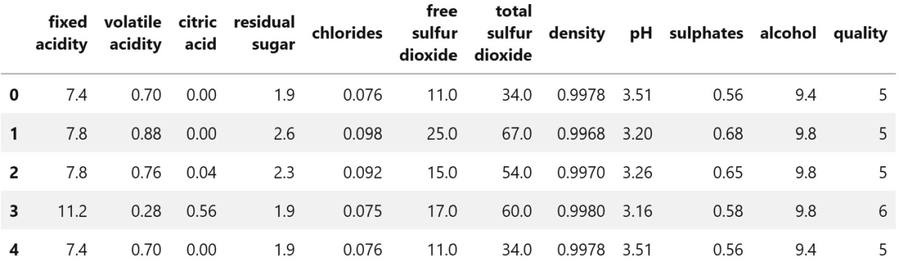
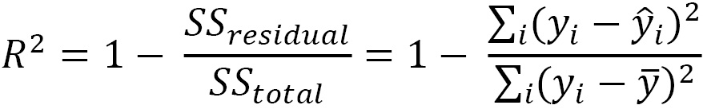
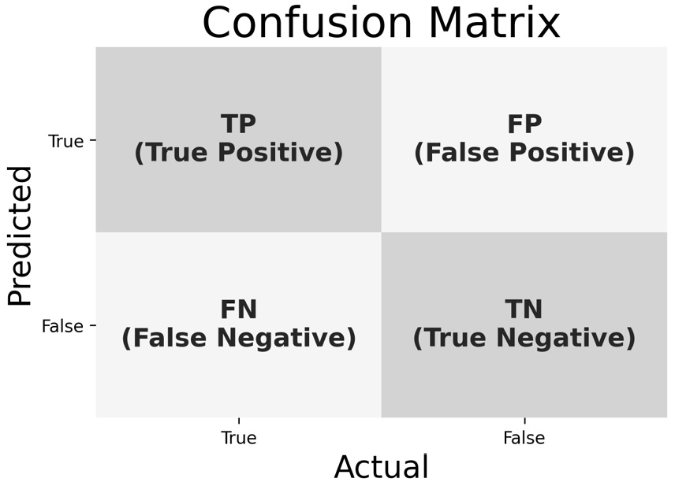
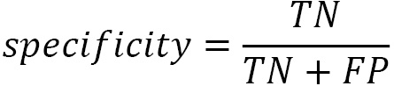

*Lab 9*: Getting Started with Machine Learning in Python
========================================================

The following topics will be covered in this lab:

-   Overview of the machine learning landscape
-   Performing exploratory data analysis using skills learned in
    previous labs
-   Preprocessing data for use in a machine learning model
-   Clustering to help understand unlabeled data
-   Learning when regression is appropriate and how to implement it with
    scikit-learn
-   Understanding classification tasks and learning how to use logistic
    regression


Lab materials
=================


In this lab, we will be working with three datasets. The first two
come from data on wine quality that was donated to the UCI Machine
Learning Data Repository (<http://archive.ics.uci.edu/ml/index.php>) by
P. Cortez, A. Cerdeira, F. Almeida, T. Matos, and J. Reis, which
contains information on the chemical properties of various wine samples,
along with a rating of the quality from a blind tasting by a panel of
wine experts. These files can be found in the `data/` folder
inside this lab\'s folder in the GitHub repository
(<https://github.com/fenago/data-analysis-pandas/tree/master/lab_9>)
as `winequality-red.csv` and `winequality-white.csv`
for red and white wine, respectively.

Our third dataset was collected using the Open Exoplanet Catalogue
database, which can be found at
<https://github.com/OpenExoplanetCatalogue/open_exoplanet_catalogue/>.
This database provides data in **eXtensible
Markup Language** (**XML**) format, which is similar to HTML. The
`planet_data_collection.ipynb` notebook on GitHub contains the
code that was used to parse this information into the CSV files we will
use in this lab; while we won\'t be going over this explicitly, I
encourage you to take a look at it. The data files can be found in the
`data/` folder, as well. We will use `planets.csv`
for this lab; however, the parsed data for the other hierarchies is
provided for exercises and further exploration. These are
`binaries.csv`, `stars.csv`, and
`systems.csv`, which contain data on binaries (stars or
binaries forming a group of two), data on a single star, and data on
planetary systems, respectively.

We will be using the `red_wine.ipynb` notebook to predict red
wine quality, the `wine.ipynb` notebook to classify wines as
red or white based on their chemical properties, and the
`planets_ml.ipynb` notebook to build a regression model to
predict the year length of planets and perform clustering to find
similar planet groups. We will use the
`preprocessing.ipynb` notebook for the section on
preprocessing.

Back in *Lab 1*,
*Introduction to Data Analysis*, when we set up our environment, we
installed a package from GitHub called `ml_utils`. This
package contains utility functions and classes that we will use for our
three labs on machine learning. Unlike the last two labs, we
won\'t be discussing how to make this package; however, those interested
can look through the code at
https://github.com/fenago/ml-utils/tree/2nd_edition and follow the
instructions from *Lab 7*,
*Financial Analysis -- Bitcoin and the Stock Market*, to install it in
editable mode.

The following are the reference links for the data sources:

-   *Open Exoplanet Catalogue database*, available at
    <https://github.com/OpenExoplanetCatalogue/open_exoplanet_catalogue/#data-structure>.
-   *P. Cortez, A. Cerdeira, F. Almeida, T. Matos and J. Reis. Modeling
    wine preferences by data mining from physicochemical properties. In
    Decision Support Systems, Elsevier, 47(4):547-553, 2009.* Available
    online at <http://archive.ics.uci.edu/ml/datasets/Wine+Quality>.
-   *Dua, D. and Karra Taniskidou, E. (2017). UCI Machine Learning
    Repository \[*<http://archive.ics.uci.edu/ml/index.php>*\]. Irvine,
    CA: University of California, School of Information and Computer
    Science.*


Machine learning in Python
--------------------------

In this course, we will be using `scikit-learn` for its
user-friendly API. In `scikit-learn`, our base class is an
**estimator** (not to be confused with a model when used in statistical
terms), which is capable of learning from the data via its
`fit()` method. We use **transformers** to prepare our data
with their `transform()` method---transforming the data into
something **predictors** (classes for supervised or unsupervised
learning) can use with their
`predict()` method. The **model** classes are capable of
calculating how well they perform using a
`score()` method. Knowing just these
four methods, we can easily build any machine learning model offered by
`scikit-learn`.


Exploratory data analysis
=========================


As we have learned throughout this course, our first step should be to
engage in some **exploratory data analysis** (**EDA**) to get familiar
with our data. In the interest of brevity, this section
will include a subset of the EDA that\'s
available in each of the notebooks---be sure to check out the respective
notebooks for the full version.

Let\'s start with our imports, which will be the same across the
notebooks we will use in this lab:

```
>>> %matplotlib inline
>>> import matplotlib.pyplot as plt
>>> import numpy as np
>>> import pandas as pd
>>> import seaborn as sns
```

We will start our EDA with the wine quality data before moving on to the
planets.


Red wine quality data
---------------------

Let\'s read in our red wine data and
do some EDA using techniques we have learned
throughout this course:

```
>>> red_wine = pd.read_csv('data/winequality-red.csv')
```

We have data on 11 different chemical properties of red wine, along with
a column indicating the quality score from the wine experts that
participated in the blind taste testing. We can try to predict the
quality score by looking at the chemical properties:





Figure 9.1 -- Red wine dataset

Let\'s see what the distribution of the `quality` column looks
like:

```
>>> def plot_quality_scores(df, kind):
...     ax = df.quality.value_counts().sort_index().plot.barh(
...         title=f'{kind.title()} Wine Quality Scores',
...         figsize=(12, 3)
...     ) 
...     ax.axes.invert_yaxis()
...     for bar in ax.patches:
...         ax.text(
...             bar.get_width(),
...             bar.get_y() + bar.get_height()/2,
...             f'{bar.get_width()/df.shape[0]:.1%}',
...             verticalalignment='center'
...         )
...     plt.xlabel('count of wines')
...     plt.ylabel('quality score')
...  
...     for spine in ['top', 'right']:
...         ax.spines[spine].set_visible(False)
... 
...     return ax
>>> plot_quality_scores(red_wine, 'red')
```

The information on the dataset says that
`quality` varies from 0 (terrible) to 10 (excellent); however,
we only have values in the middle of that range. An
interesting task for this dataset could be to see
if we can predict high-quality red wines (a quality score of 7 or
higher):


Figure 9.2 -- Distribution of red wine quality scores

All of our data is numeric, so we
don\'t have to worry about handling text values;
we also don\'t have any missing values:

```
>>> red_wine.info()
<class 'pandas.core.frame.DataFrame'>
RangeIndex: 1599 entries, 0 to 1598
Data columns (total 12 columns):
 #   Column                Non-Null Count  Dtype  
---  ------                --------------  -----  
 0   fixed acidity         1599 non-null   float64
 1   volatile acidity      1599 non-null   float64
 2   citric acid           1599 non-null   float64
 3   residual sugar        1599 non-null   float64
 4   chlorides             1599 non-null   float64
 5   free sulfur dioxide   1599 non-null   float64
 6   total sulfur dioxide  1599 non-null   float64
 7   density               1599 non-null   float64
 8   pH                    1599 non-null   float64
 9   sulphates             1599 non-null   float64
 10  alcohol               1599 non-null   float64
 11  quality               1599 non-null   int64  
dtypes: float64(11), int64(1)
memory usage: 150.0 KB
```

We can  to get an idea
of what scale each of the columns is on:

```
>>> red_wine.describe()
```

The result indicates that we will definitely have to do some scaling if
our model uses distance metrics for anything because our columns aren\'t
all on the same range:


Figure 9.3 -- Summary statistics for the red wine dataset

Lastly, let\'s use `pd.cut()` to bin our high-quality red
wines (roughly 14% of the data) for later:

```
>>> red_wine['high_quality'] = pd.cut(
...     red_wine.quality, bins=[0, 6, 10], labels=[0, 1]
... )
>>> red_wine.high_quality.value_counts(normalize=True)
0    0.86429
1    0.13571
Name: high_quality, dtype: float64
```


White and red wine chemical properties data
-------------------------------------------

Now, let\'s look at the red and white wine data together. Since the data
comes in separate files, we need to read in both
and concatenate them into a single dataframe. The
white wine file is actually semi-colon
(`;`) separated, so we must provide the `sep`
argument to `pd.read_csv()`:

```
>>> red_wine = pd.read_csv('data/winequality-red.csv')
>>> white_wine = \
...     pd.read_csv('data/winequality-white.csv', sep=';')
```

We can also look at the quality scores of the
white wines, just as we did with the red ones, and we will find that the
white wines tend to be rated higher overall. This might bring us to
question whether the judges preferred white wine over red wine, thus
creating a bias in their ratings. As it is, the rating system that was
used seems to be pretty subjective:


Figure 9.4 -- Distribution of white wine quality scores

Both of these dataframes
have the same columns, so we can combine them
without further work. Here, we use `pd.concat()` to stack
the white wine data on top of
the red wine data after adding a column to
identify which wine type each observation belongs to:

```
>>> wine = pd.concat([
...     white_wine.assign(kind='white'),
...     red_wine.assign(kind='red')
... ])
>>> wine.sample(5, random_state=10)
```

As we did with the red wine dataset, we can run `info()` to
check whether we need to perform type conversion or whether we are
missing any data; thankfully, we have no need here either. Our combined
wine dataset looks like this:


Figure 9.5 -- Combined wine dataset

Using `value_counts()`, we can see that
we have many more white wines than red wines in the data:

```
>>> wine.kind.value_counts()
white    4898
red      1599
Name: kind, dtype: int64
```

Lastly, let\'s examine box
plots for each chemical property
broken out by wine type using
`seaborn`. This can help us identify **features** (model
inputs) that will be helpful when building our model to distinguish
between red and white wine:

```
>>> import math
>>> chemical_properties = [col for col in wine.columns
...                        if col not in ['quality', 'kind']]
>>> melted = \
...     wine.drop(columns='quality').melt(id_vars=['kind'])
>>> fig, axes = plt.subplots(
...     math.ceil(len(chemical_properties) / 4), 4, 
...     figsize=(15, 10)
... )
>>> axes = axes.flatten()
>>> for prop, ax in zip(chemical_properties, axes):
...     sns.boxplot(
...         data=melted[melted.variable.isin([prop])], 
...         x='variable', y='value', hue='kind', ax=ax
...     ).set_xlabel('')
>>> for ax in axes[len(chemical_properties):]:
...     ax.remove() # remove the extra subplots
>>> plt.suptitle(
...     'Comparing Chemical Properties of Red and White Wines'
... )
>>> plt.tight_layout()
```

Given the following result, we might look to use
fixed acidity, volatile acidity, total sulfur
dioxide, and sulphates
when building a model since they seem to be
distributed differently for red and white wines:


Figure 9.6 -- Comparing red and white wine on a chemical level

Tip

Comparing the distributions of variables across
classes can help inform feature selection for our model. If
the
distribution for a variable is very different between classes, that
variable may be very useful to include in our model. It is essential
that we perform an in-depth exploration of our
data before moving on to modeling. Be sure to use the visualizations we
covered in *Lab 5*,
*Visualizing Data with Pandas and Matplotlib*, and *Lab 6*,
*Plotting with Seaborn and Customization Techniques*, as they will prove
invaluable for this process.

We will come back to this visualization in *Lab 10*,
*Making Better Predictions -- Optimizing Models*, when we examine
incorrect predictions made by our model. Now, let\'s take a look at the
other dataset we will be working with.


Planets and exoplanets data
---------------------------

An **exoplanet** is simply a planet that orbits a
star outside of our solar system, so from here on
out we will refer to both collectively as
**planets**. Let\'s read in our planets data now:

```
>>> planets = pd.read_csv('data/planets.csv')
```

Some interesting tasks we can do with this data would be to find
clusters of similar planets based on their orbits and try to predict the
orbit period (how long a year is on a planet), in Earth days:


Figure 9.7 -- Planets dataset

We can build a correlation matrix heatmap to help find the best features
to use:

```
>>> fig = plt.figure(figsize=(7, 7))
>>> sns.heatmap(
...     planets.drop(columns='discoveryyear').corr(), 
...     center=0, vmin=-1, vmax=1, square=True, annot=True,
...     cbar_kws={'shrink': 0.8}
... )
```

The heatmap shows us that the semi-major axis of a planet\'s orbit is
highly positively correlated to the length
of its period, which makes
sense since the semi-major axis (along
with eccentricity) helps define the path that a
planet travels around its star:


Figure 9.8 -- Correlations between features in the planets dataset

To predict `period`, we probably want to look at
`semimajoraxis`, `mass`, and
`eccentricity`. The orbit eccentricity quantifies how much the
orbit differs from a perfect circle:


Figure 9.9 -- Understanding eccentricity

Let\'s shapes
the orbits we have are:

```
>>> planets.eccentricity.min(), planets.eccentricity.max()
(0.0, 0.956) # circular and elliptical eccentricities
>>> planets.eccentricity.hist()
>>> plt.xlabel('eccentricity')
>>> plt.ylabel('frequency')
>>> plt.title('Orbit Eccentricities')
```

It looks like nearly everything is an ellipse,
which we would expect since these are planets:


Figure 9.10 -- Distribution of orbit eccentricities

An ellipse, being an elongated circle, has two axes: *major* and *minor*
for the longest and shortest ones, respectively.
The semi-major axis is half the major axis. When
compared to a circle, the axes are analogous to
the diameter, crossing the entire shape, and the
semi-axes are akin to the radius, being half the diameter. The following
is how this would look in the case where the planet orbited a star that
was exactly in the center of its elliptical orbit (due to gravity from
other objects, in reality, the star can be anywhere inside the orbit
path):


Figure 9.11 -- Understanding the semi-major axis

Now that we understand what these columns mean, let\'s do some more EDA.
This data isn\'t as clean as our wine data was---it\'s certainly much
easier to measure everything when we can reach
out and touch it. We only have
`eccentricity`, `semimajoraxis`, or `mass`
data for a fraction of the planets, despite
 values:

```
>>> planets[[
...     'period', 'eccentricity', 'semimajoraxis', 'mass'
... ]].info()
<class 'pandas.core.frame.DataFrame'>
RangeIndex: 4094 entries, 0 to 4093
Data columns (total 4 columns):
 #   Column         Non-Null Count  Dtype  
---  ------         --------------  -----  
 0   period         3930 non-null   float64
 1   eccentricity   1388 non-null   float64
 2   semimajoraxis  1704 non-null   float64
 3   mass           1659 non-null   float64
dtypes: float64(4)
memory usage: 128.1 KB
```

If we were to drop data where any of these columns was null, we would be
left with about 30% of it:

```
>>> planets[[
...     'period', 'eccentricity', 'semimajoraxis', 'mass'
... ]].dropna().shape
(1222, 4)
```

If we are simply looking for a way to predict the length of the year
(when we have these values available) to learn more about their
relationship, we wouldn\'t necessarily worry about throwing out the
missing data. Imputing it here could be far worse for our model. At
least everything is properly encoded as a decimal
(`float64`); however, let\'s check
whether we need to do some scaling (beneficial if our model is sensitive
to differences in magnitude):

```
>>> planets[[
...     'period', 'eccentricity', 'semimajoraxis', 'mass'
... ]].describe()
```

This shows us that, depending on our model, we
will definitely have to do some scaling because
the values in the `period` column are much larger than the
others:


Figure 9.12 -- Summary statistics for the planets dataset

We could also look at some scatter plots. Note that there is a
`list` column for the group the planet belongs to, such as
`Solar System` or `Controversial`. We might want to
see if the period (and distance from the star) influences this:

```
>>> sns.scatterplot(
...     x=planets.semimajoraxis, y=planets.period, 
...     hue=planets.list, alpha=0.5
... )
>>> plt.title('period vs. semimajoraxis')
>>> plt.legend(title='') 
```

The controversial planets appear to be
spread throughout and have larger
axes and
periods. Perhaps they are controversial because they are very far from
their star:


Figure 9.13 -- Planet period versus semi-major axis

Unfortunately, we can see that the scale of `period` is making
this pretty difficult to read, so we could try a log transformation on
the *y*-axis to get more separation in the denser section on the
lower-left. Let\'s just point out the planets in our solar system this
time:

```
>>> fig, ax = plt.subplots(1, 1, figsize=(10, 10))
>>> in_solar_system = (planets.list == 'Solar System')\
...     .rename('in solar system?')
>>> sns.scatterplot(
...     x=planets.semimajoraxis, y=planets.period, 
...     hue=in_solar_system, ax=ax
... )
>>> ax.set_yscale('log')
>>> solar_system = planets[planets.list == 'Solar System']
>>> for planet in solar_system.name:
...     data = solar_system.query(f'name == "{planet}"')
...     ax.annotate(
...         planet, 
...         (data.semimajoraxis, data.period), 
...         (7 + data.semimajoraxis, data.period),
...         arrowprops=dict(arrowstyle='->')
...     )
>>> ax.set_title('log(orbital period) vs. semi-major axis')
```

There were certainly a lot of
planetsthat
lower-left corner of the plot. We can see many
planets with years shorter than Mercury\'s 88 Earth-day year now:


Figure 9.14 -- Our solar system compared to exoplanets

Now that we have a feel for the data we will be working with, let\'s
learn how to prepare it for use in a machine learning model.


Preprocessing data
==================


In this section, we will be working in the
`preprocessing.ipynb` notebook before we return
to the notebooks we used for EDA. We will begin
with our imports and read in the data:

```
>>> import numpy as np
>>> import pandas as pd
>>> planets = pd.read_csv('data/planets.csv')
>>> red_wine = pd.read_csv('data/winequality-red.csv')
>>> wine = pd.concat([
...     pd.read_csv(
...         'data/winequality-white.csv', sep=';'
...     ).assign(kind='white'), 
...     red_wine.assign(kind='red')
... ])
```

Machine learning models follow the garbage in, garbage out principle. We
have to make sure that we **train** our models (have them learn) on the
best possible version of the data. What this means will depend on the
model we choose. For instance, models that use a distance metric to
calculate how similar observations are will easily be confused if our
features are on wildly different scales. Unless
we are working with a **natural language processing** (**NLP**) problem
to try and understand the meaning of words, our model will have no use
for---or worse, be unable to interpret---textual values. Missing or
invalid data will also cause problems; we will have to decide whether to
drop them or impute them. All of the adjustments we make to our
data before giving it to our model to learn from
are collectively called **preprocessing**.


Training and testing sets
-------------------------

So far, machine learning sounds pretty great, though---we can build a
model that will learn how to perform a task for
us. Therefore, we should give it all the data we
have so that it learns well, right? Unfortunately, it\'s not that
simple. If we give the model all of our data, we risk **overfitting**
it, meaning that it won\'t be able to generalize well to new data points
because it was fit to the sample rather than the population. On the
other hand, if we don\'t give it enough data, it will **underfit** and
be unable to capture the underlying information in the data.

Tip

When a model fits the randomness in the data, it is said to fit the
**noise** in the data.

Another thing to consider is that if we use all of our data to train the
model, how can we evaluate its performance? If we test it on the data we
used for training, we will be overestimating how good it is because our
model will always perform better on the training data. For these
reasons, it\'s important to split our data into a **training set** and
**testing set**. To do so, we could shuffle our dataframe and select the
top *x*% of the rows for training and leave the rest for testing:

```
shuffled = \
    planets.reindex(np.random.permutation(planets.index))
train_end_index = int(np.ceil(shuffled.shape[0] * .75))
training = shuffled.iloc[:train_end_index,]
testing = shuffled.iloc[train_end_index:,]
```

This would work, but it\'s a lot to write every time. Thankfully,
`scikit-learn` provides us with the
`train_test_split()` function in the
`model_selection` module, which is a more robust,
easier-to-use solution. It requires us to separate our input data
(`X`) from our output data (`y`) beforehand. Here,
we will pick 75% of the data to be used for the training set
(`X_train`, `y_train`) and 25% for the testing set
(`X_test`, `y_test`). We will set a seed
(`random_state=0`) so that the split is reproducible:

```
>>> from sklearn.model_selection import train_test_split
>>> X = planets[['eccentricity', 'semimajoraxis', 'mass']]
>>> y = planets.period
>>> X_train, X_test, y_train, y_test = train_test_split(
...     X, y, test_size=0.25, random_state=0
... )
```

While there are no specific criteria for what constitutes a good size
for the test set, a rule of thumb is usually between 10% and 30% of the
data. However, if we don\'t have much data, we will
shift toward a 10% testing set to make sure that
we have enough data to learn from. Conversely, if
we have a lot of data, we may move toward 30% testing, since, not only
do we not want to overfit, but we want to give our model a good amount
of data to prove its worth. Note that there is a big caveat with this
rule of thumb: there are diminishing returns on the amount of training
data we use. If we have a ton of data, we will most likely use much less
than 70% of it for training because our computational costs may rise
significantly for possibly minuscule improvements and an increased risk
of overfitting.

Important note

When building models that require tuning, we split the data into
training, validation, and testing sets. We will introduce validation
sets in *Lab 10*,
*Making Better Predictions -- Optimizing Models*.

Let\'s take a look at the dimensions of our training and testing sets
now. Since we are using three features (`eccentricity`,
`semimajoraxis`, and `mass`), `X_train`
and `X_test` have three columns. The `y_train` and
`y_test` sets will be a single column each. The number of
observations in the `X` and `y` data for training
will be equal, as will be the case for the testing set:

```
>>> X.shape, y.shape # original data
((4094, 3), (4094,))
>>> X_train.shape, y_train.shape # training data
((3070, 3), (3070,))
>>> X_test.shape, y_test.shape # testing data
((1024, 3), (1024,))
```

`X_train` and `X_test` are returned to us as
dataframes since that is the format we passed them in as. If we
are working with data in NumPy directly, we will
 back
instead. We are going to work with this data for other examples in the
*Preprocessing data* section, so let\'s take a look at the first five
rows of the `X_train` dataframe. Don\'t worry about the
`NaN` values for now; we will discuss different ways of
handling them in the *Imputing* section:

```
>>> X_train.head()
      eccentricity  semimajoraxis  mass
1390           NaN            NaN   NaN
2837           NaN            NaN   NaN
3619           NaN         0.0701   NaN
1867           NaN            NaN   NaN
1869           NaN            NaN   NaN
```

Both `y_train` and `y_test` are series since that is
what we passed into the `train_test_split()` function. If we
had passed in a NumPy array, that is what we would have gotten back
instead. The rows in `y_train` and `y_test` must
line up with the rows in `X_train` and `X_test`,
respectively. Let\'s confirm this by looking at the first five rows of
`y_train`:

```
>>> y_train.head()
1390     1.434742
2837    51.079263
3619     7.171000
1867    51.111024
1869    62.869161
Name: period, dtype: float64
```

Indeed, everything matches up, as expected. Note that for our wine
models, we need to use stratified sampling, which
can also be done with `train_test_split()` by passing
the values to stratify on in the
`stratify` argument. We will see this in the *Classification*
section. For now, let\'s move on to the rest of our preprocessing.


Scaling and centering data
--------------------------

We\'ve seen that our dataframes had columns with very different scales;
if we want to use any model that calculates a
distance metric (such as k-means, which we will
discuss in this lab, or **k-nearest neighbors** (**k-NN**), which we
will discuss briefly in *Lab 10*,
*Making Better Predictions -- Optimizing Models*), we will need to scale
these. As we discussed back in *Lab 1*,
*Introduction to Data Analysis*, we have quite a few options for doing
so. Scikit-learn provides options in the `preprocessing`
module for standardizing (scaling by calculating Z-scores) and min-max
scaling (to normalize data to be in the range \[0, 1\]), among others.

Important note

We should check the requirements of the model we are building to see if
the data needs to be scaled.

For standard scaling, we use the `StandardScaler` class. The
`fit_transform()` method combines `fit()`, which
figures out the mean and standard deviation needed to center and scale,
and `transform()`, which applies the transformation to the
data. Note that, when instantiating a `StandardScaler` object,
we can choose to not subtract the mean or not divide by the standard
deviation by passing `False` to `with_mean` or
`with_std`, respectively. Both are `True` by
default:

```
>>> from sklearn.preprocessing import StandardScaler
>>> standardized = StandardScaler().fit_transform(X_train)
# examine some of the non-NaN values
>>> standardized[~np.isnan(standardized)][:30]
array([-5.43618156e-02,  1.43278593e+00,  1.95196592e+00,
        4.51498477e-03, -1.96265630e-01,  7.79591646e-02, 
        ...,
       -2.25664815e-02,  9.91013258e-01, -7.48808523e-01,
       -4.99260165e-02, -8.59044215e-01, -5.49264158e-02])
```

After this transformation, the data is in **scientific notation**. The
information after the character `e` tells us
where the decimal point got moved to. For a
`+` sign, we move the decimal point to
the right by the number of places indicated; we move to the left for a
`-` sign. Therefore, `1.00e+00` is equivalent to
`1`, `2.89e-02` is equivalent to `0.0289`,
and `2.89e+02` is equivalent to `289`. The
transformed planets data is mostly between -3 and 3 because everything
is now a Z-score.

Other scalers can be used with the same syntax. Let\'s use the
`MinMaxScaler` class to transform the planets data into the
range \[0, 1\]:

```
>>> from sklearn.preprocessing import MinMaxScaler
>>> normalized = MinMaxScaler().fit_transform(X_train)
# examine some of the non-NaN values
>>> normalized[~np.isnan(normalized)][:30]
array([2.28055906e-05, 1.24474091e-01, 5.33472803e-01,
       1.71374569e-03, 1.83543340e-02, 1.77824268e-01, 
       ...,
       9.35966714e-04, 9.56961137e-02, 2.09205021e-02, 
       1.50201619e-04, 0.00000000e+00, 6.59028789e-06])
```

Tip

Another 
class, which uses the median and IQR for robust
to outliers scaling. There is an example of this in the notebook. More
preprocessing classes can be found at
<https://scikit-learn.org/stable/modules/classes.html#module-sklearn.preprocessing>.


Encoding data
-------------

All of the scalers discussed so far address the preprocessing of our
numeric data, but how can we deal with
categorical data? We need to encode the categories into integer values.
There are a few options here, depending on what the categories
represent. If our category is binary (such as
`0`/`1`, `True`/`False`, or
`yes`/`no`), then we will **encode** these as a
single column for both options, where `0` is one option and
`1` is the other. We can easily do this with the
`np.where()` function. Let\'s encode the wine data\'s
`kind` field as `1` for red and `0` for
white:

```
>>> np.where(wine.kind == 'red', 1, 0)
array([0, 0, 0, ..., 1, 1, 1])
```

This is effectively a column that tells us whether or not the wine is
red. Remember, we concatenated the red wines to the bottom of the white
wines when we created our `wine` dataframe, so
`np.where()` will return zeros for the top rows and ones for
the bottom rows, just like we saw in the previous result.

Tip

We can also use the `LabelBinarizer` class from
`scikit-learn` to encode the `kind` field. Note that
if our data is actually continuous, but we want to treat it as a binary
categorical value, we could use the `Binarizer` class and
provide a threshold or `pd.cut()`/`pd.qcut()`. There
are examples of these in the notebook.

If our categories are ordered, we may want to use
**ordinal encoding** on those columns; this will preserve the ordering
of the categories. For instance, if we wanted to classify the red wines
as low, medium, or high quality, we could encode this as `0`,
`1`, and `2`, respectively. The advantages of this
are that we can use regression techniques to
predict the quality, or we can use this as a feature in the model to
predict something else; this model would be able to use the fact that
high is better than medium, which is better than low quality. We can
achieve this with the `LabelEncoder` class. Note that the
labels will be created according to alphabetical order, so the first
category alphabetically will be `0`:

```
>>> from sklearn.preprocessing import LabelEncoder
>>> pd.Series(LabelEncoder().fit_transform(pd.cut(
...     red_wine.quality, 
...     bins=[-1, 3, 6, 10], 
...     labels=['0-3 (low)', '4-6 (med)', '7-10 (high)']
... ))).value_counts()
1    1372
2     217
0      10
dtype: int64
```

Important note

Scikit-learn provides the `OrdinalEncoder` class, but our data
is not in the correct format---it expects 2D data (such as a
`DataFrame` or `ndarray` object), instead of the 1D
`Series` object we are working with here. We still need to
ensure that the categories are in the proper order beforehand.

However, note that the ordinal encoding may create a potential data
issue. In our example, if high-quality wines are now `2` and
medium-quality wines are `1`, the model may interpret that
`2 * med = high`. This is implicitly creating an association
between the levels of quality that we may not agree with.

Alternatively, a safer approach would be to
perform **one-hot encoding** to create two new
columns---`is_low` and `is_med`, which take only
`0` or `1`. Using those two, we automatically know
whether the wine quality was high (when `is_low` =
`is_med` = `0`). These are called **dummy
variables** or **indicator variables**; they numerically represent group
membership for use in machine learning. If the
indicator or dummy has a value of `1`, that row is a member of
that group; in our example of wine quality
categories, if `is_low` is `1`, then that row is a
member of the low-quality group. This can be achieved with the
`pd.get_dummies()` function and the `drop_first`
argument, which will remove the redundant column.

Let\'s use one-hot encoding to encode the `list` column in the
planets data, since the categories have no inherent order. Before we do
any transformations, let\'s take a look at the lists we have in the
data:

```
>>> planets.list.value_counts()
Confirmed planets                    3972
Controversial                          97
Retracted planet candidate             11
Solar System                            9
Kepler Objects of Interest              4
Planets in binary systems, S-type       1
Name: list, dtype: int64
```

We can use the `pd.get_dummies()` function to create dummy
variables if we want to include the planet list in our models:

```
>>> pd.get_dummies(planets.list).head()
```

This turns our single series into the following
dataframe, where the dummy variables were created in the order they
appeared in the data:


Figure 9.15 -- One-hot encoding

As we discussed previously, one of these columns is redundant because
the values in the remaining ones can be used to determine the value for
the redundant one. Some models may be
significantly affected by the high correlation between these columns
(referred to as **multicollinearity**), so we should remove one
redundant column by passing in the `drop_first` argument:

```
>>> pd.get_dummies(planets.list, drop_first=True).head()
```

Note that the first column from the previous result has been removed,
but we can still determine that all but the last row were in the
`Confirmed Planets` list:


Figure 9.16 -- Dropping redundant columns after one-hot encoding

Note that we can obtain a similar result by using the
`LabelBinarizer` class and its `fit_transform()`
method on our planets list. This won\'t drop a redundant feature, so we
once again have the first feature belonging to
the confirmed planets list, which can be seen in bold in the following
result:

```
>>> from sklearn.preprocessing import LabelBinarizer
>>> LabelBinarizer().fit_transform(planets.list)
array([[1, 0, 0, 0, 0, 0],
       [1, 0, 0, 0, 0, 0], 
       [1, 0, 0, 0, 0, 0],
       ..., 
       [1, 0, 0, 0, 0, 0],
       [1, 0, 0, 0, 0, 0],
       [1, 0, 0, 0, 0, 0]])
```

Important note

Scikit-learn provides the `OneHotEncoder` class, but our data
is not in the correct format---it expects the data to come in a 2D
array, and our series is just 1D. We will see an example of how to use
this in the *Additional transformers* section.


Imputing
--------

We already know that we have some missing values in our planet data, so
let\'s discuss a few of the options `scikit-learn` offers for
handling them, which can be found in the `impute` module:
imputing with a value (using constants or summary statistics), imputing
based on similar observations, and indicating
what is missing.

Back in the *Exploratory data analysis* section, we ran
`dropna()` on the planets data we planned to model with.
Let\'s say we don\'t want to get rid of it, and we want to try imputing
it instead. The last few rows of our data have some missing values for
`semimajoraxis`:

```
>>> planets[['semimajoraxis', 'mass', 'eccentricity']].tail()
      semimajoraxis    mass  eccentricity
4089        0.08150  1.9000         0.000
4090        0.04421  0.7090         0.038
4091            NaN  0.3334         0.310
4092            NaN  0.4000         0.270
4093            NaN  0.4200         0.160
```

We can use the `SimpleImputer` class to impute with a value,
which will be the mean by default:

```
>>> from sklearn.impute import SimpleImputer
>>> SimpleImputer().fit_transform(
...     planets[['semimajoraxis', 'mass', 'eccentricity']]
... )
array([[ 1.29      , 19.4       ,  0.231     ],
       [ 1.54      , 11.2       ,  0.08      ],
       [ 0.83      ,  4.8       ,  0.        ],
       ...,
       [ 5.83796389,  0.3334    ,  0.31      ],
       [ 5.83796389,  0.4       ,  0.27      ],
       [ 5.83796389,  0.42      ,  0.16      ]])
```

The mean hardly seems like a good strategy here since the planets we
know about may share something in common, and surely things like what
system a planet is a part of and its orbit can be
good indicators of some of the missing data points. We have the option
to provide the `strategy` parameter with a method other than
the mean; currently, it can be `median`,
`most_frequent`, or `constant` (specify the value
with `fill_value`). None of these is really appropriate for
us; however, `scikit-learn` also provides the
`KNNImputer` class for imputing missing values based on
similar observations. By default, it uses the five nearest neighbors and
runs k-NN, which we will discuss in *Lab 10*,
*Making Better Predictions -- Optimizing Models*, using the features
that aren\'t missing:

```
>>> from sklearn.impute import KNNImputer
>>> KNNImputer().fit_transform(
...     planets[['semimajoraxis', 'mass', 'eccentricity']]
... )
array([[ 1.29    , 19.4     ,  0.231   ],
       [ 1.54    , 11.2     ,  0.08    ],
       [ 0.83    ,  4.8     ,  0.      ],
       ...,
       [ 0.404726,  0.3334  ,  0.31    ],
       [ 0.85486 ,  0.4     ,  0.27    ],
       [ 0.15324 ,  0.42    ,  0.16    ]])
```

Notice that each of the bottom three rows has a unique value imputed for
the semi-major axis now. This is because the mass and eccentricity were
used to find similar planets from which to impute the semi-major axis.
While this is certainly better than using the `SimpleImputer`
class for the planets data, imputing can be dangerous.

Rather than imputing the data, in some cases, we may be more interested
in noting where we have missing data and using
that as a feature in our model. This can be achieved with the
`MissingIndicator` class:

```
>>> from sklearn.impute import MissingIndicator
>>> MissingIndicator().fit_transform(
...     planets[['semimajoraxis', 'mass', 'eccentricity']]
... )
array([[False, False, False],
       [False, False, False],
       [False, False, False],
       ...,
       [ True, False, False],
       [ True, False, False],
       [ True, False, False]])
```

As we turn our attention to the final set of preprocessors that we will
discuss, notice that all of them have a `fit_transform()`
method, along with `fit()` and `transform()`
methods. This API design decision makes it very easy to figure out how
to use new classes and is one of the reasons why
`scikit-learn` is so easy to learn and use---it\'s very
consistent.


Additional transformers
-----------------------

What if, rather than scaling our data or encoding
it, we want to run a mathematical operation, such as taking the square
root or the logarithm? The `preprocessing` module also has
some classes for this. While there are a few that perform a specific
transformation, such as the `QuantileTransformer` class, we
will focus our attention on the `FunctionTransformer` class,
which lets us provide an arbitrary function to use:

```
>>> from sklearn.preprocessing import FunctionTransformer
>>> FunctionTransformer(
...     np.abs, validate=True
... ).fit_transform(X_train.dropna())
array([[0.51   , 4.94   , 1.45   ],
       [0.17   , 0.64   , 0.85   ],
       [0.08   , 0.03727, 1.192  ],
       ...,
       [0.295  , 4.46   , 1.8    ],
       [0.34   , 0.0652 , 0.0087 ],
       [0.3    , 1.26   , 0.5    ]])
```

Here, we took the absolute value of every number. Take note of the
`validate=True` argument; the `FunctionTransformer`
class knows that `scikit-learn` models won\'t accept
`NaN` values, infinite values, or missing ones, so it will
throw an error if we get those back. For this reason, we run
`dropna()` here as well.

Notice that for scaling, encoding, imputing, and
transforming data, everything we passed was transformed. If we have
features of different data types, we can use the
`ColumnTransformer` class to map transformations to a column
(or group of columns) in a single call:

```
>>> from sklearn.compose import ColumnTransformer 
>>> from sklearn.impute import KNNImputer
>>> from sklearn.preprocessing import (
...     MinMaxScaler, StandardScaler
... )
>>> ColumnTransformer([
...     ('impute', KNNImputer(), [0]),
...     ('standard_scale', StandardScaler(), [1]),
...     ('min_max', MinMaxScaler(), [2])
... ]).fit_transform(X_train)[10:15] 
array([[ 0.17      , -0.04747176,  0.0107594 ],
       [ 0.08      , -0.05475873,  0.01508851],
       [ 0.15585591,         nan,  0.13924042],
       [ 0.15585591,         nan,         nan],
       [ 0.        , -0.05475111,  0.00478471]])
```

There is also the `make_column_transformer()` function, which
will name the transformers for us. Let\'s make a
`ColumnTransformer` object that will treat categorical data
and numerical data differently:

```
>>> from sklearn.compose import make_column_transformer
>>> from sklearn.preprocessing import (
...     OneHotEncoder, StandardScaler
... )
>>> categorical = [
...     col for col in planets.columns
...     if col in [
...         'list', 'name', 'description', 
...         'discoverymethod', 'lastupdate'
...     ]
... ]
>>> numeric = [
...     col for col in planets.columns
...     if col not in categorical
... ]
>>> make_column_transformer(
...     (StandardScaler(), numeric),
...     (OneHotEncoder(sparse=False), categorical)
... ).fit_transform(planets.dropna())
array([[ 3.09267587, -0.2351423 , -0.40487424, ...,  
         0.        ,  0.        ],
       [ 1.432445  , -0.24215395, -0.28360905, ...,  
         0.        ,  0.        ],
       [ 0.13665505, -0.24208849, -0.62800218, ...,  
         0.        ,  0.        ],
       ...,
       [-0.83289954, -0.76197788, -0.84918988, ...,  
         1.        ,  0.        ],
       [ 0.25813535,  0.38683239, -0.92873984, ...,  
         0.        ,  0.        ],
       [-0.26827931, -0.21657671, -0.70076129, ...,  
         0.        ,  1.        ]])
```

Tip

We are passing `sparse=False` upon instantiating our
`OneHotEncoder` object so that we can
see our result. In practice, we don\'t need to do this since
`scikit-learn` models know how to handle NumPy sparse
matrices.


Building data pipelines
-----------------------

It sure seems like there are a lot of steps involved in preprocessing
our data, and they need to be applied in the
correct order for both training and testing data---quite tedious.
Thankfully, `scikit-learn` offers the ability to create
pipelines to streamline the preprocessing and ensure that the training
and testing sets are treated the same. This prevents issues, such as
calculating the mean using all the data in order to standardize it and
then splitting it into training and testing sets, which will create a
model that looks like it will perform better than it actually will.

Important note

When information from outside the training set
(such as using the full dataset to calculate the mean for
standardization) is used to train the model, it is referred to as **data
leakage**.

We are learning about pipelines before we build our first models because
they ensure that the models are built properly. Pipelines can contain
all the preprocessing steps and the model itself. Making a pipeline is
as simple as defining the steps and naming them:

```
>>> from sklearn.pipeline import Pipeline
>>> from sklearn.preprocessing import StandardScaler
>>> from sklearn.linear_model import LinearRegression
>>> Pipeline([
...     ('scale', StandardScaler()), ('lr', LinearRegression())
... ])
Pipeline(steps=[('scale', StandardScaler()), 
                ('lr', LinearRegression())])
```

We aren\'t limited to using pipelines with models---they can also be
used inside other `scikit-learn` objects, for example,
`ColumnTransformer` objects. This makes it possible for us to
first use k-NN imputing on the semi-major axis data (the column at index
`0`) and then standardize the result.
We can then include this as part of a pipeline, which gives us
tremendous flexibility in how we build our models:

```
>>> from sklearn.compose import ColumnTransformer 
>>> from sklearn.impute import KNNImputer
>>> from sklearn.pipeline import Pipeline
>>> from sklearn.preprocessing import (
...     MinMaxScaler, StandardScaler
... )
>>> ColumnTransformer([
...     ('impute', Pipeline([
...         ('impute', KNNImputer()),
...         ('scale', StandardScaler())
...     ]), [0]),
...     ('standard_scale', StandardScaler(), [1]),
...     ('min_max', MinMaxScaler(), [2])
... ]).fit_transform(X_train)[10:15]
array([[ 0.13531604, -0.04747176,  0.0107594 ],
       [-0.7257111 , -0.05475873,  0.01508851],
       [ 0.        ,         nan,  0.13924042],
       [ 0.        ,         nan,         nan],
       [-1.49106856, -0.05475111,  0.00478471]])
```

Just like with the `ColumnTransformer` class, we have a
function that can make pipelines for us without
having to name the steps. Let\'s make another pipeline, but this time we
will use the `make_pipeline()` function:

```
>>> from sklearn.pipeline import make_pipeline
>>> make_pipeline(StandardScaler(), LinearRegression())
Pipeline(steps=[('standardscaler', StandardScaler()),
                ('linearregression', LinearRegression())])
```

Note that the steps have been automatically named the lowercase version
of the class name. As we will see in the next lab, naming the steps
will make it easier to optimize model parameters by name. The
consistency of the `scikit-learn` API will also allow us to
use this pipeline to fit our model and make predictions using the same
object, which we will see in the next section.


Clustering
==========


We use clustering to divide our data points into groups of similar
points. The points in each group are more like
their fellow group members than those of other groups. Clustering is
commonly used for tasks such as recommendation systems (think of how
Netflix recommends what to watch based on what other people who\'ve
watched similar things are watching) and market segmentation.

For example, say we work at an online retailer and want to segment our
website users for more targeted marketing efforts; we can gather data on
time spent on the site, page visits, products viewed, products
purchased, and much more. Then, we can have an unsupervised clustering
algorithm find groups of users with similar behavior; if we make three
groups, we can come up with labels for each group according to its
behavior:


Figure 9.17 -- Clustering website users into three groups

Since we can use clustering for unsupervised
learning, we will need to interpret the groups that are created and then
try to derive a meaningful name for each group. If our clustering
algorithm identified the three clusters in the preceding scatter plot,
we may be able to make the following behavioral observations:

-   **Frequent customers (group 0)**: Purchase a lot and look at many
    products.
-   **Occasional customers (group 1)**: Have made some purchases, but
    less than the most frequent customers.
-   **Browsers (group 2)**: Visit the website, but haven\'t bought
    anything.

Once these groups have been identified, the marketing team can focus on
marketing to each of these groups differently; it\'s clear that the
frequent customers will do more for the bottom line, but if they are
already buying a lot, perhaps the marketing budget is better utilized
trying to increase the purchases of the occasional customers or
converting browsers into occasional customers.

Important note

Deciding on the number of groups to create can clearly influence how the
groups are later interpreted, meaning that this is not a trivial
decision. We should at least visualize our data and obtain some domain
knowledge on it before attempting to guess the number of groups to split
it into.

Alternatively, clustering can be used in a supervised fashion if we know
the group labels for some of the data for
training purposes. Say we collected data on login activity, like in
[*Lab
8*,
*Rule-Based Anomaly Detection*, but we had some examples of what
attacker activity looks like; we could gather those data points for all
activity and then use a clustering algorithm to assign to the valid
users group or to the attacker group. Since we have the labels, we can
tweak our input variables and/or the clustering algorithm we use to best
align these groups to their true group.


k-means
-------

We will take a look at **k-means**, which iteratively
assigns points to the nearest group using the
distance from the **centroid** of the group (center point), making *k*
groups. Since this model uses distance
calculations, it is imperative that we understand the effect scale will
have on our results beforehand; we can then decide which columns, if
any, to scale.

### Grouping planets by orbit characteristics

As we discussed in the *Preprocessing data* section, we can build a
pipeline to scale and then model our data. Here, our model will be a
`KMeans` object that makes eight clusters (for the number of
planets in our solar system---sorry, Pluto). Since the k-means algorithm
randomly picks its starting centroids, it\'s
possible to get different cluster results unless we specify the seed.
Therefore, we also provide `random_state=0` for
reproducibility:

```
>>> from sklearn.cluster import KMeans
>>> from sklearn.pipeline import Pipeline
>>> from sklearn.preprocessing import StandardScaler
>>> kmeans_pipeline = Pipeline([
...     ('scale', StandardScaler()), 
...     ('kmeans', KMeans(8, random_state=0))
... ])
```

Once we have our pipeline, we fit it on all the data since we aren\'t
trying to predict anything (in this case)---we just want to find similar
planets:

```
>>> kmeans_data = planets[['semimajoraxis', 'period']].dropna()
>>> kmeans_pipeline.fit(kmeans_data)
Pipeline(steps=[('scale', StandardScaler()),
                ('kmeans', KMeans(random_state=0))])
```

Once the model is fit to our data, we can use the `predict()`
method to get the cluster labels for each point (on the same data that
we used previously). Let\'s take a look at the clusters that k-means
identified:

```
>>> fig, ax = plt.subplots(1, 1, figsize=(7, 7))
>>> sns.scatterplot(
...     x=kmeans_data.semimajoraxis, 
...     y=kmeans_data.period, 
...     hue=kmeans_pipeline.predict(kmeans_data),
...     ax=ax, palette='Accent'
... )
>>> ax.set_yscale('log')
>>> solar_system = planets[planets.list == 'Solar System']
>>> for planet in solar_system.name:
...     data = solar_system.query(f'name == "{planet}"')
...     ax.annotate(
...         planet, 
...         (data.semimajoraxis, data.period), 
...         (7 + data.semimajoraxis, data.period),
...         arrowprops=dict(arrowstyle='->')
...     )
>>> ax.get_legend().remove()
>>> ax.set_title('KMeans Clusters')
```

Mercury and Venus landed in the same cluster, as
did Earth and Mars. Jupiter, Saturn, and Uranus each belong to separate
clusters, while Neptune and Pluto share a cluster:


Figure 9.18 -- Eight clusters of planets identified by k-means

We picked eight clusters arbitrarily here, since this is the number of
planets in our solar system. Ideally, we would have some domain
knowledge about the true groupings or need to
pick a specific number. For example, say we want
to fit wedding guests at five tables so that they all get along, then
our *k* is 5; if we can run three marketing campaigns on user groups, we
have a *k* of 3. If we have no intuition as to the number of groups
there will be in the data, a rule of thumb is to try the square root of
our observations, but this can yield an unmanageable amount of clusters.
Therefore, if it doesn\'t take too long to create many k-means models on
our data, we can use the elbow point method.

### The elbow point method for determining k

The **elbow point method** involves creating multiple models with many
values of *k* and plotting each model\'s
**inertia** (**within-cluster sum of squares**) versus the number of
clusters. We want to minimize the sum of squared
distances from points to their cluster\'s center while not creating too
many clusters.

The `ml_utils.elbow_point` module contains our
`elbow_point()` function, which has been reproduced here:

```
import matplotlib.pyplot as plt
def elbow_point(data, pipeline, kmeans_step_name='kmeans',    
                k_range=range(1, 11), ax=None):
    """
    Plot the elbow point to find an appropriate k for
    k-means clustering.
    Parameters:
        - data: The features to use
        - pipeline: The scikit-learn pipeline with `KMeans`
        - kmeans_step_name: Name of `KMeans` step in pipeline
        - k_range: The values of `k` to try
        - ax: Matplotlib `Axes` to plot on.
    Returns: 
        A matplotlib `Axes` object
    """
    scores = []
    for k in k_range:
        pipeline.named_steps[kmeans_step_name].n_clusters = k
        pipeline.fit(data)
        # score is -1*inertia so we multiply by -1 for inertia
        scores.append(pipeline.score(data) * -1)
    if not ax:
        fig, ax = plt.subplots()
    ax.plot(k_range, scores, 'bo-')
    ax.set_xlabel('k')
    ax.set_ylabel('inertias')
    ax.set_title('Elbow Point Plot')
    return ax
```

Let\'s use the elbow point method to find an
appropriate value for *k*:

```
>>> from ml_utils.elbow_point import elbow_point
>>> ax = elbow_point(
...     kmeans_data, 
...     Pipeline([
...         ('scale', StandardScaler()), 
...         ('kmeans', KMeans(random_state=0))
...     ])
... )
>>> ax.annotate(
...     'possible appropriate values for k', xy=(2, 900), 
...     xytext=(2.5, 1500), arrowprops=dict(arrowstyle='->')
... )
>>> ax.annotate(
...     '', xy=(3, 3480), xytext=(4.4, 1450), 
...     arrowprops=dict(arrowstyle='->')
... )
```

The point at which we see diminishing returns is
an appropriate *k*, which may be around two or three here:


Figure 9.19 -- Interpreting an elbow point plot

If we create just two clusters, we divide the planets into a group with
most of the planets (orange) and a second group with only a few in the
upper-right (blue), which are likely to be outliers:


Figure 9.20 -- Two clusters of planets identified by k-means

Note that while this may have been an appropriate
amount of clusters, it doesn\'t tell us as much as the previous attempt.
If we wanted to know about planets that are similar to each of the
planets in our solar system, we would want to use a larger *k*.

### Interpreting centroids and visualizing the cluster space

Since we standardized our data before clustering,
we can look at the **centroids**, or cluster
centers, to see the Z-score that the members
are closest to. A centroid\'s location will be
the average of each of the dimensions of the points in the cluster. We
can grab this with the `cluster_centers_` attribute of the
model. The centroid of the blue cluster is located at (18.9, 20.9),
which is in the (semi-major axis, period) format; remember, these are
Z-scores, so these are quite far from the rest of the data. The orange
cluster, on the other hand, is centered at (-0.035, -0.038).

Let\'s build a visualization that shows us the location of the centroids
with the scaled input data and the cluster distance space (where points
are represented as the distance to their cluster\'s centroid). First, we
will set up our layout for a smaller plot inside of a larger one:

```
>>> fig = plt.figure(figsize=(8, 6))
>>> outside = fig.add_axes([0.1, 0.1, 0.9, 0.9])
>>> inside = fig.add_axes([0.6, 0.2, 0.35, 0.35])
```

Next, we grab the scaled version of the input data and the distances
between those data points and the centroid of the
cluster they belong to. We can use the
`transform()` and `fit_transform()`
(`fit()` followed by `transform()`) methods to
convert the input data into cluster distance space. We get NumPy
`ndarrays` back, where each value in the outer array
represents the coordinates of a point:

```
>>> scaled = kmeans_pipeline_2.named_steps['scale']\ 
...     .fit_transform(kmeans_data) 
>>> cluster_distances = kmeans_pipeline_2\
...     .fit_transform(kmeans_data)
```

Since we know that each array in the outer array will have the
semi-major axis as the first entry and the period as the second, we use
`[:,0]` to select all the semi-major axis values and
`[:,1]` to select all the period values. These will be the *x*
and *y* for our scatter plot. Note that we actually don\'t need to call
`predict()` to get the cluster labels for the data because we
want the labels for the data we trained the model on; this means that we
can use the `labels_` attribute of the `KMeans`
object:

```
>>> for ax, data, title, axes_labels in zip(
...     [outside, inside], [scaled, cluster_distances], 
...     ['Visualizing Clusters', 'Cluster Distance Space'], 
...     ['standardized', 'distance to centroid']
... ):
...     sns.scatterplot(
...         x=data[:,0], y=data[:,1], ax=ax, alpha=0.75, s=100,
...         hue=kmeans_pipeline_2.named_steps['kmeans'].labels_
...     )
... 
...     ax.get_legend().remove()
...     ax.set_title(title)
...     ax.set_xlabel(f'semimajoraxis ({axes_labels})')
...     ax.set_ylabel(f'period ({axes_labels})')
...     ax.set_ylim(-1, None)
```

Lastly, we annotate the location of the centroids
on the outer plot, which shows the scaled data:

```
>>> cluster_centers = kmeans_pipeline_2\
...     .named_steps['kmeans'].cluster_centers_
>>> for color, centroid in zip(
...     ['blue', 'orange'], cluster_centers
... ):
...     outside.plot(*centroid, color=color, marker='x')
...     outside.annotate(
...         f'{color} center', xy=centroid, 
...         xytext=centroid + [0, 5], 
...         arrowprops=dict(arrowstyle='->')
...     )
```

In the resulting plot, we can easily see that the three blue points are
quite different from the rest and that they are the only members of the
second cluster:


Figure 9.21 -- Visualizing the planets in the cluster distance space

So far, we have been using
`transform()` or combination methods,
such as `fit_predict()` or `fit_transform()`, but
not all models will support these methods. We will see a slightly
different workflow in the *Regression* and *Classification* sections. In
general, most `scikit-learn` objects will support the
following, based on what they are used for:


Figure 9.22 -- General reference for the scikit-learn model API

Now that we have built a few models, we are ready
for the next step: quantifying their performance.
The `metrics` module in `scikit-learn` contains
various metrics for evaluating model performance across clustering,
regression, and classification tasks; the API lists the functions at
<https://scikit-learn.org/stable/modules/classes.html#module-sklearn.metrics>.
Let\'s discuss how to evaluate an unsupervised clustering model next.


Evaluating clustering results
-----------------------------

The most important criterion for evaluating our clustering results is
that they are useful for what we set out to do;
we used the elbow point method to pick an appropriate value for *k*, but
that wasn\'t as useful to us as the original model with eight clusters.
That being said, when looking to quantify the performance, we need to
pick metrics that match the type of learning we performed.

When we know the true clusters for our data, we can check that our
clustering model places the points together in a cluster as they are in
the true cluster. The cluster label given by our
model can be different than the true one---all
that matters is that the points in the same true cluster are also
together in the predicted clusters. One such metric is the
**Fowlkes-Mallows Index**, which we will see in the end-of-lab
exercises.

With the planets data, we performed unsupervised clustering because we
don\'t have labels for each data point, and therefore, we can\'t measure
how well we did against those. This means that we have to use metrics
that evaluate aspects of the clusters themselves, such as how far apart
they are and how close the points in a cluster are together. We can
compare multiple metrics to get a more well-rounded evaluation of the
performance.

One such method is called the **silhouette
coefficient**, which helps quantify cluster separation. It is calculated
by subtracting the mean of the distances between every two points in a
cluster (*a*) from the mean of distances between points in a
given cluster and the closest different cluster
(*b*) and dividing by the maximum of the two:


This metric returns values in the range \[-1, 1\], where -1 is the worst
(clusters are wrongly assigned) and 1 is the best; values near 0
indicate overlapping clusters. The higher this number is, the better
defined (more separated) the clusters are:

```
>>> from sklearn.metrics import silhouette_score
>>> silhouette_score(
...     kmeans_data, kmeans_pipeline.predict(kmeans_data)
... )
0.7579771626036678
```

Another score we could use to evaluate our clustering result is the
ratio of **within-cluster distances** (distances between points in a
cluster) to the **between-cluster distances** (distances between points
in different clusters), called the **Davies-Bouldin score**. Values
closer to zero indicate better partitions between
clusters:

```
>>> from sklearn.metrics import davies_bouldin_score
>>> davies_bouldin_score(
...     kmeans_data, kmeans_pipeline.predict(kmeans_data)
... )
0.4632311032231894 
```

One last metric for unsupervised clustering that
we will discuss here is the **Calinski and
Harabasz score**, or **Variance Ratio Criterion**, which is the ratio of
dispersion within a cluster to dispersion between
clusters. Higher values indicate better defined (more separated)
clusters:

```
>>> from sklearn.metrics import calinski_harabasz_score
>>> calinski_harabasz_score(
...     kmeans_data, kmeans_pipeline.predict(kmeans_data)
... )
21207.276781867335
```

For a complete list of clustering evaluation metrics offered by
`scikit-learn` (including supervised clustering) and when to
use them, check out the *Clustering performance evaluation* section of
their guide at
<https://scikit-learn.org/stable/modules/clustering.html#clustering-evaluation>.


Regression
==========


With the planets dataset, we want to predict the length of the year,
which is a numeric value, so we will turn to
regression. As mentioned at the beginning of this lab, regression is
a technique for modeling the strength and magnitude of the relationship
between 
data)---often called **regressors**---and the dependent variable (our
`y` data) that we want to predict.


Linear regression
-----------------

Scikit-learn provides many algorithms that can handle regression tasks,
ranging from decision trees to linear regression,
spread across modules according to the various algorithm classes.
However, typically, the best starting point is a linear
regression, which can be found in the
`linear_model` module. In **simple linear regression**, we fit
our data to a line of the following form:


Here, epsilon (*ε*) is the error term and betas (*β*) are coefficients.

Important note

The coefficients we get from our model are those that minimize the
**cost function**, or error between the observed values (*y*) and those
predicted with the model (*ŷ*, pronounced *y-hat*). Our model gives us
estimates of these coefficients, and we write them as
 (pronounced *beta-hat*).

However, if we want to model additional
relationships, we need to use **multiple linear regression**, which
contains multiple regressors:


Linear regression in `scikit-learn` uses **ordinary least
squares** (**OLS**), which yields the
coefficients that minimize the sum of squared
errors (measured as the distance between *y* and *ŷ*). The coefficients
can be found using the closed-form solution, or
estimated with optimization methods, such as **gradient descent**, which
uses the negative gradient (direction of steepest ascent calculated with
partial derivatives) to determine which coefficients
to try next (see the link in the *Further
reading* section for more information). We will use gradient descent in
[*Lab
11*,
*Machine Learning Anomaly Detection*.

Important note

Linear regression makes some assumptions about the data, which we must
keep in mind when choosing to use this technique. It assumes that the
residuals are normally distributed and homoskedastic and that there is
no multicollinearity (high correlations between the regressors).

Now that we have a little background on how linear regression works,
let\'s build a model to predict the orbit period of a planet.

### Predicting the length of a year on a planet

Before we can build our model, we must isolate
the columns that are used to predict (`semimajoraxis`,
`mass`, and `eccentricity`) from the column that
will be predicted (`period`):

```
>>> data = planets[
...     ['semimajoraxis', 'period', 'mass', 'eccentricity']
... ].dropna()
>>> X = data[['semimajoraxis', 'mass', 'eccentricity']]
>>> y = data.period
```

This is a supervised task. We want to be able to predict the length of a
year on a planet using its semi-major axis, mass, and eccentricity of
orbit, and we have the period lengths for most of the planets in the
data. Let\'s create a 75/25 split of training to testing data so that we
can assess how well this model predicts year length:

```
>>> from sklearn.model_selection import train_test_split
>>> X_train, X_test, y_train, y_test = train_test_split(
...     X, y, test_size=0.25, random_state=0
... )
```

Once we have separated the data into the training and testing sets, we
can create and fit the model:

```
>>> from sklearn.linear_model import LinearRegression
>>> lm = LinearRegression().fit(X_train, y_train)
```

This fitted model can be used to examine the estimated coefficients and
also to predict the value of the dependent variable for a given set of
independent variables. We will cover both of these use cases in the next
two sections.

### Interpreting the linear regression equation

The equation derived from a linear regression model gives coefficients
to quantify the relationships between the variables. Care must be
exercised when attempting to interpret these
coefficients if we are dealing with more than a single regressor. In the
case of multicollinearity, we can\'t interpret them because we are
unable to hold all other regressors constant to examine the effect of a
single one.

Thankfully, the regressors we are using for the planets data aren\'t
correlated, as we saw from the correlation matrix heatmap we made in the
*Exploratory data analysis* section (*Figure 9.8*). So, let\'s get the
intercept and coefficients from the fitted linear model object:

```
# get intercept
>>> lm.intercept_
-622.9909910671811 
# get coefficients
>>> [(col, coef) for col, coef in 
...  zip(X_train.columns, lm.coef_)]
[('semimajoraxis', 1880.4365990440929),
 ('mass', -90.18675916509196),
 ('eccentricity', -3201.078059333091)] 
```

This yields the following equation for our linear regression model of
planet year length:


In order to interpret this more completely, we
need to understand the units everything is in:

-   `period` (length of year): Earth days

-   `semimajoraxis`: **Astronomical units** (**AUs**)

-   `mass`: Jupiter masses (planet mass divided by Jupiter\'s
    mass)

-   `eccentricity`: N/A

    Tip

    An astronomical unit is the average distance between the Earth and
    the Sun, which is equivalent to 149,597,870,700 meters.

The intercept in this particular model doesn\'t have any meaning: if the
planet had a semi-major axis of zero, no mass, and a perfect circle
eccentricity, its year would be -623 Earth days long. A planet must have
a non-negative, non-zero period, semi-major axis, and mass, so this
clearly makes no sense. We can, however, interpret the other
coefficients. The equation says that, holding mass and eccentricity
constant, adding one additional AU to the semi-major axis distance
increases the year length by 1,880 Earth days. Holding the
semi-major axis and eccentricity constant, each
additional Jupiter mass decreases the year length by 90.2 Earth days.

Going from a perfectly circular orbit (`eccentricity=0`) to a
nearly parabolic escape orbit (`eccentricity=1`) will decrease
the year length by 3,201 Earth days; note that these are approximate for
this term because, with a parabolic escape orbit, the planet will never
return, and consequently, this equation wouldn\'t make sense. In fact,
if we tried to use this equation for eccentricities greater than or
equal to 1, we would be extrapolating because we have no such values in
the training data. This is a clear example of when extrapolation
doesn\'t work. The equation tells us that the larger the eccentricity,
the shorter the year, but once we get to eccentricities of one and
beyond, the planets never come back (they have reached escape orbits),
so the year is infinite.

All of the eccentricity values in the training data are in the range
\[0, 1), so we are interpolating (predicting period values using data in
the ranges we trained on). This means that as long as the eccentricity
of the planet we want to predict is also in the range \[0, 1), we can
use this model to make the prediction.

### Making predictions

Now that we have an idea of the effect each of
our regressors has, let\'s use our model to make predictions of year
length for the planets in the test set:

```
>>> preds = lm.predict(X_test)
```

Let\'s visualize how well we did by plotting the actual and predicted
values:

```
>>> fig, axes = plt.subplots(1, 1, figsize=(5, 3))
>>> axes.plot(
...     X_test.semimajoraxis, y_test, 'ob',
...     label='actuals', alpha=0.5
... )
>>> axes.plot(
...     X_test.semimajoraxis, preds, 'or', 
...     label='predictions', alpha=0.5
... )
>>> axes.set(xlabel='semimajoraxis', ylabel='period')
>>> axes.legend()
>>> axes.set_title('Linear Regression Results')
```

The predicted values seem pretty close to the
actual values and follow a similar pattern:


Figure 9.23 -- Predictions versus actual values

Tip

Try running this regression with just the `semimajoraxis`
regressor. Some reshaping of the data will be necessary, but this will
show how much better this performs as we add in `eccentricity`
and `mass`. In practice, we often have to build many versions
of our model to find one we are happy with.

We can check their correlation to see how well our model tracks the true
relationship:

```
>>> np.corrcoef(y_test, preds)[0][1]
0.9692104355988059
```

Our predictions are very strongly positively
correlated with the actual values (0.97 correlation coefficient). Note
that the correlation coefficient will tell us whether our model moves
with the actual data; however, it will not tell us whether we are off
magnitude-wise. For that, we will use the metrics discussed in the
following section.


Evaluating regression results
-----------------------------

When looking to evaluate a regression model, we are interested in how
much of the variance in the data our model is
able to capture, as well as how accurate the predictions are. We can use
a combination of metrics and visuals to assess the model for each of
these aspects.

### Analyzing residuals

Whenever we work with linear regression, we
should visualize our **residuals**, or the discrepancies between the
actual values and the model\'s predictions; as we learned in *Lab 7*,
*Financial Analysis -- Bitcoin and the Stock Market*, they should
be centered around zero and homoskedastic
(similar variance throughout). We can use a kernel density estimate to
assess whether the residuals are centered around zero and a scatter plot
to see if they are homoskedastic.

Let\'s look at the utility function in `ml_utils.regression`,
which will create these subplots for checking the residuals:

```
import matplotlib.pyplot as plt
import numpy as np
def plot_residuals(y_test, preds):
    """
    Plot residuals to evaluate regression.
    Parameters:
        - y_test: The true values for y
        - preds: The predicted values for y
    Returns:
        Subplots of residual scatter plot and residual KDE
    """
    residuals = y_test – preds
    fig, axes = plt.subplots(1, 2, figsize=(15, 3))
    axes[0].scatter(np.arange(residuals.shape[0]), residuals)
    axes[0].set(xlabel='Observation', ylabel='Residual')
    residuals.plot(kind='kde', ax=axes[1])
    axes[1].set_xlabel('Residual')
    plt.suptitle('Residuals')
    return axes
```

Now, let\'s look at the residuals for this linear regression:

```
>>> from ml_utils.regression import plot_residuals
>>> plot_residuals(y_test, preds)
```

It looks like our predictions don\'t have a
pattern (left subplot), which is good; however, they aren\'t quite
centered around zero and the distribution has negative skew (right
subplot). These negative residuals occur when the predicted year was
longer than the actual year:


Figure 9.24 -- Examining the residuals

Tip

If we find patterns in the residuals, our data isn\'t linear and the
chances are that visualizing the residuals could help us plan our next
move. This may mean employing strategies such as polynomial regression
or log transformations of the data.

### Metrics

In addition to examining the residuals, we should
calculate metrics to evaluate our regression
model. Perhaps the most common is **R2** (pronounced *R-squared*), or
the **coefficient of determination**, which
quantifies the proportion of variance in the
dependent variable that we can predict from our independent variables.
It is calculated by subtracting the ratio of the sum of squared
residuals to the total sum of squares from 1:





Tip

Sigma (*Σ*) represents the sum. The average of the *y* values is denoted
as *ȳ* (pronounced *y-bar*). The predictions are denoted with *ŷ*
(pronounced *y-hat*).

This value will be in the range \[0, 1\], where
higher values are better. Objects of the `LinearRegression`
class in `scikit-learn` use R[2]{.superscript} as their
scoring method. Therefore, we can simply use the `score()`
method to calculate it for us:

```
>>> lm.score(X_test, y_test)
0.9209013475842684 
```

We can also get R[2]{.superscript} from the `metrics` module:

```
>>> from sklearn.metrics import r2_score
>>> r2_score(y_test, preds)
0.9209013475842684 
```

This model has a very good R[2]{.superscript}; however, keep in mind
that there are many factors that affect the period, such as the stars
and other planets, which exert a gravitational force on the planet in
question. Despite this abstraction, our simplification does pretty well
because the orbital period of a planet is determined in large part by
the distance that must be traveled, which we account for by using the
semi-major axis data.

There is a problem with R[2]{.superscript}, though; we can keep adding
regressors, which would make our model more and more complex while at
the same time increasing R[2]{.superscript}. We need a metric that
penalizes model complexity. For that, we have **adjusted
R**[2]{.superscript}, which will only increase if the added regressor
improves the model more than what would be expected by chance:


Unfortunately, `scikit-learn` doesn\'t offer this metric;
however, it is very easy to implement ourselves. The
`ml_utils.regression` module contains a function for
calculating  for
us. Let\'s take a look at it:

```
from sklearn.metrics import r2_score
def adjusted_r2(model, X, y):
    """
    Calculate the adjusted R^2.
    Parameters:
        - model: Estimator object with a `predict()` method
        - X: The values to use for prediction.
        - y: The true values for scoring.
    Returns: 
        The adjusted R^2 score.
    """
    r2 = r2_score(y, model.predict(X))
    n_obs, n_regressors = X.shape
    adj_r2 = \
        1 - (1 - r2) * (n_obs - 1)/(n_obs - n_regressors - 1)
    return adj_r2
```

Adjusted R[2]{.superscript} will always be lower than
R[2]{.superscript}. By using the `adjusted_r2()` function, we
can see that our adjusted R[2]{.superscript} is slightly lower than the
R[2]{.superscript} value:

```
>>> from ml_utils.regression import adjusted_r2
>>> adjusted_r2(lm, X_test, y_test)
0.9201155993814631 
```

Unfortunately, R[2]{.superscript} (and adjusted R[2]{.superscript})
values don\'t tell us anything about our prediction error or
even whether we specified our model correctly.
Think back to when we discussed Anscombe\'s quartet in *Lab 1*,
*Introduction to Data Analysis*. These four different datasets have the
same summary statistics. They also have the same R[2]{.superscript} when
fit with a linear regression line (0.67), despite some of them not
indicating a linear relationship:


Figure 9.25 -- R[2]{.superscript} can be misleading

Another metric offered by
`scikit-learn` is the **explained variance score**, which
tells us the percentage of the variance that is explained by our model.
We want this as close to 1 as possible:


We can see that our model explains 92% of the variance:

```
>>> from sklearn.metrics import explained_variance_score
>>> explained_variance_score(y_test, preds)
0.9220144218429371 
```

We aren\'t limited to looking at variance when evaluating our regression
models; we can also look at the magnitude of the
errors themselves. The remaining metrics we will discuss in this section
all yield errors in the same unit of measurement we are using for
prediction (Earth days here), so we can understand the meaning of the
size of the error.

**Mean absolute error** (**MAE**) tells us the
average error our model made in either direction. Values range from 0 to
∞ (infinity), with smaller values being better:


By using the `scikit-learn` function, we can see that our MAE
was 1,369 Earth days:

```
>>> from sklearn.metrics import mean_absolute_error
>>> mean_absolute_error(y_test, preds)
1369.441817073533 
```

**Root mean squared error** (**RMSE**) allows for
further penalization of poor predictions:


Scikit-learn provides a function for the **mean squared error**
(**MSE**), which is the portion of the preceding
equation inside the square root; therefore, we simply have to take the
square root of the result. We would use this metric when large errors
are undesirable:

```
>>> from sklearn.metrics import mean_squared_error
>>> np.sqrt(mean_squared_error(y_test, preds))
3248.499961928374 
```

An alternative to all these mean-based measures
is the **median absolute error**, which is the median of the residuals.
This can be used in cases where we have a few
outliers in our residuals, and we want a more accurate description of
the bulk of the errors. Note that this is smaller than the MAE for our
data:

```
>>> from sklearn.metrics import median_absolute_error
>>> median_absolute_error(y_test, preds)
759.8613358335442 
```

There is also a `mean_squared_log_error()` function, which can
only be used for non-negative values. Some of the predictions are
negative, which prevents us from using this. Negative predictions happen
when the semi-major axis is very small (less than 1) since that is the
only portion of the regression equation with a positive coefficient. If
the semi-major axis isn\'t large enough to balance out the rest of our
equation, the prediction will be negative and, thus, automatically
incorrect. For a complete list of regression
metrics offered by `scikit-learn`, check out
<https://scikit-learn.org/stable/modules/classes.html#regression-metrics>.


Classification
==============


The goal of classification is to determine how to
label data using a set of discrete labels. This probably sounds similar
to supervised clustering; however, in this case, we don\'t care how
close members of the groups are spatially. Instead, we concern ourselves
with classifying them with the correct class label. Remember, in
[*Lab
8*,
*Rule-Based Anomaly Detection*, when we classified the IP addresses as
valid user or attacker? We didn\'t care how well-defined clusters of IP
addresses were---we just wanted to find the attackers.

Just as with regression, `scikit-learn` provides many
algorithms for classification tasks. These are
spread across modules, but will usually say *Classifier* at the end for
classification tasks, as opposed to *Regressor* for regression tasks.
Some common methods are logistic regression,
**support vector machines** (**SVMs**), k-NN, decision trees, and random
forests; here, we will discuss logistic regression.


Logistic regression
-------------------

Logistic regression is a way to use linear
regression to solve classification tasks. However, it uses the logistic
sigmoid function to return probabilities in the range \[0, 1\] that can
be mapped to class labels:


Figure 9.26 -- The logistic sigmoid function

Let\'s use logistic regression to classify red wines as high or low
quality and to classify wines as red or white based on their chemical
properties. We can treat logistic regression as we did the linear
regression in the previous section, using the `linear_model`
module in `scikit-learn`. Just like the linear regression
problem, we will be using a supervised method, so
we have to split our data into testing and training sets.

Tip

While the examples discussed in this section are both binary
classification problems (two classes), `scikit-learn` provides
support for multiclass problems as well. The process of building
multiclass models will be nearly identical to the binary case but may
require passing an additional parameter to let the model know that there
are more than two classes. You will have a chance to build a multiclass
classification model in the exercises at the end of this lab.

### Predicting red wine quality

We made the `high_quality` column back at the beginning of
this lab, but remember that there was a large
imbalance in the number of red wines that were high quality. So, when we
split our data, we will stratify by that column for a stratified random
sample to make sure that both the training and testing sets preserve the
ratio of high-quality to low-quality wines in the data (roughly 14% are
high quality):

```
>>> from sklearn.model_selection import train_test_split
>>> red_y = red_wine.pop('high_quality')
>>> red_X = red_wine.drop(columns='quality')
>>> r_X_train, r_X_test, \
... r_y_train, r_y_test = train_test_split(
...     red_X, red_y, test_size=0.1, random_state=0,
...     stratify=red_y
... )
```

Let\'s make a pipeline that will first standardize all of our data and
then build a logistic regression. We will provide the seed
(`random_state=0`) for reproducibility and
`class_weight='balanced'` to have `scikit-learn`
compute the weights of the classes, since we have an imbalance:

```
>>> from sklearn.preprocessing import StandardScaler
>>> from sklearn.pipeline import Pipeline
>>> from sklearn.linear_model import LogisticRegression
>>> red_quality_lr = Pipeline([
...     ('scale', StandardScaler()), 
...     ('lr', LogisticRegression(
...         class_weight='balanced', random_state=0
...     ))
... ])
```

The class weights determine how much the model will be penalized for
wrong predictions for each class. By selecting
balanced weights, wrong predictions on smaller classes will carry more
weight, where the weight will be inversely proportional to the frequency
of the class in the data. These weights are used for regularization,
which we will discuss more in *Lab 10*,
*Making Better Predictions -- Optimizing Models*.

Once we have our pipeline, we can fit it to the data with the
`fit()` method:

```
>>> red_quality_lr.fit(r_X_train, r_y_train)
Pipeline(steps=[('scale', StandardScaler()),
                ('lr', LogisticRegression(
                     class_weight='balanced',
                     random_state=0))])
```

Lastly, we can use our model fit on the training data to predict the red
wine quality for the test data:

```
>>> quality_preds = red_quality_lr.predict(r_X_test)
```

Tip

Scikit-learn makes it easy to switch between models because we can count
on them to have the same methods, such as `score()`,
`fit()`, and `predict()`. In some cases, we also can
use `predict_proba()` for probabilities or
`decision_function()` to evaluate a point with the equation
derived by the model instead of `predict()`.

Before we move on to evaluating the performance
of this model, let\'s build another classification model using the full
wine dataset.

### Determining wine type by chemical properties

We want to know whether it is possible to tell red and white wine apart
based solely on their chemical properties. To
test this, we will build a second logistic regression model, which will
predict whether a wine is red or white. First, let\'s split our data
into testing and training sets:

```
>>> from sklearn.model_selection import train_test_split 
>>> wine_y = np.where(wine.kind == 'red', 1, 0)
>>> wine_X = wine.drop(columns=['quality', 'kind'])
>>> w_X_train, w_X_test, \
... w_y_train, w_y_test = train_test_split(
...     wine_X, wine_y, test_size=0.25, 
...     random_state=0, stratify=wine_y
... )
```

We will once again use logistic regression in a pipeline:

```
>>> from sklearn.linear_model import LogisticRegression
>>> from sklearn.pipeline import Pipeline
>>> from sklearn.preprocessing import StandardScaler
>>> white_or_red = Pipeline([
...     ('scale', StandardScaler()), 
...     ('lr', LogisticRegression(random_state=0))
... ]).fit(w_X_train, w_y_train)
```

Finally, we will save our predictions of which kind of wine each
observation in the test set was:

```
>>> kind_preds = white_or_red.predict(w_X_test)
```

Now that we have predictions for both of our
logistic regression models using their respective testing sets, we are
ready to evaluate their performance.


Evaluating classification results
---------------------------------

We evaluate the performance of classification models by looking at how
well each class in the data was predicted by the
model. The **positive class** is the class of
interest to us; all other classes are considered **negative classes**.
In our red wine classification, the positive class is high quality,
while the negative class is low quality. Despite
our problem only being a binary classification problem, the metrics that
are discussed in this section extend to multiclass classification
problems.

### Confusion matrix

As we discussed in *Lab 8*,
*Rule-Based Anomaly Detection*, a classification problem
can be evaluated by comparing the predicted
labels to the actual labels using a **confusion matrix**:





Figure 9.27 -- Evaluating classification results with a confusion matrix

Each prediction can be one of four outcomes,
based on how it matches up to the actual value:

-   **True Positive (TP)**: Correctly predicted to be the positive class

-   **False Positive (FP)**: Incorrectly predicted to be the positive
    class

-   **True Negative (TN)**: Correctly predicted to not be the positive
    class

-   **False Negative (FN)**: Incorrectly predicted to not be the
    positive class

    Important note

    False positives are also referred to as
    **type I errors**, while false negatives are
    **type II errors**. Given a certain classifier, an effort to reduce
    one will cause an increase in the other.

Scikit-learn provides the `confusion_matrix()` function, which
we can pair with the `heatmap()` function from
`seaborn` to visualize our confusion matrix. In the
`ml_utils.classification` module, the
`confusion_matrix_visual()` function handles this for us:

```
import matplotlib.pyplot as plt
import numpy as np
import seaborn as sns
from sklearn.metrics import confusion_matrix
def confusion_matrix_visual(y_true, y_pred, class_labels, 
                            normalize=False, flip=False, 
                            ax=None, title=None, **kwargs):
    """
    Create a confusion matrix heatmap
    Parameters:
        - y_test: The true values for y
        - preds: The predicted values for y
        - class_labels: What to label the classes.
        - normalize: Whether to plot the values as percentages.
        - flip: Whether to flip the confusion matrix. This is 
          helpful to get TP in the top left corner and TN in 
          the bottom right when dealing with binary 
          classification with labels True and False.
        - ax: The matplotlib `Axes` object to plot on.
        - title: The title for the confusion matrix
        - kwargs: Additional keyword arguments to pass down.
    Returns: A matplotlib `Axes` object.
    """
    mat = confusion_matrix(y_true, y_pred)
    if normalize:
        fmt, mat = '.2%', mat / mat.sum()
    else:
        fmt = 'd'
    if flip:
        class_labels = class_labels[::-1]
        mat = np.flip(mat)
    axes = sns.heatmap(
        mat.T, square=True, annot=True, fmt=fmt,
        cbar=True, cmap=plt.cm.Blues, ax=ax, **kwargs
    )
    axes.set(xlabel='Actual', ylabel='Model Prediction')
    tick_marks = np.arange(len(class_labels)) + 0.5
    axes.set_xticks(tick_marks)
    axes.set_xticklabels(class_labels)
    axes.set_yticks(tick_marks)
    axes.set_yticklabels(class_labels, rotation=0)
    axes.set_title(title or 'Confusion Matrix')
    return axes
```

Let\'s call our confusion matrix visualization function to see how we
did for each of our classification models. First, we will look at how
well the model identified high-quality red wines:

```
>>> from ml_utils.classification import confusion_matrix_visual
>>> confusion_matrix_visual(
...     r_y_test, quality_preds, ['low', 'high']
... )
```

Using the confusion matrix, we can see that the
model had trouble finding the high-quality red wines consistently
(bottom row):


Figure 9.28 -- Results for the red wine quality model

Now, let\'s look at how well the `white_or_red` model
predicted the wine type:

```
>>> from ml_utils.classification import confusion_matrix_visual
>>> confusion_matrix_visual(
...     w_y_test, kind_preds, ['white', 'red']
... )
```

It looks like this model had a much easier time,
with very few incorrect predictions:

\`


Figure 9.29 -- Results for the white or red wine model

Now that we understand the composition of the confusion matrix, we can
use it to calculate additional performance metrics.

### Classification metrics

Using the values in the confusion matrix, we can
calculate metrics to help evaluate the performance of a classifier. The
best metrics will depend on the goal for which we are building the model
and whether our classes are balanced. The formulas in this section are
derived from the data we get from the confusion
matrix, where *TP* is the number of true
positives, *TN* is the number of true negatives, and so on.

#### Accuracy and error rate

When our classes are roughly equal in size, we
can use **accuracy**, which will give us the
percentage of correctly classified values:


The `accuracy_score()` function in `sklearn.metrics`
will calculate the accuracy as per the formula; however, the
`score()` method of our model will also give us the accuracy
(this isn\'t always the case, as we will see with grid search in
[*Lab
10*,
*Making Better Predictions -- Optimizing Models*):

```
>>> red_quality_lr.score(r_X_test, r_y_test)
0.775
```

Since accuracy is the percentage we correctly
classified (our **success rate**), it follows that our **error rate**
(the percentage we got wrong) can be calculated as follows:


Our accuracy score tells us that we got 77.5% of the red wines correctly
classified according to their quality. Conversely, the
`zero_one_loss()` function gives us the percentage of values
that were misclassified, which is 22.5% for the red wine quality model:

```
>>> from sklearn.metrics import zero_one_loss
>>> zero_one_loss(r_y_test, quality_preds)
0.22499999999999998
```

Note that while both of these are easy to compute and understand, they
require a threshold. By default, this is 50%, but we can use any
probability we wish as a cutoff when predicting

method in `scikit-learn`. In addition, accuracy and error rate
can be misleading in cases of class imbalance.

#### Precision and recall

When we have a **class imbalance**, accuracy can
become an unreliable metric for measuring our
performance. For instance, if we had a 99/1 split between two classes, A
and B, where the rare event, B, is our positive class, we could build a
model that was 99% accurate by just saying everything belonged to class
A. This problem stems from the fact that true negatives will be very
large, and being in the numerator (in addition to the denominator), they
will make the results look better than they are. Clearly, we shouldn\'t
bother building a model if it doesn\'t do anything to identify class B;
thus, we need different metrics that will discourage this behavior. For
this, we use precision and recall instead of accuracy. **Precision** is
the ratio of true positives to everything flagged
positive:


**Recall** gives us the **true positive rate**
(**TPR**), which is the ratio of true positives
to everything that was actually positive:


In the case of the 99/1 split between classes A and B, the model that
classifies everything as A would have a recall of 0% for the positive
class, B (precision would be undefined---0/0). Precision and recall
provide a better way of evaluating model performance in the face of a
class imbalance. They will correctly tell us that the model has little
value for our use case.

Scikit-learn provides the `classification_report()` function,
which will calculate precision and recall for us.
In addition to calculating these metrics per class label, it also
calculates the **macro** average (unweighted average between classes)
and the **weighted** average (average between classes weighted by the
number of observations in each class). The **support** column indicates
the count of observations that belong to each class using the labeled
data.

The classification report indicates that our model does well at finding
the low-quality red wines, but not so great with the high-quality red
wines:

```
>>> from sklearn.metrics import classification_report
>>> print(classification_report(r_y_test, quality_preds))
              precision    recall  f1-score   support
           0       0.95      0.78      0.86       138
           1       0.35      0.73      0.47        22
    accuracy                           0.78       160
   macro avg       0.65      0.75      0.66       160
weighted avg       0.86      0.78      0.80       160
```

Given that the quality scores are very subjective and not necessarily
related to the chemical properties, it is no surprise that this simple
model doesn\'t perform too well. On the other hand, chemical properties
are different between red and white wines, so this information is more
useful for the `white_or_red` model. As we can imagine, based
on the confusion matrix for the `white_or_red` model, the
metrics are good:

```
>>> from sklearn.metrics import classification_report
>>> print(classification_report(w_y_test, kind_preds))
              precision    recall  f1-score   support
           0       0.99      1.00      0.99      1225
           1       0.99      0.98      0.98       400
    accuracy                           0.99      1625
   macro avg       0.99      0.99      0.99      1625
weighted avg       0.99      0.99      0.99      1625
```

Just like accuracy, both precision and recall are
easy to compute and understand, but require thresholds. In addition,
precision and recall each only consider half of the confusion matrix:


Figure 9.30 -- Confusion matrix coverage for precision and recall

There is typically a trade-off between maximizing recall and maximizing
precision, and we have to decide which is more important to us. This
preference can be quantified using the F score.

#### F score

The classification report also includes the
**F**[1]{.subscript} **score**, which helps us
balance precision and recall using the **harmonic
mean** of the two:


Important note

The harmonic mean is the reciprocal of the arithmetic mean, and is used
with rates to get a more accurate average (compared to the arithmetic
mean of the rates). Both precision and recall are proportions in the
range \[0, 1\], which we can treat as rates.

The **F**[β]{.subscript} **score**, pronounced *F-beta*, is the more
general formulation for the F score. By varying β, we can put more
weight on precision (β between 0 and 1) or on recall (β greater than 1),
where β is how many more times recall is valued over precision:


Some commonly used values for β are as follows:

-   **F**[0.5]{.subscript} **score**: Precision twice as important as
    recall
-   **F**[1]{.subscript} **score**: Harmonic mean (equal importance)
-   **F**[2]{.subscript} **score**: Recall twice as important as
    precision

The F score is also easy to compute and relies on thresholds. However,
it doesn\'t consider true negatives and is hard to optimize due to the
trade-offs between precision and recall. Note that when working with
large class imbalances, we are typically more concerned with predicting
the positive class correctly, meaning that we may be less interested in
true negatives, so using a metric that ignores them isn\'t necessarily
an issue.

Tip

Functions for precision, recall, F[1]{.subscript} score, and
F[β]{.subscript} score can be found in the `sklearn.metrics`
module.

#### Sensitivity and specificity

Along the lines of the precision and recall trade-off, we have another
pair of metrics that can be used to illustrate
the delicate balance we strive to achieve with classification problems:
sensitivity and specificity.

**Sensitivity** is the true positive rate, or
recall, which we saw previously. **Specificity**, however, is the **true
negative rate**, or the proportion of true negatives
to everything that should have been classified as
negative:





Note that, together, specificity and sensitivity consider the full
confusion matrix:


Figure 9.31 -- Confusion matrix coverage for sensitivity and specificity

We would like to maximize both sensitivity and specificity; however, we
could easily maximize specificity by decreasing
the number of times we classify something as the positive class, which
would decrease sensitivity. Scikit-learn doesn\'t offer specificity as a
metric---preferring precision and recall---however, we can easily make
our own by writing a function or using the `make_scorer()`
function from `scikit-learn`. We are discussing them here
because they form the basis of the sensitivity-specificity plot, or ROC
curve, which is the topic of the following section.

### ROC curve

In addition to using metrics to evaluate classification problems, we can
turn to visualizations. By plotting the true positive rate
(*sensitivity*) versus the false positive rate (*1 - specificity*), we
get the **Receiver Operating Characteristic** (**ROC**) **curve**. This
curve allows us to visualize the trade-off
between the true positive rate and the false positive rate. We can
identify a false positive rate that we are willing to accept and use
that to find the threshold to use as a cutoff when predicting the class
with probabilities using the `predict_proba()` method in
`scikit-learn`. Say that we find the threshold to be 60%---we
would require `predict_proba()` to return a value greater than
or equal to 0.6 to predict the positive class (`predict()`
uses 0.5 as the cutoff).

The `roc_curve()` function from `scikit-learn`
calculates the false and true positive rates at thresholds from 0 to
100% using the probabilities of an observation belonging
to a given class, as determined by the model. We
can then plot this, with the goal being to maximize the **area under the
curve** (**AUC**), which is in the range \[0, 1\]; values below 0.5 are
worse than guessing and good scores are above 0.8. Note that when
referring to the area under a ROC curve, the AUC
may also be written as **AUROC**. The AUROC
summarizes the model\'s performance across thresholds.

The following are examples of good ROC curves. The dashed line would be
random guessing (no predictive value) and is used as a baseline;
anything below that is considered worse than guessing. We want to be
toward the top-left corner:


Figure 9.32 -- Comparing ROC curves

The `ml_utils.classification` module contains a function for
plotting our ROC curve. Let\'s take a look at it:

```
import matplotlib.pyplot as plt
from sklearn.metrics import auc, roc_curve
def plot_roc(y_test, preds, ax=None):
    """
    Plot ROC curve to evaluate classification.
    Parameters:
        - y_test: The true values for y
        - preds: The predicted values for y as probabilities
        - ax: The `Axes` object to plot on
    Returns: 
        A matplotlib `Axes` object.
    """
    if not ax:
        fig, ax = plt.subplots(1, 1)
    fpr, tpr, thresholds = roc_curve(y_test, preds)
    ax.plot(
        [0, 1], [0, 1], color='navy', lw=2, 
        linestyle='--', label='baseline'
    )
    ax.plot(fpr, tpr, color='red', lw=2, label='model')
    ax.legend(loc='lower right')
    ax.set_title('ROC curve')
    ax.set_xlabel('False Positive Rate (FPR)')
    ax.set_ylabel('True Positive Rate (TPR)')
    ax.annotate(
        f'AUC: {auc(fpr, tpr):.2}', xy=(0.5, 0),
        horizontalalignment='center'
    )
    return ax
```

As we can imagine, our `white_or_red` model will have a very
good ROC curve. Let\'s see what that looks like
by calling the `plot_roc()` function. Since we need to pass
the probabilities of each entry belonging to the positive class, we need
to use the `predict_proba()` method instead of
`predict()`. This gives us the probabilities that each
observation belongs to each class.

Here, for every row in `w_X_test`, we have a NumPy array of
`[P(white), P(red)]`. Therefore, we use slicing to select the
probabilities that the wine is red for the ROC curve
(`[:,1]`):

```
>>> from ml_utils.classification import plot_roc
>>> plot_roc(
...     w_y_test, white_or_red.predict_proba(w_X_test)[:,1]
... )
```

Just as we expected, the ROC curve for the `white_or_red`
model is very good, with an AUC of nearly 1:


Figure 9.33 -- ROC curve for the white or red wine model

Given the other metrics we have looked at, we don\'t expect the red wine
quality prediction model to have a great ROC
curve. Let\'s call our function to see what the ROC curve for the red
wine quality model looks like:

```
>>> from ml_utils.classification import plot_roc
>>> plot_roc(
...     r_y_test, red_quality_lr.predict_proba(r_X_test)[:,1]
... )
```

This ROC curve isn\'t as good as the previous one, as expected:


Figure 9.34 -- ROC curve for the red wine quality model

Our AUROC is 0.85; however, note that the AUROC provides optimistic
estimates under class imbalance (since it
considers true negatives). For this reason, we should also look at the
precision-recall curve.

### Precision-recall curve

When faced with a class imbalance, we use **precision-recall curves**
instead of ROC curves. This curve shows precision
versus recall at various probability thresholds. The baseline is a
horizontal line at the percentage of the data that
belongs to the positive class. We want our curve
above this line, with an **area under the precision-recall curve**
(**AUPR**) greater than that percentage (the higher the better).

The `ml_utils.classification` module contains the
`plot_pr_curve()` function for drawing precision-recall curves
and providing the AUPR:

```
import matplotlib.pyplot as plt
from sklearn.metrics import (
    auc, average_precision_score, precision_recall_curve
)
def plot_pr_curve(y_test, preds, positive_class=1, ax=None):
    """
    Plot precision-recall curve to evaluate classification.
    Parameters:
        - y_test: The true values for y
        - preds: The predicted values for y as probabilities
        - positive_class: Label for positive class in the data
        - ax: The matplotlib `Axes` object to plot on
    Returns: A matplotlib `Axes` object.
    """
    precision, recall, thresholds = \
        precision_recall_curve(y_test, preds)
    if not ax:
        fig, ax = plt.subplots()
    ax.axhline(
        sum(y_test == positive_class) / len(y_test), 
        color='navy', lw=2, linestyle='--', label='baseline'
    )
    ax.plot(
        recall, precision, color='red', lw=2, label='model'
    )
    ax.legend()
    ax.set_title(
        'Precision-recall curve\n'
        f"""AP: {average_precision_score(
            y_test, preds, pos_label=positive_class
        ):.2} | """
        f'AUC: {auc(recall, precision):.2}'
    )
    ax.set(xlabel='Recall', ylabel='Precision')
    ax.set_xlim(-0.05, 1.05)
    ax.set_ylim(-0.05, 1.05)
    return ax
```

Since the implementation of the AUC calculation
in `scikit-learn` uses interpolation, it may give an
optimistic result, so our function also calculates **average precision**
(**AP**), which summarizes the precision-recall curve as the
weighted mean of the precision scores
(*P*[n]{.subscript}) achieved at various thresholds. The weights are
derived from the change in recall (*R*[n]{.subscript}) between one
threshold and the next. Values are between 0 and 1, with higher values
being better:


Let\'s take a look at the precision-recall curve for the red wine
quality model:

```
>>> from ml_utils.classification import plot_pr_curve
>>> plot_pr_curve(
...     r_y_test, red_quality_lr.predict_proba(r_X_test)[:,1]
... )
```

This still shows that our model is better than
the baseline of random guessing; however, the performance reading we get
here seems more in line with the lackluster performance we saw in the
classification report. We can also see that the model loses lots of
precision when going from a recall of 0.2 to 0.4. Here, the trade-off
between precision and recall is evident, and we will likely choose to
optimize one:


Figure 9.35 -- Precision-recall curve for the red wine quality model

Since we have a class imbalance between the high-quality and low-quality
red wines (less than 14% are high quality), we must make a choice as to
whether we optimize precision or recall. Our choice would depend on who
we work for in the wine industry. If we are renowned for producing
high-quality wine, and we are choosing which wines to provide to critics
for reviews, we want to make sure we pick the best ones and would rather
miss out on good ones (false negatives) than tarnish our name with
low-quality ones that the model classifies as high quality (false
positives). However, if we are trying to make the best profit from
selling the wines, we wouldn\'t want to sell such a high-quality wine
for the same price as a low-quality wine (false negative), so we would
rather overprice some low-quality wines (false positives).

Note that we could easily have classified
everything as low quality to never disappoint or as high quality to
maximize our profit selling them; however, this isn\'t too practical.
It\'s clear that we need to strike an acceptable balance between false
positives and false negatives. To do so, we need to quantify this
trade-off between the two extremes in terms of what matters to us more.
Then, we can use the precision-recall curve to find a threshold that
meets our precision and recall targets. In *Lab 11*,
*Machine Learning Anomaly Detection*, we will work through an example of
this.

Let\'s now take a look at the precision-recall curve for our white or
red wine classifier:

```
>>> from ml_utils.classification import plot_pr_curve
>>> plot_pr_curve(
...     w_y_test, white_or_red.predict_proba(w_X_test)[:,1]
... )
```

Note that this curve is in the upper right-hand corner. With this model,
we can achieve high precision and high recall:


Figure 9.36 -- Precision-recall curve for the white or red wine model

As we saw with the red wine quality model, AUPR works very well with
class imbalance. However, it can\'t be compared
across datasets, is expensive to compute, and is hard to optimize. Note
that this was just a subset of the metrics we can use to evaluate
classification problems.

Summary
=======


This lab served as an introduction to machine learning in Python. We
discussed the terminology that\'s commonly used to describe learning
types and tasks. Then, we practiced EDA using the skills we learned
throughout this course to get a feel for the wine and planet datasets.
This gave us some ideas about what kinds of models we would want to
build. A thorough exploration of the data is essential before attempting
to build a model.

In order to prepare our data efficiently,
we used pipelines in `scikit-learn` to package up everything
from our preprocessing through our model.

We used unsupervised k-means to cluster the planets using their
semi-major axis and period; we also discussed how to use the elbow point
method to find a good value for *k*. Then, we moved on to supervised
learning and made a linear regression model to predict the period of a
planet using its semi-major axis, eccentricity of orbit, and mass. We
learned how to interpret the model coefficients and how to evaluate the
model\'s predictions. Finally, we turned to classification to identify
high-quality red wines (which had a class imbalance) and distinguish
between red and white wine by their chemical properties.


In the next lab, we will learn how to tune our models to improve
their performance, so make sure to complete the exercises to practice
this lab\'s material before moving on.


Exercises
=========


Practice building and evaluating machine learning models in
`scikit-learn` with the following exercises:

1.  Build a clustering model to distinguish between red and white wine
    by their chemical properties:

    a\) Combine the red and white wine datasets
    (`data/winequality-red.csv` and
    `data/winequality-white.csv`, respectively) and add a
    column for the kind of wine (red or white).

    b\) Perform some initial EDA.

    c\) Build and fit a pipeline that scales the data and then uses
    k-means clustering to make two clusters. Be sure not to use the
    `quality` column.

    d\) Use the Fowlkes-Mallows Index (the
    `fowlkes_mallows_score()` function is in
    `sklearn.metrics`) to evaluate how well k-means is able to
    make the distinction between red and white wine.

    e\) Find the center of each cluster.

2.  Predict star temperature:

    a\) Using the `data/stars.csv` file, perform some initial
    EDA and then build a linear regression model of all the numeric
    columns to predict the temperature of the star.

    b\) Train the model on 75% of the initial data.

    c\) Calculate the R[2]{.superscript} and RMSE of the model.

    d\) Find the coefficients for each regressor and the intercept of
    the linear regression equation.

    e\) Visualize the residuals using the `plot_residuals()`
    function from the `ml_utils.regression` module.

3.  Classify planets that have shorter years than Earth:

    a\) Using the `data/planets.csv` file, build a logistic
    regression model with the `eccentricity`,
    `semimajoraxis`, and `mass` columns as
    regressors. You will need to make a new column to use for the *y*
    (year shorter than Earth).

    b\) Find the accuracy score.

    c\) Use the `classification_report()` function from
    `scikit-learn` to see the precision, recall, and
    F[1]{.subscript} score for each class.

    d\) With the `plot_roc()` function from the
    `ml_utils.classification` module, plot the ROC curve.

    e\) Create a confusion matrix using the
    `confusion_matrix_visual()` function from the
    `ml_utils.classification` module.

4.  Multiclass classification of white wine quality:

    a\) Using the `data/winequality-white.csv` file, perform
    some initial EDA on the white wine data. Be sure to look at how many
    wines had a given quality score.

    b\) Build a pipeline to standardize the data and fit a multiclass
    logistic regression model. Pass
    `multi_class='multinomial'` and `max_iter=1000`
    to the `LogisticRegression` constructor.

    c\) Look at the classification report for your model.

    d\) Create a confusion matrix using the
    `confusion_matrix_visual()` function from the
    `ml_utils.classification` module. This will work as is for
    multiclass classification problems.

    e\) Extend the `plot_roc()` function to work for multiple
    class labels. To do so, you will need to create a ROC curve for each
    class label (which are quality scores here), where a true positive
    is correctly predicting that quality score and a false positive is
    predicting any other quality score. Note that `ml_utils`
    has a function for this, but try to build your own implementation.

    f\) Extend the `plot_pr_curve()` function to work for
    multiple class labels by following a similar method to part *e)*.
    However, give each class its own subplot. Note that
    `ml_utils` has a function for this, but try to build your
    own implementation.

5.  We have seen how easy the `scikit-learn` API is to
    navigate, making it a cinch to change which algorithm we are using
    for our model. Rebuild the red wine quality model that we created in
    this lab using an SVM instead of logistic regression. We
    haven\'t discussed this model, but you should still be able to use
    it in `scikit-learn`. Check out the link in the *Further
    reading* section to learn more about the algorithm. Some guidance
    for this exercise is as follows:

    a\) You will need to use the `SVC` (support vector
    classifier) class from `scikit-learn`, which can be found
    at
    <https://scikit-learn.org/stable/modules/generated/sklearn.svm.SVC.html>.

    b\) Use `C=5` as an argument to the `SVC`
    constructor.

    c\) Pass `probability=True` to the `SVC`
    constructor to be able to use the `predict_proba()`
    method.

    d\) Build a pipeline first using the `StandardScaler`
    class and then the `SVC` class.

    e\) Be sure to look at the classification report, precision-recall
    curve, and confusion matrix for the model.
