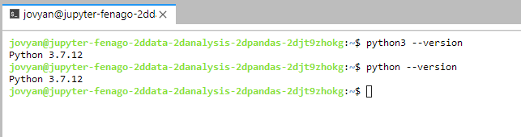
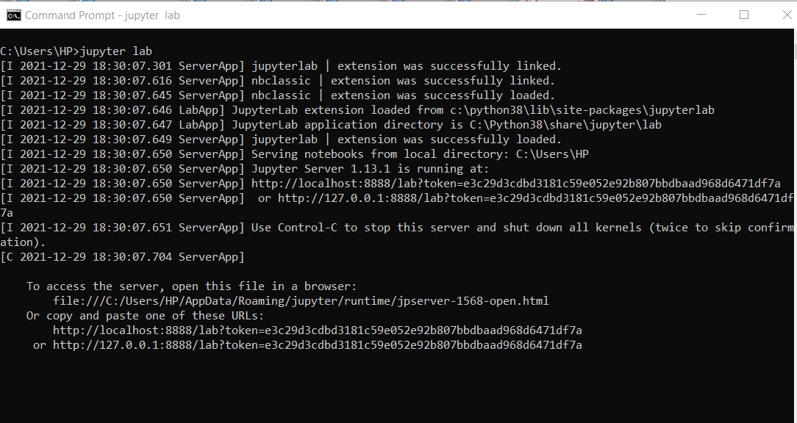
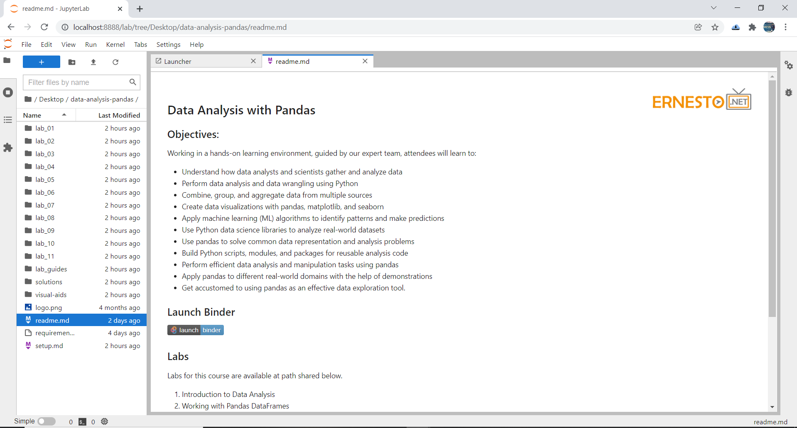

#### Local Setup Guide

1) Install python3.7.x/pip (https://www.python.org/downloads/)



2) Install pip packages (Run as administrator on Windows if possible)

`pip install -r requirements.txt`

**Note** Above command will also install jupyterlab (https://jupyter.org/install).


3) Start Jupyter Lab

`jupyter lab`



**Optionally**, if you have administrator access to your system, you can run jupyter lab on port 80:

`jupyter lab --port 80 --allow-root`

4) Navigate to the course repository folder:




**Optional Step:** 

If your machine is Linux based, run following commands after completing above steps:

```
sudo apt-get update
sudo apt-get install graphviz
```

You can ignore if you get any errors running above commands.
